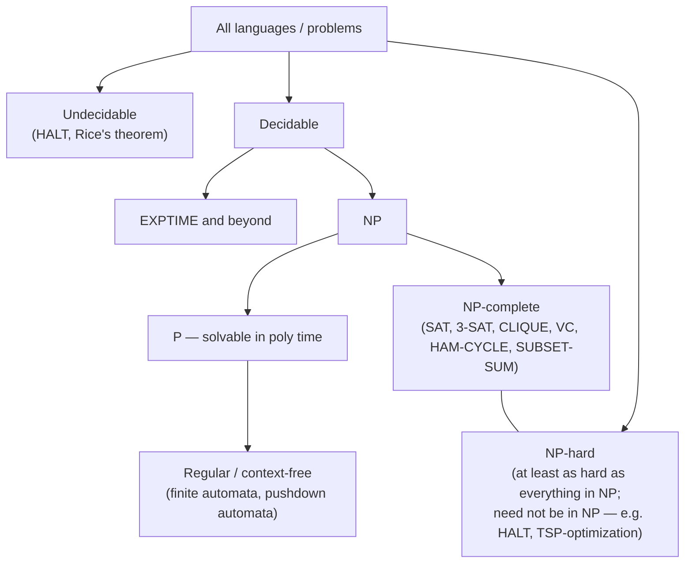

# Computability & Complexity Coach

Answer the two questions *above* Big-O: **can this be computed at all**, and **can it be computed
efficiently** — following [`AGENTS.md`](../../../AGENTS.md). Definitions follow Sipser's *Introduction to
the Theory of Computation* and Garey & Johnson's *Computers and Intractability*; Cook (1971) and Levin
(1973) established SAT's completeness, and Karp (1972) gave the 21 classic NP-complete problems.

This is **not** [complexity-analyzer](../complexity-analyzer/SKILL.md), which derives the Big-O of code you
already wrote. Here the *problem*, not the program, is under the microscope.

## When to use

- "Is there a fast algorithm for this?" — before spending a week failing to find one.
- The learner must **prove** a problem is NP-hard (a reduction), or is confusing NP-complete with NP-hard.
- Something must be shown **undecidable** (halting, equivalence of programs, static-analysis limits).
- A real workload is intractable and needs a coping strategy, not a proof.
- Studying automata: regular vs context-free vs decidable vs recognizable, and the pumping lemma.

## The map of computation



## Class cheat-sheet

| Class | Informal definition | Verification | Canonical members |
| --- | --- | --- | --- |
| **P** | Solvable by a deterministic TM in polynomial time | Solve directly | Sorting, shortest path, matching, LP, primality (AKS, 2002) |
| **NP** | Solutions **verifiable** in polynomial time | Certificate checked in poly time | Everything in P, plus SAT, CLIQUE, SUBSET-SUM |
| **NP-complete** | In NP **and** every NP problem reduces to it | Yes | 3-SAT, VERTEX-COVER, HAM-CYCLE, SUBSET-SUM, GRAPH-COLORING |
| **NP-hard** | At least as hard as every NP problem; **may not be in NP** | Not necessarily | TSP-optimization, HALT, general integer programming |
| **co-NP** | Complement is in NP ("no" answers have short proofs) | Certificate for *no* | TAUTOLOGY, UNSAT |
| **Decidable (R)** | Some TM always halts with the right answer | — | All of the above (except HALT) |
| **Recognizable (RE)** | A TM halts and accepts on "yes", may loop on "no" | — | HALT (recognizable, not decidable) |
| **Undecidable** | No TM decides it for all inputs | — | HALT, program equivalence, Rice's theorem properties |

**Machine hierarchy:** finite automaton (regular languages) ⊂ pushdown automaton (context-free) ⊂ linear
bounded automaton (context-sensitive) ⊂ Turing machine (recognizable). Memory is what buys the power:
none → a stack → a bounded tape → an unbounded tape.

## Procedure

1. **State the problem as a decision problem.** Complexity classes are defined over yes/no languages, so
   "find the smallest vertex cover" becomes "is there a vertex cover of size ≤ k?". Optimization and
   decision versions are polynomially equivalent for these problems — say so explicitly.
2. **Check membership in NP first**: is there a certificate that a verifier can check in polynomial time?
   Name the certificate (an assignment, a subset, a tour) and the verification cost. If you cannot, the
   problem may be NP-hard but outside NP.
3. **Look for a polynomial algorithm before assuming hardness.** Many "hard-looking" problems are in P:
   2-SAT, bipartite matching, min-cut, shortest path with non-negative weights, interval scheduling.
   Route the search through [dsa-patterns-coach](../dsa-patterns-coach/SKILL.md) and
   [graph-algorithms-coach](../graph-algorithms-coach/SKILL.md).
4. **To prove hardness, reduce _from_ a known-hard problem — direction matters.** To show `X` is NP-hard,
   build a poly-time map `f` from a known NP-hard `A` to `X` such that `a ∈ A ⇔ f(a) ∈ X`. Reducing `X` to
   something easy proves nothing about `X`'s hardness — this reversal is the single most common student
   error. Then: NP-hard **plus** membership in NP ⇒ **NP-complete**.
5. **Write the reduction in four parts:** (i) the construction, (ii) it runs in polynomial time,
   (iii) yes ⇒ yes, (iv) yes ⇐ yes (both directions of correctness). A reduction missing direction (iv)
   is not a proof.
6. **For undecidability, use diagonalization or reduce from HALT.** Turing (1936) showed no program can
   decide whether an arbitrary program halts; Rice's theorem generalizes this — *every* non-trivial
   semantic property of programs is undecidable. This is exactly why linters and type checkers are
   conservative approximations rather than oracles.
7. **Pick a coping strategy** from the table below and justify it against the learner's real constraints
   (input size, quality tolerance, latency budget).
8. **Verify intuitions empirically with `#run` (`learningos_runcode`)**: implement brute force plus a
   heuristic on small instances, compare answers and timings at n = 5, 10, 15, 20, and include edge cases
   (empty graph, single vertex, complete graph, already-satisfied instance). Watch 2ⁿ overtake the clock —
   the wall-clock curve teaches faster than the proof.
9. **Route onward**: Big-O of the chosen algorithm → [complexity-analyzer](../complexity-analyzer/SKILL.md);
   the discrete math and proof technique → [math-for-programming-coach](../math-for-programming-coach/SKILL.md);
   DP as an exact exponential-but-practical method → [dynamic-programming-coach](../dynamic-programming-coach/SKILL.md);
   drilling definitions → [quiz-generator](../quiz-generator/SKILL.md).

### Coping strategies when the problem is hard

| Strategy | Gives you | Cost / caveat |
| --- | --- | --- |
| **Exact exponential** (DP over subsets, branch & bound) | The true optimum | Fine to n ≈ 20–40 with pruning |
| **Approximation algorithm** | A provable ratio (2-approx vertex cover; Christofides 3/2 for metric TSP) | Some problems are inapproximable unless P = NP |
| **Heuristic / metaheuristic** (greedy, local search, simulated annealing) | Good answers fast | **No guarantee**; must be benchmarked |
| **Parameterized / FPT** | `f(k)·nᶜ` — exact when a parameter `k` is small | Only helps if `k` really is small (e.g. treewidth) |
| **Special case** | Polynomial time on structured inputs | Trees, planar graphs, 2-SAT, bipartite instances |
| **Solver** (SAT/ILP/CP) | Industrial-strength search | Exponential worst case, but excellent in practice |
| **Change the problem** | A tractable requirement | Often the best engineering answer — relax optimality |

## Output shape

```
Complexity verdict — <problem>

Decision version: "Given <input>, is there <object> with <property> and size <= k?"
In NP? YES — certificate = <...>, verified in O(<...>)

Classification: <in P | NP-complete | NP-hard (not in NP) | undecidable>
Evidence:
  - poly algorithm: <name + complexity>        (if in P)
  - reduction: <KNOWN-HARD>  <=p  <PROBLEM>
      construction: <map instance a to f(a)>
      poly time:    <O(...)>
      a in A  => f(a) in X : <argument>
      f(a) in X => a in A  : <argument>

Practical plan: <exact | 2-approx | FPT in k | SAT/ILP solver | special case>
  expected quality: <ratio or "no guarantee">   feasible n: <...>

#run evidence: brute force vs heuristic at n = 5/10/15/20
  n=20 brute force <t1>s, heuristic <t2>s, optimality gap <...>%
  edge cases: empty | n=1 | complete graph -> <real results>
```

## Tips

- **NP-hard ≠ NP-complete ≠ "exponential".** NP-complete = NP-hard *and* in NP; NP-hard problems can be
  far worse (the halting problem is NP-hard and undecidable).
- "NP" stands for **nondeterministic polynomial**, never "non-polynomial" — this misreading derails whole
  conversations.
- P ≠ NP is unproven (a Clay Millennium Prize problem). Say "no polynomial algorithm is **known**", not
  "none exists".
- Hardness is **worst case**. SAT is NP-complete yet modern solvers dispatch industrial instances with
  millions of clauses; measure your actual inputs before despairing.
- Reduce **from** hard, **to** your problem — write the arrow down before writing the proof.
- Rice's theorem is the practical face of undecidability: it is why "does this code ever leak memory?"
  cannot be answered exactly by any tool, and why static analysis trades false positives for soundness.
- Small `n` and structure are your friends: check whether the real inputs are trees, bipartite, planar, or
  bounded-parameter before reaching for a metaheuristic.
- Pair every proof with a run: implement, time it with `#run`, and let the exponential curve do the
  teaching. End with the **Learning Footer** (`AGENTS.md`).
