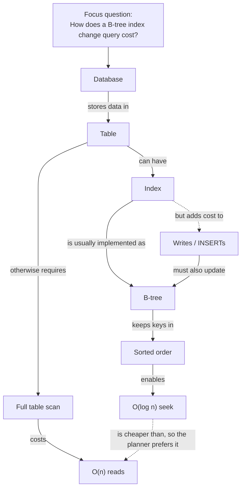

# Concept Map Generator

A concept map is not a pretty mind map — it is a set of **propositions** you can read aloud and judge
true or false, built per [`AGENTS.md`](../../../AGENTS.md) and the method in Novak & Cañas, *The Theory
Underlying Concept Maps and How to Construct and Use Them* (IHMC Technical Report, rev. 2008).

## When to use

- After reading a chapter, paper, or docs page, to check what the learner actually understood.
- When a topic feels like disconnected facts and needs a structure that shows *how* ideas relate.
- Before an exam or interview, as a recall-based alternative to re-reading.
- To surface misconceptions: a wrong map states a wrong proposition **out loud**, where it can be fixed.

## First principles: concept → linking phrase → proposition

The atomic unit is the **proposition**: `concept —linking phrase→ concept`. "Index —speeds up→ lookup" is a
claim. An unlabelled arrow between "Index" and "Lookup" is a decoration — it can be neither taught nor
falsified. That single rule is what separates a concept map from a mind map.



Read the solid arrows top-down: each is a sentence. The **dashed** arrows are *cross-links* — connections
between different branches, which Novak treats as the strongest evidence of genuine understanding, and the
hardest part to produce.

| | Concept map (Novak) | Mind map (Buzan-style) |
| --- | --- | --- |
| Edges | **labelled** linking phrases | usually unlabelled |
| Unit of meaning | proposition (`A —verb→ B`) | association |
| Shape | hierarchical **graph**, cross-links allowed | radial **tree**, one centre |
| Roots | multiple concepts may be general | exactly one centre |
| Best for | checking & building understanding | brainstorming & recall of a list |
| Assessable? | yes — each proposition is true/false | not really |

## Procedure

1. **Write the focus question first.** A map answers a question ("How does a B-tree index change query
   cost?"), not a noun ("Indexes"). A noun-topic map sprawls; a question-driven map has a boundary.
2. **Build the parking lot**: list 10–20 concepts from the source. Concepts are **nouns or noun phrases**
   ("write amplification"), never verbs — verbs belong on the edges.
3. **Rank the parking lot general → specific.** The most inclusive concept goes on top. This ordering is
   the map's spine and is worth doing before drawing anything.
4. **Lay down the hierarchy**: 3–5 levels, branching 2–5 children per node. Deeper than ~5 levels usually
   means two maps hiding in one.
5. **Label every edge with a linking phrase** — a verb phrase that makes `A —phrase→ B` a readable
   sentence. Read each one aloud; if it isn't a sentence, the edge is wrong, not just unlabelled.
6. **Hunt cross-links** between branches, and label them too. Aim for 2–4. This is the step learners skip
   and the step that produces the insight; draw them dashed so they stand out.
7. **Attach 1–2 concrete examples** as leaves (Novak treats specific instances as examples, not concepts —
   keep them visually distinct, e.g. in quotes or with a different shape).
8. **Validate the propositions.** Read every edge as a sentence and mark each `true / unsure / wrong`.
   Anything "unsure" is a knowledge gap — name it explicitly rather than smoothing it over.
9. **Revise once.** First maps are always too flat and too linear; merge duplicates, promote the truly
   general concepts, and split overloaded nodes.
10. **Render** it as Mermaid (per the constitution's Mermaid-first rule), hand it back with the gap list,
    and close with the **Learning Footer**.

## Output shape

```
Focus question: <one question the map answers>

Parking lot (general -> specific):
  1. <most inclusive concept>
  ...
  n. <most specific concept>

Map:
  ```mermaid
  flowchart TD
    A["Concept"] -->|"linking phrase"| B["Concept"]
    B -.->|"cross-link phrase"| D["Concept in another branch"]
  ```

Propositions (read each as a sentence):
  1. <A> —<phrase>→ <B>            [true | unsure | wrong]
  2. ...
Cross-links: <n> — <the insight each one encodes>
Examples: <concrete instance> under <concept>
Gaps found: <the 'unsure' propositions, named>
Next: <what to read/practise to close the top gap>
Learning Footer
```

## Tips

- **Every edge is labelled or it doesn't exist.** An unlabelled arrow is a guess wearing a diagram.
- Concepts are nouns; relationships are verbs. If a box contains a verb, it's an edge that escaped.
- The focus question is the boundary — when a concept doesn't help answer it, cut it.
- Cross-links are the scoring signal: Novak's assessment scheme weights a valid cross-link far above an
  extra hierarchy level, because it proves the learner integrated two branches.
- Have the learner build the map from **memory first**, then check against the source — that turns it into
  retrieval practice instead of copying.
- Don't invent relationships to make the picture look complete (`AGENTS.md` §2); an honest gap teaches more.
- Keep one map to ~15–20 concepts; beyond that, split by sub-question and link the maps.
- Pair with [visual-explainer](../visual-explainer/SKILL.md) to pick the right visual form,
  [mind-map](../mind-map/SKILL.md) for pure brainstorming,
  [knowledge-graph](../knowledge-graph/SKILL.md) for machine-queryable relations,
  [concept-explainer](../concept-explainer/SKILL.md),
  [misconception-buster](../misconception-buster/SKILL.md),
  [diagram-review-coach](../diagram-review-coach/SKILL.md), and
  [quiz-generator](../quiz-generator/SKILL.md) to turn propositions into questions.
  End with the **Learning Footer** (`AGENTS.md`).
