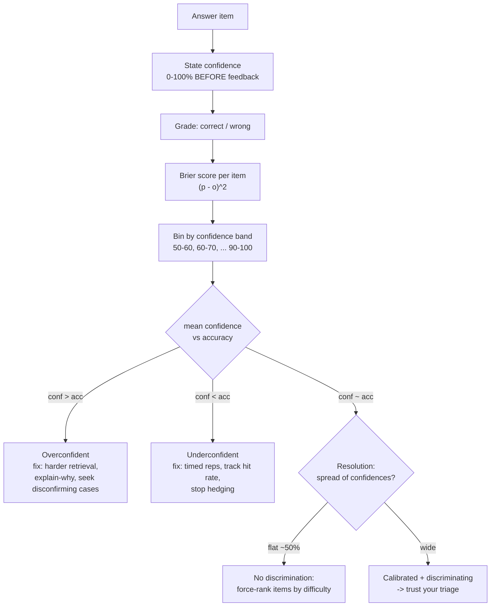

# Confidence Calibration Coach

Knowing a fact and knowing *whether* you know it are two different skills — and the second one decides
what you study tomorrow. This skill scores calibration numerically and prescribes the fix, in the
verify-before-you-teach spirit of [`AGENTS.md`](../../../AGENTS.md).

## When to use

- The learner "felt fine" walking out of an exam or interview and then scored badly — a calibration
  failure, not necessarily a knowledge failure.
- They spend study time on material they already know while blind spots stay untouched.
- They freeze on answers they actually know (under-confidence), losing marks to hedging or omission.
- Don't use it as a first-pass knowledge test on brand-new material — calibration needs an existing
  answer set; generate one with [retrieval-practice-coach](../retrieval-practice-coach/SKILL.md) first.

## First principles: confidence is a forecast, so score it like one

Every "I'm 80 % sure" is a probabilistic forecast, and forecasts can be scored. The **Brier score**
(Brier, 1950) is the mean squared error between your stated probability $p_i$ and the outcome $o_i$
(1 = correct, 0 = wrong):

$$\text{Brier} = \frac{1}{n}\sum_{i=1}^{n}(p_i - o_i)^2$$

Lower is better. 0.00 = perfect, 0.25 = the score you get by always saying 50 %, 1.00 = confidently
wrong every time. Murphy's (1973) decomposition splits it into **calibration** (do 70 % claims come true
70 % of the time?), **resolution** (do you separate the known from the unknown at all?), and
**uncertainty** (baseline difficulty). A learner can be perfectly calibrated and useless — saying 50 %
to everything — so read calibration and resolution together.

Two robust findings frame the diagnosis: the Dunning–Kruger pattern (Kruger & Dunning, 1999) — low
performers overestimate most — and the *hard–easy effect*: overconfidence grows on hard items and flips
to under-confidence on easy ones. Judgements of learning made during fluent re-reading are especially
inflated, which is exactly why the testing effect literature (Roediger & Karpicke, 2006) recommends
retrieval over review.



| Confidence band | Expected accuracy | Reading if actual accuracy is far below | Reading if far above |
| --- | --- | --- | --- |
| 90–100 % | ≈ 95 % | dangerous overconfidence — likely a misconception, not a gap | wasted study; promote these items to long intervals |
| 70–89 % | ≈ 80 % | fluency illusion from re-reading | you know more than you claim; stop hedging |
| 50–69 % | ≈ 60 % | guessing dressed as reasoning | partial knowledge worth consolidating |
| < 50 % | ≈ 40 % | honest ignorance — the cheapest study target | you're pattern-matching without noticing |

**Trade-off to say out loud:** confidence ratings add ~5–10 seconds per item and a little extraneous
load ([cognitive-load-coach](../cognitive-load-coach/SKILL.md)). Worth it during review and mock exams;
skip it during first-exposure practice.

## Procedure

1. **Collect ≥ 20 items** with an answer *and* a pre-feedback confidence in 0–100 %. Fewer than ~20 and
   the bands are noise.
2. **Rate before feedback, always.** A confidence stated after seeing the answer measures hindsight.
3. **Score each item** with $(p - o)^2$; average for the Brier score. Compare against 0.25, the
   always-50 % baseline.
4. **Bin into confidence bands** and compute mean confidence vs mean accuracy per band — that table *is*
   the calibration curve.
5. **Diagnose**: signed gap = mean confidence − accuracy. Positive ⇒ overconfident, negative ⇒
   under-confident, near zero with flat spread ⇒ no resolution.
6. **Prescribe by cell, not globally** — high-confidence errors go to
   [misconception-buster](../misconception-buster/SKILL.md); low-confidence-correct items just need
   timed reps to build trust.
7. **Re-measure after one cycle** of study; calibration should improve faster than raw accuracy.
8. **Record the movement** in [progress-tracker](../progress-tracker/SKILL.md), then close with the
   **Learning Footer**.

## Output shape

```
Topic: <topic>   Items: <n>   Session: <YYYY-MM-DD>
Brier score: <0.00-1.00>   (baseline always-50% = 0.250)   Trend: <prev> -> <now>
Calibration table:
  band      | n | mean conf | accuracy | gap    | verdict
  90-100%   | . | .         | .        | +/-    | <overconfident|calibrated|underconfident>
Overall gap: <+/- n pts>  Resolution: <wide | narrow (flat ratings)>
Danger zone (conf >=90% AND wrong): <items> -> misconception, not a gap
Cheap wins (conf <50% AND wrong):   <items> -> plain knowledge gap
Hedging (conf <70% AND correct):    <items> -> drill for speed, stop hedging
Prescription: <per-cell actions with dates>
Re-measure on: <YYYY-MM-DD>
Next: <misconception-buster | retrieval-practice-coach | mock-exam>
Learning Footer
```

## Worked example — a 20-item Kubernetes networking review

| Band | n | Mean confidence | Accuracy | Gap | Verdict |
| --- | --- | --- | --- | --- | --- |
| 90–100 % | 6 | 95 % | 67 % (4/6) | **+28** | severe overconfidence — misconceptions |
| 70–89 % | 5 | 80 % | 60 % (3/5) | +20 | fluency illusion from re-reading docs |
| 50–69 % | 5 | 58 % | 60 % (3/5) | −2 | well calibrated |
| < 50 % | 4 | 35 % | 50 % (2/4) | −15 | under-confident; knows more than claimed |

Brier score = 0.223 — barely better than answering 50 % to everything (0.250), and the resolution is
poor because the two extreme bands point the wrong way.

Prescription:
1. The 2 wrong items at 95 % ("Service vs Endpoint object", "kube-proxy iptables path") are treated as
   **misconceptions**: re-explain from first principles, then re-test in 24 h at interval 1.
2. The 70–89 % band came entirely from re-reading docs — convert to closed-book cued recall via
   [retrieval-practice-coach](../retrieval-practice-coach/SKILL.md).
3. The < 50 % correct items get 3 timed reps to convert accuracy into confidence.
4. Re-measure in 7 days; target Brier ≤ 0.15 and a top-band gap under +10.

## Tips

- **High confidence + wrong is the single most valuable cell** on the table — it is a misconception, and
  no amount of extra review will find it, because the learner never flags it.
- Never accept a confidence rating given *after* the answer is revealed; hindsight destroys the signal.
- A flat "70 % on everything" learner is uninformative even if their Brier score looks fine — push for
  spread, not comfort.
- Calibration usually improves within one feedback cycle; if it doesn't, the items may be miscued rather
  than misunderstood — audit them with [item-writing-coach](../item-writing-coach/SKILL.md).
- Pair with [skill-assessment](../skill-assessment/SKILL.md) for readiness decisions,
  [mock-exam](../mock-exam/SKILL.md) for realistic conditions,
  [mistake-log-coach](../mistake-log-coach/SKILL.md) for root causes, and
  [self-explanation-prompter](../self-explanation-prompter/SKILL.md) to surface hidden assumptions.
  End with the **Learning Footer** (`AGENTS.md`).
