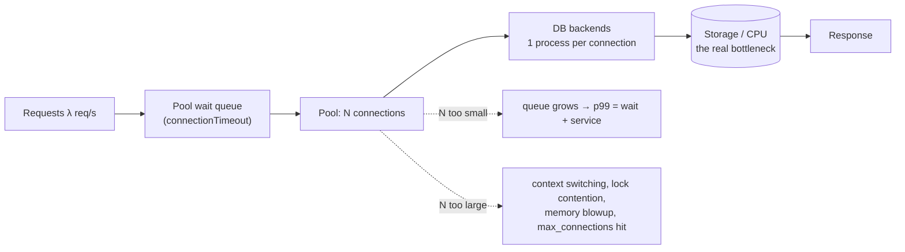

# Connection Pooling Coach

A connection pool is a **queue with a fixed number of servers**, so it obeys queueing theory, not vibes.
This skill derives the right pool size from measurable numbers, then hardens it against exhaustion —
teaching from first principles as required by [`AGENTS.md`](../../../AGENTS.md).

## When to use

- Latency spikes under load while the database itself looks idle (the queue is in *your* pool).
- `FATAL: sorry, too many clients already` / `HikariPool-1 - Connection is not available, request timed out`.
- Moving to Lambda/Cloud Run and connection counts explode with concurrency.
- **Don't use it for** slow individual queries — that's [sql-indexing-lab](../sql-indexing-lab/SKILL.md) and
  [database-index-coach](../database-index-coach/SKILL.md); pooling hides nothing, it only queues.

## First principles: the pool is a queue, the database is the server

PostgreSQL forks **one OS process per connection**, so connections cost memory and scheduler time even when
idle; the PostgreSQL wiki's "Number Of Database Connections" page — the source HikariCP's *About Pool
Sizing* quotes — argues that throughput peaks at a small connection count and *declines* beyond it. Two
independent numbers must both be satisfied:

$$L = \lambda \times W \quad\text{(Little's Law)} \qquad C_{\max} \approx (\text{cores} \times 2) + \text{effective\_spindle\_count}$$

`L` is the concurrency you actually need; `C_max` is roughly the most the server can usefully run at once.



| Knob (HikariCP default) | Meaning | Failure it prevents |
| --- | --- | --- |
| `maximumPoolSize` = 10 | hard cap on concurrent DB work | database overload |
| `minimumIdle` = `maximumPoolSize` | keep the pool fixed-size | latency spikes from cold acquisition |
| `connectionTimeout` = 30 000 ms | how long a thread waits for a lease | *must* be shorter than the upstream request timeout |
| `maxLifetime` = 1 800 000 ms | recycle before the DB/LB kills it | stale-connection errors; set < DB `idle_session_timeout` and < LB idle timeout |
| `idleTimeout` = 600 000 ms | trim idle connections (only if `minimumIdle` < max) | wasted server processes |
| `validationTimeout` = 5 000 ms | liveness check budget | serving a dead socket |
| `leakDetectionThreshold` = 0 (off) | logs leases held too long | connection leaks from unclosed sessions |

**Verify defaults against the HikariCP README for your exact version before quoting them in a design doc.**

## PgBouncer modes — what each one costs you

| `pool_mode` | Server connection held for | Multiplexing | Breaks |
| --- | --- | --- | --- |
| `session` | the whole client session | none (1:1) | nothing — but no savings either |
| `transaction` | one transaction | **high** — the default choice | session state: `SET`/GUCs, `LISTEN`/`NOTIFY`, session advisory locks, `WITH HOLD` cursors, and named prepared statements unless `max_prepared_statements > 0` (PgBouncer ≥ 1.21) |
| `statement` | one statement | highest | multi-statement transactions are rejected outright |

AWS RDS Proxy behaves like transaction pooling and **pins** a connection when it sees session state it
cannot multiplex; a pinned connection stops sharing, so watch `DatabaseConnectionsCurrentlySessionPinned`.

## Procedure

1. **Measure `λ` and `W`.** `λ` = peak requests/second hitting the DB; `W` = mean *database* time per
   request (sum of all its queries), from APM or `pg_stat_statements`.
2. **Compute the demand:** `L = λ × W`. Round up, then add ~50 % headroom for jitter. That is the pool size
   *per application instance divided by instance count* — never per instance in isolation.
3. **Compute the ceiling:** `C_max ≈ cores × 2 + spindles` (1 for SSD/NVMe). Enforce
   `instances × maximumPoolSize + admin/cron/replica slots ≤ min(C_max, max_connections)`.
4. **Check the live picture** before changing anything:
   ```bash
   psql -c "SHOW max_connections;" \
        -c "SELECT state, count(*) FROM pg_stat_activity GROUP BY state ORDER BY 2 DESC;" \
        -c "SELECT wait_event_type, wait_event, count(*) FROM pg_stat_activity
            WHERE wait_event IS NOT NULL GROUP BY 1,2 ORDER BY 3 DESC LIMIT 10;"
   ```
5. **Order your timeouts** so failure is fast and local:
   `statement_timeout < connectionTimeout < upstream HTTP timeout`. Never leave `statement_timeout = 0`.
6. **Add a pooler when instance count grows**, not before. Minimal `pgbouncer.ini`:
   ```ini
   [databases]
   appdb = host=127.0.0.1 port=5432 dbname=appdb
   [pgbouncer]
   listen_addr = 127.0.0.1
   listen_port = 6432
   auth_type = scram-sha-256
   pool_mode = transaction
   max_client_conn = 5000      ; cheap: client-side sockets
   default_pool_size = 20      ; expensive: real server backends
   min_pool_size = 5
   reserve_pool_size = 5
   server_idle_timeout = 60
   max_prepared_statements = 200
   ```
   Observe it: `psql -h 127.0.0.1 -p 6432 -U pgbouncer pgbouncer -c "SHOW POOLS;" -c "SHOW STATS;"` —
   a persistently non-zero `cl_waiting` means the pool is too small or queries too slow.
7. **For serverless**, invert the model: one connection per execution environment, created **outside** the
   handler so it is reused across invocations, plus a pooler in front. Cap concurrency deliberately.
8. **Load-test the change** ([k6-load-test-lab](../k6-load-test-lab/SKILL.md)) and compare p99 *and*
   `cl_waiting` before/after, then close with the **Learning Footer**.

## Output shape

```
Workload: λ = <req/s> · W = <ms DB time/req> · instances = <n> · engine = <postgres|mysql|...>
Demand (Little's Law): L = λ × W = <value> concurrent connections
Ceiling: C_max ≈ cores×2 + spindles = <value>   max_connections = <value>
Pool size: <N> per instance   Total = N × instances = <value>  ≤ ceiling? <yes/no>
Timeouts: statement_timeout=<> < connectionTimeout=<> < upstream=<>   maxLifetime=<> (< LB/DB idle timeout)
Pooler: <none | PgBouncer transaction | RDS Proxy | engine-native>   Breaks: <session state used?>
Serverless: <n/a | 1 conn/env, created outside handler, pooler in front, reserved concurrency = <n>>
Evidence: cl_waiting=<> · pg_stat_activity idle-in-transaction=<> · p99 before/after = <>/<>
Next: <capacity-planning-coach | database-index-coach | k6-load-test-lab>
Learning Footer
```

## Worked example — 400 req/s over 6 pods against an 8-core Postgres

Measured: 3 queries per request, mean 4 ms each → `W = 12 ms = 0.012 s`; `λ = 400 req/s`.

- **Demand:** `L = 400 × 0.012 = 4.8` → ~5 concurrent connections *for the whole fleet*, ~8 with headroom.
- **Ceiling:** 8 cores, NVMe → `C_max ≈ 8 × 2 + 1 = 17`.
- **The bug:** the team ran `maximumPoolSize = 50` on 6 pods = **300** connections against
  `max_connections = 200` → `too many clients already`, and even at 200 the server thrashes past 17.
- **The fix:** `maximumPoolSize = 4` per pod → 24 total, comfortably above the required ~8 and only
  slightly above `C_max`; PgBouncer in `transaction` mode with `default_pool_size = 20` caps real backends.

| Config | Total conns | Demand met? | Server state | p99 |
| --- | --- | --- | --- | --- |
| 50 × 6 pods | 300 | yes | rejecting connections, thrashing | broken |
| 4 × 6 pods | 24 | yes (need ~8) | healthy, ~17 active max | best |
| 1 × 6 pods | 6 | **no** (need ~8) | idle | queueing in the pool |

Counter-intuitive but load-tested repeatedly: **shrinking the pool from 50 to 4 lowered p99**, because
queueing politely in the application is cheaper than overwhelming the database.

## Tips

- If p99 is bad and the DB is idle, your queue is in the pool — measure `cl_waiting`/acquisition time first.
- `connectionTimeout` longer than the upstream HTTP timeout converts a small stall into a thread-pool
  collapse; make the pool fail fast and shed load.
- `idle in transaction` sessions are pool poison — they hold a connection *and* block vacuum. Alert on
  `state = 'idle in transaction'` and set `idle_in_transaction_session_timeout`.
- Transaction pooling silently breaks session-scoped features; grep for `SET `, `LISTEN`, temp tables, and
  advisory locks before flipping `pool_mode`.
- Read replicas need their **own** budget — see
  [replication-topology-coach](../replication-topology-coach/SKILL.md) and
  [sharding-strategy-coach](../sharding-strategy-coach/SKILL.md).
- Practise safely offline with [postgres-local-lab](../postgres-local-lab/SKILL.md) and
  [testcontainers-lab](../testcontainers-lab/SKILL.md); size the fleet with
  [capacity-planning-coach](../capacity-planning-coach/SKILL.md); for functions see
  [serverless-designer](../serverless-designer/SKILL.md) and
  [aws-lambda-lab](../aws-lambda-lab/SKILL.md). Close with the **Learning Footer** (`AGENTS.md`).
