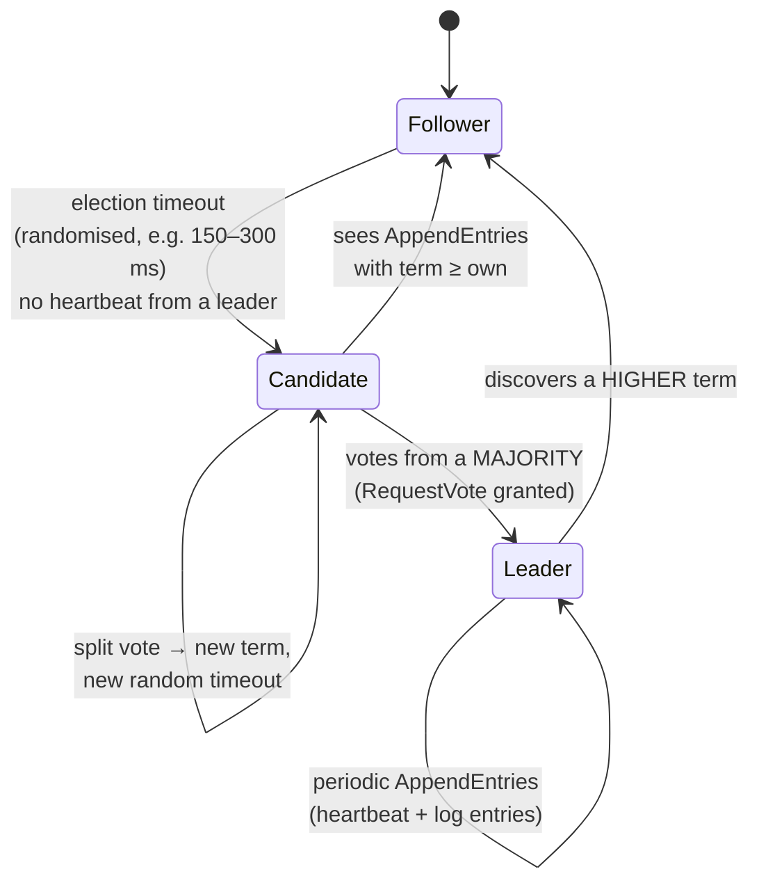

# Consensus Explainer

Consensus is how a set of unreliable machines agrees on **one ordered log**. This skill teaches it from the
Raft paper outward — mechanism first, then the safety argument, then the alternatives — in the
first-principles style mandated by [`AGENTS.md`](../../../AGENTS.md).

## When to use

- You use etcd, Consul, CockroachDB, TiKV or Kafka KRaft and want to know what actually protects your data.
- Someone asked "why 3 or 5 nodes, never 4?" or "can we lose data during a leader change?"
- You are preparing for a distributed-systems interview and need to *derive*, not recite, the rules.
- **Don't use it for** designing an application's replication topology or read-scaling — that's
  [replication-topology-coach](../replication-topology-coach/SKILL.md).

## First principles: one leader, one log, one majority

The primary source is Ongaro & Ousterhout, *"In Search of an Understandable Consensus Algorithm"*
(USENIX ATC 2014; extended version = Ongaro's 2014 Stanford dissertation). Raft decomposes consensus into
**leader election**, **log replication**, and **safety**, and enforces a strong leader: entries only ever
flow leader → follower.



Time is divided into **terms** — a logical clock; each term has at most one leader, and any message
carrying a higher term forces the receiver back to follower. Only three RPCs matter: `RequestVote`,
`AppendEntries` (heartbeat *and* replication), and `InstallSnapshot` for lagging followers.

| Cluster size N | Majority (quorum) | Crash faults tolerated `f = ⌊(N−1)/2⌋` | Verdict |
| --- | --- | --- | --- |
| 1 | 1 | 0 | not fault tolerant |
| 3 | 2 | 1 | the common production minimum |
| 4 | 3 | 1 | **strictly worse than 3** — more cost, same tolerance |
| 5 | 3 | 2 | standard for control planes |
| 7 | 4 | 3 | higher latency (more round trips to a slow majority) |

Because any two majorities of N intersect in at least one node, a new leader's quorum always contains a
node that saw every committed entry. That intersection *is* the entire safety proof, in one sentence.

**The five safety properties (paper, Figure 3):** Election Safety (≤1 leader per term) · Leader Append-Only
(a leader never overwrites its own log) · Log Matching (same index+term ⇒ identical prefixes) · Leader
Completeness (a committed entry is present in every future leader's log) · State Machine Safety (no two
nodes apply different commands at the same index).

**Two rules do the heavy lifting.** (1) *Election restriction* (§5.4.1): a voter refuses a candidate whose
log is less up-to-date — compare `lastLogTerm` first, then `lastLogIndex`. (2) *Commit rule* (§5.4.2): a
leader commits an entry only once it is replicated on a majority **and** belongs to the leader's current
term; earlier-term entries commit indirectly, which is why Figure 8 in the paper exists.

## Contrast with the alternatives

| Property | Raft (2014) | Basic/Multi-Paxos (Lamport 1998, 2001) | ZAB (ZooKeeper) | Viewstamped Replication (Oki & Liskov 1988) |
| --- | --- | --- | --- | --- |
| Leader | mandatory, strong | optional (distinguished proposer in Multi-Paxos) | mandatory | mandatory (primary) |
| Log shape | contiguous, no holes | may accept out of order → holes | contiguous | contiguous |
| Log flows | leader → follower only | either direction during recovery | leader → follower | primary → backups |
| Recovery | truncate follower to match leader | phase 1 per unresolved slot | epoch-based sync | view change |
| Primary framing | understandability | minimality | atomic broadcast | replication protocol |
| Faults tolerated | crash only, `f` of `2f+1` | crash only | crash only | crash only |

None of these tolerate **Byzantine** (lying) nodes; that needs PBFT-class protocols (Castro & Liskov, OSDI
1999) with `3f+1` replicas. And none escape **FLP** (Fischer, Lynch & Paterson, JACM 1985): no deterministic
protocol guarantees termination in a fully asynchronous system with one crash fault. Raft dodges FLP the
practical way — *randomised* election timeouts under partial synchrony (Dwork, Lynch & Stockmeyer, 1988).

## Procedure

1. **Fix the vocabulary**: term, index, quorum, committed (durable, majority-replicated, current term),
   applied (handed to the state machine). Most confusion is committed-vs-applied.
2. **Trace an election by hand** on 5 nodes; apply the up-to-date rule per voter and count the votes.
3. **Trace a replication round**: client → leader appends → `AppendEntries` → majority ack → commit index
   advances → apply → respond. Note the client sees success only *after* commit.
4. **Break it deliberately.** Run a real cluster locally and kill the leader:
   ```bash
   # three local etcd members (offline after the binary is downloaded)
   TOKEN=lab; CLUSTER=n1=http://127.0.0.1:2380,n2=http://127.0.0.1:2382,n3=http://127.0.0.1:2384
   etcd --name n1 --listen-client-urls http://127.0.0.1:2379 --advertise-client-urls http://127.0.0.1:2379 \
        --listen-peer-urls http://127.0.0.1:2380 --initial-advertise-peer-urls http://127.0.0.1:2380 \
        --initial-cluster $CLUSTER --initial-cluster-token $TOKEN --data-dir n1.data &
   # ...repeat for n2 (2381/2382) and n3 (2383/2384)
   etcdctl --endpoints=127.0.0.1:2379,127.0.0.1:2381,127.0.0.1:2383 endpoint status -w table
   ```
   Stop the member reported as `IS LEADER`, re-run `endpoint status`, and observe a new term and leader.
   Then stop a second member of three: writes now fail — **no quorum, by design, not by bug**.
5. **Ask the minority question**: with 2 of 3 down, why does Raft refuse writes instead of serving them?
   (Because a healthy partition elsewhere could form its own quorum → split brain.)
6. **Study membership change** (§6): joint consensus or one-server-at-a-time, never a naive swap — adding
   two nodes at once can create two overlapping majorities.
7. **Explain snapshots**: logs are compacted, so a far-behind follower gets `InstallSnapshot`.
8. **Summarise the trade-off** (leader throughput ceiling, cross-region write latency = one round trip to
   the nearest majority) and close with the **Learning Footer**.

## Output shape

```
Question: <what the learner asked>
Model: N = <nodes> · quorum = <⌈(N+1)/2⌉> · tolerates f = <value> crash faults
Roles/terms: <who is leader, current term, each node's last (index, term)>
Election trace: candidate <X> lastLogTerm=<> lastLogIndex=<> → votes granted by <...>, denied by <...> (rule §5.4.1)
Replication trace: entry <i> → acked by <...> → committed? <yes/no, and by which rule>
Safety property exercised: <Election Safety | Log Matching | Leader Completeness | State Machine Safety>
What is LOST and why it is legal: <uncommitted entries from a dead leader>
Contrast: Raft vs <Paxos|ZAB|VR> on <leader | log holes | recovery>
Real systems: <etcd | Consul | CockroachDB | TiKV | Kafka KRaft>
Next: <replication-topology-coach | event-sourcing-coach | distributed-tracing-coach>
Learning Footer
```

## Worked example — can a shorter log win the election?

Five nodes. S1 was leader in term 2 and appended entry `index 3 (term 2)`, replicating it to S2 only, then
crashed. Logs at the start of term 3 (`index:term`):

| Node | Log | lastLogIndex | lastLogTerm |
| --- | --- | --- | --- |
| S1 (down) | 1:1, 2:1, 3:2 | 3 | 2 |
| S2 | 1:1, 2:1, 3:2 | 3 | 2 |
| S3 | 1:1, 2:1 | 2 | 1 |
| S4 | 1:1 | 1 | 1 |
| S5 | 1:1 | 1 | 1 |

S3 campaigns in term 3. Applying §5.4.1 — a voter grants only if the candidate's `(lastLogTerm,
lastLogIndex)` is **≥** its own: S2 refuses (its `lastLogTerm = 2 > 1`); S4 and S5 grant. With its own vote
S3 has **3 of 5 — a majority — so S3 becomes leader** and entry `3:2` is truncated from S2.

Is that data loss? No: `3:2` was on 2 of 5 nodes, never a majority, so it was **never committed** and no
client was ever told it succeeded. Now change one fact — suppose S3 had also stored `3:2`. Then S4
campaigning would be refused by S1, S2 **and** S3, collecting only 2 votes and never winning; any winner
must already hold the committed entry. That is Leader Completeness, derived rather than memorised.

## Tips

- Never run an even number of voting members: 4 nodes tolerate the same 1 failure as 3, at higher cost and
  latency. Use non-voting learners/observers for read scale-out instead.
- "Committed" is a *majority* fact, not a leader fact — a leader that has written an entry locally has
  promised nothing yet.
- A leader must not count replicas to commit an entry from an **older** term (§5.4.2); this is the single
  most misimplemented rule in homegrown Raft.
- Randomised election timeouts are not a detail — remove the randomness and you get perpetual split votes.
- Consensus gives you an ordered log, not low latency: every write costs one round trip to the nearest
  majority, which is why cross-region Raft feels slow. Budget it with
  [capacity-planning-coach](../capacity-planning-coach/SKILL.md).
- Go deeper with [event-sourcing-coach](../event-sourcing-coach/SKILL.md),
  [saga-pattern-coach](../saga-pattern-coach/SKILL.md),
  [kafka-kraft-local-lab](../kafka-kraft-local-lab/SKILL.md),
  [idempotency-coach](../idempotency-coach/SKILL.md) and
  [sharding-strategy-coach](../sharding-strategy-coach/SKILL.md). Cite the paper's section numbers when you
  teach it, and end with the **Learning Footer** (`AGENTS.md`).
