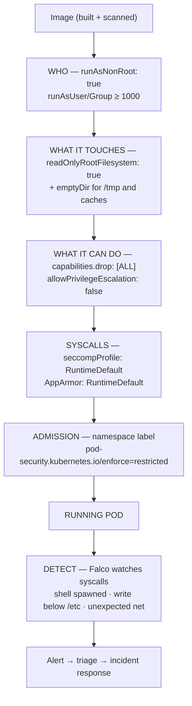

# Container Runtime Security Lab

Defence in depth for a *running* container: shrink what the process **is** (non-root), what it can
**touch** (read-only rootfs), what it can **do** (capabilities, seccomp, AppArmor), and then **watch** it
(Falco). Defensive hardening only — no exploitation — following the security posture in
[`AGENTS.md`](../../../AGENTS.md).

## When to use

- Images are running as UID 0 with a writable root filesystem and the full default capability set, and
  nobody has justified a single one of those defaults.
- A namespace needs to reject unsafe pods automatically rather than relying on review discipline.
- The team has scanning at build time but no idea what a container *does* after it starts.
- **Don't use it for** offensive work: this skill never helps escape a sandbox, bypass a policy, or attack
  a host. For image/CVE scanning use [trivy-scan-lab](../trivy-scan-lab/SKILL.md); for build-chain
  integrity use [supply-chain-security-coach](../supply-chain-security-coach/SKILL.md).

## First principles: a container is a constrained process, not a boundary

A container is a Linux process with namespaces, cgroups, capabilities, and LSM/seccomp filters applied.
Each hardening control removes one class of action from that process. Kubernetes exposes them through
`securityContext`, and the **Pod Security Standards** bundle them into three cumulative levels —
`privileged`, `baseline`, `restricted` — enforced per namespace by Pod Security admission (Kubernetes
documentation, *Pod Security Standards* and *Configure a Security Context for a Pod or Container*,
kubernetes.io, 2025).



| Control | Docker flag | Kubernetes field | Removes |
| --- | --- | --- | --- |
| Non-root identity | `--user 10001:10001` | `runAsNonRoot: true`, `runAsUser: 10001` | UID-0-only actions, most host-file damage |
| Immutable rootfs | `--read-only --tmpfs /tmp` | `readOnlyRootFilesystem: true` + `emptyDir` mounts | dropping tools/binaries into the container |
| Capabilities | `--cap-drop=ALL --cap-add=NET_BIND_SERVICE` | `capabilities: {drop: ["ALL"], add: [...]}` | raw sockets, mounts, module loading |
| No escalation | `--security-opt=no-new-privileges` | `allowPrivilegeEscalation: false` | setuid binaries gaining privileges |
| Syscall filter | `--security-opt seccomp=…` (default profile on) | `seccompProfile: {type: RuntimeDefault}` | dangerous/obsolete syscalls |
| MAC policy | `--security-opt apparmor=docker-default` | `appArmorProfile: {type: RuntimeDefault}` (v1.30+ field) | file/network access outside the profile |
| Resource abuse | `-m 512m --cpus 1 --pids-limit 100` | `resources.limits`, LimitRange | noisy-neighbour and fork-bomb effects |
| Never | `--privileged` | `privileged: true`, `hostPID`, `hostNetwork` | — this is the thing to remove |

| PSS level | Intent | Notable requirements |
| --- | --- | --- |
| `privileged` | unrestricted | nothing blocked — infrastructure workloads only |
| `baseline` | block known privilege escalations | no `privileged`, no hostPID/hostIPC/hostNetwork, no hostPath |
| `restricted` | hardened, current best practice | `runAsNonRoot`, `allowPrivilegeEscalation: false`, `capabilities.drop: [ALL]`, `seccompProfile` `RuntimeDefault`/`Localhost`, limited volume types |

Worth knowing precisely: `restricted` does **not** require `readOnlyRootFilesystem` — set it yourself; and
`runAsNonRoot: true` fails the pod at start-up if the image's user resolves to UID 0, which is the point.

## Procedure

1. **Baseline the image**: `docker run --rm <image> id` — if it prints `uid=0(root)`, that is finding #1.
   `docker inspect <image> --format '{{.Config.User}}'` shows whether the image even declares a user.
2. **Harden locally, one flag at a time**, so you learn which flag breaks the app:
   `docker run --rm --user 10001:10001 --read-only --tmpfs /tmp:rw,noexec,nosuid,size=64m --cap-drop=ALL --security-opt=no-new-privileges <image>`.
3. **Find the legitimate needs**: if it fails to bind port 80, either add `NET_BIND_SERVICE` *or* listen on
   8080 and let the Service map it — prefer the latter. If it fails to write, mount an `emptyDir` at the
   exact path instead of unlocking the whole filesystem.
4. **Confirm the reductions from inside**: `docker exec <c> cat /proc/1/status | grep -E 'CapEff|NoNewPrivs|Seccomp'`.
   `CapEff: 0000000000000000` and `Seccomp: 2` are the evidence.
5. **Move to Kubernetes**: `kind create cluster`, apply the hardened Deployment below, and verify with
   `kubectl exec <pod> -- id` and `kubectl exec <pod> -- touch /x` (must fail: read-only).
6. **Enforce it at the namespace**, so bad pods are rejected rather than reviewed:
   `kubectl label ns app pod-security.kubernetes.io/enforce=restricted pod-security.kubernetes.io/warn=restricted`.
   Then try to apply a privileged pod and read the rejection message verbatim.
7. **Add runtime detection** on the same free cluster:
   `helm repo add falcosecurity https://falcosecurity.github.io/charts && helm install falco falcosecurity/falco -n falco --create-namespace`.
   Check `helm show values falcosecurity/falco | grep -A5 driver` for the driver kind your kernel supports
   (modern eBPF vs kernel module) rather than assuming.
8. **Generate one benign detection** you are authorised to run — `kubectl exec -it <pod> -- sh` — and read
   the alert: `kubectl logs -n falco -l app.kubernetes.io/name=falco | tail`. Falco's default ruleset
   flags an interactive shell in a container (Falco documentation, *Rules* / default rules,
   falco.org, 2025; Falco is a graduated CNCF project).
9. **Write down the residual risk and the response plan**, then close with the **Learning Footer**.

## Output shape

```
Image: <repo:tag@digest>   Runs as: <uid> → hardened to <uid>  (runAsNonRoot: true)
Filesystem: readOnlyRootFilesystem=<true> + writable emptyDir mounts: </tmp, /var/cache>
Capabilities: drop=[ALL] add=[<justified list or none>]   allowPrivilegeEscalation=false
Syscalls: seccompProfile=<RuntimeDefault|Localhost:<file>>   AppArmor=<RuntimeDefault|Localhost>
Host access: privileged=false · hostNetwork=false · hostPID=false · hostPath=none
Evidence: /proc/1/status CapEff=<0000...> NoNewPrivs=1 Seccomp=2 · write test <denied ✔>
Admission: ns=<name> pod-security.kubernetes.io/enforce=restricted → rejection msg "<...>"
Detection: Falco installed (<driver>) · rule fired: "<Terminal shell in container>" · route to <alert sink>
Residual risk: <what is still possible>   Response: <who is paged, what they do>
Next: <trivy-scan-lab | k8s-admission-policy-lab | incident-response-drill>
Learning Footer
```

## Worked example — a Deployment that passes `restricted`

```yaml
apiVersion: apps/v1
kind: Deployment
metadata:
  name: web
  namespace: app          # labelled pod-security.kubernetes.io/enforce=restricted
spec:
  replicas: 2
  selector:
    matchLabels: {app: web}
  template:
    metadata:
      labels: {app: web}
    spec:
      automountServiceAccountToken: false     # no API token unless the app calls the API
      securityContext:
        runAsNonRoot: true
        runAsUser: 10001
        runAsGroup: 10001
        fsGroup: 10001
        seccompProfile:
          type: RuntimeDefault
        appArmorProfile:
          type: RuntimeDefault                # v1.30+ field; older clusters use the annotation
      containers:
        - name: web
          image: nginxinc/nginx-unprivileged:1.27-alpine   # listens on 8080 as non-root
          ports: [{containerPort: 8080}]
          securityContext:
            allowPrivilegeEscalation: false
            readOnlyRootFilesystem: true
            capabilities:
              drop: ["ALL"]
          resources:
            requests: {cpu: "50m", memory: "64Mi"}
            limits:   {cpu: "200m", memory: "128Mi"}
          volumeMounts:
            - {name: tmp, mountPath: /tmp}
            - {name: cache, mountPath: /var/cache/nginx}
            - {name: run, mountPath: /var/run}
      volumes:
        - {name: tmp, emptyDir: {}}
        - {name: cache, emptyDir: {}}
        - {name: run, emptyDir: {}}
```

Reasoning through it: nginx normally wants root to bind :80 and write to `/var/cache/nginx` and
`/var/run` — so we pick the *unprivileged* variant that listens on 8080, and give back exactly three
writable `emptyDir` paths instead of unlocking the rootfs or adding `NET_BIND_SERVICE`. That is the whole
method: enumerate the genuine need, grant only that, deny the rest. Verify rather than believe:

```bash
kubectl exec deploy/web -- id                      # uid=10001 gid=10001
kubectl exec deploy/web -- sh -c 'touch /nope'     # Read-only file system  ✔
kubectl exec deploy/web -- grep -E 'CapEff|NoNewPrivs|Seccomp:' /proc/1/status
```

## Tips

- Hardening flags fail **loudly and early** — that is a feature. Add them one at a time so each breakage
  names the capability or path the app genuinely needs.
- `runAsNonRoot: true` without `runAsUser` still fails if the image's default user is root; fix the
  Dockerfile (`USER 10001`) rather than dropping the check.
- Read-only rootfs is the single control that most reduces post-compromise usefulness — an attacker who
  cannot write cannot easily persist or drop tooling.
- `--privileged`, `hostPID`, and `hostNetwork` erase most of the other controls at once; treat any request
  for them as a design review, not a config change.
- Admission enforcement beats code review: label the namespace, and unsafe pods never merge into reality.
  Extend with [k8s-admission-policy-lab](../k8s-admission-policy-lab/SKILL.md) and
  [opa-policy-lab](../opa-policy-lab/SKILL.md).
- Detection without a response plan is noise — connect Falco alerts to
  [incident-response-drill](../incident-response-drill/SKILL.md) and
  [observability-plan](../observability-plan/SKILL.md).
- Related: [trivy-scan-lab](../trivy-scan-lab/SKILL.md), [cosign-signing-lab](../cosign-signing-lab/SKILL.md),
  [k8s-rbac-lab](../k8s-rbac-lab/SKILL.md), [k8s-network-policy-lab](../k8s-network-policy-lab/SKILL.md),
  [threat-model](../threat-model/SKILL.md), and [kustomize-lab](../kustomize-lab/SKILL.md) to ship the
  hardened settings as a base every overlay inherits.
  End with the **Learning Footer** (`AGENTS.md`).
