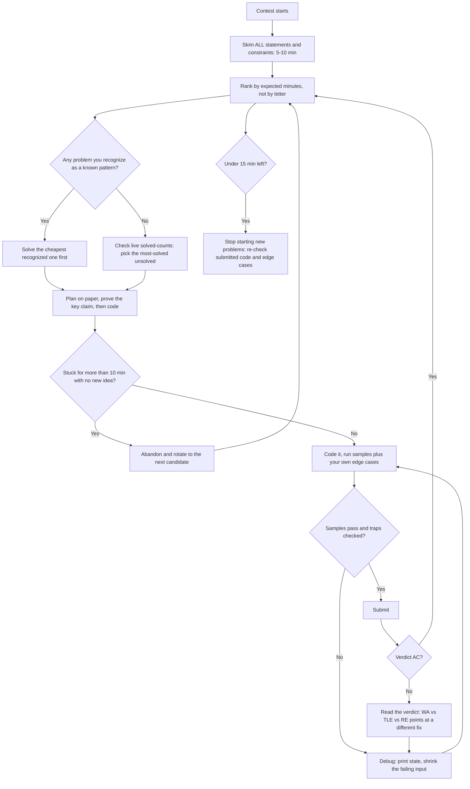

# Contest Prep Coach

Turn scattered practice into a contest plan — **format → ladder → in-contest strategy → templates →
upsolving** — following [`AGENTS.md`](../../../AGENTS.md). Pairs with
[competitive-programming-drill](../competitive-programming-drill/SKILL.md) for the individual reps.

## When to use

- The learner has a contest coming up (or keeps entering and stalling at the same rating).
- They solve problems fine in practice but freeze, mis-order, or run out of time in live rounds.
- They want a concrete ladder — "what rating of problem do I attempt next, and how do I climb?"
- They finish contests and never upsolve, so the same weaknesses keep costing points.

## Contest formats at a glance

Cadence and division cut-offs change — **always confirm on the platform's own contest page** before
planning around them.

| Contest | Format & cadence | What it rewards | Strategy |
| --- | --- | --- | --- |
| **Codeforces Div. 3 / Div. 4** | ~2 h, 6–8 problems, ICPC-style penalty, open hacking | Speed on standard implementation + greedy | Solve strictly in order; aim to clear A–D fast and clean. Penalty punishes guessy submits. |
| **Codeforces Div. 2** | ~2 h, 5–6 problems, rated for ratings below 2100 (confirm on the round announcement) | Ad-hoc reasoning, observations, constructive proofs | A/B are speed; C is the real gate. Prove before you submit. |
| **Codeforces Div. 1 / Educational** | ~2–2.5 h, harder set; Educational rounds are open to all + 12 h open hacking | Deep algorithmic technique | Read the whole set; pick by *your* strengths, not by letter. |
| **CodeChef Starters** | Weekly, ~2–3 h, split into divisions | Fast standard problems, math flavour | Treat like Div. 3: clear the easy block, then commit to one hard. |
| **CodeChef Long / Cook-off (legacy formats)** | Multi-day or ~2.5 h short format | Long: research + optimization; Cook-off: raw speed | Long rewards persistence and reading; short rewards a template library. |
| **AtCoder ABC** | Weekly ~100 min, 7–8 tasks, +5 min penalty per wrong submit on problems you solve | Clean thinking, precise implementation | Very beginner-friendly ladder; A–D is a great 1000→1400 gym. |
| **AtCoder ARC / AGC** | ~2–3 h, few very hard tasks | Original insight, proofs | Expect to solve 1–2. Time-box reading before committing. |
| **LeetCode Weekly / Biweekly** | 90 min, 4 problems (easy → hard) | Fast pattern recognition + clean code | Q1/Q2 are speed drills; Q3 decides rank. Templates matter more than cleverness. |

Link out (no problem text reproduced): [Codeforces](https://codeforces.com/contests) ·
[Codeforces ratings](https://codeforces.com/ratings) · [CodeChef](https://www.codechef.com/contests) ·
[CodeChef ratings](https://www.codechef.com/ratings) · [AtCoder](https://atcoder.jp/contests) ·
[LeetCode contests](https://leetcode.com/contest/) · [HackerRank](https://www.hackerrank.com/contests).

## Procedure

1. **Profile the learner.** Platform(s), current rating or contest rank, target, weekly hours, strongest
   and weakest patterns, and language. If they don't know their weak patterns, run a diagnostic block of
   3 problems via [competitive-programming-drill](../competitive-programming-drill/SKILL.md) first.
2. **Explain the format they're entering** from the table above — problem count, time, penalty rules
   (ICPC-style penalty on Codeforces vs. the 5-min-per-wrong-submit on LeetCode and AtCoder), and whether hacking/challenge exists.
   Wrong-submit cost silently drives the entire strategy.
3. **Build the rating ladder.** Target problems at **current rating + 100 to +300** — hard enough to fail
   sometimes, easy enough to finish. Prescribe a weekly mix, e.g.:
   `4 × (rating+100) for speed · 3 × (rating+200) for stretch · 1 × (rating+300) for depth`.
   Enforce a **hard 45-minute think cap**: if unsolved, read the editorial, then re-implement from a blank
   file the next day. Re-evaluate the ladder every 2 weeks or every rating change.
4. **Build the template library** *before* the contest, not during it: fast I/O, a debug macro/print helper,
   modular arithmetic (`mod pow`, `nCr` with factorials), DSU, sieve, gcd/lcm, binary-search-on-answer
   skeleton, graph adjacency + BFS/DFS/Dijkstra, and a multi-test-case `main` wrapper. Have the learner
   **verify every template with `#run` (`learningos_runcode`)** on a tiny case *and* an edge case before it
   is trusted in a live round — an untested template is a guaranteed penalty.
   Fast I/O by language: Python → read all of stdin at once and avoid per-line `input()`; C++ → untie
   `cin`/`cout` and disable sync; Java → `BufferedReader`/`StringBuilder` instead of `Scanner`/`println`.
5. **Drill in-contest triage.** Teach the read-and-order routine (below), the 10-minute skim, the sunk-cost
   abandon rule, and how to use the live solved-counts as the real difficulty signal.
6. **Rehearse with a virtual contest.** Have them run a **past** contest at full length, alone, timed, no
   editorial. Then debrief: what was solved, what was mis-ordered, where the minutes actually went.
7. **Run the trap checklist** on every solution *before* submitting (see the trap table below); make it a
   literal pre-submit ritual.
8. **Upsolve with discipline** — the highest-leverage habit in CP. Within 24 h of the contest: solve the
   first problem you did NOT get, **without** the editorial, for up to 60 min; then read the editorial,
   close it, and re-implement from scratch; then execute the finished code with `#run` against the edge
   cases you originally missed and log the bug class. Repeat for one problem past that.
9. **Log and review.** One line per contest: rank, solved, minutes lost, root cause (wrong pattern · TLE ·
   overflow · edge case · slow implementation · panic). Review the log before the next round — the pattern
   in your failures *is* the study plan.

## Which problem do I attempt next? (live contest)



## Classic contest traps

| Trap | Symptom | Guard |
| --- | --- | --- |
| Integer overflow | WA only on large tests | Use 64-bit by default (`long long` / `int64`); check `n·(n−1)/2` and products. |
| Wrong complexity | TLE at the largest test | Multiply n by the loop count *before* coding; 10⁸ simple ops ≈ 1 s is the mental budget. |
| Slow I/O | TLE on a trivially simple solution | Fast I/O template; never flush per line inside a loop. |
| Off-by-one | WA on n = 1 or the last element | Test n = 1, n = 2, and the maximum explicitly. |
| Missed edge constraint | WA on a hidden test | Re-read constraints after coding: negatives, zero, duplicates, empty, k = n. |
| Multi-test-case state leak | Passes test 1, fails test 2 | Reset every global/array **inside** the test-case loop, sized to that case. |
| Unproven greedy | WA mid-tests | Prove or find a counter-example before submitting; don't "feel" a greedy. |
| Recursion depth / stack | RE on deep inputs | Raise the recursion limit or convert to an iterative stack. |
| Modulo mistakes | Off-by-a-mod, negative results | `((a % m) + m) % m`; take mod after every multiply. |
| Reading the wrong output format | WA on everything | Re-read the output spec, including "print YES/Yes" casing and per-case formatting. |

## Output shape

```
Contest plan — <platform> · current <rating/level> -> target <rating> · <hours>/week

Format brief: <contest> | <duration, problems, penalty rules, hacking?>

Rating ladder (next 2 weeks):
  Speed   (<rating+100>): <n> problems/week
  Stretch (<rating+200>): <n> problems/week
  Depth   (<rating+300>): <n> problems/week
  Think cap: <45 min> then editorial -> re-implement blank next day

Template library (verified with #run):
  [ ] fast I/O   [ ] multi-test main   [ ] DSU   [ ] sieve   [ ] modpow/nCr
  [ ] graph + BFS/DFS/Dijkstra   [ ] binary-search-on-answer   [ ] debug helper

In-contest strategy:
  Skim all: <min> | Order: <problem order + why> | Abandon rule: <...>
  Pre-submit ritual: overflow · complexity vs n · n=1 · reset globals · output format

Virtual contest: <which past round, when>

Upsolve plan:
  Problem <X>: <pattern> | 60 min solo -> editorial -> blank re-implement -> #run edge cases
  Bug-class log: <overflow | TLE | edge case | wrong pattern>

Contest log line: rank <..> · solved <..>/<..> · minutes lost <..> · root cause <..>
Next review: <date>
```

## Tips

- Rating is an output, not a target. Optimize the **input**: problems attempted just above your level, and
  every unsolved one upsolved within 24 hours.
- A wrong submission costs 5 minutes on AtCoder and LeetCode, and 10 minutes in Codeforces ICPC-penalty
  rounds (Div. 3/4, Educational) — know the penalty rule before you decide how much to verify locally.
- Live solved-counts are the most honest difficulty ranking in the room; letters are only the setter's guess.
- Never debug in the submission box: shrink the failing input locally and execute it with `#run` until you
  can see the exact state that goes wrong.
- The last 15 minutes are for verifying, not for starting; the first 10 are for reading, not for coding.
- Reference the platforms by link only — never reproduce proprietary or paywalled problem statements from
  LeetCode, CodeChef, HackerRank, or Codeforces; contest schedules, divisions, and rating tiers also drift,
  so verify them on the official site (with the date) before relying on them.
- Run individual reps with [competitive-programming-drill](../competitive-programming-drill/SKILL.md) and
  recognize the pattern faster with [dsa-patterns-coach](../dsa-patterns-coach/SKILL.md).
  End with the **Learning Footer** (`AGENTS.md`).
