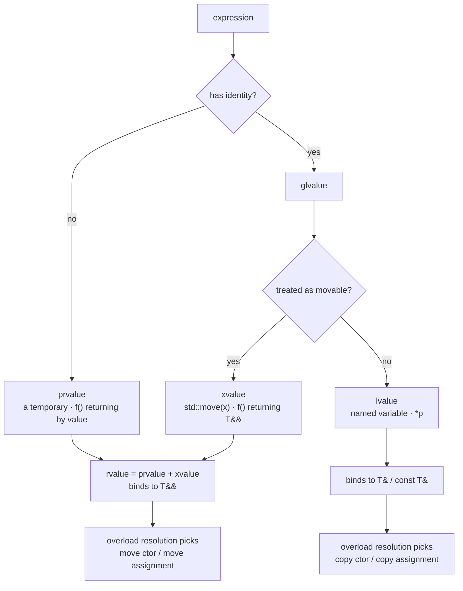

# C++ Move Semantics Lab

Move semantics is a **compile-time overload-resolution story**, not a runtime optimisation you can sprinkle
on. We teach it in the order the compiler sees it — value category → overload chosen → elision — following
the first-principles and verify-before-you-teach rules in [`AGENTS.md`](../../../AGENTS.md).

## When to use

- A learner writes `std::move(x)` and is surprised the object is *still* copied, or that `x` is unusable after.
- They must hand-write the rule of five for a resource-owning type (buffer, handle, file descriptor).
- They need perfect forwarding for a factory/wrapper and keep collapsing references wrongly.
- Don't use it for ownership *design* — `unique_ptr`/`shared_ptr` choice belongs in
  [cpp-smart-pointers-raii-lab](../cpp-smart-pointers-raii-lab/SKILL.md).

## First principles: value categories decide the overload

C++17 [basic.lval] splits every expression into exactly one of three primary categories. `std::move` does
**not** move anything: cppreference defines it as `static_cast<std::remove_reference_t<T>&&>(t)` — an
unconditional cast that changes only the *category*, so a different overload gets selected.



| Expression | Category | Binds to `T&&`? | Which ctor runs | Gotcha |
| --- | --- | --- | --- | --- |
| `Widget w;` then `w` | lvalue | no | copy | needs an explicit `std::move` |
| `std::move(w)` | xvalue | yes | move | `w` left *valid but unspecified* |
| `Widget{}` / `make()` | prvalue | yes | **neither** — elided | C++17 guarantees no ctor call |
| `std::move(cw)`, `cw` is `const` | xvalue of `const T` | binds `const T&` | **copy** | silent pessimisation |
| `t` inside `template<class T> f(T&& t)` | lvalue | — | depends | needs `std::forward<T>(t)` |

**Moved-from state.** The standard ([lib.types.movedfrom]) says a moved-from library object is *valid but
unspecified*: you may destroy it or assign to it, and nothing else without first querying it. Only
`unique_ptr`/`shared_ptr` promise emptiness; a moved-from `std::string` being empty is a QoI accident.

**`noexcept` is not decoration.** `std::vector` reallocation uses `std::move_if_noexcept`: a move
constructor that is not `noexcept` is *skipped* in favour of the copy constructor, to preserve the strong
exception guarantee. A non-`noexcept` move constructor silently costs O(n) copies on every growth.

## Procedure

1. **Name the category** of every argument before reasoning about cost. If it has a name it is an lvalue —
   even a parameter declared `T&&`.
2. **Apply the rule of five or zero.** Prefer zero (members that manage themselves). Declaring a destructor
   or any copy operation *suppresses* the implicit move operations, so partial rules silently pessimise.
3. **Mark both move operations `noexcept`** and prove it:
   `static_assert(std::is_nothrow_move_constructible_v<T>);`.
4. **Never `return std::move(local)`** — [class.copy.elision] already treats a returned local as an rvalue,
   and the cast defeats NRVO. GCC/Clang diagnose it with `-Wpessimizing-move` and `-Wredundant-move`.
5. **Distinguish the two elisions.** Since C++17, initialising from a *prvalue* is not an elided copy at
   all — the result object is constructed in place (mandatory). NRVO (returning a *named* local) remains
   optional; `-fno-elide-constructors` disables NRVO but cannot undo the C++17 prvalue rule.
6. **Forward, don't move, in templates:**
   `template<class... A> T make(A&&... a) { return T(std::forward<A>(a)...); }`. Reference collapsing gives
   `& &`→`&`, `& &&`→`&`, `&& &`→`&`, `&& &&`→`&&`, so an lvalue argument stays an lvalue. `std::move`
   there would steal from the caller's object.
7. **Build with sanitizers and trace it:**
   `g++ -std=c++20 -Wall -Wextra -Wpessimizing-move -fsanitize=address,undefined -g move.cpp -o move && ./move`
   then rerun with `-fno-elide-constructors` and diff the output.
8. **Break it on purpose**: drop the `noexcept`, `const`-qualify the source, or add `std::move` to a return —
   and predict the new trace *before* rerunning. Close with the **Learning Footer**.

## Output shape

```
Expression:   <the exact expression under review>
Category:     lvalue | xvalue | prvalue        (why: <identity? movable?>)
Overload won: copy ctor | move ctor | elided (C++17 prvalue) | NRVO
Moved-from:   <valid-but-unspecified | guaranteed empty (unique_ptr/shared_ptr) | n/a>
noexcept:     move ctor <yes|no>  -> vector growth uses <move|copy via move_if_noexcept>
Fix:          <std::move | std::forward<T> | drop the cast | mark noexcept | rule of zero>
Build:        g++ -std=c++20 -Wall -Wextra -fsanitize=address,undefined -g x.cpp -o x
Trace:        <expected line-by-line ctor/copy/move output>
Next: <cpp-stl-templates-lab | cpp-smart-pointers-raii-lab | memory-model-lockfree-coach>
Learning Footer
```

## Worked example — a tracer that proves which special member ran

```cpp
// move.cpp — g++ -std=c++20 -Wall -Wextra -fsanitize=address,undefined -g move.cpp -o move
#include <iostream>
#include <string>
#include <type_traits>
#include <utility>

struct Tracer {
    std::string name;
    explicit Tracer(std::string n) : name(std::move(n)) { std::cout << "ctor    " << name << '\n'; }
    Tracer(const Tracer& o) : name(o.name) { std::cout << "copy    " << name << '\n'; }
    Tracer(Tracer&& o) noexcept : name(std::move(o.name)) { std::cout << "move    " << name << '\n'; }
    Tracer& operator=(const Tracer& o) { name = o.name; std::cout << "copy=   " << name << '\n'; return *this; }
    Tracer& operator=(Tracer&& o) noexcept { name = std::move(o.name); std::cout << "move=   " << name << '\n'; return *this; }
    ~Tracer() = default;
};

Tracer make_prvalue() { return Tracer{"prvalue"}; }    // C++17: mandatory elision
Tracer make_named()   { Tracer t{"named"}; return t; } // NRVO: permitted, not guaranteed

int main() {
    static_assert(std::is_nothrow_move_constructible_v<Tracer>);
    Tracer a = make_prvalue();   // 1: there is no copy/move to elide
    Tracer b = make_named();     // 2: NRVO
    Tracer c = a;                // 3: lvalue -> copy
    Tracer d = std::move(a);     // 4: xvalue -> move; a.name now unspecified
    const Tracer e{"const"};     // 5
    Tracer f = std::move(e);     // 6: const T&& binds const T& -> COPY, silently
    (void)b; (void)c; (void)d; (void)f;
}
```

Traced output (default `-O0`, elision on):

```
ctor    prvalue
ctor    named
copy    prvalue
move    prvalue
ctor    const
copy    const
```

Edge cases this pins down: line 4 prints `move    prvalue` because the *destination* member already holds
the string when the trace runs; `a.name` afterwards is valid-but-unspecified, so printing it is legal but
meaningless. Line 6 is the whole lesson — `std::move` on a `const` object yields `const Tracer&&`, which no
move constructor accepts, so you pay a copy with no diagnostic. Rebuild with `-fno-elide-constructors` and
line 2 gains an extra `move    named`, while line 1 does **not** change: C++17 prvalue initialisation has no
copy to elide.

## Tips

- `std::move` is a cast; `std::forward` is a *conditional* cast. Using `move` on a `T&&` template parameter
  steals from the caller and is the most common forwarding bug.
- A `const` member or a `const`-qualified source silently disables moving; audit with a tracer plus
  `-Wall -Wextra`, never by eye.
- Moving out of a container you are still iterating leaves unspecified elements — see the invalidation rules
  in [cpp-stl-templates-lab](../cpp-stl-templates-lab/SKILL.md).
- Self-move-assignment must leave the object valid; guard it explicitly or use copy-and-swap.
- Forget `noexcept` and `std::vector` growth degrades to copies — measure it with
  [cpu-cache-performance-coach](../cpu-cache-performance-coach/SKILL.md).
- Contrast with Rust, where moves are the *default* and use-after-move is a compile error:
  [rust-smart-pointers-lab](../rust-smart-pointers-lab/SKILL.md).
- Pair with [cpp-smart-pointers-raii-lab](../cpp-smart-pointers-raii-lab/SKILL.md),
  [memory-management-coach](../memory-management-coach/SKILL.md) and
  [code-optimizer](../code-optimizer/SKILL.md); verify every claim against cppreference and the working
  draft (`AGENTS.md` §2), and end with the **Learning Footer** (`AGENTS.md`).
