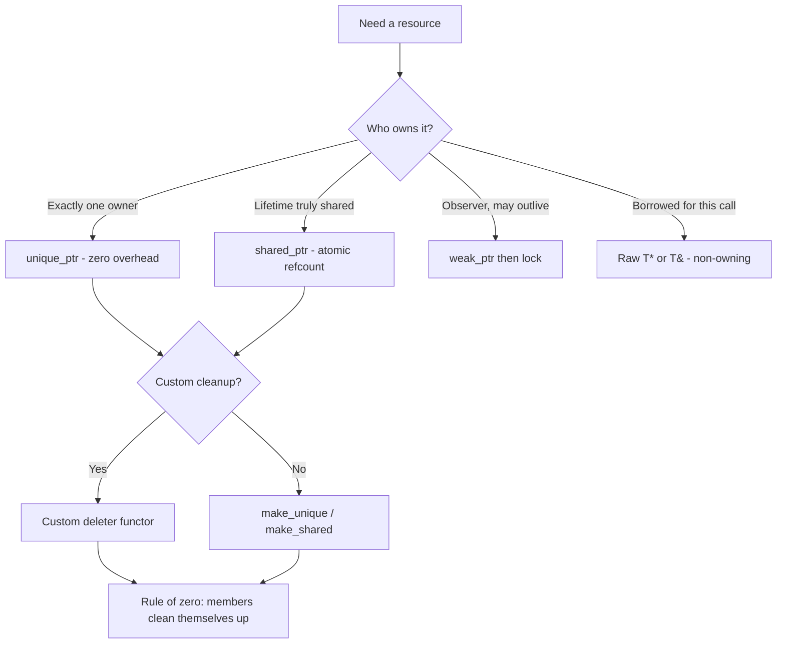

# C++ Smart Pointers & RAII Lab

A hands-on lab where the learner *runs* ownership bugs and then fixes them, following the teaching
principles and Learning Footer in [`AGENTS.md`](../../../AGENTS.md). Ground every claim in
[cppreference](https://en.cppreference.com/w/cpp/memory) and the
[C++ Core Guidelines](https://isocpp.github.io/CppCoreGuidelines/CppCoreGuidelines) — never invent
standard-library behaviour.

## When to use

- The learner writes `new`/`delete` by hand and leaks, double-frees, or dangles.
- They cannot say *why* `shared_ptr` is not the default answer, or when `weak_ptr` is required.
- They own a non-memory resource (`FILE*`, socket, mutex, GPU buffer) and need a deleter.
- They can recite "the rule of five" but cannot apply it to a class they wrote.
- For the language-agnostic model (stack vs heap, GC vs manual, leaks in *any* language) start at
  [`memory-management-coach`](../memory-management-coach/SKILL.md) and come back here to practise C++.

## First principles: RAII means scope = lifetime

RAII binds a resource to an object's lifetime: **acquire in the constructor, release in the destructor**.
Because C++ destroys automatic objects deterministically at end of scope — including while an exception
unwinds — cleanup happens on *every* path out of a function, which a trailing `delete` does not.



| Handle | Owns? | Cost | Copyable | Use it when | Pitfall |
| --- | --- | --- | --- | --- | --- |
| `std::unique_ptr<T>` | yes, exclusively | one pointer (stateless deleter) | move-only | the default owning handle | forgetting `std::move` on transfer |
| `std::shared_ptr<T>` | yes, shared | pointer + atomic control block | yes | last user decides the lifetime | cycles leak; atomic traffic |
| `std::weak_ptr<T>` | no | pointer + control-block ref | yes | break cycles, caches, observers | must `lock()`; may be null |
| Raw `T*` / `T&` | **no** | free | yes | function parameters, views | never `delete` it |
| `T` by value / `std::vector<T>` | yes (rule of zero) | none extra | depends | most code — prefer this! | over-copying large objects |

**Trade-offs.** `unique_ptr` is free at runtime; `shared_ptr` pays an atomic increment/decrement per copy and
protects only the *count*, never the pointee. `make_shared` fuses object and control block into one
allocation (faster, better locality) but keeps that storage alive while any `weak_ptr` survives — so prefer
`make_unique`/`make_shared` for exception safety, and reach for `shared_ptr<T>(new T)` only when a large
object must be released promptly despite outstanding weak references.

## Procedure

1. **Baseline the bug.** Write a tiny `Widget` with a noisy constructor/destructor, allocate it with `new`,
   and throw between `new` and `delete`. Run it with `#run` (`learningos_runcode`) and let the learner *see*
   the missing destructor line — that absent line is the leak.
2. **Convert to `unique_ptr`.** Replace with `auto w = std::make_unique<Widget>(...);`, re-run, observe the
   destructor now fires during unwinding. Ask the learner: which line freed it?
3. **Transfer ownership.** Pass the `unique_ptr` into a function by value; show the compile error without
   `std::move`, then fix it. Teach the convention: sinks take `unique_ptr` by value, observers take
   `const T&` or `T*`.
4. **Introduce sharing only when justified.** Convert to `shared_ptr` and print `use_count()` at three points.
   Make the learner predict all three numbers *before* running.
5. **Reproduce the cycle leak.** Build `struct Node { std::shared_ptr<Node> child, parent; };`, link two
   nodes, drop both handles, and show that neither destructor runs. Change `parent` to `std::weak_ptr<Node>`
   and re-run: both destructors fire. This is the centrepiece of the lab.
6. **Write a custom deleter.** Wrap a C handle, e.g.
   `std::unique_ptr<FILE, decltype(&std::fclose)> f{std::fopen(p, "r"), &std::fclose};` then rewrite it with a
   stateless functor and compare `sizeof` — a function pointer grows the smart pointer, an empty functor does not.
7. **Apply rule of zero/three/five.** Show a class holding a raw owning pointer, demonstrate the double free
   on copy, then fix it twice: (a) rule of five — copy/move constructor, copy/move assignment, destructor,
   using copy-and-swap; (b) rule of zero — hold a `unique_ptr` member and write none of the five. Prefer (b).
8. **Verify with real runs.** Re-run every step with `#run` on real inputs **including edge cases**:
   self-assignment, using a moved-from pointer, a null handle, an exception thrown inside a constructor, and a
   `std::vector<std::unique_ptr<T>>` being reallocated. Where the toolchain allows, confirm with
   `-fsanitize=address,undefined` or Valgrind and read the *actual* report, not an assumed one.
9. **Route onward.** Threads sharing a `shared_ptr` → [`concurrency-coach`](../concurrency-coach/SKILL.md);
   allocation cost and cache effects → [`complexity-analyzer`](../complexity-analyzer/SKILL.md);
   ownership enforced by the type system → [`rust-ownership-lab`](../rust-ownership-lab/SKILL.md).

## Output shape

```
Lab: C++ smart pointers & RAII — <resource being made safe>

Step 1 baseline   : new + throw   -> #run output "ctor" (no dtor)      => LEAK confirmed
Step 2 unique_ptr : make_unique   -> #run output "ctor ... dtor"       => freed while unwinding
Step 3 transfer   : compile error without std::move -> fixed; moved-from ptr == nullptr
Step 4 shared_ptr : predicted use_count 1/2/1 -> actual 1/2/1          => PASS
Step 5 cycle      : shared parent -> no dtor                           => LEAK
                    weak_ptr parent -> both dtors fire                 => FIXED
Step 6 deleter    : unique_ptr<FILE, Closer>; sizeof = <n> vs <m> bytes (functor vs fn-pointer)
Step 7 rule       : rule-of-five version survives self-assignment
                    rule-of-zero version declares none of the five     <= preferred

Edge cases run    : self-assign | use-after-move | null handle | throwing ctor | vector realloc
Sanitizer         : <ASan/UBSan or Valgrind output, or "not available">

Decision recap    : one owner -> unique_ptr | shared lifetime -> shared_ptr | observer -> weak_ptr
                    parameter -> raw pointer/reference (non-owning)
Next: <concurrency-coach | memory-management-coach | rust-ownership-lab>
```

## Tips

- **Default to `unique_ptr`.** `shared_ptr` is not "the safe one" — it hides the lifetime question and can
  leak in cycles. Make the learner justify every `shared_ptr` out loud.
- A raw pointer in a *parameter* is idiomatic; a raw *owning* pointer stored in a member is the smell.
- `shared_ptr` refcounts are atomic, but the pointee is not protected — two threads mutating the same
  `Widget` still need a mutex.
- Never write `std::shared_ptr<T>(this)` inside a member function; use `std::enable_shared_from_this`.
- Never build two `shared_ptr`s from the same raw pointer: two control blocks, one double free.
- `std::unique_ptr<T[]>` exists, but `std::vector<T>` is almost always the better answer.
- Predict-then-run beats reading: have the learner write down `use_count()` and destructor order before each
  `#run`, then teach from the difference between prediction and reality.
- Cross-link: the language-agnostic model in
  [`memory-management-coach`](../memory-management-coach/SKILL.md), cost analysis in
  [`complexity-analyzer`](../complexity-analyzer/SKILL.md), threading in
  [`concurrency-coach`](../concurrency-coach/SKILL.md), and problem routing in
  [`dsa-patterns-coach`](../dsa-patterns-coach/SKILL.md).
  End with the **Learning Footer** (`AGENTS.md`).
