# C++ STL & Templates Lab

The standard library is a **contract**: each container states its complexity *and* exactly when your
iterators die. We teach containers, algorithms, ranges and concepts from those guarantees, in the
first-principles, cite-the-source style of [`AGENTS.md`](../../../AGENTS.md).

## When to use

- A learner picks `std::vector` vs `std::deque` vs `std::list` by feel, or crashes after `push_back`.
- They write raw loops where `<algorithm>` or a `std::ranges` pipeline is clearer and better-checked.
- Their template errors are unreadable and should become one-line `concept` diagnostics.
- Don't use it for move/forwarding mechanics — that is
  [cpp-move-semantics-lab](../cpp-move-semantics-lab/SKILL.md).

## First principles: containers are guarantees, not classes

Every container in [containers] publishes complexity **and** invalidation. Reading a dead iterator is
undefined behaviour — not "usually fine": after reallocation the old buffer is freed, so ASan reports
heap-use-after-free.

```mermaid
flowchart TD
  N["What do you need?"] --> A{"index / contiguous<br/>memory?"}
  A -->|yes| V["std::vector<br/>O(1) back, O(n) middle<br/>reserve() to stop reallocation"]
  A -->|no| B{"push/pop at BOTH ends?"}
  B -->|yes| D["std::deque<br/>refs survive end-insert,<br/>iterators do not"]
  B -->|no| C{"stable addresses +<br/>O(1) splice?"}
  C -->|yes| L["std::list / forward_list"]
  C -->|no| K{"lookup by key,<br/>need order?"}
  K -->|ordered| M["std::map / set<br/>O(log n), node-based"]
  K -->|unordered| U["std::unordered_map / set<br/>O(1) avg; rehash kills iterators,<br/>NOT references"]
```



| Container | Insert invalidates | Erase invalidates | Notes (per cppreference / [containers]) |
| --- | --- | --- | --- |
| `vector` | **all** iters+refs if it reallocates; else those at/after the point | at/after the erased element | `reserve()` past max size makes inserts stable |
| `deque` | **all iterators**; references survive an insert at either *end* | end-erase: only the erased; middle-erase: all | asymmetric — the classic surprise |
| `list` / `forward_list` | never | only the erased element | O(1) `splice`, but pointer-chasing kills cache |
| `map` / `set` | never (node-based) | only the erased element | `extract()` moves nodes without reallocating |
| `unordered_*` | rehash invalidates **iterators only**, never references/pointers | only the erased element | `reserve(n)` avoids the rehash |
| `std::span` / `string_view` | n/a — non-owning | n/a | dangles the instant the owner dies |

**Ranges are lazy and non-owning.** `std::views::filter | transform` builds a view; nothing runs until you
iterate. Two consequences: (a) a view over a temporary dangles — bind the owner to a named variable; (b)
`filter_view::begin()` caches its first satisfying element (C++20 [range.filter]), so mutating the
underlying range after the first traversal is undefined. `std::ranges::sort` etc. take the range directly
and accept a **projection** (`std::ranges::sort(v, {}, &Item::price)`).

## Procedure

1. **Start from access pattern + invalidation**, not from habit. Default to `std::vector`; justify anything
   else with a guarantee from the table above.
2. **Reserve before bulk insertion** (`v.reserve(n)`) so no iterator dies mid-loop, and so growth doesn't
   pay for reallocation. Growth also depends on `noexcept` moves — see
   [cpp-move-semantics-lab](../cpp-move-semantics-lab/SKILL.md).
3. **Replace raw loops** with named algorithms. Remember `std::remove_if` only *partitions*: the erase-remove
   idiom `v.erase(std::remove_if(b, e, p), v.end())` is required, and C++20's `std::erase_if(v, p)` /
   `std::erase(v, value)` replaces it in one call.
4. **Pipe with ranges** when the steps are a transformation chain, and keep the owner alive:
   `auto out = v | std::views::filter(p) | std::views::transform(f);`.
5. **Constrain templates with concepts** (C++20 `<concepts>`: `std::integral`, `std::same_as`,
   `std::totally_ordered`, `std::ranges::range`). `template <std::integral T> T f(T);` fails at the call
   site with one line instead of a SFINAE avalanche, and concept *subsumption* orders overloads.
6. **Push work to compile time**: `constexpr` = *may* run at compile time, `consteval` = **must**,
   `constinit` = initialised at compile time but mutable. C++20 permits `constexpr` `std::vector`/`std::string`
   provided the allocation does not escape the constant evaluation (libstdc++ 12+, libc++ 15+).
7. **Build with the checking flags** — this is the whole point of the lab:
   `g++ -std=c++20 -Wall -Wextra -D_GLIBCXX_ASSERTIONS -fsanitize=address,undefined -g stl.cpp -o stl`.
   For full iterator debugging use `-D_GLIBCXX_DEBUG` (libstdc++) or `-D_LIBCPP_HARDENING_MODE=_LIBCPP_HARDENING_MODE_DEBUG`
   (libc++ 18+); both abort with a named error instead of corrupting memory.
8. **Prove one invalidation on purpose**, watch the tool name it, then fix it and re-run. Close with the
   **Learning Footer**.

## Output shape

```
Access pattern: <index | ends | middle-insert | key lookup | ordered scan>
Container:      <chosen>   Runner-up: <other> — rejected because <guarantee>
Complexity:     insert <O(..)> · lookup <O(..)> · erase <O(..)>
Invalidation:   insert -> <...> · erase -> <...>   (mitigation: reserve / node handles / indices)
Algorithm:      <std::ranges::… | erase_if | views pipeline>   Projection: <member|none>
Constraint:     template <<concept> T>  — failure message: <one line>
Compile-time:   constexpr | consteval | constinit | runtime-only  (why)
Build: g++ -std=c++20 -Wall -Wextra -D_GLIBCXX_DEBUG -fsanitize=address,undefined -g x.cpp -o x
Expected output: <traced lines>
Next: <cpp-move-semantics-lab | cpu-cache-performance-coach | complexity-analyzer>
Learning Footer
```

## Worked example — erase, sort, pipe, and a constexpr sum

```cpp
// stl.cpp — g++ -std=c++20 -Wall -Wextra -D_GLIBCXX_ASSERTIONS -fsanitize=address,undefined -g stl.cpp -o stl
#include <algorithm>
#include <concepts>
#include <iostream>
#include <ranges>
#include <vector>

template <std::integral T>                 // concept, not SFINAE: one-line error on misuse
constexpr T sum_of(const std::vector<T>& xs) {
    T total{};
    for (T x : xs) total += x;
    return total;
}
// constexpr std::vector: allocation is created and destroyed inside the same constant evaluation.
static_assert(sum_of(std::vector<int>{1, 2, 3, 4}) == 10);

int main() {
    std::vector<int> v{5, 2, 9, 2, 7, 4};
    std::erase(v, 2);                       // C++20 -> {5, 9, 7, 4}
    std::ranges::sort(v);                   //        -> {4, 5, 7, 9}

    auto even_squares = v | std::views::filter([](int x) { return x % 2 == 0; })
                          | std::views::transform([](int x) { return x * x; });
    for (int x : even_squares) std::cout << x << ' ';
    std::cout << "\nsum=" << sum_of(v) << '\n';

    std::vector<int> w{1, 2, 3};
    auto it = w.begin();
    w.reserve(64);                          // capacity grows -> `it` is now dangling
    // std::cout << *it;                    // UB: ASan = heap-use-after-free, _GLIBCXX_DEBUG = abort
    it = w.begin();                         // the fix: re-acquire after any capacity change
    std::cout << "front=" << *it << '\n';
}
```

Traced output:

```
16 
sum=25
front=1
```

Check the trace: `{5,2,9,2,7,4}` minus every `2` is `{5,9,7,4}`; sorted it is `{4,5,7,9}`; the filter keeps
only `4`, the transform squares it to `16` (note the trailing space from the loop), and `4+5+7+9 = 25`. Edge
cases worth pointing at: `std::erase` removes **all** matches, not the first; the view is evaluated lazily at
the `for` loop, so mutating `v` before it would change the result; and uncommenting the `*it` line turns a
"works on my machine" bug into a named diagnostic under `-D_GLIBCXX_DEBUG`.

## Tips

- Invalidation is per-operation *and* per-container — quote the cppreference row, never generalise from
  `vector` to `deque`.
- `std::remove_if` does not remove: it returns the new logical end. Prefer `std::erase_if` in C++20+.
- Views are lazy and borrow: `for (auto x : make_vector() | views::take(3))` dangles in C++20 (fixed only
  for specific range adaptors); assign the owner to a named variable first.
- Index or key handles survive reallocation when iterators do not — a cheap fix for growing containers.
- `std::list` has beautiful complexity and terrible locality; measure with
  [cpu-cache-performance-coach](../cpu-cache-performance-coach/SKILL.md) before believing the Big-O.
- Reach for concepts the moment an error exceeds a screen; pair with
  [complexity-analyzer](../complexity-analyzer/SKILL.md),
  [design-patterns-coach](../design-patterns-coach/SKILL.md) and
  [cpp-smart-pointers-raii-lab](../cpp-smart-pointers-raii-lab/SKILL.md). Cite cppreference with dates
  (`AGENTS.md` §2) and finish with the **Learning Footer** (`AGENTS.md`).
