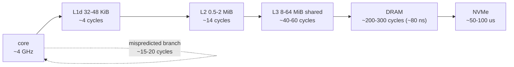

# CPU Cache & Performance Coach

Modern CPUs are fast at arithmetic and slow at waiting; almost all "slow code" is really **memory layout and
branch behaviour**. We reason from the hierarchy down to the cache line, then *measure* rather than assert,
per the verify-before-you-teach rule in [`AGENTS.md`](../../../AGENTS.md).

## When to use

- A loop with good Big-O is still slow, or a "parallel" version gets *slower* as threads are added.
- The learner is choosing a data layout (AoS vs SoA, nested containers vs a flat buffer) for a hot path.
- They want to read `perf stat` output and turn counters into a concrete code change.
- Don't use it for algorithmic complexity — pick the right algorithm first with
  [complexity-analyzer](../complexity-analyzer/SKILL.md).

## First principles: the hierarchy and the 64-byte line

DRAM is roughly two orders of magnitude further away than L1. Hardware hides that with **cache lines**
(64 B on x86-64 and most AArch64; some Apple silicon uses 128 B), so one miss pulls in ~16 `int32`s — free
work *if* you use them, wasted bandwidth if you stride past them.



| Symptom | Likely cause | Counter that confirms it | Fix |
| --- | --- | --- | --- |
| Slow scan of a big array | stride > 64 B, poor spatial locality | `cache-misses` / `LLC-load-misses` high | traverse in memory order; blocking/tiling |
| Only some fields touched | AoS drags cold fields into the line | high `cache-references` per useful byte | switch to SoA / split hot & cold fields |
| Threads scale *negatively* | false sharing (MESI line ping-pong) | high `LLC-store-misses`, low IPC | pad/align each writer to its own line |
| Data-dependent `if` in a loop | branch mispredict, ~15-20 cycle flush | `branch-misses` ≫ 1 % of `branches` | sort data, or go branchless with arithmetic/`cmov` |
| Pointer-chasing (`list`, tree) | no prefetchable pattern | high miss rate, low IPC | flat arrays + indices instead of pointers |
| Scalar float loop | no vectorisation | `-fopt-info-vec-missed` says why | `-O3 -march=native`, contiguous, no aliasing |

Numbers above are order-of-magnitude (Intel/AMD optimisation manuals; the widely circulated "latency numbers
every programmer should know" table). **Never quote them as measurements** — always confirm on the machine
in front of you.

## Procedure

1. **Establish a baseline you can trust**: fixed input, ≥ 3 repeats, report the median, and print a value
   derived from the result so the optimiser cannot delete the loop.
2. **Compute the working set** (`elements × sizeof(element)`) and place it against L1/L2/L3 (`lscpu`,
   `getconf -a | grep CACHE`). Everything below is either "fits" or "doesn't".
3. **Fix traversal order first** — iterate the *fastest-varying* index innermost so consecutive iterations
   touch the same line. In C/C++ that means row-major; in column-major languages the opposite.
4. **Split hot from cold fields.** If a loop reads one field of a 64-byte struct, an SoA layout raises useful
   bytes-per-line from 4/64 to 64/64.
5. **Eliminate false sharing**: give each writing thread its own cache line via
   `alignas(64)` (or `std::hardware_destructive_interference_size`, C++17 — note GCC's `-Winterference-size`
   ABI warning) and accumulate in a thread-local before one final atomic update.
6. **Attack branches only after memory.** Sorting the data, hoisting the condition out, or replacing it with
   arithmetic can remove a 15-20 cycle flush per element.
7. **Vectorise last.** Check `-O3 -march=native -fopt-info-vec` (GCC) or `-Rpass=loop-vectorize` (Clang);
   most failures are aliasing, non-contiguous access, or a loop-carried dependency — not a missing intrinsic.
8. **Measure, don't believe:**
   `g++ -std=c++20 -O2 -march=native -pthread cache.cpp -o cache && perf stat -e cycles,instructions,cache-references,cache-misses,branch-misses ./cache`
   (`valgrind --tool=cachegrind ./cache` when `perf` is unavailable, e.g. in containers or on WSL).
   Then re-measure after *one* change at a time, and close with the **Learning Footer**.

## Output shape

```
Hot path:      <file:function:loop>
Working set:   <bytes>  -> fits in <L1|L2|L3|DRAM>
Layout:        AoS | SoA | flat array | pointer-chasing    Line utilisation: <useful bytes>/64
Hypothesis:    <spatial locality | false sharing | branch mispredict | no vectorisation>
Counters:      cache-misses <x> · branch-misses <y>% · IPC <z>   (perf stat command shown)
Change:        <one edit>                       Predicted effect: <direction + rough factor>
Measured:      before <t0> ms -> after <t1> ms  (median of <n> runs, same input)
Rejected:      <optimisation> because <it did not move the counter that mattered>
Next: <complexity-analyzer | memory-model-lockfree-coach | code-optimizer>
Learning Footer
```

## Worked example — traversal order and false sharing, in one program

```cpp
// cache.cpp — g++ -std=c++20 -O2 -march=native -pthread cache.cpp -o cache && ./cache
// Needs ~64 MiB of RAM for the matrix.
#include <atomic>
#include <chrono>
#include <cstddef>
#include <cstdint>
#include <iostream>
#include <thread>
#include <vector>

using clk = std::chrono::steady_clock;
constexpr std::size_t kLine = 64;          // x86-64 / typical AArch64 cache line

template <class F> double ms(F&& f) {
    const auto t0 = clk::now();
    f();
    return std::chrono::duration<double, std::milli>(clk::now() - t0).count();
}

int main() {
    constexpr std::size_t N = 4096;        // 4096^2 * 4 B = 64 MiB: far past any L3
    std::vector<std::int32_t> m(N * N, 1);
    std::int64_t r = 0, c = 0;

    const double t_row = ms([&] { for (std::size_t i = 0; i < N; ++i)
                                      for (std::size_t j = 0; j < N; ++j) r += m[i * N + j]; });
    const double t_col = ms([&] { for (std::size_t j = 0; j < N; ++j)
                                      for (std::size_t i = 0; i < N; ++i) c += m[i * N + j]; });
    std::cout << "row-major " << t_row << " ms | col-major " << t_col
              << " ms | ratio " << t_col / t_row << " | sums " << r << ' ' << c << '\n';

    constexpr int kIters = 20'000'000;
    struct Shared { std::atomic<std::uint64_t> a{0}, b{0}; };                 // same line
    struct Padded { alignas(kLine) std::atomic<std::uint64_t> a{0};
                    alignas(kLine) std::atomic<std::uint64_t> b{0}; };        // one line each
    Shared s; Padded p;
    auto hammer = [](std::atomic<std::uint64_t>& x) {
        for (int i = 0; i < kIters; ++i) x.fetch_add(1, std::memory_order_relaxed);
    };
    const double t_fs = ms([&] { std::thread t1([&]{ hammer(s.a); }), t2([&]{ hammer(s.b); });
                                 t1.join(); t2.join(); });
    const double t_pd = ms([&] { std::thread t1([&]{ hammer(p.a); }), t2([&]{ hammer(p.b); });
                                 t1.join(); t2.join(); });
    std::cout << "false-shared " << t_fs << " ms | padded " << t_pd
              << " ms | speedup " << t_fs / t_pd << '\n';
}
```

What must be true, and what must not: both sums are exactly `16777216` (4096² ones), so any run where they
differ means the compiler removed work — a broken benchmark, not a fast one. `sizeof(Shared) == 16` while
`sizeof(Padded) == 128`, which is the entire fix. Expected *direction*: column-major is typically 3-10× slower
because each iteration touches a fresh line 16 KiB away, and the padded counters typically run 2-8× faster
than the shared pair. Exact ratios are machine-specific — report yours, don't quote mine. Confirm the second
result with `perf stat -e cache-misses,LLC-store-misses ./cache`; if padding does not move that counter, your
hypothesis was wrong.

## Tips

- Benchmarks that don't consume their result get optimised away — print the sum or use
  `benchmark::DoNotOptimize` (Google Benchmark).
- False sharing is invisible in the source: two *different* variables in one 64-byte line. Look at the
  struct layout, not the code.
- Padding costs memory; only pad the few counters written concurrently, and prefer a thread-local
  accumulator plus one final atomic — see [memory-model-lockfree-coach](../memory-model-lockfree-coach/SKILL.md).
- `std::list`/node-based maps defeat the prefetcher; a flat `vector` with indices usually wins despite worse
  asymptotics — check [cpp-stl-templates-lab](../cpp-stl-templates-lab/SKILL.md) for the guarantees you give up.
- `-march=native` bakes in the build machine's ISA; use `-mtune` or runtime dispatch for portable binaries.
- Hyperthreads share L1/L2 — pin threads (`taskset`, `numactl`) before comparing scaling numbers.
- Pair with [code-optimizer](../code-optimizer/SKILL.md), [memory-management-coach](../memory-management-coach/SKILL.md)
  and [os-internals-coach](../os-internals-coach/SKILL.md); cite the vendor optimisation manual with its date
  (`AGENTS.md` §2) and finish with the **Learning Footer** (`AGENTS.md`).
