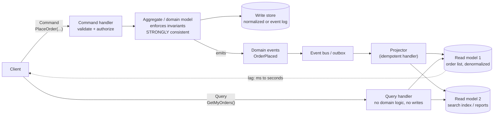

# CQRS Coach

CQRS is one decision: **the model you write through and the model you read from need not be the same model.**
Everything else is a consequence. Teach the trade-off, per [`AGENTS.md`](../../../AGENTS.md). Pairs with
[event-sourcing-coach](../event-sourcing-coach/SKILL.md),
[saga-pattern-coach](../saga-pattern-coach/SKILL.md),
[microservices-decomposer](../microservices-decomposer/SKILL.md), and
[consistency-models-coach](../consistency-models-coach/SKILL.md).

## When to use

- A single ORM entity is being contorted to serve both a rule-heavy write path and a dozen list/report screens.
- Reads outnumber writes by orders of magnitude (or vice versa) and one store must be tuned for both.
- The team is adopting event sourcing and assumes CQRS is mandatory (it isn't — and vice versa).
- Someone proposed CQRS for a CRUD admin screen and you need the honest "don't".

## The flow



Two rules define the shape: a **command** changes state and returns no data (an ack or an id at most); a
**query** returns data and changes nothing. That is Bertrand Meyer's command–query separation applied at the
*architecture* level rather than the method level.

## What actually gets split — pick your level

| Level | Write side | Read side | Cost | Use when |
| --- | --- | --- | --- | --- |
| **0 — none (CRUD)** | One model | Same model | None | Simple domain; reads and writes look alike |
| **1 — separate models, one database** | Domain aggregates | Hand-written SQL / DTO projections, possibly views | Low | Different *shapes*, same consistency needs. **Start here.** |
| **2 — separate schemas or tables, same DB, updated in the same transaction** | Aggregates | Denormalized tables | Medium | Query performance matters; **still strongly consistent** |
| **3 — separate stores, async projections** | Write DB or event log | Cache / search index / read replica | High | Different *scale* or *technology*; accepts eventual consistency |
| **4 — CQRS + event sourcing** | Append-only event log | Rebuildable projections | Highest | Full audit history, temporal queries, replayable models |

**The costs rise steeply after level 2.** Most teams that "did CQRS and regretted it" jumped to level 3 for a
domain that needed level 1.

## Is it worth it?

| Signal for CQRS | Signal against |
| --- | --- |
| Complex invariants on write, simple flat projections on read | Straight CRUD with matching shapes |
| Read:write ratio ≫ 1 (or ≪ 1) and you need to scale one side alone | Balanced, modest load |
| Many differently shaped read views over one write model | One screen per table |
| Reporting/search needs a completely different store (Elasticsearch, OLAP) | The relational store serves everything fine |
| Audit / temporal queries are a requirement | Audit isn't asked for |
| A bounded context with a genuine domain model already exists | Anemic entities and no ubiquitous language |
| The team has ops maturity for async pipelines and lag monitoring | One dev, no message infra, no on-call |

**CQRS is a per-bounded-context decision, not a system-wide one.** Applying it to every service is the single
most common way teams pay all the costs and collect none of the benefits.

## CQRS and event sourcing are independent

| | Without event sourcing | With event sourcing |
| --- | --- | --- |
| **Without CQRS** | Classic CRUD | Event-sourced aggregate, state rebuilt for reads — works, but queries get painful fast |
| **With CQRS** | Very common: separate read models over a normal relational write store | The classic pairing: events are the natural projection feed |

Event sourcing makes CQRS *convenient* (the event stream is already a change feed) and makes it *nearly
necessary* (querying a raw event log is impractical). CQRS does **not** require event sourcing — a change-data-
capture feed, an outbox table, or a synchronous in-transaction update all work. See
[event-sourcing-coach](../event-sourcing-coach/SKILL.md) and
[cdc-pipeline-coach](../cdc-pipeline-coach/SKILL.md).

## Eventual consistency: the part that bites users

At level 3+, a user can write and then immediately read stale data ("I saved it and it's not in the list").
Options, roughly in order of preference:

1. **Return what the command knows.** The handler already has the new state — render it directly instead of
   re-querying. Removes the problem for the most common case.
2. **Optimistic UI.** Show the intended result locally, reconcile when the projection catches up. Needs a
   visible failure path.
3. **Read-your-own-writes routing.** Pin the user's session to a synchronous/primary read for a short window
   after their write.
4. **Version tokens.** The command returns a version/position; the query waits for the projection to reach it
   (bounded wait, then degrade). Precise but adds latency and coupling.
5. **Make the lag visible.** "Updating…" beats a silently wrong screen.
6. **Keep the projection synchronous** (level 2) for the few views where staleness is genuinely unacceptable.

Never assume "milliseconds of lag" — measure projection lag and alert on it, because during a rebuild or an
incident it becomes minutes.

## Failure modes to design for up front

- **Dual-write** — writing to the store and publishing to the bus in two steps loses events on a crash. Use the
  **transactional outbox** (or CDC) so the event is committed with the state change.
- **Non-idempotent projectors** — at-least-once delivery means duplicates. Make every projector idempotent
  (upsert by id, or track the last processed event position) and tolerate out-of-order delivery
  ([idempotency-coach](../idempotency-coach/SKILL.md)).
- **Unrebuildable read models** — if you can't drop and replay a projection, you can't fix a projection bug.
  Keep rebuild a documented, tested, timed operation.
- **Poison events** — one bad event stalls a projector forever. Add retry limits plus a dead-letter path.
- **Commands that return data** — the moment a command returns a query result, the split has leaked.
- **Business logic in query handlers** — queries must be dumb; rules belong on the write side.
- **A distributed transaction across aggregates** — that is a saga, not a command
  ([saga-pattern-coach](../saga-pattern-coach/SKILL.md)).

## Procedure

1. **Scope one bounded context.** Never decide CQRS globally.
2. **List the commands and the queries separately** with their real frequencies, latency budgets, and
   consistency requirements. The asymmetry (or its absence) is the whole argument.
3. **Score it against the signal table.** If fewer than ~3 "for" signals fire, recommend **level 0 or 1** and
   say so plainly — recommending *against* CQRS is the most valuable thing this skill does.
4. **Choose the level (0–4)** and name what you are buying and what you are paying.
5. **Design the write side**: aggregate boundaries = transactional consistency boundaries; one aggregate per
   command; invariants enforced in the aggregate, never in a handler or the database.
6. **Design each read model backwards from a screen or API response.** Denormalize freely; duplication across
   read models is expected and fine. Read models are **disposable and rebuildable** — that property is what
   makes them safe.
7. **Choose the propagation mechanism**: same transaction (level 2), transactional outbox, CDC, or an event
   stream. State the delivery guarantee (at-least-once) and make projectors idempotent accordingly.
8. **Pick the stale-read strategy per view** from the list above, and set a target/alert for projection lag.
9. **Plan the rebuild**: how a projection is dropped and replayed, how long it takes at production volume, and
   whether it can run without downtime. Test it before you need it.
10. **Verify with a spike, not a doc.** Prototype one command + one projection, then run it with `#run`
    (`learningos_runcode`) or a local harness: assert idempotency by replaying the same event twice, assert
    out-of-order handling, and measure real lag under load. Then teach from those numbers.

## Output shape

```
CQRS assessment — <bounded context>

Commands: <PlaceOrder, CancelOrder ...>   ~<rate>/s, latency budget <ms>, consistency: STRONG
Queries:  <OrderList, OrderSearch ...>    ~<rate>/s, latency budget <ms>, staleness tolerated: <ms/s/none>

Signals for: <complex invariants | read:write = 500:1 | 6 view shapes | search store needed>
Signals against: <small team | no async infra>
=> VERDICT: <level 0 CRUD | level 1 same DB, separate models | level 2 sync projection |
             level 3 async projections | level 4 + event sourcing>
   Buying: <...>   Paying: <...>   (if level 0/1, say plainly: CQRS is not justified here)

Write side: aggregate <Name> = transactional boundary; invariants <...>; store <...>
Read models:
  <OrderListView>  <- shaped from screen <...>, store <...>, rebuild time <...>
  <OrderSearch>    <- store <...>, rebuild time <...>
Propagation: <same transaction | transactional outbox | CDC | event stream>  delivery: at-least-once
Projector idempotency: <upsert by id | last-processed position>   out-of-order: <handled how>

Stale reads: <return command result | optimistic UI | read-your-writes pinning | version token wait>
Lag SLO: p99 < <x>s, alert at <y>s, dashboard: <...>
Rebuild plan: <drop + replay from <source>, est <duration>, downtime: <none/…>, tested on <date>>

Failure modes covered: dual-write ✓ | duplicate events ✓ | poison event ✓ | rebuild ✓
Verified by spike (#run): replay-twice = same state ✓ | out-of-order ✓ | measured lag = <...>
Next: <event-sourcing-coach | saga-pattern-coach | microservices-decomposer>
```

## Tips

- The default answer is **no**. CQRS earns its keep in a minority of bounded contexts; say so before drawing
  any boxes.
- You can get most of the value at **level 1** — separate read DTOs and hand-written queries over the same
  database, zero eventual consistency, zero new infrastructure.
- Commands return acknowledgements, not data; queries return data and touch nothing. The moment either leaks,
  you have CQRS costs with CRUD coupling.
- CQRS ≠ event sourcing. Choose each on its own merits, and never let "we need an audit log" smuggle in a
  distributed async architecture when an audit table would do.
- Never dual-write to a database and a message bus — use a transactional outbox or CDC.
- Assume at-least-once, out-of-order delivery: every projector must be idempotent and position-aware.
- Design read models backwards from the screen. A read model that needs a join at query time isn't finished.
- Treat "can I rebuild this projection from scratch, in production, within X minutes?" as a release gate.
- Monitor projection lag as a first-class SLO; users experience lag, not architecture diagrams.
- End with the **Learning Footer** (`AGENTS.md`).
