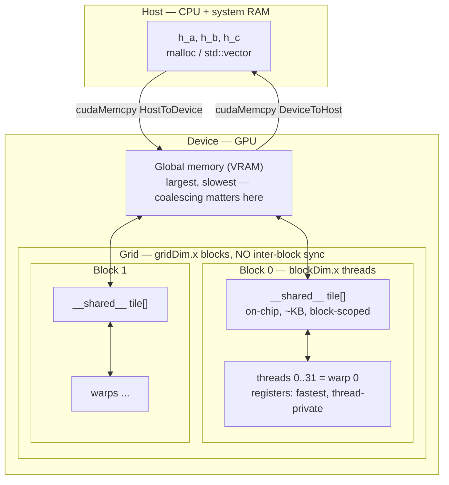

# CUDA Kernel Lab

GPU programming taught as a chain of decisions — **index → memory → coalescing → occupancy → measurement** —
in the first-principles, run-it-yourself spirit of [`AGENTS.md`](../../../AGENTS.md). Every API, flag and
launch-configuration rule below is checkable in NVIDIA's **CUDA C++ Programming Guide** and **CUDA C++ Best
Practices Guide** (both re-published with every CUDA Toolkit release — CUDA 12.x at the time of writing;
confirm against the version your `nvcc --version` reports).

## When to use

- The learner has written CPU code and wants to understand what a kernel launch actually does, rather than
  calling a library that hides it.
- Their kernel "runs" but the output array is all zeros, or only the first 256 elements are correct —
  almost always a missing bounds guard, a missing `cudaMemcpy` back, or an unchecked error.
- They need to reason about *why* one kernel is 10× faster than another: coalescing, occupancy and
  arithmetic intensity, not folklore.
- They have no NVIDIA GPU and need a free one (Google Colab's free tier offers an NVIDIA GPU — commonly a
  T4 — with a preinstalled CUDA toolkit).
- **Don't use it for** browser/portable GPU compute — see
  [webgpu-compute-lab](../webgpu-compute-lab/SKILL.md) — CPU-side or cluster parallelism
  ([mpi-openmp-parallel-lab](../mpi-openmp-parallel-lab/SKILL.md),
  [slurm-hpc-job-lab](../slurm-hpc-job-lab/SKILL.md)), or training neural networks, where cuBLAS/cuDNN
  already beat your hand-written kernel ([pytorch-tensors-lab](../pytorch-tensors-lab/SKILL.md)).

## First principles: one program, many threads, an explicit memory hierarchy

CUDA is **SIMT** — one kernel body executed by a grid of threads. Threads are grouped into **blocks** (which
share fast on-chip *shared memory* and can synchronise with `__syncthreads()`); blocks form a **grid**, and
blocks cannot synchronise with each other and may run in any order — that restriction is exactly what lets
the same binary scale across GPUs of different sizes. Hardware schedules threads in **warps of 32**; every
performance rule below follows from that number.



*Fig. 1 — the CUDA memory hierarchy. Cost rises and capacity falls as you move down: registers → shared
memory → L2 → global memory → PCIe back to the host. Optimising a kernel is almost always about moving work
**up** this diagram.*

### The global-index formula, recomputed

Every thread must map itself to exactly one data element:

$$ i = \text{blockIdx.x} \times \text{blockDim.x} + \text{threadIdx.x} $$

Check it by hand. With `blockDim.x = 256`, the thread with `blockIdx.x = 3, threadIdx.x = 7` gets
$i = 3 \times 256 + 7 = 775$. The last thread of block 3 is $3 \times 256 + 255 = 1023$ and the first thread
of block 4 is $4 \times 256 + 0 = 1024$ — contiguous, no gaps, no overlap. That contiguity is the point, and
it is also why coalescing works.

The grid must **cover** N, so it is rounded **up**:

$$ \text{gridDim.x} = \left\lceil \frac{N}{\text{blockDim.x}} \right\rceil $$

For $N = 1{,}000{,}000$ and `blockDim.x = 256`: $\lceil 1000000/256 \rceil = 3907$ blocks, launching
$3907 \times 256 = 1{,}000{,}192$ threads — **192 more threads than elements**. Hence the mandatory guard
`if (i >= n) return;`. Omitting it is the most common cause of an out-of-bounds write in a first CUDA
program.

| Scope | Declared as | Lifetime | Visible to | Rough cost |
| --- | --- | --- | --- | --- |
| Register | plain local variable | thread | one thread | ~1 cycle |
| Shared | `__shared__ float tile[N];` | block | all threads in the block | tens of cycles |
| Global | `cudaMalloc` / `__device__` | application | whole grid + host | hundreds of cycles |
| Constant | `__constant__` | application | grid (read-only, broadcast) | cached |
| Local ("spill") | too many registers | thread | one thread | **global-memory speed** — avoid |

### Coalescing, in bytes

A warp is 32 threads. If thread *t* reads `a[base + t]` of `float` (4 B), the warp touches
$32 \times 4 = 128$ contiguous bytes = **4 × 32-byte sectors**: fully coalesced, minimum traffic. Change it
to `a[base + 2*t]` and the same 32 values span 256 bytes = **8 sectors**, so you move 2× the bytes for the
same useful data — roughly 50 % memory efficiency. Column-wise access over a row-major matrix is the same
bug at larger stride, which is exactly why tiled matmul stages through `__shared__`.

### Occupancy, computed not guessed

Occupancy = resident warps ÷ maximum resident warps per SM. It is capped by whichever resource runs out
first: threads/SM, registers/SM, shared memory/SM, or blocks/SM.

Worked for a **Turing T4 (`sm_75`)**, whose limits are 1024 threads/SM and 65 536 32-bit registers/SM (look
yours up with `cudaGetDeviceProperties` — these are *architecture-specific*), at `blockDim.x = 256`:

| Registers/thread | Registers/block (×256) | Blocks fitting in 65 536 regs | Threads resident | Occupancy |
| --- | --- | --- | --- | --- |
| 64 | 16 384 | 4 | 1024 | **100 %** (also exactly the 1024-thread cap) |
| 72 | 18 432 | 3 (⌊65536/18432⌋ = ⌊3.55⌋) | 768 | 75 % |
| 128 | 32 768 | 2 | 512 | 50 % |

⚠ Register allocation is rounded up to a hardware granularity, so treat the table as the *shape* of the
relationship and get the real number from `cudaOccupancyMaxActiveBlocksPerMultiprocessor()` or Nsight
Compute. And say the trade-off out loud: **100 % occupancy is not the goal** — the CUDA C++ Best Practices
Guide is explicit that *enough* occupancy to hide latency is sufficient, and a lower-occupancy kernel with
more registers and more instruction-level parallelism frequently wins.

## Procedure

1. **Get a GPU.** Local: `nvidia-smi` (driver + GPU) and `nvcc --version` (toolkit — they are separate
   things and can disagree). No GPU? Open Google Colab, choose **Runtime → Change runtime type → GPU**, then:
   ```bash
   !nvidia-smi
   !nvcc --version
   ```
   In a Colab cell, write the source with `%%writefile lab.cu`, then compile and run with `!nvcc ...`.
2. **Compile for your actual architecture.** `-arch=native` (nvcc 11.5+) detects it; otherwise name it
   (`sm_75` Turing/T4, `sm_80` A100, `sm_86` RTX 30xx, `sm_89` L4/RTX 40xx, `sm_90` H100):
   ```bash
   nvcc -O2 -arch=native -lineinfo lab.cu -o lab    # -lineinfo maps Nsight counters back to source
   ```
   A binary built for the wrong arch fails at *launch*, not at compile time.
3. **Wrap every CUDA call in an error check from line one.** Kernel launches are *asynchronous*, so a
   kernel fault surfaces later at a random-looking API call unless you ask explicitly (`CUDA_CHECK` below).
4. **Write the kernel with the guard**: compute `i` with the formula above, `if (i >= n) return;`, then do
   the work. Prefer a **grid-stride loop** so one launch configuration handles any N.
5. **Allocate → copy → launch → sync → copy back → free**: `cudaMalloc`, `cudaMemcpy(...HostToDevice)`,
   `kernel<<<grid, block, shmemBytes>>>`, `cudaDeviceSynchronize()`, `cudaMemcpy(...DeviceToHost)`,
   `cudaFree`.
6. **Verify against a CPU reference before timing anything.** A fast wrong kernel is worthless: assert
   element-wise equality (exact for integers, epsilon-tolerant for floats).
7. **Time with CUDA events, not wall clock**, and time the copies separately from the kernel — for a
   memory-bound kernel the PCIe transfer usually dominates, and that lesson is the point:
   ```c
   cudaEvent_t t0, t1; cudaEventCreate(&t0); cudaEventCreate(&t1);
   cudaEventRecord(t0); kernel<<<g,b>>>(/*...*/); cudaEventRecord(t1);
   cudaEventSynchronize(t1); float ms; cudaEventElapsedTime(&ms, t0, t1);
   ```
8. **Compute achieved bandwidth** and compare with the datasheet peak. Vector add moves three arrays
   (2 read + 1 write), so effective GB/s $= 3 N \times 4\,\text{B} / (ms \times 10^{6})$. Near peak means
   the kernel is finished — stop optimising arithmetic.
9. **Profile before guessing.** Timeline first, then counters:
   ```bash
   nsys profile --stats=true ./lab      # Nsight Systems: where does wall time actually go?
   ncu --set full -o report ./lab       # Nsight Compute: per-kernel counters + rules
   ```
   Nsight Compute needs performance-counter permission; on shared or cloud machines (including Colab)
   counter collection is sometimes restricted — verify the current flag and the `ERR_NVGPUCTRPERM` remedy
   on the Nsight Compute documentation page rather than trusting an old answer.
10. **Only then optimise**, in this order: fix coalescing → cut host↔device copies → reuse data through
    shared memory → tune block size/occupancy → overlap copy and compute with streams. Close with the
    **Learning Footer**.

## Output shape

```
Kernel: <name>   Problem: <map|reduce|stencil|matmul>   N = <...>   dtype = <float|double|int>
Device: <name> · SMs <..> · maxThreadsPerBlock <..> · maxThreadsPerMultiProcessor <..>  (cudaGetDeviceProperties)
Toolkit/driver: nvcc <ver> · driver <ver> · built with -arch=<native|sm_XX>
Launch config: blockDim=<256>  gridDim=ceil(N/256)=<...>  -> threads launched <...>   guard present: <yes>
Index formula: i = blockIdx.x*blockDim.x + threadIdx.x    spot check: block <b>, thread <t> -> i = <...>
Memory plan: global <..> MB · shared/block <..> B · registers/thread <..>  (from -Xptxas -v)
Coalescing: warp 32 x <4> B = <128> B = <4> sectors  ->  <coalesced | strided x<k>, ~<..>% efficient>
Occupancy: activeBlocks/SM = <..> (cudaOccupancyMaxActiveBlocksPerMultiprocessor) -> <..>% — enough to hide latency? <y/n>
Correctness: CPU reference vs GPU — max abs diff = <0 | eps>    (checked BEFORE any timing)
Timing: H2D <ms> · kernel <ms> · D2H <ms>    effective BW <GB/s> vs peak <GB/s> = <..>%
Profile: nsys <top hotspot> · ncu limiter = <memory | compute | latency>
Errors: every call wrapped in CUDA_CHECK · cudaGetLastError() after launch: <ok>
Next: <webgpu-compute-lab | mpi-openmp-parallel-lab | cpu-cache-performance-coach>
Learning Footer
```

## Worked example — vector add, then a shared-memory reduction

Save as `lab.cu`. It needs nothing but the CUDA Toolkit, and runs unchanged in a Colab cell after
`%%writefile lab.cu`.

```c
#include <cstdio>
#include <cstdlib>
#include <cmath>

#define CUDA_CHECK(call)                                                        \
  do {                                                                          \
    cudaError_t _e = (call);                                                    \
    if (_e != cudaSuccess) {                                                    \
      fprintf(stderr, "CUDA error %s:%d: %s\n", __FILE__, __LINE__,             \
              cudaGetErrorString(_e));                                          \
      exit(EXIT_FAILURE);                                                       \
    }                                                                           \
  } while (0)

/* ---- Kernel 1: vector add. Grid-stride, so ANY grid size is correct for any N. ---- */
__global__ void vec_add(const float *a, const float *b, float *c, int n) {
  int stride = blockDim.x * gridDim.x;                  /* total threads in the grid */
  for (int i = blockIdx.x * blockDim.x + threadIdx.x;   /* the global-index formula */
       i < n;                                           /* the guard: the grid rounds UP */
       i += stride) {
    c[i] = a[i] + b[i];             /* thread i touches element i -> perfectly coalesced */
  }
}

/* ---- Kernel 2: block-level sum reduction in shared memory.
   Each block reduces 2*blockDim.x elements to one partial sum. Sequential-addressing
   pattern from NVIDIA's "Optimizing Parallel Reduction in CUDA" (Mark Harris). ---- */
__global__ void reduce_sum(const float *in, float *partial, int n) {
  extern __shared__ float sdata[];            /* size comes from the 3rd launch argument */
  unsigned tid = threadIdx.x;
  unsigned i   = blockIdx.x * (blockDim.x * 2u) + threadIdx.x;

  float v = 0.0f;                             /* first add happens during the load — free */
  if (i < (unsigned)n)              v  = in[i];
  if (i + blockDim.x < (unsigned)n) v += in[i + blockDim.x];
  sdata[tid] = v;
  __syncthreads();                            /* block-wide barrier: every thread must arrive */

  for (unsigned s = blockDim.x / 2u; s > 0u; s >>= 1u) {
    if (tid < s) sdata[tid] += sdata[tid + s];
    __syncthreads();                          /* OUTSIDE the if — never inside divergence */
  }
  if (tid == 0) partial[blockIdx.x] = sdata[0];
}

int main(void) {
  const int N = 1 << 20;                      /* 1,048,576 elements */
  const int BLOCK = 256;                      /* multiple of the 32-thread warp */
  const size_t bytes = (size_t)N * sizeof(float);

  float *h_a = (float *)malloc(bytes), *h_b = (float *)malloc(bytes),
        *h_c = (float *)malloc(bytes);
  for (int i = 0; i < N; ++i) { h_a[i] = (float)i; h_b[i] = 2.0f * (float)i; }

  float *d_a, *d_b, *d_c;
  CUDA_CHECK(cudaMalloc(&d_a, bytes));
  CUDA_CHECK(cudaMalloc(&d_b, bytes));
  CUDA_CHECK(cudaMalloc(&d_c, bytes));
  CUDA_CHECK(cudaMemcpy(d_a, h_a, bytes, cudaMemcpyHostToDevice));
  CUDA_CHECK(cudaMemcpy(d_b, h_b, bytes, cudaMemcpyHostToDevice));

  int grid = (N + BLOCK - 1) / BLOCK;         /* ceil(1048576/256) = 4096 exactly */
  vec_add<<<grid, BLOCK>>>(d_a, d_b, d_c, N);
  CUDA_CHECK(cudaGetLastError());             /* launch errors are async — ask for them */
  CUDA_CHECK(cudaDeviceSynchronize());
  CUDA_CHECK(cudaMemcpy(h_c, d_c, bytes, cudaMemcpyDeviceToHost));

  /* Verify: c[i] = i + 2i = 3i.  c[N-1] = 3*1048575 = 3145725, exact in float (< 2^24). */
  double maxdiff = 0.0;
  for (int i = 0; i < N; ++i) maxdiff = fmax(maxdiff, fabs((double)h_c[i] - 3.0 * i));
  printf("vec_add:    c[0]=%.0f c[7]=%.0f c[N-1]=%.0f  max|err|=%g\n",
         h_c[0], h_c[7], h_c[N - 1], maxdiff);

  /* ---- Reduction. All values 1.0f, so the exact answer is N and float error is truly 0. ---- */
  for (int i = 0; i < N; ++i) h_a[i] = 1.0f;
  CUDA_CHECK(cudaMemcpy(d_a, h_a, bytes, cudaMemcpyHostToDevice));

  int rgrid = (N + BLOCK * 2 - 1) / (BLOCK * 2);   /* 1048576 / 512 = 2048 blocks */
  float *h_partial = (float *)malloc((size_t)rgrid * sizeof(float));
  float *d_partial;
  CUDA_CHECK(cudaMalloc(&d_partial, (size_t)rgrid * sizeof(float)));

  reduce_sum<<<rgrid, BLOCK, BLOCK * sizeof(float)>>>(d_a, d_partial, N);
  CUDA_CHECK(cudaGetLastError());
  CUDA_CHECK(cudaDeviceSynchronize());
  CUDA_CHECK(cudaMemcpy(h_partial, d_partial, (size_t)rgrid * sizeof(float),
                        cudaMemcpyDeviceToHost));

  double total = 0.0;              /* 2048 partials finished on the CPU: cheap and exact */
  for (int i = 0; i < rgrid; ++i) total += h_partial[i];
  printf("reduce_sum: blocks=%d partial[0]=%.0f total=%.0f (expect %d)\n",
         rgrid, h_partial[0], total, N);

  free(h_a); free(h_b); free(h_c); free(h_partial);
  CUDA_CHECK(cudaFree(d_a)); CUDA_CHECK(cudaFree(d_b));
  CUDA_CHECK(cudaFree(d_c)); CUDA_CHECK(cudaFree(d_partial));
  return 0;
}
```

```bash
nvcc -O2 -arch=native -lineinfo -Xptxas -v lab.cu -o lab   # -Xptxas -v prints registers/thread
./lab
# vec_add:    c[0]=0 c[7]=21 c[N-1]=3145725  max|err|=0
# reduce_sum: blocks=2048 partial[0]=512 total=1048576 (expect 1048576)
```

**Trace the numbers by hand — that is the lesson.** `c[7] = 7 + 2·7 = 21`. `c[1048575] = 3 × 1 048 575 =
3 145 725`, which is below $2^{24} = 16\,777\,216$, so `float` represents it exactly and `max|err|` is truly
0. Each reduction block consumes $2 \times 256 = 512$ ones, so `partial[0] = 512`; with
$1\,048\,576 / 512 = 2048$ blocks the partials sum to $2048 \times 512 = 1\,048\,576 = N$. ✓ Had you summed
0…N−1 in `float` instead, the answer would be wrong by millions through round-off — a deliberate failure
worth running once.

The `__syncthreads()` placement encodes two rules: it is a **block-wide barrier**, so every thread in the
block must reach it (never put it inside a divergent branch), and it says nothing about other blocks — which
is precisely why we return per-block partials and finish on the host (or launch a second kernel).

## Tips

- **All zeros back?** In order: did you `cudaMemcpy` device→host *after* `cudaDeviceSynchronize`; did you
  check `cudaGetLastError()` after the launch; is the `if (i >= n) return;` guard present; did you pass the
  shared-memory byte count as the third `<<<>>>` argument for `extern __shared__`?
- Kernel launches **fail silently** without a check. `CUDA_CHECK` + `cudaGetLastError()` from line one saves
  hours; bolting it on afterwards is how people conclude "the GPU is broken".
- `__syncthreads()` synchronises a **block**, never a grid. If the algorithm needs a grid-wide barrier,
  launch a second kernel (or use cooperative groups where the device supports them).
- Make `blockDim` a **multiple of 32**; anything else wastes whole lanes of every warp. 128/256 are sane
  starting points — then measure, don't cargo-cult.
- Chase **coalescing before occupancy**. Most first kernels are memory-bound, so reaching a high fraction of
  DRAM peak matters far more than reaching high occupancy;
  [cpu-cache-performance-coach](../cpu-cache-performance-coach/SKILL.md) makes the same locality argument
  for CPUs.
- Expect legitimate `float` differences in reductions: the GPU changes the *order* of additions. Use a
  tolerance, or accumulate in `double`/Kahan, before declaring a bug.
- Version-volatile: architecture limits, `-arch` targets, and Nsight metric names and CLI flags change
  between toolkit releases. Verify on the current CUDA C++ Programming Guide / Nsight Compute page and state
  the CUDA version you tested with.
- Pair with [webgpu-compute-lab](../webgpu-compute-lab/SKILL.md) for the portable browser equivalent,
  [mpi-openmp-parallel-lab](../mpi-openmp-parallel-lab/SKILL.md) and
  [slurm-hpc-job-lab](../slurm-hpc-job-lab/SKILL.md) for scaling past one GPU,
  [memory-management-coach](../memory-management-coach/SKILL.md) for host-side allocation discipline,
  [pytorch-tensors-lab](../pytorch-tensors-lab/SKILL.md) to see where framework kernels take over, and
  [numpy-lab](../numpy-lab/SKILL.md) for the CPU reference you must always verify against.
  End with the **Learning Footer** (`AGENTS.md`).
