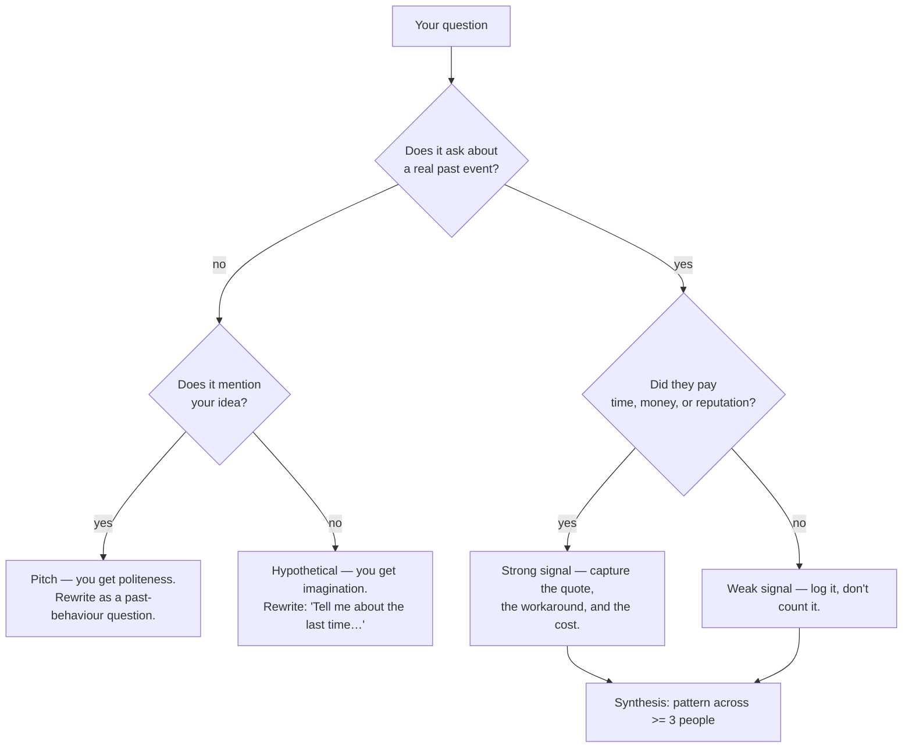

# Customer Interview Coach

Discovery interviews fail in a predictable way: you pitch, they're polite, you hear "yes", you build the
wrong thing. This skill teaches the **Mom Test** discipline — past behaviour over future opinion — and
follows the verify-before-you-teach and source rules in [`AGENTS.md`](../../../AGENTS.md).

## When to use

- You have an idea, a hypothesis, or a fuzzy problem and need evidence from real humans before building.
- Your interviews keep returning compliments ("I'd totally use that") and you can't tell signal from noise.
- You have raw notes from 5–15 conversations and need a synthesis that survives a sceptical reviewer.
- **Don't use it for** usability testing of an existing UI (that's task observation, not discovery), for
  quantitative survey design, or for a sales call — the moment you're selling, you've stopped learning.

## First principles: opinions are cheap, behaviour is expensive

Fitzpatrick's core claim in *The Mom Test* (2013) is that **you cannot ask anyone whether your idea is
good** — you can only ask about their life. Good questions are ones your own mother couldn't lie about,
because they concern facts that already happened. Three rules: talk about *their* life, ask about the
*past* not the future, talk less and listen more.



| Signal | What it looks like | Evidence tier | What it licenses |
| --- | --- | --- | --- |
| Currency (money spent) | "We pay $400/mo for a tool that half-works" | strongest | build / pricing decisions |
| Time spent | "Every Monday I spend two hours reconciling this by hand" | strong | prioritisation |
| Workaround built | "Here's the spreadsheet/script we hacked together" | strong | solution shape |
| Reputation risk | "I escalated it to my VP twice" | medium-strong | urgency claims |
| Specific past story | "Last quarter it broke and we…" | medium | opportunity framing |
| Generic complaint | "Reporting is kind of annoying" | weak | a follow-up question only |
| Compliment | "Cool idea, I'd definitely use it" | ~zero | nothing at all |
| Future promise | "Send me a link when it launches" | ~zero | ask for a commitment now |

**Be honest about the limits.** Interviews reveal *problems*, not *solutions* — people are poor at
specifying what to build. They over-represent whoever agreed to talk to you (selection bias), and five
people from one channel is one segment, not a market. Interviews complement, never replace, instrumented
behaviour and experiments — see [ab-test-designer](../ab-test-designer/SKILL.md).

## Bad question → good question

| Bad (leading / hypothetical) | Why it fails | Good (Mom Test) |
| --- | --- | --- |
| "Would you use a tool that automates X?" | invites politeness | "Walk me through the last time you did X." |
| "Do you think this is a good idea?" | asks for an opinion | "What have you already tried to fix it?" |
| "How much would you pay for this?" | imagined budget | "What are you paying today, and who signs off?" |
| "Is reporting a pain point?" | yes/no, no detail | "When did reporting last cost you a deadline?" |
| "Do you care about security?" | virtue answer | "What did your last security review change?" |

## Procedure

1. **Write the learning goal, not the pitch.** One sentence: "I want to learn how <segment> currently
   handles <job>, and what it costs them." If you can't say it without naming your product, rewrite it.
2. **List your riskiest assumptions** and rank them; interview only the top two or three. Feed survivors
   into an [product-discovery-coach](../product-discovery-coach/SKILL.md) opportunity tree.
3. **Name the segment precisely** (role, company size, trigger event) and record how you found each
   person — that recruiting channel *is* your bias log.
4. **Draft ≤ 7 questions**, every one past-tense and behavioural. Run each through the flowchart above and
   rewrite the failures. Leave the product out of the script entirely.
5. **Open with context, not a demo:** "I'm trying to understand how teams handle <job>. There's nothing to
   sell — I just want your story." Then stop talking. Aim for a 20/80 talk ratio.
6. **Dig on every emotion or vague word.** "Annoying" → "when did it last annoy you?" → "what did you do
   next?" → "what did that cost?" Three levels of *why* before you move on.
7. **Push for a commitment, not a compliment:** an intro to a colleague, a follow-up slot, a document, a
   letter of intent, a deposit. Currency, time, or reputation — or it didn't happen.
8. **Write notes within 10 minutes**, verbatim quotes first, your interpretation clearly separated.
9. **Synthesise after ~5 interviews per segment:** tag quotes, cluster into opportunities, and require a
   pattern from ≥ 3 independent people before you call it a finding. Count disconfirming evidence too.
10. Report using the shape below, then close with the **Learning Footer**.

## Output shape

```
Learning goal: <one sentence, no product named>
Segment: <role / context / trigger>   Recruited via: <channel — bias note>
Riskiest assumptions tested: <A1> · <A2>
Script (past-tense only):
  1. <question>   2. <question>   ...  (<= 7)
Traps removed: <leading question> -> <rewrite>
Interview log: n=<x> · talk ratio ~<20/80> · commitment asked: <yes/no>
Signals:
  "<verbatim quote>"  -> tier: currency|time|workaround|reputation|story|weak  -> opportunity: <...>
Patterns (>= 3 people): <pattern> (n=<x>/<total>)
Disconfirming evidence: <what did NOT show up>
Confidence: low|medium|high — because <sample, selection, recency>
Next test: <experiment / prototype / pricing probe>
Learning Footer
```

## Worked exchange — scored

> **You:** "Would you pay for a tool that auto-tags your support tickets?" → ❌ *pitch + hypothetical.
> Score 1/5. You have told them the answer you want.*
>
> **Rewrite:** "Tell me about the last time a ticket got routed to the wrong team."
> **Them:** "Ugh, Tuesday. It sat for six hours before someone noticed." → ✅ *real, dated, costly.*
>
> **You:** "What happened after the six hours?"
> **Them:** "The customer escalated to our CSM, and I had to write an apology." → ✅ *reputation cost.*
>
> **You:** "What have you already tried to stop that?"
> **Them:** "We built a Zapier rule on keywords. It misfires maybe a quarter of the time, so Priya
> spot-checks the queue each morning — about 40 minutes a day." → ✅ *workaround + time + named owner.*
>
> **You:** "Who would have to approve replacing that?" → ✅ *buying process, still no pitch.*
>
> **Synthesis:** currency signal absent, but **time (≈ 3.3 h/week)** + **workaround** + **reputation** →
> tier: strong. Pattern held in 4/6 interviews. Disconfirming: 2 teams with < 50 tickets/day did not care →
> segment the opportunity by ticket volume, not by industry.

## Tips

- If they compliment you, you asked a bad question — the compliment is data about *you*, not the market.
- "Would you" and "do you think" are banned openings; "tell me about the last time" is the workhorse.
- Never present a demo before the behavioural questions; you cannot un-anchor someone.
- Five yeses from friends is zero evidence. Recruit at least one person who should hate your idea.
- Deals and dates beat adjectives: log money, minutes, and the name of the workaround.
- Feed findings into [product-discovery-coach](../product-discovery-coach/SKILL.md) and
  [roadmap-builder](../roadmap-builder/SKILL.md); write it up with
  [prd-writer](../prd-writer/SKILL.md) or [user-story-writer](../user-story-writer/SKILL.md); pressure-test
  pricing claims with [pricing-strategy-coach](../pricing-strategy-coach/SKILL.md); brief stakeholders via
  [stakeholder-management-coach](../stakeholder-management-coach/SKILL.md). End every session with the
  **Learning Footer** (`AGENTS.md`).
