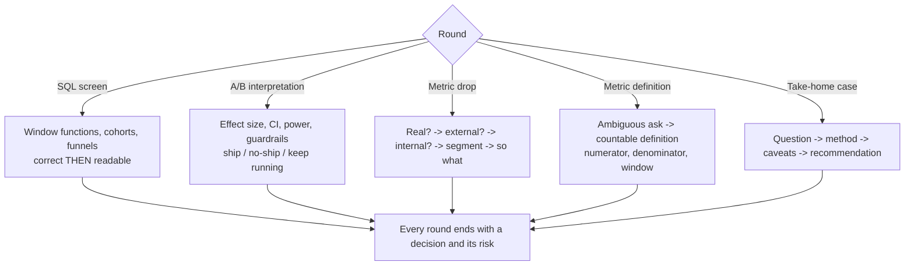

# Data Interview Drill

One data-interview task, timed, scored against a rubric, then a model answer and a targeted follow-up —
per [`AGENTS.md`](../../../AGENTS.md). The analytics sibling of
[coding-interview-drill](../coding-interview-drill/SKILL.md).

## When to use

- The learner has an analyst / data-scientist loop: SQL screen, product-case round, stats round, take-home.
- They can write SQL but stall on window functions, or they can run a t-test but can't explain what the
  business should *do* with the result.
- They give a cause for a metric drop before segmenting the data — the single most common rejection reason.

## The five rounds



**The metric-drop spine.** Ask in this order and you will out-perform 80% of candidates:
*is it real* (logging deploy, bot filter, pipeline late/partial, timezone) → *is it external* (seasonality,
holiday, platform or competitor change) → *is it internal* (release, pricing, experiment ramp, funnel step)
→ *which slice* (new vs. returning, platform, geo, cohort, top accounts) → *so what* (impact and action).
A 15% aggregate drop is usually one segment collapsing, not everyone declining 15%.

## Round comparison

| Round | Typical time | Really testing | Classic failure | Winning move |
| --- | --- | --- | --- | --- |
| **SQL** | 20–30 min | Window functions, joins, correctness under time | Silent typing, then a wrong join grain | Say the grain out loud; check duplicates before aggregating |
| **A/B interpretation** | 15–25 min | Whether they read a CI honestly | "p = 0.06 so it failed" | Report effect size + interval + power, then a decision |
| **Metric drop** | 20–30 min | Structured diagnosis | Guessing a cause in 30 seconds | Rule out instrumentation, then segment before theorizing |
| **Metric definition** | 10–20 min | Turning ambiguity into something countable | Reusing a vague word ("active") | Numerator, denominator, time window, exclusions |
| **Take-home** | 2–6 hrs | Judgment + communication | A notebook with no recommendation | Lead with the answer; put method and caveats below |

**SQL sub-skills that actually appear** — `ROW_NUMBER`/`RANK` for dedupe and top-N-per-group,
`LAG`/`LEAD` for period-over-period and session gaps, `SUM() OVER (PARTITION BY … ORDER BY …)` for running
totals and retention curves, and self-joins or `DATE_TRUNC` for cohorts. Know which of those five your
answer needs before typing.

## Procedure

1. **Set the round.** Confirm round type, SQL dialect if relevant, level, and time budget. Present **one
   original task** with a small, explicit schema — never a real company's proprietary question or dataset.
2. **Take clarifying questions first.** Reward asking about grain, nulls, duplicates, timezone, and what
   business decision the number feeds. Answer only what is asked.
3. **Require a plan before the keyboard.** One or two sentences: which tables, which grain, which window
   function, what the output rows mean. Then start the timer.
4. **Give progressive hints only on request** — nudge the shape ("what's the grain after that join?"), never
   write the query.
5. **Verify, don't assume.** For SQL, walk the query against 3–5 hand-made rows (or run it) and check the
   real output: duplicate rows from a fan-out join, nulls excluded by an inner join, and off-by-one window
   frames are the three bugs that show up most.
6. **Force the decision.** Every round must end with a sentence a stakeholder could act on, plus the risk if
   the learner is wrong. A correct number with no recommendation is a mid-level answer.
7. **Push on statistics honestly** in the A/B round: effect size and confidence interval before p-values;
   check sample-ratio mismatch, peeking, multiple comparisons, and novelty effects. Delegate depth to
   [experiment-analysis-coach](../experiment-analysis-coach/SKILL.md) and
   [hypothesis-testing-coach](../hypothesis-testing-coach/SKILL.md).
8. **Score against the rubric** with one line of evidence per dimension.
9. **Give a model answer** (query sketch or 5–8 line narrative) and **one targeted follow-up** aimed only at
   the lowest-scoring dimension.

## Output shape

```
Data Drill — <round type> (<level> · <dialect if SQL> · <time>)

Task: <original prompt + schema>
Clarifying Qs asked: <grain? nulls? timezone? decision?>
Plan stated before typing: <yes/no — "…">

--- Answer captured ---
Query / analysis: …
Output grain: <one row per …>       Assumptions: …
Decision for the stakeholder: …     Risk if wrong: …

--- Verification ---
Traced on <n> rows -> <real output> | Duplicates: <checked?> | Nulls: <handled?> | Window frame: <correct?>

--- Scored rubric (1–5 each) ---
| Dimension                           | Score | Evidence                     |
|-------------------------------------|-------|------------------------------|
| Correctness (result is right)       |  _/5  | …                            |
| Query craft / method choice         |  _/5  | …                            |
| Handling ambiguity & assumptions    |  _/5  | …                            |
| Statistical honesty (CI, power)     |  _/5  | …                            |
| Segmentation & diagnostic structure |  _/5  | …                            |
| Communication & recommendation      |  _/5  | …                            |
Total: __/30   Signal: <no hire | mixed | hire | strong hire at level>

Top strength: …
Top gap: …          Cost in a real loop: …
Model answer: <query sketch or 5–8 line narrative>
Targeted follow-up (lowest dimension only): …
```

## Tips

- **Grain first, aggregate second.** Most wrong SQL answers are right code on the wrong row grain — say
  "one row per user per day" before you write `GROUP BY`.
- **A p-value is not a decision.** Report the effect size with its interval, say whether the experiment was
  powered for the effect the business cares about, then recommend ship / no-ship / keep running — and check
  sample-ratio mismatch before believing any of it. Pair with
  [ab-test-designer](../ab-test-designer/SKILL.md).
- **Segment before you theorize.** Slice by platform, geo, new-vs-returning, and top accounts; the segment
  that moved usually names the cause for you.
- **"Active users" is not a metric** until you state numerator, denominator, time window, and exclusions —
  formalize with [metrics-definition-coach](../metrics-definition-coach/SKILL.md).
- Watch for **survivorship and selection bias** in cohort questions, and for **Simpson's paradox** when an
  aggregate moves opposite to every segment — naming it out loud is a senior signal.
- For take-homes: **lead with the recommendation**, keep the notebook reproducible, state caveats you'd fix
  with more time, and never present a chart you can't defend. See
  [exec-communication-coach](../exec-communication-coach/SKILL.md) for the write-up.
- Deepen SQL mechanics with [sql-coach](../sql-coach/SKILL.md) and
  [sql-query-explainer](../sql-query-explainer/SKILL.md); behavioural rounds go to
  [star-story-builder](../star-story-builder/SKILL.md).
- **Original tasks and synthetic data only** — never reproduce proprietary interview questions or datasets.
- One task per session, scored, then one follow-up. Broader timed practice:
  [mock-exam](../mock-exam/SKILL.md). End with the **Learning Footer** (`AGENTS.md`).
