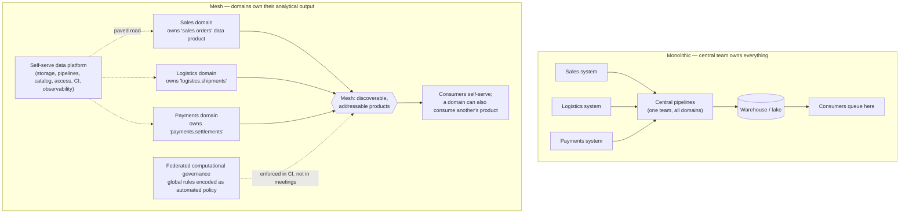

# Data Mesh Coach

Data mesh is an **organisational** answer to a bottleneck, dressed in architecture. If the bottleneck is a
central data team that cannot keep up with domain knowledge it does not own, mesh helps. If you have three
engineers and one warehouse, mesh is overhead with a manifesto. This skill teaches the four principles from
their sources and then argues, honestly, about fit — per the trade-offs-out-loud rule in
[`AGENTS.md`](../../../AGENTS.md).

## When to use

- Leadership has read about data mesh and wants a decision, not a summary.
- A central data team is the queue for every new dataset and lead time is measured in months.
- Domain teams already own operational services and are being asked to own their analytical data too.
- You are designing the *platform* half and need to know what "self-serve" must actually provide.
- **Don't use it for** picking storage or table formats ([`lakehouse-designer`](../lakehouse-designer/SKILL.md)),
  writing a single dataset's interface ([`data-contract-designer`](../data-contract-designer/SKILL.md)), or
  as a rebrand for "we bought a catalog" ([`data-catalog-coach`](../data-catalog-coach/SKILL.md)).

## First principles: four principles, one motivation

**Sources.** Zhamak Dehghani, *How to Move Beyond a Monolithic Data Lake to a Distributed Data Mesh*
(martinfowler.com, **2019-05-20**), which named the idea; *Data Mesh Principles and Logical Architecture*
(martinfowler.com, **2020-12-03**), which fixed the four principles used below; and the book *Data Mesh:
Delivering Data-Driven Value at Scale* (O'Reilly, **2022**). Supporting: Melvin Conway's law (1968), Eric
Evans' bounded contexts (*Domain-Driven Design*, 2003), and Skelton & Pais' *Team Topologies* (2019) for
the platform-team and cognitive-load arguments.

The motivating failure is specific: a **centralised, monolithic** data platform staffed by specialists who
own the *pipelines* but not the *meaning* of the data. Every new question queues behind a team that must
re-learn a domain it does not work in. Throughput does not scale with the number of domains, and data
quality has no owner who feels the consequences.



*Figure: the change is who owns the analytical output — the domain that already owns the operational
system. Platform and governance exist to stop that decentralisation from producing N incompatible silos.*

### The four principles, and what each one actually demands

| # | Principle | What it means | What it costs you |
| --- | --- | --- | --- |
| 1 | **Domain-oriented decentralised data ownership** | the team that produces the data owns its analytical form, aligned to a bounded context | domain teams need data skills and headroom; Conway's law now works *for* you, so the boundaries must be right |
| 2 | **Data as a product** | each dataset has an owner, an SLO, documentation, a schema contract, and a consumer feedback loop | a product needs a product owner, a roadmap, and deprecation discipline |
| 3 | **Self-serve data platform** | domain teams provision storage, pipelines, access, catalog entries and observability without tickets | a real platform team funded as a product, not a rebranded ops rota |
| 4 | **Federated computational governance** | global rules (interoperability, privacy, identity) decided jointly by domain reps **and executed automatically** | policy-as-code plus a governance forum; the word *computational* is doing the work |

**Data as a product — the usability characteristics** the 2020 article enumerates. Use them as an
acceptance checklist, not a slogan:

| Characteristic | Concrete test |
| --- | --- |
| Discoverable | it is in the catalog with owner, description and freshness |
| Addressable | a stable, permanent identifier/URI that survives refactors |
| Trustworthy & truthful | published SLOs (freshness, completeness) with measured, visible compliance |
| Self-describing | schema + semantics + example queries, readable without asking the team |
| Interoperable | global standards: shared identifiers, field types, naming, polyglot access |
| Secure & governed | access control enforced globally, PII classified, audit available |

Two more constructs from the same source worth naming: the **data product as an architectural quantum**
(code + data + metadata + infrastructure shipped and versioned *together*, not a table alone), and
**output ports** (a product may expose SQL, files, and a stream — consumers choose).

### When mesh is the wrong answer

| Signal | Reading |
| --- | --- |
| Fewer than ~4–5 genuinely distinct data-producing domains | the coordination cost of mesh exceeds the coordination cost it removes |
| No platform team, and none funded | principle 3 is missing ⇒ you get N bespoke stacks, not a mesh |
| Domain teams have no data engineering capacity | ownership becomes abandonment; quality drops |
| The real pain is a slow warehouse or bad modelling | fix it with [`lakehouse-designer`](../lakehouse-designer/SKILL.md) / [`data-warehouse-modeling`](../data-warehouse-modeling/SKILL.md) |
| Governance is a monthly meeting with no automation | principle 4 degrades into a committee; standards will not hold |
| Leadership wants the diagram but not the reorg | mesh is org change first; the architecture is downstream |

**Mesh vs. neighbours.** *Data fabric* is a metadata-and-automation-centric architecture that can be
centrally owned — it is not the same claim. *Lakehouse* is a storage/compute architecture and is orthogonal:
you can run a mesh on lakehouse products, or a monolith on the same technology. Do not let a vendor
substitute one for the other.

## Procedure

1. **Name the bottleneck precisely** with evidence: lead time from "we need dataset X" to "X is in
   production", queue depth on the central team, and the share of incidents where nobody owns the data.
   If you cannot measure the bottleneck, you cannot claim mesh fixes it.
2. **Score readiness** on the eight criteria in the worked example. Be adversarial about principle 3 —
   platform absence is the most common reason mesh attempts fail.
3. **Map domains to bounded contexts**, not to org-chart boxes. Use
   [`domain-driven-design-coach`](../domain-driven-design-coach/SKILL.md); a domain that cannot describe its
   own ubiquitous language cannot own a data product.
4. **Pick two or three pilot data products** on the highest-demand, clearest-ownership datasets. Never
   start with the ambiguous shared entity (`customer`) — start where ownership is obvious.
5. **Write the data product spec** for each: owner, purpose, schema, SLOs, output ports, access policy,
   PII classification, deprecation policy. Use
   [`data-contract-designer`](../data-contract-designer/SKILL.md) for the interface itself.
6. **Define the platform's paved road** as a list of things a domain can do without a ticket: create a
   product from a template, get storage and compute, register in the catalog, grant access, get freshness
   and quality checks, get lineage. Anything not on that list will be reinvented three times.
7. **Encode the global standards as automated policy** — a CI check that fails a data product PR missing an
   owner, an SLO, a PII classification, or a non-conforming identifier. This is the step that makes
   principle 4 real rather than aspirational.
8. **Instrument the products**, not the pipelines: freshness, volume, schema, distribution, with
   [`data-observability-coach`](../data-observability-coach/SKILL.md) and
   [`data-quality-checker`](../data-quality-checker/SKILL.md). An SLO with no measurement is decoration.
9. **Set federated governance membership**: one representative per domain plus platform and security, with
   a written rule that any decision they take must ship as code within N days or be dropped.
10. **Review after the pilots** against the metric from step 1. If lead time did not fall, the constraint
    was not ownership — say so publicly and stop, rather than scaling a failed pilot.
11. Close with the **Learning Footer**.

## Output shape

```
Bottleneck evidence: lead time <X> · central-team queue <n> · unowned-data incidents <n/quarter>
Readiness score: <n>/24  ->  verdict: <not now | selective adoption | mesh candidate>
  weakest criterion: <...>  (this is what you fix first, regardless of verdict)

Domains (bounded contexts): <domain> -> owns <data product(s)> · data capacity <y/n> · product owner <name>

Pilot data products:
  <domain.product> | purpose <...> | grain <one row per ...> | output ports <SQL | files | stream>
    owner <team> · SLO freshness <e.g. <2h> · completeness <e.g. >99.5%> · schema contract <link/version>
    PII <none|classified fields> · access <policy> · deprecation <notice period>
    usability check: discoverable<✓/✗> addressable<✓/✗> trustworthy<✓/✗> self-describing<✓/✗>
                     interoperable<✓/✗> secure<✓/✗>

Platform paved road (no ticket required): <create product · storage · access · catalog · checks · lineage>
  gaps: <what still needs a human>  -> platform backlog

Federated governance:
  members: <domain reps + platform + security>
  global standards: <identifiers · types · naming · privacy>
  computational enforcement: <CI policy check name> · blocking <yes/no> · exemption process <...>

Re-evaluation: metric <lead time> baseline <X> target <Y> review date <date>
Anti-pattern watch: <mesh-in-name-only | platform missing | committee-not-code | started with 'customer'>
Next: data-contract-designer | data-catalog-coach | data-observability-coach
Learning Footer
```

## Worked example — a readiness score, a product spec, and governance that runs

**A 400-person retailer.** Central data team of 6; domains: Sales, Logistics, Payments, Marketing, Store
Ops. Lead time for a new dataset: **11 weeks**. Score each criterion 0–3 (0 = absent, 3 = strong):

| # | Criterion | Score | Evidence |
| --- | --- | --- | --- |
| 1 | ≥ 4–5 distinct data-producing domains | 3 | five, with separate services and separate languages |
| 2 | Domain teams can staff data work | 2 | Sales and Payments can; Store Ops cannot |
| 3 | A platform team exists or is funded | 1 | two infra engineers, no product mandate |
| 4 | Central team is a measured bottleneck | 3 | 11-week lead time, 14-item queue |
| 5 | Executive sponsorship for org change | 2 | CTO yes, CFO unconvinced |
| 6 | Self-serve foundations (CI/CD, IaC, catalog) | 2 | CI/CD and IaC yes, no catalog |
| 7 | Governance can be automated | 1 | standards exist in a wiki, enforced by review |
| 8 | Many cross-domain consumers | 2 | finance and merchandising pull from all five |

Total: 3 + 2 + 1 + 3 + 2 + 2 + 1 + 2 = **16 / 24 (67 %)**.

| Band | Verdict |
| --- | --- |
| 0–8 | **Not now.** Fix modelling and the warehouse; mesh will add coordination cost to an unsolved problem. |
| 9–15 | **Selective adoption.** Take principles 2 and 4 (data as a product, computational governance) without decentralising ownership yet. |
| 16–24 | **Mesh candidate**, provided the weakest criterion is on the plan. |

Verdict: **mesh candidate — but criteria 3 and 7 (both scoring 1) are the plan for the next two quarters.**
Decentralising ownership before the platform exists is the documented way to turn one monolith into five.
Note what the score does *not* say: it is a structured argument, not a metric — write the evidence column,
because that is what survives the debate.

**One pilot data product spec** (Sales owns it; the interface is the contract, versioned in the domain's
own repo):

```yaml
# sales/data-products/orders/product.yaml
id: sales.orders                        # addressable, permanent
version: 1.3.0
owner:
  team: sales-engineering
  product_owner: j.okafor
  slack: "#sales-data"
purpose: "Completed and cancelled customer orders, one row per order, for revenue and demand analysis."
grain: "one row per order_id"
output_ports:
  - type: sql      # a table consumers query directly
    location: "warehouse://analytics/sales/orders_v1"
  - type: stream   # the same facts, as change events
    location: "kafka://sales.orders.v1"
schema_contract: ./schema/orders.v1.yaml
slos:
  freshness_minutes: 120                # measured, published, alerted on
  completeness_pct: 99.5
  availability_pct: 99.9
classification:
  pii_fields: [customer_email]          # masked in the SQL port; see rls-and-data-masking-coach
  retention_days: 2555
deprecation_policy: "90 days notice, announced in #sales-data and the catalog entry"
```

**Federated computational governance, as code.** The forum decides the rule; CI enforces it on every data
product PR in every domain. This runs locally and free — no platform purchase required:

```python
# tools/policy_check.py  — run in CI on any changed product.yaml
import sys, pathlib, yaml

REQUIRED = ["id", "version", "owner", "purpose", "grain", "output_ports",
            "schema_contract", "slos", "classification", "deprecation_policy"]

failures = []
for path in map(pathlib.Path, sys.argv[1:]):
    spec = yaml.safe_load(path.read_text(encoding="utf-8")) or {}

    for key in REQUIRED:
        if key not in spec:
            failures.append(f"{path}: missing required field '{key}'")

    # global standard: identifiers are <domain>.<product>, lowercase, dot-separated
    pid = str(spec.get("id", ""))
    if pid.count(".") != 1 or pid != pid.lower():
        failures.append(f"{path}: id '{pid}' must be '<domain>.<product>' in lowercase")

    # global standard: an SLO without a number is not an SLO
    slos = spec.get("slos") or {}
    if not isinstance(slos.get("freshness_minutes"), int):
        failures.append(f"{path}: slos.freshness_minutes must be an integer")

    # global standard: PII must be declared explicitly, even when empty
    if "pii_fields" not in (spec.get("classification") or {}):
        failures.append(f"{path}: classification.pii_fields must be present (use [] if none)")

for f in failures:
    print("POLICY FAIL:", f)
sys.exit(1 if failures else 0)
```

Trace it against the spec above: all ten required keys present; `id` is `sales.orders` — one dot, all
lowercase ✓; `freshness_minutes` is `120`, an `int` ✓; `classification.pii_fields` present ✓ → **exit 0**.
Now delete the `slos:` block and re-run: two failures print (`missing required field 'slos'` and
`slos.freshness_minutes must be an integer`, since `slos` resolves to `{}`) → **exit 1**, and the PR is
blocked. That fifteen-line script is more governance than most mesh programmes ship in a year, because it
is the difference between a standard people agreed to and a standard the pipeline enforces.

Finally, the honest counterfactual: had the same company scored **7/24** — two domains, no platform, a
central team that was fast — the correct advice is *don't*. Adopt principle 2 (treat the five most-used
datasets as products with owners and SLOs), automate the governance checks above, and revisit in a year.
Most of mesh's value in a small org comes from ownership and contracts, and neither requires the reorg.

## Tips

- Mesh is **org design first**. If the reorg is off the table, take principles 2 and 4 — they deliver most
  of the value at a fraction of the cost, and nothing about them requires decentralisation.
- The word in principle 4 that matters is **computational**. A governance forum whose decisions do not ship
  as automated checks will be quietly ignored within two quarters.
- Never pilot on the contested shared entity. `customer` is owned by four teams and none of them; start
  where the owner is obvious and the demand is real.
- Without a funded platform team you do not get a mesh, you get five bespoke data stacks and a catalog that
  documents the divergence.
- A data product is code + data + metadata + infrastructure versioned together. A table someone published
  is not a product; the deprecation policy is part of the deliverable.
- Publish SLOs you actually measure. An unmeasured freshness promise is worse than none, because consumers
  build on it. Instrument with
  [`data-observability-coach`](../data-observability-coach/SKILL.md) and
  [`slo-designer`](../slo-designer/SKILL.md).
- Cite the primary sources when arguing this internally — the 2019 and 2020 martinfowler.com articles and
  the 2022 O'Reilly book — because most vendor material describes a product, not the principles
  (`AGENTS.md` §2).
- Related: [`data-contract-designer`](../data-contract-designer/SKILL.md),
  [`data-catalog-coach`](../data-catalog-coach/SKILL.md),
  [`domain-driven-design-coach`](../domain-driven-design-coach/SKILL.md),
  [`microservices-decomposer`](../microservices-decomposer/SKILL.md),
  [`lakehouse-designer`](../lakehouse-designer/SKILL.md),
  [`data-quality-checker`](../data-quality-checker/SKILL.md),
  [`unity-catalog-coach`](../unity-catalog-coach/SKILL.md), and
  [`metrics-definition-coach`](../metrics-definition-coach/SKILL.md) for the cross-domain metric agreements
  federated governance has to settle.
  End with the **Learning Footer** (`AGENTS.md`).
