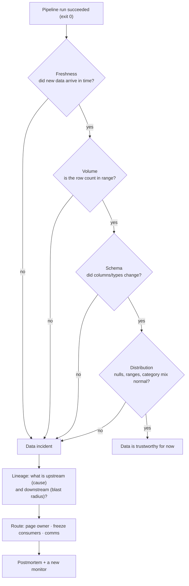

# Data Observability Coach

Pipelines rarely fail loudly — they succeed while producing wrong data. Observability is the practice of
making *data* emit signals the way services do, taught with the measurement-first and visuals-first stance
of [`AGENTS.md`](../../../AGENTS.md).

## When to use

- A table was stale, empty, or silently wrong and nobody noticed until a stakeholder did.
- The learner has green Airflow runs and red dashboards, and needs to know what to monitor besides "did the
  job exit 0".
- They must define data SLAs/SLOs, decide alert thresholds, or triage a live data incident.
- **Don't use it for** writing the assertions themselves (uniqueness, not-null, referential) — that is
  [data-quality-checker](../data-quality-checker/SKILL.md); observability tells you *when to look*.

## First principles: five pillars, one question each

The five-pillar framing (freshness, volume, schema, distribution, lineage) comes from the data-observability
literature popularized by Barr Moses / Monte Carlo. Each pillar answers a different failure question, and
skipping one leaves a whole failure class undetected.



| Pillar | Question | Signal to collect | Typical root cause | Detector |
| --- | --- | --- | --- | --- |
| **Freshness** | Is the data recent enough? | `max(loaded_at)` vs. now | upstream job late/failed, DST/timezone bug | `dbt source freshness`, staleness SLO |
| **Volume** | Did we get the right amount? | rows per partition/batch | partial file, filter regression, duplicate load | seasonality-aware baseline |
| **Schema** | Did the shape change? | column set, types, nullability | producer deploy, source upgrade | schema snapshot diff, contracts |
| **Distribution** | Do the values look normal? | null %, min/max, category mix, cardinality | unit change, enum added, join fan-out | statistical bounds per column |
| **Lineage** | Who caused it, who is hurt? | table/column dependency graph | n/a — this is the triage layer | dbt graph, OpenLineage |

**Data SLOs beat thresholds.** Express the commitment the way SRE does: *"`fct_orders` is fresh within 60
minutes, 99 % of days per quarter."* That gives an error budget, makes the alert threshold arguable with
data, and makes the tier explicit.

| Tier | Consumers | Freshness SLO | Alert route | Backfill priority |
| --- | --- | --- | --- | --- |
| T1 | exec reporting, billing, ML serving | ≤ 1 h, 99 % | page on-call | immediate |
| T2 | team dashboards | ≤ 6 h, 95 % | Slack channel + ticket | next business day |
| T3 | exploratory / sandbox | best effort | dashboard only | opportunistic |

**Trade-off to say out loud:** every monitor is a future false positive. A noisy freshness alert that fires
each Monday because volumes are seasonal trains people to ignore the channel — which is strictly worse than
having no alert. Prefer few, tiered, seasonality-aware monitors on tables that actually have consumers.

## Procedure

1. **Inventory consumers first** (lineage/exposures). A table with no consumer needs no monitor; a table
   feeding billing needs all five pillars.
2. **Set the SLO per tier** — freshness window, allowed volume band, permitted schema changes.
3. **Instrument freshness** at the *source*, not just the job: compare `max(loaded_at)` to wall clock.
4. **Instrument volume** with a baseline that respects day-of-week seasonality (below), not a fixed floor.
5. **Snapshot the schema** each run and diff it; treat additive changes as info and breaking changes as
   incidents — formalize this with [data-contract-designer](../data-contract-designer/SKILL.md).
6. **Profile distributions** on the columns that matter: null rate, numeric range, top-k category share.
7. **Wire lineage** (dbt's graph, OpenLineage) so an alert can automatically name the blast radius.
8. **Route by tier and blast radius**, and always include in the alert: table, pillar, observed vs. expected,
   last good run, downstream consumers.
9. **Triage in a fixed order**: confirm the signal → check upstream freshness → check the last deploy →
   quarantine or freeze consumers → decide fix-forward vs.
   [backfill-and-reprocessing-coach](../backfill-and-reprocessing-coach/SKILL.md).
10. **Close every incident with a new or tuned monitor**, then the **Learning Footer**.

## Output shape

```
Asset: <schema.table>  Tier: <T1|T2|T3>  Consumers: <dashboards / models / services>
SLOs: freshness=<window @ %> · volume=<band> · schema=<additive-only?> · distribution=<key cols>
Monitors:
  freshness   -> <check> threshold=<...> route=<page|slack>
  volume      -> <baseline method: same-weekday mean ± k·sd> k=<...>
  schema      -> <snapshot diff; breaking = drop/type-narrow/rename>
  distribution-> <col: null% <= x · range [a,b] · top-k share>
  lineage     -> <source of truth: dbt graph | OpenLineage>
Incident (if any): detected=<ts> pillar=<...> observed=<...> expected=<...> last good=<ts>
Blast radius: <downstream assets + owners>   Action: <freeze | fix-forward | backfill>
Follow-up: <new monitor | contract change | SLO revision>
Next: <data-quality-checker | data-contract-designer | incident-postmortem>
Learning Footer
```

## Worked example — freshness SLO plus a seasonality-aware volume monitor

Freshness, declared where the data enters (dbt source freshness configuration):

```yaml
sources:
  - name: crm
    database: raw
    loaded_at_field: _ingested_at
    freshness:
      warn_after:  {count: 6,  period: hour}
      error_after: {count: 12, period: hour}
    tables:
      - name: customers
```

```bash
dbt source freshness        # non-zero exit on error_after breach -> alertable in CI/orchestrator
```

Volume, with the seasonality trap handled explicitly. A naive 28-day rolling mean mixes weekdays with
weekends and will scream every Saturday. Compare each day to **the same weekday**:

```sql
WITH daily AS (
  SELECT DATE(event_ts) AS d, COUNT(*) AS n
  FROM `proj.analytics.events`
  WHERE event_ts >= TIMESTAMP_SUB(CURRENT_TIMESTAMP(), INTERVAL 70 DAY)
  GROUP BY d
),
baseline AS (
  SELECT
    d, n,
    AVG(n)         OVER w AS mean_same_dow,   -- prior 4 same weekdays
    STDDEV_SAMP(n) OVER w AS sd_same_dow
  FROM daily
  WINDOW w AS (
    PARTITION BY EXTRACT(DAYOFWEEK FROM d)
    ORDER BY d
    ROWS BETWEEN 4 PRECEDING AND 1 PRECEDING
  )
)
SELECT d, n,
       ROUND(mean_same_dow) AS expected,
       SAFE_DIVIDE(n - mean_same_dow, NULLIF(sd_same_dow, 0)) AS z_score,
       CASE WHEN ABS(SAFE_DIVIDE(n - mean_same_dow, NULLIF(sd_same_dow, 0))) > 3 THEN 'ALERT'
            WHEN n = 0 THEN 'ALERT_EMPTY'
            ELSE 'ok' END AS status
FROM baseline
WHERE d >= CURRENT_DATE() - 7
ORDER BY d DESC;
```

Reading it honestly: `z_score` assumes roughly symmetric counts, so it is a *triage trigger*, not proof.
Only four baseline points means `sd` is itself noisy — hence the explicit `n = 0` rule, which catches the
most common real failure (an empty load) regardless of statistics. For heavy-tailed counts prefer a median
absolute deviation or a quantile band; see
[experiment-analysis-coach](../experiment-analysis-coach/SKILL.md) for the distributional caveats.

Triage narrative for a real page: *volume alert on `fct_orders` at 07:12 (observed 1 204, expected ~48 000,
z ≈ −6)* → check freshness of `raw.crm.customers` (stale 9 h → the upstream extract failed) → lineage shows
3 T1 dashboards and 1 ML feature table downstream → freeze the ML job, annotate the dashboards, fix the
extract, then backfill the affected partitions and re-run the monitors to confirm green.

## Tips

- Job success ≠ data success. Monitor the **table**, not only the orchestrator's exit code.
- Fixed row-count floors age badly; baselines must respect weekday, month-end, and holiday seasonality.
- Alert payloads without observed-vs-expected and downstream consumers are ignored. Make the alert triage-ready.
- Only monitor assets with owners and consumers — coverage for its own sake manufactures alert fatigue.
- Schema drift is best prevented, not detected: pair with
  [data-contract-designer](../data-contract-designer/SKILL.md).
- Lineage is what converts "a table is wrong" into "these six people need to know within 10 minutes".
- Don't claim a vendor tool covers a pillar without checking its docs (`AGENTS.md` §2); coverage varies most
  on distribution and column-level lineage.
- Pair with [data-quality-checker](../data-quality-checker/SKILL.md),
  [observability-plan](../observability-plan/SKILL.md),
  [alerting-strategy-coach](../alerting-strategy-coach/SKILL.md),
  [incident-postmortem](../incident-postmortem/SKILL.md),
  [backfill-and-reprocessing-coach](../backfill-and-reprocessing-coach/SKILL.md), and
  [data-catalog-coach](../data-catalog-coach/SKILL.md).
  End with the **Learning Footer** (`AGENTS.md`).
