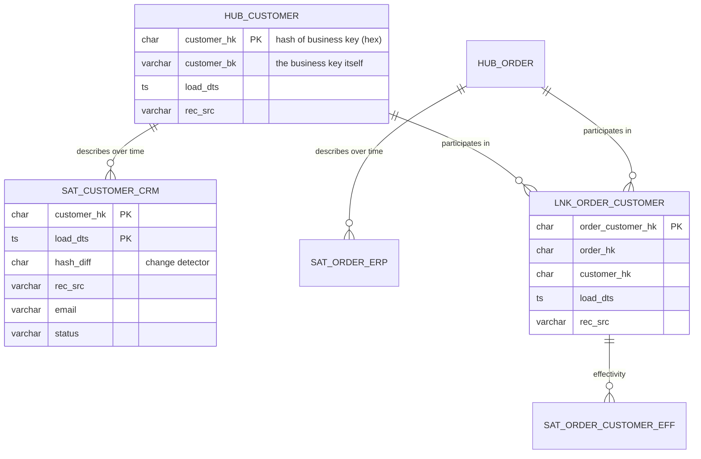

# Data Vault Modeling Coach

Data Vault 2.0 is an **integration and auditability** pattern, not a reporting pattern: it separates the
immutable business key from its volatile description so that new sources can be added without rewriting
history. Taught from first principles per [`AGENTS.md`](../../../AGENTS.md).

## When to use

- Many source systems must be integrated, the schema changes often, and audit/lineage ("what did the
  warehouse believe on 3 March?") is a hard requirement — regulated finance, insurance, healthcare.
- The learner has been told to "use Data Vault" and needs to know what a hub, link, and satellite are,
  and *why* the modelling is insert-only.
- They are choosing between Data Vault and a Kimball star schema and need an honest comparison.
- **Don't use it for** the layer analysts and BI tools query directly — that is a star schema, built with
  [data-warehouse-modeling](../data-warehouse-modeling/SKILL.md). Data Vault feeds it; it does not replace it.

## First principles: split the key from the description

Ralph Kimball's *The Data Warehouse Toolkit* (3rd ed., 2013) optimizes for **query simplicity**: conformed
dimensions, facts, SCD Type 2. Dan Linstedt's Data Vault 2.0 (Linstedt & Olschimke, *Building a Scalable
Data Warehouse with Data Vault 2.0*, 2015) optimizes for **absorbing change**: three table types, each with
exactly one job, all loaded insert-only and in parallel.



| Table type | Holds | Never holds | Grain | Load |
| --- | --- | --- | --- | --- |
| **Hub** | one row per distinct business key + `load_dts` + `rec_src` | descriptive attributes, foreign keys | business key | insert-only, distinct |
| **Link** | the hash keys of the participating hubs (a many-to-many by construction) | attributes, "current flag" | relationship occurrence | insert-only |
| **Satellite** | descriptive attributes for one hub *or* one link, from **one source**, plus `hash_diff` | business keys other than its parent hash key | parent + `load_dts` | insert-only, delta by `hash_diff` |

Three mandatory metadata columns on every table: `load_dts` (when *we* saw it), `rec_src` (where it came
from), and the hash key. Nothing is ever updated or deleted — deletion is recorded as a *new* row (a
status/tracking satellite), which is exactly what makes the model auditable.

**Why hash keys?** Data Vault 2.0 replaced 1.0's sequence surrogate keys with a deterministic hash
(historically MD5, now commonly SHA-256) of the standardized business key. Because the value is computable
from the source data alone, every hub, link, and satellite can be loaded **in parallel** with no lookup and
no load order dependency — the single biggest operational win of the pattern. The cost is a wide binary
join key and a hard rule: business keys must be normalized identically (trim, upper-case, fixed delimiter,
explicit null token) *everywhere*, forever.

| Decision | Data Vault 2.0 | Kimball star schema |
| --- | --- | --- |
| Optimized for | integration, audit, agility | query performance, comprehension |
| Table count | high (3 per concept, more per source) | low |
| Joins per business question | many | few |
| Handles a new source | add hub/link/satellite, nothing changes | remodel dimensions |
| History | insert-only, every version kept | SCD Type 1/2, chosen per attribute |
| Who queries it | pipelines, auditors | analysts, BI tools |
| Typical placement | integration layer (silver) | information mart (gold) |

**Trade-off to say out loud:** Data Vault trades query ergonomics for load parallelism and auditability. If
you have two source systems and a stable schema, it is overhead — build the star schema. The usual
enterprise answer is *both*: Raw Vault (loaded as-is) → Business Vault (derived/soft rules) → Information
Marts as star schemas, with **PIT** (point-in-time) and **Bridge** tables added purely as query-assist
structures to collapse satellite joins.

## Procedure

1. **Find the business keys**, not the surrogate keys. A business key is what a human uses to identify the
   thing across systems (`customer_number`, `order_number`) and must survive a source-system replacement.
2. **Standardize the key**: `UPPER(TRIM(key))`, a documented multi-field delimiter (`||`), and a fixed token
   for nulls. Write this rule down — it is now permanent.
3. **Create one hub per business concept**, keyed on the hash of the standardized key.
4. **Create a link for each relationship**, keyed on the hash of the *concatenated parent hash keys*. Links
   are many-to-many; do not add a "current" flag — model effectivity in a satellite.
5. **Split satellites by source system and by rate of change** (fast-changing attributes in their own
   satellite), each with a `hash_diff` over its own attribute set.
6. **Load insert-only**: compare incoming `hash_diff` with the latest row per parent; insert only on change.
7. **Add Business Vault objects** only for derived/soft business rules — never overwrite the Raw Vault.
8. **Serve the star schema** as an Information Mart (view or table) on top; add PIT/Bridge tables when
   satellite joins become the bottleneck.
9. **Test** hub uniqueness, link referential integrity, satellite non-duplication, and hash determinism.
   Close with the **Learning Footer**.

## Output shape

```
Business keys: <concept> -> <key column(s)> · standardization=<UPPER/TRIM/delimiter/null-token>
Hubs:      <hub_x(key), ...>
Links:     <lnk_x_y(parent hubs), ...>   Effectivity sat: <yes/no>
Satellites: <sat_x_source(attrs) | rate-of-change split | hash_diff columns>
Hash: algo=<SHA-256|MD5> · delimiter='<||>' · null token='<^^>'   Deterministic across sources: yes
Load: insert-only · parallel=<hubs|links|sats all independent> · rec_src=<...> · load_dts=<...>
Query assist: PIT=<...> Bridge=<...>   Information mart: <star schema tables>
Verdict vs Kimball: <use DV because ... | use a star schema because ...>
Next: <data-warehouse-modeling | data-contract-designer | dbt-model-coach>
Learning Footer
```

## Worked example — a customer hub, its satellite, and an insert-only delta load

```sql
CREATE TABLE hub_customer (
  customer_hk  CHAR(64)     NOT NULL,   -- SHA2 hex string of UPPER(TRIM(customer_bk))
  customer_bk  VARCHAR(64)  NOT NULL,   -- the business key, kept readable
  load_dts     TIMESTAMP    NOT NULL,
  rec_src      VARCHAR(64)  NOT NULL,
  PRIMARY KEY (customer_hk)
);

CREATE TABLE sat_customer_crm (
  customer_hk  CHAR(64)     NOT NULL,
  load_dts     TIMESTAMP    NOT NULL,
  hash_diff    CHAR(64)     NOT NULL,   -- SHA-256 hex over this satellite's attributes only
  rec_src      VARCHAR(64)  NOT NULL,
  full_name    VARCHAR(200),
  email        VARCHAR(320),
  status       VARCHAR(20),
  PRIMARY KEY (customer_hk, load_dts)   -- history: never updated, never deleted
);
```

The delta load. Note the two invariants: attributes are hashed in a **fixed order** with an explicit
delimiter and null token (otherwise `('AB', NULL)` and `(NULL, 'AB')` could collide), and a row is written
**only** when the `hash_diff` differs from the newest existing row. Pick one hash representation and never mix
it across sources: `SHA2(x, 256)` returns a 64-character **hex string**, so the keys are typed `CHAR(64)` — if
you prefer raw `BINARY(32)`, use `SHA2_BINARY`/`unhex(sha2(...))` on *every* source, because
`CAST(string AS BINARY)` differs by engine and would silently break the join key.

```sql
-- ANSI-style; Snowflake/Databricks accept WITH after INSERT INTO. Verify for your dialect.
INSERT INTO sat_customer_crm (customer_hk, load_dts, hash_diff, rec_src, full_name, email, status)
WITH stg AS (
  SELECT
    SHA2(UPPER(TRIM(customer_id)), 256)                                AS customer_hk,
    SHA2(CONCAT_WS('||', COALESCE(UPPER(TRIM(full_name)), '^^'),
                         COALESCE(LOWER(TRIM(email)),     '^^'),
                         COALESCE(UPPER(TRIM(status)),    '^^')), 256) AS hash_diff,
    CURRENT_TIMESTAMP()                                                AS load_dts,
    'crm.customers'                                                    AS rec_src,
    full_name, email, status
  FROM staging.crm_customers
),
latest AS (
  SELECT customer_hk, hash_diff
  FROM (
    SELECT customer_hk, hash_diff,
           ROW_NUMBER() OVER (PARTITION BY customer_hk ORDER BY load_dts DESC) AS rn
    FROM sat_customer_crm
  ) t
  WHERE rn = 1
)
SELECT s.customer_hk, s.load_dts, s.hash_diff, s.rec_src, s.full_name, s.email, s.status
FROM stg s
LEFT JOIN latest l ON l.customer_hk = s.customer_hk
WHERE l.customer_hk IS NULL          -- brand new business key
   OR l.hash_diff  <> s.hash_diff;   -- attributes actually changed
```

Trace it: run 1 inserts every customer. Run 2 with an unchanged file inserts **zero** rows — the load is
idempotent. Run 3, where one email changed, inserts exactly one row, and the previous version remains
queryable. The "current" view is a `ROW_NUMBER() ... = 1` window, never an `UPDATE`.

## Tips

- The hardest part is never the DDL — it is agreeing the **business key** and its standardization rule.
- A satellite spanning two source systems is the classic mistake: split them, or you lose source lineage.
- Never put a "current flag" in a link or satellite; deriving current from `load_dts` keeps loads insert-only.
- Hash collisions are vanishingly rare with SHA-256, but *normalization* bugs are common — test determinism
  across sources with a fixed fixture row.
- Don't hand a Data Vault to analysts. Serve a star schema mart; use PIT/Bridge tables when joins hurt.
- Data Vault does not remove the need for data quality checks —
  [data-quality-checker](../data-quality-checker/SKILL.md) still applies to the Raw Vault inputs.
- Verify structures against Linstedt's published standards before asserting a rule (`AGENTS.md` §2);
  vendor "Data Vault" templates deviate in places.
- Pair with [data-warehouse-modeling](../data-warehouse-modeling/SKILL.md),
  [data-modeling-drill](../data-modeling-drill/SKILL.md),
  [data-contract-designer](../data-contract-designer/SKILL.md),
  [dbt-model-coach](../dbt-model-coach/SKILL.md),
  [cdc-pipeline-coach](../cdc-pipeline-coach/SKILL.md), and
  [backfill-and-reprocessing-coach](../backfill-and-reprocessing-coach/SKILL.md).
  End with the **Learning Footer** (`AGENTS.md`).
