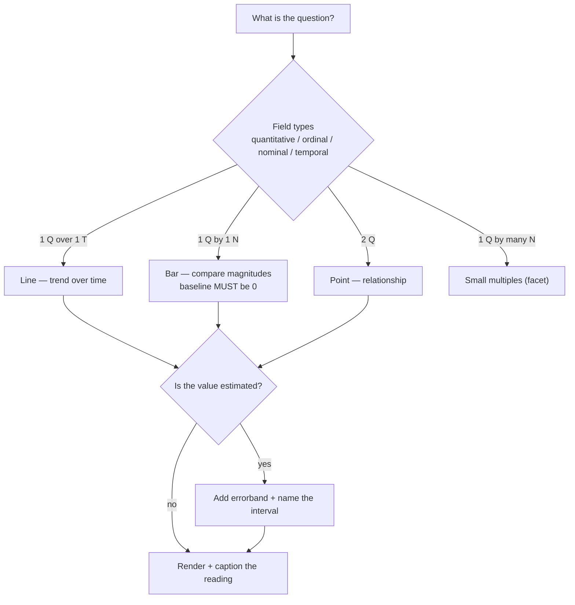

# Data Viz Coach

One chart, taught properly: **question → encoding → honesty → uncertainty → spec**, following the
visuals-by-default guidance in [`AGENTS.md`](../../../AGENTS.md). The chart type is an *output* of the
question and the data types — never a starting preference.

## When to use

- The learner has data and doesn't know which chart answers their question, or a chart "looks fine" but is
  quietly misleading (truncated axis, dual axes, area encoding, rainbow colour).
- They need to show a mean *and* its uncertainty, or compare many groups without a spaghetti plot.
- They want a real, runnable spec they can paste into the Vega-Lite editor or render in a notebook.

## First principles: the encoding ranking

A chart is a mapping from data **fields** to visual **channels**, and some channels are read accurately by
the human visual system while others are not. Cleveland & McGill's graphical-perception experiments (1984)
and the Vega-Lite grammar (Satyanarayan et al., IEEE InfoVis 2016) give the working order below.



| Rank | Channel | Encodes best | Accuracy | Use it for |
| --- | --- | --- | --- | --- |
| 1 | Position on a common scale | quantitative | highest | the number you care most about |
| 2 | Position on non-aligned scales | quantitative | high | small multiples / faceting |
| 3 | Length | quantitative | high | bars (from a zero baseline) |
| 4 | Slope / angle | quantitative | medium | trend lines, slope charts, pies |
| 5 | Area | quantitative | low | bubbles — secondary field only |
| 6 | Colour *value* (lightness) | ordered quantitative | low | heatmaps, sequential scales |
| 7 | Colour *hue* | nominal | lowest for magnitude | ≤ ~7 categories, as an identifier |

**Trade-offs to say out loud:** a pie spends the *angle* channel (rank 4) on the thing you most want
compared — a bar is nearly always more readable, though a pie survives for 2–3 parts. Dual y-axes let an
author manufacture any correlation by choosing the scales; two stacked panels sharing an x-axis are honest.

## Axis honesty and uncertainty

| Practice | Why it matters | Rule |
| --- | --- | --- |
| Bar baseline at 0 | bar *length* is the encoding; truncation lies about the ratio | never truncate a bar axis |
| Line axis may be zoomed | lines encode *slope*, not length | zoom is allowed — but label the range |
| Dual y-axes | two arbitrary scales fabricate correlation | split into two panels instead |
| Log scale | needed for multiplicative / heavy-tailed data | label it "log₁₀" explicitly |
| Aggregate without spread | a mean hides variance and sample size | add `errorband` / `errorbar`, state n |
| Rainbow colour ramp | not perceptually uniform; invents banding | use `viridis` / `blues` sequential ramps |
| Colour-only distinction | fails for ~1 in 12 men with colour-vision deficiency | add shape, direct labels, or facets |

Uncertainty vocabulary — say which one you drew: **standard deviation** = spread of the data ·
**standard error** = spread of the *estimate* · **95 % CI** ≈ mean ± 1.96·SE (large n) ·
**prediction interval** = where a *future* observation falls, always wider than a CI.

## Procedure

1. **Write the question as a sentence** the chart must answer ("Did p95 latency fall after release 2 in
   each region?"). No question → no chart.
2. **Type every field**: Vega-Lite's `"type"` is `quantitative | ordinal | nominal | temporal`, and the
   type drives the scale — not the other way round.
3. **Assign channels by rank**: the answer field goes on `x`/`y` position; demote secondary fields to
   colour, shape, size, or a facet. A fourth channel usually means you need small multiples.
4. **Pick the mark** from the flowchart — `line`, `bar` (add `"bin": true` for a histogram), `point`,
   `rect`, `boxplot`, `errorband` — and name the runner-up plus why it lost; the contrast is what transfers.
5. **Run the honesty checklist** above; fix the axis *before* styling anything.
6. **Show the uncertainty** whenever the value is estimated, sampled, or forecast: `errorband` with
   `"extent": "ci"`, a `boxplot`, or raw points jittered behind the summary.
7. **Prefer small multiples** over ~5+ overlapping series — `"facet"` / `"column"` beats a spaghetti plot,
   because rank-2 position beats rank-7 hue.
8. **Emit the runnable spec** (below); have the learner render it, then break one encoding on purpose.
9. **Caption the reading in one honest sentence**, including what the chart does *not* show (sample size,
   confounders, survivorship). Then close with the **Learning Footer**.

## Output shape

```
Question: <the sentence the chart answers>
Fields:   <field> : quantitative | ordinal | nominal | temporal   (x each)
Encoding: x=<field> (rank 1) · y=<field> · colour=<field> · facet=<field>
Mark: <line|bar|point|rect|boxplot|errorband>   Runner-up: <mark> — rejected because <...>
Honesty: baseline=<0|zoomed+labelled> · scale=<linear|log10> · dual-axis=no · palette=<viridis|blues>
Uncertainty: <none | sd | se | 95% CI | prediction interval>   (n = <...>)
Spec (Vega-Lite v5 — paste into vega.github.io/editor): { ...runnable JSON... }
Reading: <one honest sentence>   Does NOT show: <confounder / sample size / selection effect>
Next: <visual-explainer | plotly-lab | dashboard-designer>
Learning Footer
```

## Worked spec — small multiples with a 95 % confidence band

Copy-pasteable Vega-Lite v5 (schema and grammar per the official Vega-Lite documentation): a mean line
layered over an `errorband`, faceted by region, with a labelled — not truncated — y-axis.

```json
{
  "$schema": "https://vega.github.io/schema/vega-lite/v5.json",
  "description": "p95 latency by release, faceted by region, with a 95% CI band.",
  "data": {
    "values": [
      {"region": "eu", "release": 1, "latency_ms": 91}, {"region": "eu", "release": 1, "latency_ms": 99},
      {"region": "eu", "release": 2, "latency_ms": 63}, {"region": "eu", "release": 2, "latency_ms": 71},
      {"region": "us", "release": 1, "latency_ms": 84}, {"region": "us", "release": 1, "latency_ms": 76},
      {"region": "us", "release": 2, "latency_ms": 58}, {"region": "us", "release": 2, "latency_ms": 66}
    ]
  },
  "facet": {"column": {"field": "region", "type": "nominal", "title": "Region"}},
  "spec": {
    "width": 180, "height": 160,
    "layer": [
      {"mark": {"type": "errorband", "extent": "ci", "opacity": 0.3},
       "encoding": {
         "x": {"field": "release", "type": "ordinal", "title": "Release"},
         "y": {"field": "latency_ms", "type": "quantitative", "title": "p95 latency (ms)"}}},
      {"mark": {"type": "line", "point": true},
       "encoding": {
         "x": {"field": "release", "type": "ordinal"},
         "y": {"aggregate": "mean", "field": "latency_ms", "type": "quantitative",
               "scale": {"zero": false}}}}
    ]
  }
}
```

Render it locally instead of in the browser (free, no account):

```bash
pip install altair vl-convert-python
python -c "import json,pathlib,vl_convert as vlc; spec=json.loads(pathlib.Path('spec.json').read_text()); pathlib.Path('chart.png').write_bytes(vlc.vegalite_to_png(spec, scale=2))"
```

## Tips

- The chart type is a **conclusion**, not a preference — derive it from the question plus the field types.
- Bars encode length, so their axis starts at 0; lines encode slope, so zooming is legal *if you label it*.
- A mean without a spread is an opinion — add an `errorband` and name the interval you drew.
- Five overlapping series is a mess; five small multiples is a comparison. Trade ink for position.
- Never encode a magnitude in hue, and never rely on colour alone — [accessibility-audit](../accessibility-audit/SKILL.md).
- Verify the numbers first (`AGENTS.md` §2); a beautiful chart of wrong data is worse than a table.
- Pair with [visual-explainer](../visual-explainer/SKILL.md) to choose the *form*,
  [diagram-as-code-coach](../diagram-as-code-coach/SKILL.md) for non-data diagrams,
  [plotly-lab](../plotly-lab/SKILL.md), [matplotlib-lab](../matplotlib-lab/SKILL.md),
  [seaborn-lab](../seaborn-lab/SKILL.md), [dashboard-designer](../dashboard-designer/SKILL.md),
  [progress-charts](../progress-charts/SKILL.md), and [confidence-interval-coach](../confidence-interval-coach/SKILL.md).
  End with the **Learning Footer** (`AGENTS.md`).
