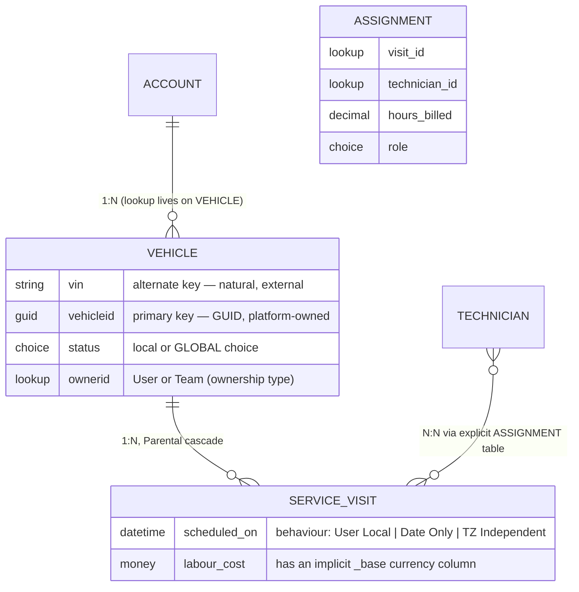

# Dataverse Modeling Coach

Dataverse modelling taught from the platform outward: **table → column → relationship → key → security**,
following the first-principles and trade-off-naming guidance in [`AGENTS.md`](../../../AGENTS.md). Every
rule below is checkable in Microsoft Learn's Dataverse documentation and testable in a free developer
environment.

## When to use

- The learner is about to create tables in a solution and needs the decisions that are *hard to reverse*
  (publisher prefix, ownership type, key strategy) settled first.
- An integration keeps creating duplicates, or a user "can see records they shouldn't" — key and
  security-model problems, not app problems.
- They are choosing between a choice column, a lookup, and a separate table.
- Don't use it for canvas-app formulas or report DAX — see [power-fx-coach](../power-fx-coach/SKILL.md)
  and [power-bi-dax-coach](../power-bi-dax-coach/SKILL.md).

## First principles: Dataverse is a relational store with security compiled in

Dataverse (Microsoft Power Platform) is not "SharePoint lists with a nicer UI". Every table row carries an
owner, every read is filtered by the caller's role privileges, and much of the model is **immutable once
shipped**: schema names, the publisher prefix, ownership type, and the primary key. Design those first.



| Need | Choose | Because |
| --- | --- | --- |
| Fixed, small, shared list of values | **Global choice** | reusable across tables, one place to maintain |
| Fixed list used by exactly one column | Local choice | avoids polluting the global namespace |
| Values change at runtime / need extra fields | **Related table + lookup** | choices are metadata; changing them is a solution deployment |
| Many-to-many with no extra data | Native N:N | platform manages the intersect table |
| Many-to-many **with** attributes (hours, role, dates) | Explicit intermediate table | native N:N intersect tables cannot hold columns |
| Exact currency arithmetic | `Money` | carries currency + exchange-rate base column |
| Exact non-currency arithmetic | `Decimal` | `Float` is approximate — never use it for money or counts |
| Date with no time zone meaning (birthday, invoice date) | DateTime behaviour **Date Only** | User Local shifts across time zones |
| Very high volume / semi-structured / no cross-row transactions | Elastic table | Cosmos-backed; gives up some relational features |

| Cascade behaviour (1:N) | Delete parent | Assign / Share / Reparent |
| --- | --- | --- |
| **Parental** | children deleted | children follow the parent | 
| **Referential, restrict delete** | blocked while children exist | children unaffected |
| **Referential, remove link** | children kept, lookup cleared | children unaffected |
| **Configurable cascading** | per-action choice | pick action by action |

### Security is a matrix, not a switch

A security role grants each **privilege** (Create, Read, Write, Delete, Append, Append To, Assign, Share)
at an **access level**: None → User → Business Unit → Parent: Child Business Units → Organization. Layer on
top: record **sharing** (per row), **teams** (owner / access / Microsoft Entra group), **column-level
security** via field security profiles, and hierarchy security. Users get the *union* of their roles, so
you cannot revoke by adding a role — you remove one.

**Trade-off to say out loud:** `Append`/`Append To` is the pair everyone forgets. To attach a Service Visit
to a Vehicle a user needs `Append` on Service Visit **and** `Append To` on Vehicle; missing the second is
the cause of most "insufficient privileges" errors on an otherwise correct role.

## Procedure

1. **Get a free environment**: the Power Apps Developer Plan provides a personal Dataverse environment at
   no cost. Then install the Power Platform CLI and connect:
   ```bash
   pac auth create --environment https://<yourorg>.crm.dynamics.com
   pac org who
   pac env list
   ```
2. **Create the solution and publisher first** — the prefix is baked into every schema name and cannot be
   changed later:
   ```bash
   pac solution init --publisher-name contoso --publisher-prefix con
   ```
3. **Model nouns as tables, verbs as processes.** Set ownership deliberately: *User or Team* owned when
   row-level security matters; *Organization* owned for reference data everyone reads.
4. **Choose column types by arithmetic and time-zone semantics** using the table above. Decide DateTime
   behaviour at creation — converting it later is a migration, not an edit.
5. **Add relationships with explicit cascade behaviour.** Default to Referential; use Parental only when
   the child genuinely cannot exist alone and *should* inherit sharing and deletion.
6. **Define alternate keys for every external identifier** (VIN, ERP number, email). They enforce
   uniqueness and enable Web API **upsert by key**, which is what stops integration duplicates. A table
   supports a small number of alternate keys (five in current documentation) — verify the current limit on
   Microsoft Learn before designing around it.
7. **Design roles as a matrix** before creating them: rows = tables, columns = the eight privileges, cells
   = access level. Assign roles to *teams*, not individuals, and test with a real non-admin account.
8. **Protect sensitive columns** with a field security profile rather than hiding them in the UI — form
   visibility is not security; the Web API still returns the column.
9. **Ship as a managed solution** through Dev → Test → Prod, and prove the model with an actual upsert and
   a least-privilege user. Close with the **Learning Footer**.

## Output shape

```
Domain: <business area>          Environment: <dev|test|prod>   Publisher prefix: <con> (immutable)
Tables: <name> (logical: <prefix_name>) — ownership <User/Team | Organization> — type <standard|elastic>
Columns: <name> : <Text|Choice|Lookup|Decimal|Money|DateTime(<behaviour>)|Boolean|File> — why
Choices: <name> <global|local> values <...>
Relationships: <A> 1:N <B> via <lookup col> cascade <Referential|Parental|Configurable>
               <A> N:N <B> via <native | explicit intersect table because it carries <cols>>
Alternate keys: <table>.<cols> -> enables upsert by <key>   (duplicate prevention)
Security: role <name> => <table>: C/R/W/D/Ap/ApTo/As/Sh at <None|User|BU|Parent:Child|Org>
          teams <...> · column security <cols> · sharing rules <...>
Validation: pac org who OK · upsert by alternate key returns 204 · least-privilege user tested
Next: <power-fx-coach | power-bi-dax-coach | data-modeling-drill>
Learning Footer
```

## Worked example — fleet maintenance, with an alternate key that kills duplicates

Model: `con_vehicle` (User/Team owned) 1:N `con_servicevisit` (Parental), and Technicians ↔ Visits as an
**explicit** `con_assignment` table because the relationship carries `hours_billed` and a `role` choice.

Alternate key on `con_vehicle.con_vin`. That single decision changes the integration from "query, branch,
create-or-update" to one idempotent call — the Web API upserts by key:

```http
PATCH https://yourorg.api.crm.dynamics.com/api/data/v9.2/con_vehicles(con_vin='1HGCM82633A004352')
Content-Type: application/json
If-None-Match: null                      # omit for upsert; use If-Match: * to update-only
{
  "con_make": "Contoso",
  "con_model": "Hauler 500",
  "con_statuscode": 1,
  "con_odometerkm": 148230
}
```

- First call → `201 Created` (row inserted).
- Every later call with the same VIN → `204 No Content` (row updated). No duplicate is possible, because
  the alternate key is enforced by a unique index in the platform, not by your integration code.
- Without the alternate key, two concurrent imports both "check then create" and you get two vehicles.

Role matrix for the field technician (least privilege, expressed before it is clicked):

| Table | Create | Read | Write | Delete | Append | Append To | Assign | Share |
| --- | --- | --- | --- | --- | --- | --- | --- | --- |
| `con_vehicle` | None | **Business Unit** | None | None | None | **Business Unit** | None | None |
| `con_servicevisit` | **User** | **User** | **User** | None | **User** | **User** | None | None |
| `con_assignment` | **User** | **User** | **User** | None | **User** | **User** | None | None |

Read it aloud: a technician can see every vehicle in their business unit, create and edit only their own
service visits, attach those visits to vehicles (`Append` on visit + `Append To` on vehicle), and delete
nothing. Cost per hour lives on `con_assignment.con_hoursbilled` protected by a field security profile, so
technicians cannot read it even through the Web API.

## Tips

- **The publisher prefix and schema names are forever.** Renaming means a new column and a data migration —
  spend ten minutes on naming before the first `pac solution init`.
- `Float` is approximate: use `Decimal` for quantities and `Money` for currency, or you will ship rounding
  bugs that only appear in aggregates.
- DateTime **behaviour** (User Local / Date Only / Time-Zone Independent) is set once at creation. Birthdays
  and invoice dates are Date Only; appointments are User Local.
- Native N:N cannot carry a single extra column. The moment a business rule says "with hours" or "from–to",
  model an explicit intermediate table.
- Rollup columns recalculate asynchronously on a schedule — never build a real-time validation on one; use
  a calculated column or a plug-in when you need immediacy.
- Hiding a column on a form is not security. Use field security profiles; the Web API ignores form layout.
- Privileges are the *union* of a user's roles: you cannot take access away by granting another role.
- Test with a real least-privilege user in a test environment — system administrators bypass exactly the
  problems you are trying to find.
- Pair with [power-fx-coach](../power-fx-coach/SKILL.md) for app logic,
  [power-bi-dax-coach](../power-bi-dax-coach/SKILL.md) for reporting,
  [data-modeling-drill](../data-modeling-drill/SKILL.md) for normalisation practice,
  [er-diagram-generator](../er-diagram-generator/SKILL.md) to document the model, and
  [cloud-iam-least-privilege-coach](../cloud-iam-least-privilege-coach/SKILL.md) for the access mindset.
  End with the **Learning Footer** (`AGENTS.md`).
