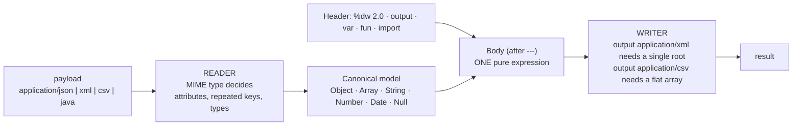

# DataWeave Transform Lab

DataWeave taught as what it is — a **pure, typed, format-agnostic expression language**: read → model →
transform → write, following the first-principles, run-it-yourself approach in
[`AGENTS.md`](../../../AGENTS.md). Every script below runs free in the DataWeave CLI or the browser
Playground; Anypoint Studio is optional.

## When to use

- The learner is writing Mule 4 integrations and treating DataWeave like JavaScript string-munging.
- A selector returns `null` and they cannot tell whether the problem is the *format reader*, the
  *selector*, or the *writer*.
- They need one canonical model emitted as JSON for an API, XML for a legacy partner, and CSV for finance.
- Don't use it for Mule flow/connector design, API contracts, or Power Platform expressions — see
  [openapi-spec-writer](../openapi-spec-writer/SKILL.md) and
  [power-fx-coach](../power-fx-coach/SKILL.md).

## First principles: the canonical model in the middle

DataWeave 2.0 (MuleSoft, the language is open source at `github.com/mulesoft/data-weave`) never operates on
text. A **reader** parses the input MIME type into a canonical tree of `Object`/`Array`/`String`/`Number`/
`Boolean`/`Date`/`Null`, your script transforms that tree, and a **writer** serialises it to the `output`
MIME type. Almost every "DataWeave bug" is really a reader or writer expectation.



| Selector | Meaning | Returns | Gotcha |
| --- | --- | --- | --- |
| `payload.order` | single-value child | value or `null` | XML repeated elements collapse to the *first* |
| `payload.*order` | **multi-value** children | Array | the fix for repeated XML elements |
| `payload..price` | descendants at any depth | Array | ignores structure — use sparingly |
| `payload.@id` / `payload.order.@` | XML attributes | value / object | JSON has no attributes |
| `payload[0]`, `payload[-1]` | index (arrays, strings) | item | out of range → `null`, not an error |
| `payload[0 to 2]` | range | Array | inclusive of both bounds |
| `payload.^mimeType`, `.^raw` | metadata | value | how you inspect what the reader saw |

| Function | Input → output | `$` means | Use for |
| --- | --- | --- | --- |
| `map` | Array → Array | item (`$$` = index) | reshape each element |
| `mapObject` | Object → Object | value (`$$` = key) | rename/rewrite keys |
| `filter` / `filterObject` | keep a subset | item / value | drop rows |
| `reduce` | Array → single value | `(item, acc = seed)` | sums, folds, merges |
| `groupBy` | Array → Object keyed by group | item | per-customer, per-day |
| `pluck` | Object → Array | `(value, key, index)` | turn `groupBy` output back into an array |
| `distinctBy`, `orderBy`, `flatMap`, `joinBy` | Array → Array/String | item | dedupe, sort, flatten, join |

**Trade-off to say out loud:** DataWeave is *pure* — there are no variables you mutate and no loops you
break out of. That is what makes a transform testable and side-effect free, and it is why "how do I set a
counter?" is answered by `reduce`, not by an assignment.

## Procedure

1. **Get a free runner.** The browser Playground at `developer.mulesoft.com/learn/dataweave/playground`
   needs nothing installed. For a local loop, install the open-source CLI (`dw`) from the
   `mulesoft-labs/data-weave` GitHub releases (or `brew install dataweave`), then:
   ```bash
   dw --help                       # confirm the exact flag names for your build before scripting
   dw -i payload=orders.json -f transform.dwl
   dw -i payload=orders.json 'output application/json --- payload map $.id'   # inline form
   ```
2. **Name the reader and the writer first.** Write the `output` line and, when the input is ambiguous, an
   explicit `input payload application/xml` — before writing any logic.
3. **Inspect what the reader produced**: `payload.^mimeType`, `typeOf(payload)`, `sizeOf(payload)`. For XML,
   check immediately whether you need `.*element`.
4. **Model the target shape as a literal**, with hard-coded values, and make it serialise correctly.
   Only then replace the literals with selectors.
5. **Reach for the right combinator**: reshape with `map`, rename keys with `mapObject`, aggregate with
   `groupBy` + `pluck`, fold with `reduce`. If you are writing nested `if`s, you probably want `match`.
6. **Extract named functions** with `fun` and constants with `var` in the header — they are testable and
   they make the body readable.
7. **Handle absence explicitly**: `payload.discount default 0`, `payload.name!` (assert present),
   and coerce with `as`: `"2026-08-09" as Date`, `now() as String {format: "yyyy-MM-dd"}`.
8. **Emit every required format from the same model** (JSON/XML/CSV below) and diff the results.
9. **Test it**: keep `transform.dwl` plus `input.json` and `expected.json` in the repo and assert equality
   in CI — DataWeave's purity makes this trivial. Close with the **Learning Footer**.

## Output shape

```
Input: <mime type> — reader notes: <repeated elements? attributes? headers? types>
Output: <mime type> — writer constraints: <single root for XML | flat array for CSV>
Canonical model: <the intermediate shape you are aiming for>
Header: %dw 2.0 · output <...> · var <...> · fun <...>
Body strategy: <map | mapObject | filter | reduce | groupBy+pluck | match> because <reason>
Null strategy: <default | ! assertion | filter> for <fields>
Script: <transform.dwl>
Run: dw -i payload=<file> -f <script>        (or the browser Playground)
Verified: input <sample> -> output <sample>   matches expected: <yes/no>
Pitfall checked: .*multi-value · attribute selector · number formatting · date coercion
Next: <openapi-spec-writer | api-design-review | data-contract-designer>
Learning Footer
```

## Worked example — orders → per-customer summary, then the same data as XML and CSV

`orders.json`:

```json
[
  {"id":"A-1","customer":"acme",  "sku":"widget","qty":3, "unitPrice":9.5, "status":"paid"},
  {"id":"A-2","customer":"acme",  "sku":"gizmo", "qty":1, "unitPrice":25.0,"status":"pending"},
  {"id":"B-1","customer":"globex","sku":"widget","qty":10,"unitPrice":9.5, "status":"paid"}
]
```

`summary.dwl` — filter, group, fold:

```dataweave
%dw 2.0
output application/json
var paid = payload filter ($.status == "paid")
fun lineTotal(o) = o.qty * o.unitPrice
---
{
  generatedAt: now() as String {format: "yyyy-MM-dd"},
  customers: (paid groupBy ($.customer)) pluck ((orders, customer) -> {
    customer:   customer,
    orderCount: sizeOf(orders),
    total:      (orders map lineTotal($)) reduce ((v, acc = 0) -> acc + v),
    skus:       (orders map $.sku) distinctBy $
  })
}
```

```bash
dw -i payload=orders.json -f summary.dwl
```

```json
{
  "generatedAt": "2026-08-09",
  "customers": [
    { "customer": "acme",   "orderCount": 1, "total": 28.5, "skus": ["widget"] },
    { "customer": "globex", "orderCount": 1, "total": 95.0, "skus": ["widget"] }
  ]
}
```

Same source, XML for the legacy partner — note the **parenthesised array** that splats repeated elements
into one object, and `@(...)` for attributes:

```dataweave
%dw 2.0
output application/xml
---
{
  orders: {
    (payload map (o) -> {
      order @(id: o.id, status: o.status): {
        customer: o.customer,
        total: o.qty * o.unitPrice
      }
    })
  }
}
```

Same source, CSV for finance — the writer requires a **flat array of objects**, so flatten first:

```dataweave
%dw 2.0
output application/csv header=true, separator=","
---
payload map (o) -> {
  orderId:  o.id,
  customer: o.customer,
  total:    o.qty * o.unitPrice
}
```

Reading XML back the other way — this is where `.*` earns its keep:

```dataweave
%dw 2.0
output application/json
---
payload.orders.*order map (o) -> { id: o.@id, status: o.@status, customer: o.customer }
```

## Tips

- **XML repeated elements**: `payload.orders.order` silently returns only the first. Use `.*order`. This
  single rule fixes most "my transform lost 99 % of the rows" tickets.
- `map` is for Arrays, `mapObject` is for Objects. Calling `map` on an object gives you a surprise, not an
  error — check `typeOf(payload)` first.
- In `map`, `$` is the item and `$$` is the index; in `mapObject`/`pluck`, `$$` is the **key**. Name your
  lambda parameters explicitly `(order, idx) ->` in anything longer than one line.
- `reduce` needs a seed for empty arrays: `reduce ((v, acc = 0) -> acc + v)` returns `null` without it.
- CSV output must be a flat array of flat objects; a nested field silently stringifies.
- XML output must have exactly one root element — an array at the top level is a writer error.
- Coerce dates and numbers explicitly with `as ... {format: ...}`; never build them with string concat.
- `default` handles missing keys, `!` asserts presence — choosing deliberately documents your contract.
- Pair with [openapi-spec-writer](../openapi-spec-writer/SKILL.md) for the API contract,
  [api-design-review](../api-design-review/SKILL.md) for the interface,
  [data-contract-designer](../data-contract-designer/SKILL.md) for producer/consumer guarantees,
  [data-quality-checker](../data-quality-checker/SKILL.md) for validating the output, and
  [regex-explainer](../regex-explainer/SKILL.md) when a transform tempts you into string parsing.
  End with the **Learning Footer** (`AGENTS.md`).
