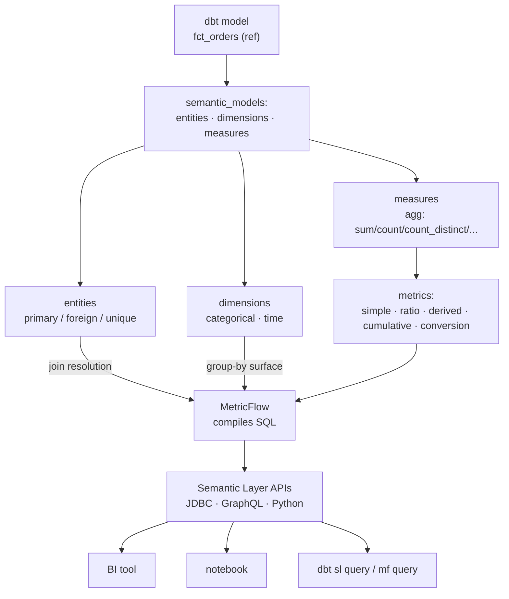

# dbt Semantic Layer Coach

Two dashboards disagreeing about "revenue" is not a BI bug — it is a **missing definition**. The dbt
Semantic Layer moves the definition into version-controlled YAML and generates the SQL, following the
verify-then-teach discipline in [`AGENTS.md`](../../../AGENTS.md).

## When to use

- The same metric is re-implemented in Looker, a notebook, and three dbt models — and the numbers differ.
- The learner needs to model entities/dimensions/measures for the first time, or is stuck on which
  MetricFlow metric type expresses their business question.
- Metric definitions need governance: PR review, tests, lineage, and a single API for every consumer.
- **Don't use it for** physical modelling or performance — build the marts first with
  [dbt-model-coach](../dbt-model-coach/SKILL.md) and tune them with
  [bigquery-optimization-coach](../bigquery-optimization-coach/SKILL.md).

## First principles: separate the definition from the query

MetricFlow (the query-generation engine behind the dbt Semantic Layer) reads **semantic models** layered on
top of existing dbt models and compiles a requested metric + grouping into warehouse SQL, resolving joins
from declared entities. Per the dbt documentation, you define the metric once; the JDBC, GraphQL, and
Python APIs then serve every consumer from that one definition.



| Object | Declares | Key fields | Governs |
| --- | --- | --- | --- |
| `semantic_model` | what a table *means* | `model: ref(...)`, `defaults.agg_time_dimension` | the mapping from physical to semantic |
| `entity` | the join keys | `type: primary \| foreign \| unique \| natural` | how MetricFlow joins tables for you |
| `dimension` | the group-by surface | `type: categorical \| time`, `type_params.time_granularity` | what you may slice by |
| `measure` | a column-level aggregation | `agg`, `expr`, `agg_time_dimension` | the raw arithmetic |
| `metric` | the business definition | `type`, `type_params`, `filter`, `label` | what the org agrees the number is |

| Metric type | Answers | `type_params` shape |
| --- | --- | --- |
| `simple` | "how much / how many?" | `measure: <measure name>` |
| `ratio` | "what share / per-unit?" | `numerator:` + `denominator:` |
| `derived` | "an expression over other metrics" | `expr:` + `metrics:` list |
| `cumulative` | "running or trailing window totals" | `measure:` + `window:` or `grain_to_date:` |
| `conversion` | "base event → converted event within N" | `conversion_type_params` (entity, window, calculation) |

Two ideas carry most of the value. **`metric_time`** is MetricFlow's reserved aggregation-time dimension:
because every measure declares its `agg_time_dimension`, one query can group metrics from different tables
onto a common timeline (`metric_time__month`). And **dimensions are addressed through entities**
(`customer__region`), so an analyst never writes the join — which is precisely where hand-written metric
SQL diverges.

**Trade-off to say out loud:** the Semantic Layer removes SQL duplication but adds a compile step and a
service dependency, and MetricFlow will not rescue a badly grained fact table. Fix the grain first.

## Procedure

1. **Write the metric in one English sentence**, including the grain and the filter: "Revenue = sum of order
   `amount` for orders whose status is not `cancelled`, aggregated by order date."
2. **Pick the underlying dbt model** and confirm its grain — one row per order, not per order line.
3. **Declare entities**: the primary key, plus foreign keys to every dimension table you want to slice by.
4. **Declare dimensions**: categorical ones as-is; the time dimension with an explicit
   `type_params.time_granularity`, and set it as the model's `defaults.agg_time_dimension`.
5. **Declare measures** (the arithmetic) — keep them thin; business intent belongs in the metric.
6. **Define the metric** with the right type from the table above, and put filters on the *metric*, not on
   the measure, so the same measure can back several metrics.
7. **Validate**: `dbt parse` builds the semantic manifest; then validate configs and list what you exposed.
8. **Query it and read the generated SQL** (`--compile`) — that is the teaching moment.
9. **Govern it**: metrics live in the repo, change via PR, are covered by the model's dbt tests and
   contracts, and are consumed only through the APIs. Add `saved_queries` for recurring cuts.
10. Close with the **Learning Footer**.

## Output shape

```
Metric (English): <one sentence, incl. grain + filter>
Source model: ref('<model>')  grain=<one row per ...>  agg_time_dimension=<col>
Entities:   <name>:<primary|foreign|unique> (expr=<col>) ...
Dimensions: <name>:<categorical|time granularity=<day|...>> ...
Measures:   <name>: agg=<sum|count|count_distinct|average|...> expr=<col>
Metric YAML: type=<simple|ratio|derived|cumulative|conversion> · filter=<...> · label=<...>
Query: dbt sl query --metrics <m> --group-by metric_time__<grain>,<entity>__<dim> --where "<...>"
Generated SQL: <paste from --compile — verify the joins and the filter placement>
Governance: file=<models/semantic/*.yml> · reviewed by PR · tests=<...> · consumers=<BI, notebook>
Next: <dbt-model-coach | data-warehouse-modeling | data-observability-coach>
Learning Footer
```

## Worked example — revenue, orders, and average order value defined once

`models/semantic/orders.yml` (schema per the dbt semantic-model and metric documentation):

```yaml
semantic_models:
  - name: orders
    description: One row per order.
    model: ref('fct_orders')
    defaults:
      agg_time_dimension: ordered_at

    entities:
      - name: order          # primary key of this semantic model
        type: primary
        expr: order_id
      - name: customer       # foreign key -> the customers semantic model
        type: foreign
        expr: customer_id

    dimensions:
      - name: ordered_at
        type: time
        type_params:
          time_granularity: day
      - name: order_status
        type: categorical

    measures:
      - name: order_amount
        description: Gross order value in USD.
        agg: sum
        expr: amount
      - name: order_count
        agg: count
        expr: order_id

metrics:
  - name: revenue
    label: Revenue
    description: Gross order value, excluding cancelled orders.
    type: simple
    type_params:
      measure: order_amount
    filter: "{{ Dimension('order__order_status') }} != 'cancelled'"

  - name: orders_placed
    label: Orders placed
    type: simple
    type_params:
      measure: order_count

  - name: average_order_value
    label: AOV
    description: revenue / orders_placed — never recomputed by hand.
    type: ratio
    type_params:
      numerator: revenue
      denominator: orders_placed
```

Validate, then query, then read the SQL it wrote for you:

```bash
dbt parse                                   # builds the semantic manifest
mf validate-configs                         # MetricFlow config validation (dbt-core + metricflow)

dbt sl list metrics
dbt sl list dimensions --metrics revenue

dbt sl query --metrics revenue,average_order_value \
             --group-by metric_time__month,customer__region \
             --where "{{ Dimension('customer__region') }} = 'EMEA'" \
             --order-by metric_time__month \
             --compile                      # print the generated SQL instead of guessing
```

Why `average_order_value` must be a `ratio` and not `avg(amount)`: averaging an already-averaged value
across months is not the monthly AOV. A ratio metric divides the *summed* numerator by the *summed*
denominator **at whatever grain you group by**, so `AOV by month` and `AOV by quarter` both stay correct.
That single property is the strongest argument for the Semantic Layer — verify it by comparing the
`--compile` output at two granularities.

## Tips

- The filter belongs on the **metric**, not the measure — otherwise you cannot reuse the measure elsewhere.
- Never model a ratio as a measure. Sum-of-ratios ≠ ratio-of-sums, and the error only appears when someone
  changes the grouping.
- `metric_time` is what lets metrics from different tables share one timeline; declare `agg_time_dimension`
  on every semantic model or joins across metrics will fail.
- Fix the fact table's grain before writing semantic YAML — MetricFlow cannot undo a fan-out join.
- Treat metric YAML as an interface: PR review, `dbt parse` in CI, and a deprecation path for renames.
- `dbt sl` runs against dbt Cloud; `mf` is the local MetricFlow CLI with dbt-core. Confirm which one your
  setup supports rather than assuming (`AGENTS.md` §2) — flags evolve between versions.
- Pair with [dbt-model-coach](../dbt-model-coach/SKILL.md),
  [dbt-duckdb-lab](../dbt-duckdb-lab/SKILL.md),
  [data-warehouse-modeling](../data-warehouse-modeling/SKILL.md),
  [data-catalog-coach](../data-catalog-coach/SKILL.md),
  [data-observability-coach](../data-observability-coach/SKILL.md), and
  [data-contract-designer](../data-contract-designer/SKILL.md).
  End with the **Learning Footer** (`AGENTS.md`).
