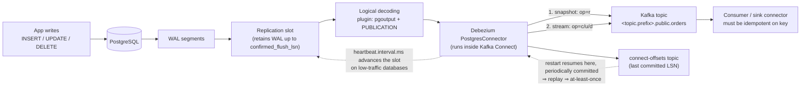

# Debezium CDC Lab

Change data capture is not "poll the table for `updated_at`" — it is **reading the database's own
write-ahead log**, so you see every change, in commit order, including the ones a poller can never see
(deletes, and the two updates that happened between polls). This lab makes that concrete on your laptop,
in the run-it-and-read-the-output spirit of [`AGENTS.md`](../../../AGENTS.md). Pairs with
[`cdc-pipeline-coach`](../cdc-pipeline-coach/SKILL.md) for the design decision and
[`kafka-connect-lab`](../kafka-connect-lab/SKILL.md) for the runtime that hosts the connector.

## When to use

- The learner needs to replicate an OLTP table into a warehouse, cache, or search index and wants the
  low-latency, no-missed-deletes version instead of a nightly `SELECT *`.
- A Debezium pipeline is misbehaving: `before` is `null`, deletes vanish downstream, the connector
  re-snapshots on restart, or the Postgres replication slot is eating the disk.
- Someone claims "Debezium gives us exactly-once" and the team needs the honest version.
- They must add a table to an already-running connector without stopping the world (incremental snapshot).
- **Don't use it for** *choosing* CDC vs. batch vs. outbox in the first place — that's
  [`cdc-pipeline-coach`](../cdc-pipeline-coach/SKILL.md) and
  [`transactional-outbox-lab`](../transactional-outbox-lab/SKILL.md) — or for lakehouse-internal change
  feeds, which are [`delta-lake-lab`](../delta-lake-lab/SKILL.md).

## First principles: the log is the source of truth

Every ACID database already writes an ordered, durable record of each change *before* acknowledging the
commit — PostgreSQL's **write-ahead log (WAL)**, MySQL's binlog, Oracle redo. Debezium does not query your
tables; it registers as a **replication client** and decodes that log. Three consequences follow, and they
are the whole reason CDC exists:

1. **No change is invisible.** A poller comparing `updated_at` misses hard deletes entirely and collapses
   N intermediate updates into one. The log has all of them, in commit order.
2. **No load on your query planner.** Reading the WAL costs the source database far less than repeated
   full scans, and it never blocks writers.
3. **Position is a durable offset.** PostgreSQL's **LSN** (log sequence number) is a resumable cursor, so a
   restarted connector continues rather than re-reading.

PostgreSQL implements this with **logical decoding** (PostgreSQL docs, *Logical Decoding*, available since
PostgreSQL 9.4, 2014). It requires `wal_level = logical`, and the connector holds a **replication slot** —
a server-side bookmark that guarantees the WAL it has not yet read is retained. That guarantee is also the
number-one operational hazard in this lab: a slot nobody consumes will retain WAL until the disk fills.



*Figure: the WAL, not the table, is what Debezium reads; the replication slot is what keeps the WAL alive,
and the periodically-committed offset is exactly why redelivery is possible.*

### The change event envelope

Every Debezium change event value has the same shape (Debezium docs, *Debezium connector for
PostgreSQL → Data change events*):

| Field | Meaning | Gotcha to teach |
| --- | --- | --- |
| `before` | row state prior to the change | `null` for inserts **and** — on Postgres — for updates/deletes unless `REPLICA IDENTITY` is `FULL` |
| `after` | row state after the change | `null` for deletes |
| `source` | `db`, `schema`, `table`, `lsn`, `txId`, `ts_ms`, `snapshot` | `snapshot` distinguishes backfill rows from live ones |
| `op` | `c` create · `u` update · `d` delete · `r` read (snapshot) · `t` truncate · `m` logical message | `r` is the tell that a row came from the snapshot, not a real write |
| `ts_ms` | when the connector processed it | *not* the commit time — that's `source.ts_ms` |
| `transaction` | `id`, `total_order`, `data_collection_order` | only present when transaction metadata is enabled |

The **message key** is the table's primary key. That is what makes the stream compaction-friendly and what
makes an idempotent sink possible: last-write-wins per key.

### Snapshot vs. streaming

| Phase | What it reads | `op` | Ordering | Ends when |
| --- | --- | --- | --- | --- |
| Initial snapshot | `SELECT` over the table inside a repeatable-read transaction, after recording the current LSN | `r` | table order, not commit order | all configured tables copied |
| Streaming | decoded WAL from that LSN forward | `c` / `u` / `d` | commit order | never (that's the point) |
| Incremental snapshot | chunked `SELECT`s, interleaved with streaming, de-duplicated by watermark events | `r` | chunks between watermarks | signalled chunks exhausted |

`snapshot.mode` controls the first phase. `initial` (the default) snapshots once then streams;
`initial_only` snapshots and stops; `when_needed` re-snapshots if the stored offset is no longer usable;
`always` snapshots on every start. There is also a "stream only, no backfill" mode whose **name changed
across major versions** (`never` in Debezium 1.x/2.x, `no_data` in Debezium 3.x) — ⚠ check the exact
allowed values on the connector page for the version you pinned before writing it into config.

**Incremental snapshots** let you backfill a newly-added table without stopping the connector. Debezium
implements the watermark-based chunking from Netflix's **DBLog** paper (Andreas Andreakis & Ioannis
Papapanagiotou, *DBLog: A Watermark Based Change-Data-Capture Framework*, arXiv 2010.12597, 2020): the
connector writes a low watermark, reads a chunk, writes a high watermark, and drops any chunk rows that
were superseded by streamed events in between. That is what makes concurrent snapshot + stream safe.

### Delivery semantics — say this out loud

Debezium's default is **at-least-once**. Kafka Connect commits source offsets *periodically*, so a crash
between "record produced" and "offset committed" replays records on restart. Kafka added exactly-once
support for **source** connectors in **Apache Kafka 3.3** (KIP-618, released 2022), enabled per-worker with
`exactly.once.source.support` and only for connectors that declare support for it. ⚠ Whether a given
Debezium connector version declares that support is version-specific — verify on the current Debezium and
Kafka Connect pages rather than assuming. The design rule that survives every version: **make the sink
idempotent on (key, LSN)** and duplicates stop mattering.

## Procedure

1. **Stand the lab up locally and free** with the compose file in the worked example
   (`docker compose up -d`). Three containers: Postgres, Kafka (KRaft, no ZooKeeper), Kafka Connect with
   the Debezium plugin. Confirm the connector plugin is loaded:
   `curl -s localhost:8083/connector-plugins | jq -r '.[].class'`.
2. **Prepare the source database.** `wal_level = logical` is mandatory; verify it rather than assume it:
   `docker compose exec postgres psql -U postgres -c 'SHOW wal_level;'` must print `logical`.
   Create a table, insert a couple of rows, and grant the connector role `REPLICATION` (or use a superuser
   in the lab only).
3. **Register the connector** with a `POST` to the Connect REST API (`/connectors`), then poll
   `/connectors/<name>/status` until `connector.state` and every `tasks[].state` are `RUNNING`. A task in
   `FAILED` state carries the stack trace in the same JSON — read it, don't guess.
4. **Watch the snapshot.** Consume the table topic from the beginning and confirm every event has
   `"op":"r"` and `"source":{"snapshot":"true"|"last"|"false"}`. Count them: they must equal the row count.
5. **Switch to streaming.** `INSERT`, `UPDATE`, then `DELETE` one row and read the three events. Name the
   `op` codes and point at `before`/`after` in each.
6. **Prove the `REPLICA IDENTITY` rule.** With the default identity, `before` on an update carries only the
   primary key. Run `ALTER TABLE orders REPLICA IDENTITY FULL;`, update again, and show that `before` now
   has every column. Say the cost out loud: `FULL` writes the whole old row into the WAL.
7. **Read the delete pair.** A delete emits the change event *and* a **tombstone** — same key, `null` value
   — because `tombstones.on.delete` defaults to `true`. Explain that the tombstone is what lets Kafka log
   compaction actually remove the key, and that a naive JSON consumer will `NullPointerException` on it.
8. **Inspect the slot and make WAL growth visible.**
   `SELECT slot_name, active, restart_lsn, pg_size_pretty(pg_wal_lsn_diff(pg_current_wal_lsn(), restart_lsn)) AS retained FROM pg_replication_slots;`
   Then stop Connect, write a few thousand rows, re-run the query and watch `retained` climb. Restart and
   watch it fall. Set `heartbeat.interval.ms` and explain the low-traffic-database trap: if the captured
   tables are idle but *other* tables are busy, the connector has nothing to acknowledge and the slot never
   advances — heartbeats (optionally with `heartbeat.action.query`) are the fix.
9. **Trigger an incremental snapshot.** Create the signalling table, set `signal.data.collection`, then
   `INSERT` an `execute-snapshot` signal and watch `op=r` events interleave with live `op=c` events.
10. **Change the schema.** `ALTER TABLE orders ADD COLUMN currency text;`, insert a row, and show the new
    field in `after`. Note that `include.schema.changes` (default `true`) also publishes DDL to a separate
    schema-change topic. Decide how the sink absorbs this with
    [`schema-evolution-coach`](../schema-evolution-coach/SKILL.md) and register the contract in
    [`schema-registry-lab`](../schema-registry-lab/SKILL.md).
11. **Force a duplicate.** `docker compose restart connect` mid-load and look for a replayed offset in the
    consumer. Then show that an upsert-by-key sink is unaffected — this is the at-least-once lesson,
    demonstrated instead of asserted.
12. **Tear down cleanly**: `curl -X DELETE localhost:8083/connectors/orders-cdc` **before**
    `docker compose down -v`, so the replication slot is dropped rather than orphaned.
13. Summarise trade-offs and close with the **Learning Footer**.

## Output shape

```
Debezium CDC lab — source: <db.schema.table> · connector: <postgres> · versions: <pg=.. debezium=.. kafka=..>

Preconditions: wal_level=<logical> · plugin=<pgoutput> · slot=<name> · publication=<name>
Connector status: connector=<RUNNING> tasks=[<RUNNING>] · topic=<prefix>.<schema>.<table>

Snapshot:   snapshot.mode=<initial|initial_only|when_needed|always|no_data/never>
            events op=r: <n>  (table row count: <n>)  match=<yes|no>
Streaming:  op=c <n> · op=u <n> · op=d <n> · tombstones <n>
Envelope:   before=<null|pk-only|full> (REPLICA IDENTITY=<DEFAULT|FULL|INDEX|NOTHING>) · key=<pk cols>
            source.lsn=<...> · source.ts_ms=<commit time> vs ts_ms=<process time>

Slot health: active=<t|f> · retained WAL=<size> · heartbeat.interval.ms=<ms> · trend=<↑|→|↓>
Incremental snapshot: signal=<execute-snapshot on [..]> · chunks=<n> · interleaved live events=<n>
Schema change: DDL=<...> · new field visible in after=<yes|no> · sink contract updated=<yes|no>

Delivery:   default=<at-least-once> · duplicates observed on restart=<n>
            sink idempotency=<upsert on key, drop if incoming lsn <= stored lsn>
Deletes:    downstream handling=<soft-delete flag | hard delete | ignore tombstone>  (explicit choice)

Teardown:   DELETE /connectors/<name> -> slot dropped=<yes|no>
Next: cdc-pipeline-coach | kafka-connect-lab | schema-evolution-coach
Learning Footer
```

## Worked example — Postgres → Kafka, and reading the four `op` codes

Everything below runs locally at zero cost. ⚠ Pin image tags deliberately and verify them on the current
Debezium and Apache Kafka pages; the tags below are illustrative, and Debezium images are published on
`quay.io`, not Docker Hub.

`docker-compose.yml`:

```yaml
services:
  postgres:
    image: postgres:16
    environment:
      POSTGRES_PASSWORD: postgres
    # logical decoding is off by default; without this the connector cannot start
    command: ["postgres", "-c", "wal_level=logical", "-c", "max_replication_slots=4", "-c", "max_wal_senders=4"]
    ports: ["5432:5432"]

  kafka:
    image: apache/kafka:3.9.0          # official Apache Kafka image, KRaft mode (no ZooKeeper)
    ports: ["9092:9092"]

  connect:
    image: quay.io/debezium/connect:3.0
    depends_on: [kafka, postgres]
    ports: ["8083:8083"]
    environment:
      BOOTSTRAP_SERVERS: kafka:9092
      GROUP_ID: cdc-lab
      CONFIG_STORAGE_TOPIC: connect_configs
      OFFSET_STORAGE_TOPIC: connect_offsets     # <- where the LSN cursor lives
      STATUS_STORAGE_TOPIC: connect_statuses
```

Seed the source:

```sql
CREATE TABLE orders (
  id       bigserial PRIMARY KEY,
  customer text        NOT NULL,
  amount   numeric(10,2) NOT NULL,
  status   text        NOT NULL DEFAULT 'new'
);
INSERT INTO orders (customer, amount) VALUES ('acme', 100.00), ('globex', 250.00);
```

Register the connector (field names per the Debezium PostgreSQL connector docs — note `topic.prefix`,
which **replaced** the older `database.server.name` in Debezium 2.0):

```bash
curl -s -X POST localhost:8083/connectors -H 'Content-Type: application/json' -d '{
  "name": "orders-cdc",
  "config": {
    "connector.class": "io.debezium.connector.postgresql.PostgresConnector",
    "database.hostname": "postgres",
    "database.port": "5432",
    "database.user": "postgres",
    "database.password": "postgres",
    "database.dbname": "postgres",
    "topic.prefix": "shop",
    "plugin.name": "pgoutput",
    "slot.name": "orders_slot",
    "publication.name": "orders_pub",
    "table.include.list": "public.orders",
    "snapshot.mode": "initial",
    "heartbeat.interval.ms": "10000",
    "signal.data.collection": "public.debezium_signal"
  }
}' | jq .

curl -s localhost:8083/connectors/orders-cdc/status | jq '{c:.connector.state, t:[.tasks[].state]}'
# {"c":"RUNNING","t":["RUNNING"]}
```

Consume the topic (`<topic.prefix>.<schema>.<table>` ⇒ `shop.public.orders`):

```bash
docker compose exec kafka /opt/kafka/bin/kafka-console-consumer.sh \
  --bootstrap-server localhost:9092 --topic shop.public.orders \
  --from-beginning --property print.key=true
```

**Tracing the events.** Two seeded rows exist before the connector starts, so the snapshot must emit
exactly two `op=r` events — `before` is `null` because a snapshot read has no prior state:

```json
{"payload":{"before":null,"after":{"id":1,"customer":"acme","amount":"100.00","status":"new"},
 "source":{"table":"orders","lsn":26583560,"snapshot":"true"},"op":"r","ts_ms":1767225600000}}
{"payload":{"before":null,"after":{"id":2,"customer":"globex","amount":"250.00","status":"new"},
 "source":{"table":"orders","lsn":26583560,"snapshot":"last"},"op":"r","ts_ms":1767225600001}}
```

Now three live statements, one at a time:

```sql
INSERT INTO orders (customer, amount) VALUES ('initech', 75.00);   -- op = c
UPDATE orders SET status = 'shipped' WHERE id = 1;                 -- op = u
DELETE FROM orders WHERE id = 2;                                   -- op = d  (+ tombstone)
```

With the **default** `REPLICA IDENTITY`, the update's `before` carries only the primary key — this is the
single most-reported "Debezium bug" that is actually correct behaviour:

```json
{"payload":{"before":null,"after":{"id":3,...},"op":"c"}}
{"payload":{"before":{"id":1,"customer":null,"amount":null,"status":null},
            "after":{"id":1,"customer":"acme","amount":"100.00","status":"shipped"},"op":"u"}}
{"payload":{"before":{"id":2,"customer":null,"amount":null,"status":null},"after":null,"op":"d"}}
# then, on the same key, a value-less record:  key={"id":2}  value=null   <- the tombstone
```

Fix it deliberately and re-run the update:

```sql
ALTER TABLE orders REPLICA IDENTITY FULL;   -- old row image is now written into the WAL
UPDATE orders SET status = 'delivered' WHERE id = 1;
```

```json
{"payload":{"before":{"id":1,"customer":"acme","amount":"100.00","status":"shipped"},
            "after":{"id":1,"customer":"acme","amount":"100.00","status":"delivered"},"op":"u"}}
```

Reasoning: `REPLICA IDENTITY DEFAULT` tells PostgreSQL to log only the primary key of the old row, so
Debezium has nothing else to put in `before`. `FULL` logs the entire old tuple — which is exactly what you
need for a before/after audit trail or SCD Type 2, and exactly what you should *not* enable on a wide,
write-heavy table without measuring the WAL volume increase first.

**Incremental snapshot** for a table added later, without a restart:

```sql
CREATE TABLE debezium_signal (id varchar(64) PRIMARY KEY, type varchar(32) NOT NULL, data varchar(2048));

INSERT INTO debezium_signal (id, type, data)
VALUES ('bf-1', 'execute-snapshot',
        '{"data-collections":["public.orders"],"type":"incremental"}');
```

Watch the topic: `op=r` chunk events appear **interleaved** with live `op=c`/`op=u` events, and the
watermark logic guarantees a row changed mid-chunk is represented by its streamed value, not the stale
snapshot read. That is the DBLog property, and it is why you no longer have to stop the pipeline to
backfill.

**Prove the at-least-once claim.** Run a write loop, `docker compose restart connect`, then compare offsets:

```bash
docker compose exec kafka /opt/kafka/bin/kafka-run-class.sh kafka.tools.GetOffsetShell \
  --bootstrap-server localhost:9092 --topic shop.public.orders
```

Events after the last committed offset are produced again. The sink-side answer is not "turn on
exactly-once" — it is: key by primary key, keep `source.lsn` in the target row, and **ignore any incoming
event whose `lsn` is not greater than the stored one**. Now replay is a no-op, and the pipeline is correct
under any delivery semantics.

## Tips

- Two `op` codes trip everyone up: **`r` is snapshot, not "read"** in the sense of a query, and **`t` is
  `TRUNCATE`**, which carries no row data at all — a sink that ignores it silently keeps deleted rows.
- `ts_ms` at the top level is *processing* time; `source.ts_ms` is *commit* time. Use `source.ts_ms` for
  freshness SLOs or you will measure your connector's lag twice.
- A tombstone is a `null` **value**, not a `null` key. Deserializers that assume a value is present crash
  on the first delete you ever process — test a delete before you go live.
- An inactive replication slot retains WAL forever. Always `DELETE /connectors/<name>` before tearing the
  environment down, and alert on `pg_replication_slots.active = false` in production.
- `snapshot.mode: always` re-copies everything on every restart. It is a debugging tool, not a setting.
- Debezium is not a transformation layer. Land raw change events, then model them downstream with
  [`dbt-model-coach`](../dbt-model-coach/SKILL.md) and
  [`data-warehouse-modeling`](../data-warehouse-modeling/SKILL.md) (the `before`/`after` pair is a natural
  SCD Type 2 feed).
- If your changes need to be *semantic* ("OrderShipped") rather than *physical* ("row 42 column status
  changed"), CDC on the table is the wrong shape — use
  [`transactional-outbox-lab`](../transactional-outbox-lab/SKILL.md).
- Version-sensitive facts (`snapshot.mode` value names, exactly-once support, image tags, plugin defaults)
  change between majors — per `AGENTS.md` §2, verify each on the current Debezium connector page and quote
  the version you tested.
- Related: [`cdc-pipeline-coach`](../cdc-pipeline-coach/SKILL.md),
  [`kafka-connect-lab`](../kafka-connect-lab/SKILL.md),
  [`kafka-topics-partitions-lab`](../kafka-topics-partitions-lab/SKILL.md),
  [`schema-registry-lab`](../schema-registry-lab/SKILL.md),
  [`streaming-pipeline-designer`](../streaming-pipeline-designer/SKILL.md),
  [`postgres-local-lab`](../postgres-local-lab/SKILL.md), and
  [`ingestion-connector-lab`](../ingestion-connector-lab/SKILL.md) for the poll-based alternative.
  End with the **Learning Footer** (`AGENTS.md`).
