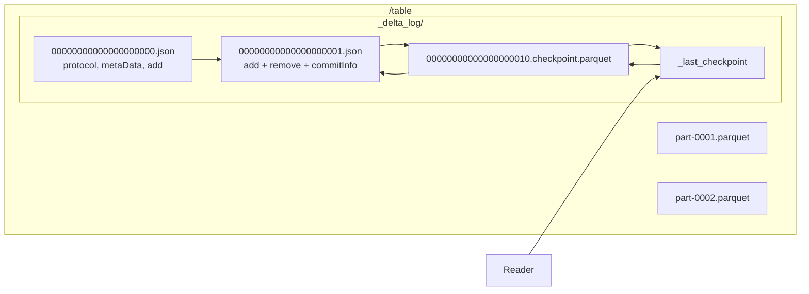

# Delta Lake Lab

Open the `_delta_log` and read a transaction log with your own eyes — that is the entire lesson, taught the
way [`AGENTS.md`](../../../AGENTS.md) prescribes. Pairs with
[`iceberg-table-lab`](../iceberg-table-lab/SKILL.md) for the format comparison and
[`lakehouse-designer`](../lakehouse-designer/SKILL.md) for the design decision behind it.

## When to use

- The learner wants proof that "ACID on object storage" is real and needs to see the commit protocol.
- They are debugging small files, a stale `VACUUM`, a `MERGE` that is too slow, or a concurrency conflict.
- They must choose between partitioning, Z-order, and **liquid clustering** for a table layout.
- They need CDC out of a lakehouse table and are deciding whether Change Data Feed is the right answer.

## First principles: the log is the table

A Delta table is a **directory of Parquet data files plus an ordered log of what is currently valid**. The
data files are append-only; a "delete" is a log entry, not an erasure. Reading = replay the log to get the
live file set. That indirection buys atomicity, isolation, and time travel for free.



A commit is an **atomic put-if-absent of the next filename** `<version+1>.json`. Two writers computing the
same next version race; exactly one wins, the loser re-reads the log and retries — that is **optimistic
concurrency control** (Delta Lake docs, *Delta transaction log protocol*, delta.io).

| Action in a commit | Means | Read effect |
| --- | --- | --- |
| `protocol` | min reader/writer versions or table features | Fails fast if your engine is too old |
| `metaData` | schema, partition columns, table properties | Schema evolution is a log entry |
| `add` | a data file becomes live (+ stats, partition values) | Feeds file skipping via min/max stats |
| `remove` | a data file is tombstoned | Still on disk until `VACUUM` — this is time travel |
| `commitInfo` | operation, predicate, metrics, timestamp | What `DESCRIBE HISTORY` shows you |
| `txn` | idempotent streaming app id + version | Exactly-once for streaming writers |

**Checkpoints** collapse the replayed state into one Parquet file (by default every 10 commits), and
`_last_checkpoint` points at the newest one, so readers do not replay from version 0 forever.

| Layout choice | Best for | Trade-off |
| --- | --- | --- |
| Hive partitioning (`PARTITIONED BY`) | one low-cardinality filter, e.g. date | Wrong/high-cardinality choice = tiny files; **cannot be changed** without a rewrite |
| Z-order (`OPTIMIZE … ZORDER BY`) | multi-column filters on a partitioned table | Must be re-run after every load; you pick the columns |
| Liquid clustering (`CLUSTER BY`) | evolving or skewed filter patterns | Clustering keys can be changed later; incremental, no partition directories |

## Procedure

1. **Set up locally, free.** `pip install deltalake pyarrow pandas` (delta-rs — no JVM, no cloud), or Spark
   local with the `delta-spark` package and the Delta SQL extensions. Run every step with **`#run`
   (`learningos_runcode`)** and read the *actual* output.
2. **Write v0.** `write_deltalake("./tbl", arrow_table)`. Then `ls ./tbl/_delta_log/` and pretty-print
   `00000000000000000000.json` — one JSON object per line. Name each action from the table above.
3. **Append and overwrite.** Write again with `mode="append"`, then a filtered `mode="overwrite"`. Read
   `...0001.json` and `...0002.json` and point at the `add`/`remove` pairs. Nothing was deleted from disk.
4. **Time travel.** `DeltaTable("./tbl", version=0).to_pyarrow_table()` (or `SELECT … VERSION AS OF 0` /
   `TIMESTAMP AS OF`). Show `dt.history()` and map each row back to a `commitInfo`.
5. **Force a checkpoint.** Commit 10+ times in a loop, then list `_delta_log/` again: a
   `*.checkpoint.parquet` and `_last_checkpoint` appeared. Explain the read-path cost it removes.
6. **Demonstrate optimistic concurrency.** Start two writers against the same table (two processes or two
   Spark sessions). One commit succeeds, the other retries or raises a concurrent-modification error.
   Teach the rule: conflicts are decided on **file/partition overlap**, so disjoint partitions rarely clash.
7. **MERGE — upsert then SCD2.** First a plain upsert (`whenMatchedUpdate` / `whenNotMatchedInsert`). Then
   build **Slowly Changing Dimension Type 2**: match on the business key where `is_current = true`, update
   the matched row to `is_current = false, valid_to = now()`, and insert the new version with
   `valid_from = now(), is_current = true` — the classic two-step "close then insert" pattern.
   Model the dimension itself with [`data-warehouse-modeling`](../data-warehouse-modeling/SKILL.md).
8. **Layout experiment.** Compare a partitioned table, `OPTIMIZE … ZORDER BY (col)`, and a `CLUSTER BY`
   table on the same query. Record files scanned and bytes read for each; do not accept a claim you did not
   measure. (Delta Lake docs, *Optimizations* / *Liquid clustering*.)
9. **OPTIMIZE then VACUUM.** `dt.optimize.compact()` (or `OPTIMIZE`) to fix small files, then
   `dt.vacuum(retention_hours=…)`. Show that **VACUUM is what actually frees storage** and that it
   **destroys time travel older than the retention window** — default retention is 7 days, and lowering it
   below the safety threshold risks breaking readers and concurrent writers mid-query.
10. **Change Data Feed.** Enable `delta.enableChangeDataFeed = true`, do an update and a delete, then read
    the change feed and inspect `_change_type` (`insert`, `update_preimage`, `update_postimage`, `delete`)
    with `_commit_version` and `_commit_timestamp`. Note the trap: CDF only records changes made **after**
    it was enabled. Feed it downstream with
    [`streaming-pipeline-designer`](../streaming-pipeline-designer/SKILL.md).
11. **Summarize the trade-offs** and route on to [`dbt-model-coach`](../dbt-model-coach/SKILL.md) for the
    transformation layer.

## Output shape

```
Delta lab — <dataset> · engine: delta-rs | Spark local · path: ./tbl

_delta_log walked:
  0000...0000.json  actions: protocol(minR=<r>,minW=<w>) metaData add x<n>
  0000...0001.json  actions: add x<n> remove x<m> commitInfo(op=<WRITE|MERGE>)
  0000...0010.checkpoint.parquet + _last_checkpoint -> version <v>

History:      version <v> | op <op> | metrics <numFiles/numTargetRowsUpdated/...>
Time travel:  VERSION AS OF 0 -> rows=<n>  (remove-tombstoned files still on disk)
Concurrency:  writer A commit v<n> OK | writer B -> retry/ConcurrentModification -> v<n+1>
MERGE/SCD2:   matched -> is_current=false, valid_to=<ts> | inserted -> valid_from=<ts>, rows=<n>
Layout:       partitioned <files/bytes> · ZORDER <files/bytes> · CLUSTER BY <files/bytes>
OPTIMIZE:     <n> files -> <m> files
VACUUM:       retention=<h>h -> <k> files deleted -> time travel now limited to <window>
CDF:          _change_type counts: insert=<a> update_pre=<b> update_post=<b> delete=<c>

#run checks: <command -> real output -> PASS/FAIL>
Next: iceberg-table-lab | lakehouse-designer | dbt-model-coach
```

## Tips

- Every question about Delta ("why is this stale? why did my delete not free space?") is answered by reading
  `_delta_log`. Open it first, theorize second.
- `remove` ≠ deleted. Storage is only reclaimed by `VACUUM`, and `VACUUM` is the one irreversible operation
  in this lab — it caps your time-travel window.
- Conflicts are per-file. Partition your writers so their file sets are disjoint and optimistic concurrency
  almost never retries.
- A `MERGE` that reads the whole target is a full-table rewrite in disguise. Always add a predicate on the
  target that the engine can use for file skipping (typically a date range).
- Prefer liquid clustering when filter patterns will change, since clustering keys are alterable while
  partition columns are not; keep classic partitioning for a stable, low-cardinality date filter.
- Check the `protocol` action / table features before promising a feature — an older reader simply refuses
  the table rather than reading it wrong.
- End with the **Learning Footer** (`AGENTS.md`) — one commit JSON the learner must interpret unaided, and
  one layout experiment to re-run on their own data.
