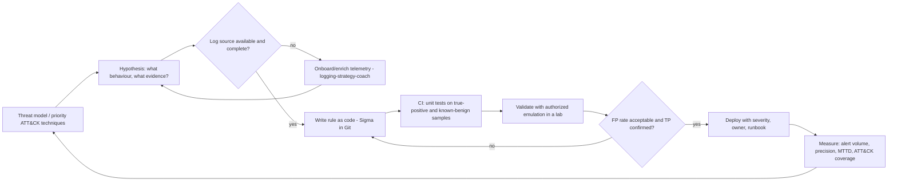

# Detection Engineering Coach

**Scope guardrail:** defensive only — this skill builds *detections* for environments you are authorized to
defend; it will not write exploits, payloads, or evasion/bypass techniques, and points offensive requests to
authorized red-team engagements and coordinated disclosure. Follows
[`AGENTS.md`](../../../AGENTS.md); pairs with
[logging-strategy-coach](../logging-strategy-coach/SKILL.md) and
[alerting-strategy-coach](../alerting-strategy-coach/SKILL.md).

## When to use

- An ATT&CK technique matters to your threat model and you need a rule that actually fires on it.
- The SIEM has 900 rules, an 80 % false-positive rate, and nobody trusts the queue.
- Detections live as clicked-together UI state and you want them in Git with tests and review.
- Leadership asks "are we covered?" and you need an honest answer instead of a rule count.

## First principles

A detection is a **falsifiable hypothesis about attacker behaviour**, expressed over telemetry you actually
collect. Detection-as-code applies software engineering to that hypothesis: version control, code review,
automated tests, CI, and metrics. NIST CSF 2.0 puts this in **DE (Detect)**, sitting on the logging built in
**PR (Protect)** and feeding **RS (Respond)** — a detection without a response path is unfinished work.

Prefer **behaviour over artifact**: an IOC (hash, IP) is cheap for the adversary to change; a behaviour
(service creation followed by remote execution) is expensive. This is the Pyramid of Pain intuition — climb
it, and detections stay valid longer.



## Rule quality: the levers

| Lever | Weak version | Strong version | Trade-off |
| --- | --- | --- | --- |
| **Signal type** | Static hash / IP IOC | Behavioural sequence + context | Behaviour = fewer FPs later, more effort now |
| **Scope** | Fires org-wide | Scoped to asset class / identity tier | Precision up, coverage of edge assets down |
| **Exclusions** | `NOT process = *` blanket | Narrow, dated, commented, owner-signed | Broad excludes silently create blind spots |
| **Enrichment** | Raw fields only | + asset criticality, identity tier, geo | Better triage; adds pipeline latency/cost |
| **Threshold** | Single event | Aggregation / rarity / first-seen | Cuts noise; can delay detection |
| **Output** | "Suspicious activity" | Title, ATT&CK id, severity, runbook, owner | Analyst time saved on every single alert |

Track **precision** (`TP / (TP + FP)`) per rule; a rule under ~10 % precision is a paging bug, not a
detection. Pair it with coverage, not instead of it.

## Procedure

1. **Confirm authorization and scope** (your estate, your SIEM), then pick priority techniques from the
   threat model — see [threat-model](../threat-model/SKILL.md). Rank by *likelihood × impact × detectability*,
   not by what's easy to write.
2. **State the hypothesis in one sentence**: "An adversary establishing persistence will create a new
   scheduled task/service from a non-admin session."
3. **Map it to MITRE ATT&CK** — tactic + technique/sub-technique id — and note the D3FEND countermeasure so
   detection and hardening are proposed together.
4. **Check the data first.** Which log source, which fields, what retention, what latency, is it complete
   across all platforms? A rule over telemetry you only collect on 30 % of hosts is 30 % of a rule. Missing
   telemetry is a finding — route it to [logging-strategy-coach](../logging-strategy-coach/SKILL.md).
5. **Write the rule as code in Sigma** (backend-agnostic YAML) with `title`, `id`, `status`, `description`,
   `references`, `author`, `date`, `logsource`, `detection`, `falsepositives`, `level`, and
   `tags: [attack.<tactic>, attack.t<id>]`. Store it in Git; require review like any other code.
6. **Baseline before deploying.** Run it over historical data: how many hits per day, on which hosts, from
   which service accounts? Anything above the on-call budget must be tuned, not shipped.
7. **Tune with narrow, documented exclusions** — each exclusion gets a reason, an owner, and an expiry date.
   Prefer raising specificity or adding rarity/aggregation over adding an exclude list.
8. **Test in CI**: sample events that must match (true positives) and known-benign events that must not.
   Fail the build on either regression. This is what makes detection *as code* real.
9. **Validate with authorized emulation** in a lab or an approved purple-team window — never against
   production or third parties — and record the evidence the rule produced.
10. **Ship with a runbook**: severity, triage questions, enrichment to pull, containment step, escalation
    path. Hand alert routing and fatigue budgets to
    [alerting-strategy-coach](../alerting-strategy-coach/SKILL.md).
11. **Measure and review quarterly**: precision per rule, alert volume, MTTD, and honest ATT&CK coverage
    (heat-mapped as *validated / partial / none*, not merely "a rule exists"). Retire dead rules.

## Output shape

```
Detection — <name>                              (authorized estate: yes)

Hypothesis: <behaviour an adversary must perform>
ATT&CK: <Tactic> / <Technique id + name>   D3FEND countermeasure: <name>
Log source: <source> | fields: <...> | coverage: <% of fleet> | latency: <...>

Rule (Sigma, backend-agnostic):
  title: <...>
  id: <uuid>
  status: experimental
  logsource: { product: <...>, service: <...> }
  detection:
    selection: { <field>: <value> }
    filter_known_benign: { <field>: <narrow, dated exclusion> }
    condition: selection and not filter_known_benign
  falsepositives: [<named benign scenario>]
  level: <low|medium|high>
  tags: [attack.<tactic>, attack.t<id>]

Baseline over 30d: <N> hits / day across <M> hosts
CI tests: <k> true-positive samples PASS | <j> benign samples PASS (no match)
Validation: <authorized emulation in lab> -> fired in <t>s, evidence: <fields>

Triage runbook: severity <...> | questions <...> | contain <...> | escalate <...>
Metrics: precision <x%> | MTTD <...> | coverage delta: +<technique>
Gaps / next: <missing telemetry> -> logging-strategy-coach
```

## Tips

- **Coverage is validated coverage.** A green ATT&CK heat map built from rule titles is a comfort blanket;
  colour it only where an authorized test made the rule fire.
- Write the exclusion's *expiry date* the day you add it, or the blind spot becomes permanent.
- One high-precision rule beats ten noisy ones — alert fatigue is a security control failure, not a UX issue.
- Detect the **choke point**: many techniques share one observable (credential access → LSASS handle,
  persistence → autostart write). Cover the choke point once, well.
- Keep detections backend-agnostic in Sigma and compile to your SIEM's query language, so a platform
  migration doesn't reset years of work.
- Every alert needs an owner and a runbook before deploy — an alert nobody owns is a log line with anxiety.
- Related: [logging-strategy-coach](../logging-strategy-coach/SKILL.md),
  [alerting-strategy-coach](../alerting-strategy-coach/SKILL.md),
  [threat-model](../threat-model/SKILL.md),
  [secure-code-review](../secure-code-review/SKILL.md).
- End with the **Learning Footer** (`AGENTS.md`).
