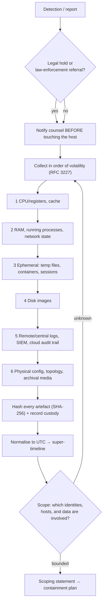

# DFIR Evidence Triage Drill

A timed reps drill for the first hour of an incident: **preserve → collect in volatility order →
verify integrity → timeline → scope**, taught from first principles per
[`AGENTS.md`](../../../AGENTS.md). This is defensive forensic readiness — it produces evidence and a
scoping statement, never intrusion tooling.

## When to use

- Responders reach for the "isolate and reimage" button before anything is preserved.
- The team needs muscle memory for collection order, hashing, and custody documentation.
- An investigation is stuck because logs, memory, and disk timestamps disagree and nobody normalised UTC.
- **Don't use it for** live legal proceedings, evidence handling without counsel's direction, or anything
  offensive — use [incident-response-drill](../incident-response-drill/SKILL.md) for full IR command flow.

## First principles: volatility, integrity, custody

RFC 3227 (BCP 55, *Guidelines for Evidence Collection and Archiving*) defines the **order of volatility**:
collect what disappears fastest, first. NIST SP 800-86 (*Guide to Integrating Forensic Techniques into
Incident Response*) adds the acquire → examine → analyse → report flow, and NIST SP 800-61r3 (April 2025)
places all of it inside the CSF 2.0 Functions so triage feeds **RESPOND** and **RECOVER**, not a silo.



| Tier | Artefact | Half-life | Collect with (free / built-in) | Destroyed by |
| --- | --- | --- | --- | --- |
| 1 | CPU registers, cache | µs | not practically collectable | any instruction |
| 2 | RAM, process list, sockets | minutes–hours | vendor/OSS memory imager; `ss -tupan`, `Get-NetTCPConnection` | **power off**, reboot |
| 3 | Temp files, container layers, live sessions | hours | `docker/podman inspect`, session exports | container restart, cleanup jobs |
| 4 | Disk / volume image | days–months | write-blocked image, cloud snapshot | reimaging, disk reuse |
| 5 | Central logs, cloud audit trail | retention period | SIEM export, `aws cloudtrail lookup-events` | log rotation, short retention |
| 6 | Topology, config, backups | long | CMDB export, IaC repo | undocumented change |

**Trade-off to say out loud:** isolating a host preserves *disk* and stops spread but can destroy
*memory* and live network state (tiers 2–3). Prefer **network containment that keeps the host powered**
(quarantine VLAN, security-group deny) so memory survives — and record the decision and its time, because
a defensible timeline of *responder* actions is as important as the attacker's.

## Procedure

1. **Start the log before the work.** Open a triage record: case ID, UTC start, responders, systems, and
   whether legal hold applies. Every subsequent action gets a UTC timestamp and an actor.
2. **Ask the legal question first** — hold, regulator notification, or law-enforcement referral changes
   handling *before* collection, not after.
3. **Choose containment that preserves volatility**: network quarantine over power-off, snapshot before
   terminate, and never "just reboot to clear it".
4. **Collect tier by tier** down the table, newest-volatility first, one artefact per line in the record.
5. **Hash immediately at the point of collection** and again on arrival in the evidence store:

   ```bash
   sha256sum mem.raw disk.img > MANIFEST.sha256   # Linux/macOS
   sha256sum -c MANIFEST.sha256                   # verify on arrival
   ```

   ```powershell
   Get-FileHash -Algorithm SHA256 .\mem.raw, .\disk.img | Export-Csv .\MANIFEST.csv -NoTypeInformation
   ```

6. **Record custody transfers** — who handed what to whom, when (UTC), and where it is stored. An
   unbroken chain is the difference between evidence and an anecdote.
7. **Normalise every timestamp to UTC** and note each source's clock skew, then build a super-timeline
   from log, filesystem, and audit sources. Free tooling: Plaso/`log2timeline` for timelining, `jq` for
   cloud audit JSON, `pandas` for merging.
8. **Scope by pivot, not by hunch**: identity → host → network → data. Answer "what else did this
   identity touch in the window?" before declaring the blast radius bounded.
9. **Write the scoping statement** (below), hand off to containment/recovery, and close with the
   **Learning Footer**.

## Output shape

```
Case: <id> · opened(UTC)=<ts> · lead=<name> · legal hold=<yes|no> · counsel notified=<ts|n/a>
Scenario: <one sentence, observed facts only>
Containment choice: <network quarantine | snapshot+isolate | power-off> — rationale=<volatility impact>
Collection log (volatility order):
  <tier> <artefact> · host=<…> · collected(UTC)=<ts> · by=<…> · sha256=<…> · store=<…>
Custody: <ts UTC> <from> -> <to> · purpose=<…> · integrity re-verified=<yes|no>
Timeline: window(UTC)=<start>..<end> · sources=<n> · clock skew notes=<…>
  <ts UTC> · <source> · <event> · <confidence: observed|inferred>
Scope: identities=<…> · hosts=<…> · data classes=<…> · exfil evidence=<observed|none observed>
Unknowns: <what is NOT yet established — list explicitly>
ATT&CK hypotheses (for detection work): <Txxxx[.nnn]> — <why suspected> — <detection to build>
Handoff: containment owner=<…> · recovery owner=<…> · comms owner=<…>
Next: [threat-hunting-drill] · [incident-response-drill] · [ransomware-resilience-drill]
Learning Footer
```

## Worked example — suspicious admin logon on a Linux jump host

`Case IR-2026-014`, opened `2026-08-09T09:12Z`, legal hold **yes** (counsel notified `09:15Z`).
Containment = security-group deny-all except the responder bastion; the host stays powered so tier-2
memory survives. Collection order actually executed:

| # | Tier | Artefact | UTC | SHA-256 (truncated) |
| --- | --- | --- | --- | --- |
| 1 | 2 | RAM image `mem.raw` | 09:24 | `9f2c…a71b` |
| 2 | 2 | `ss -tupan`, `ps auxww` snapshots | 09:27 | `3ad0…c519` |
| 3 | 3 | running container inspect JSON | 09:31 | `c7e4…0f28` |
| 4 | 4 | EBS snapshot → offline image | 09:48 | `11bd…8e33` |
| 5 | 5 | CloudTrail + auth.log export, 14-day window | 10:05 | `62fa…4d90` |

Timeline merge (all UTC) showed `auth.log` accepted a key-based logon at `08:41Z` for an account whose
last CloudTrail activity was 40 days earlier — a **dormant-credential** signal. Scope: 1 identity,
2 hosts, no evidence of data staged or transferred. Unknowns recorded explicitly: initial access vector,
and whether the key was reused elsewhere. Detection to build: alert on interactive logon by an identity
idle > 30 days (map the hypothesis to the relevant ATT&CK *Valid Accounts* technique ID after confirming
it in the current ATT&CK release).

## Tips

- Preserve first, remediate second — reimaging a host is the most common irreversible mistake in hour one.
- Power-off destroys tier 2; if you must pull the plug, say in the record what you knowingly lost.
- Hash at collection **and** on arrival; an unverified copy is not evidence.
- Everything in **UTC**, with per-source clock skew noted — mixed local times invent false sequences.
- Separate `observed` from `inferred` in the timeline; conflating them poisons the post-incident review.
- Keep ATT&CK references as *hypotheses that drive detections*, and confirm technique IDs against the
  current ATT&CK release rather than from memory.
- Pair with [incident-response-drill](../incident-response-drill/SKILL.md),
  [threat-hunting-drill](../threat-hunting-drill/SKILL.md),
  [ransomware-resilience-drill](../ransomware-resilience-drill/SKILL.md),
  [security-logging-audit-coach](../security-logging-audit-coach/SKILL.md),
  [detection-engineering-coach](../detection-engineering-coach/SKILL.md),
  [incident-postmortem](../incident-postmortem/SKILL.md), and
  [runbook-writer](../runbook-writer/SKILL.md). End with the **Learning Footer** (`AGENTS.md`).
