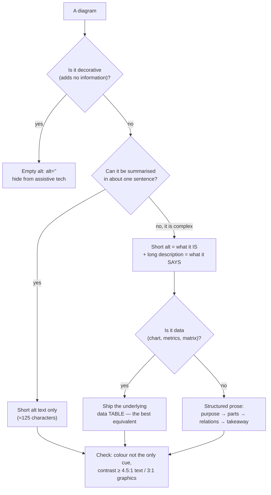

# Diagram Accessibility Coach

A diagram nobody can read is a diagram that doesn't exist. Following [`AGENTS.md`](../../../AGENTS.md)
§4 (every visual ships with alt text) and §9 (respect the reader), this skill produces the **text
equivalents and redundant encodings** that make a visual work for screen-reader users, colourblind
readers, low-vision readers and anyone on a small screen.

## When to use

- Any time you publish a diagram, chart, flow, schema or screenshot in docs, slides, a README or a lesson.
- A chart distinguishes its series **only by colour**, or a legend sits far from the data.
- Reviewing content for WCAG 2.2 conformance, or after an accessibility audit flags images
  ([accessibility-audit](../accessibility-audit/SKILL.md)).
- Writing teaching material — the text equivalent doubles as the study summary everyone benefits from.

## First principles

Accessibility is **redundant encoding**: never let one perceptual channel be the only carrier of meaning.
Colour, position, shape, pattern and text should say the same thing, so losing any one channel loses no
information. WCAG 2.2 makes this concrete: **1.1.1 Non-text Content** (a text alternative for every
image), **1.4.1 Use of Color** (colour is never the sole means of conveying information), **1.4.3
Contrast (Minimum)** 4.5:1 for normal text, **1.4.11 Non-text Contrast** 3:1 for graphical objects and UI
components, and **1.4.10 Reflow** (readable without two-dimensional scrolling).



## What to write, and how long

| Image kind | Short alt (≈125 chars) | Long description | Extra |
| --- | --- | --- | --- |
| Decorative divider, stock photo | `alt=""` (empty, not missing) | none | remove it instead (coherence) |
| Simple icon with meaning | the meaning, not the picture: "Error" | none | never "red circle icon" |
| Flowchart / process | "Flowchart: order fulfilment, 6 steps from checkout to delivery" | numbered steps + branch conditions | see [dual-coding-coach](../dual-coding-coach/SKILL.md) |
| Sequence diagram | "Sequence diagram: OAuth PKCE flow between user, client, auth server, API" | numbered message list, including failure branch | pairs with [sequence-diagram-generator](../sequence-diagram-generator/SKILL.md) |
| State diagram | "State diagram: order lifecycle, 7 states" | the **transition table** ([state-machine-visualizer](../state-machine-visualizer/SKILL.md)) | list illegal transitions too |
| ER diagram / schema | "ER diagram: 5 entities around ORDER" | entity list + relationship sentences | [er-diagram-generator](../er-diagram-generator/SKILL.md) |
| Chart with data | "Bar chart: p95 latency by version, falling from 90 ms to 30 ms" | trend, outliers, and the **data table** | table beats prose for numbers |
| Screenshot of UI | what the UI shows and its state | the text content, in reading order | never a screenshot of code — paste the code |
| Formula image | the equation spoken aloud | derivation steps | better: real KaTeX ([latex-math-coach](../latex-math-coach/SKILL.md)) |

## Procedure

1. **Ask what the image is *for*.** The alt text answers "why is this here?", not "what pixels are in it".
   Two identical diagrams in different contexts get different alt text.
2. **Decide decorative vs. informative.** Decorative → empty alt and, better, delete it. Informative →
   continue.
3. **Write the short alt first** — one sentence, ≈125 characters, front-loading the type and the takeaway:
   *"Flowchart: retry with exponential back-off, giving up after 3 attempts."* Don't start with "Image
   of"; screen readers already announce that.
4. **Add a structured long description for anything complex**, in this order: **purpose → components →
   relationships → the conclusion the reader should draw**. Put it in visible prose near the figure (a
   `<details>` block or caption) — visible descriptions help everyone, not just screen-reader users.
5. **For data, ship the table.** A chart's accessible equivalent is the numbers. Provide the table
   alongside or behind a disclosure; keep units and labels in the header row.
6. **Use Mermaid's built-in accessibility directives** so the rendered SVG carries a title and
   description:

   ```
   flowchart LR
     accTitle: Retry with exponential back-off
     accDescr: Request fails, waits 1s, 2s, then 4s, then gives up after the third attempt.
     A[Request] --> B{Failed?}
     B -->|yes| C[Wait 2^n seconds] --> A
     B -->|no| D[Done]
   ```

7. **Kill colour-only encoding.** Every series, path or category also needs a **direct label**, a
   **shape/line style**, or a **pattern**. Direct labels beat legends: they remove the lookup entirely
   (spatial contiguity, and it fixes 1.4.1 at the same time).
8. **Choose a colourblind-safe palette.** Deuteranomaly affects roughly 1 in 12 men, so red/green is the
   worst possible pairing. Use a qualitative palette designed for colour-vision deficiency — the
   **Okabe–Ito** set (black, orange, sky blue, bluish green, yellow, blue, vermillion, reddish purple) or
   Paul Tol's qualitative scheme — and prefer **blue↔orange** over red↔green.
9. **Check contrast and size**: text in the figure ≥ 4.5:1 against its background (WCAG 1.4.3), lines and
   meaningful shapes ≥ 3:1 (1.4.11), and no text smaller than the surrounding body text. Verify with a
   contrast checker, not by eye.
10. **Test it three ways**: read only the alt text — is the point intact? View it in greyscale — is every
    series still distinguishable? Zoom to 200–400% — does it reflow or require horizontal scrolling?
11. **Prefer text-based diagram sources** (Mermaid, KaTeX) over images: they scale, respect user themes,
    are searchable and diffable, and expose real text to assistive tech.

## Output shape

```
Figure: <name>  ·  Kind: <flow | sequence | state | ER | chart | screenshot>  ·  Role: <informative | decorative>

Short alt (<=125 chars): "<type>: <takeaway>"

Long description
- Purpose: <why this figure exists>
- Components: <the named parts>
- Relationships: <how they connect, in reading order>
- Takeaway: <the conclusion>

Data equivalent (charts/matrices)
| <label> | <value> |
|---|---|

Mermaid directives: accTitle / accDescr added ✔
Redundant encoding: colour + <label | shape | pattern | position>
Palette: <Okabe–Ito / Tol> — no red-green pairing
Contrast: text <ratio> (needs 4.5:1) · graphics <ratio> (needs 3:1)
Tests: alt-only ✔ · greyscale ✔ · 200% zoom ✔
Next: <related skill link>
```

## Tips

- **Alt text is a translation, not a caption.** The caption is visible to everyone and can add context;
  the alt text must carry the information the sighted reader gets for free.
- Long descriptions written *visibly* serve everyone — low-vision, cognitive-load, mobile and skimming
  readers — so don't hide them by default.
- "Click the green button" is an accessibility bug in the *text*, not the image; write "select
  **Deploy**".
- Never rely on a legend when a direct label fits; legends force a colour→meaning lookup that colourblind
  and low-vision readers may not be able to perform.
- Automated checkers catch missing alt and contrast, never *wrong* alt — the judgement is yours.
- Complexity is an accessibility issue: splitting one 20-node diagram into three is often the biggest
  single win ([dual-coding-coach](../dual-coding-coach/SKILL.md)).
- Pair with [accessibility-audit](../accessibility-audit/SKILL.md),
  [accessibility-remediation-coach](../accessibility-remediation-coach/SKILL.md),
  [technical-writing-coach](../technical-writing-coach/SKILL.md) and
  [visual-explainer](../visual-explainer/SKILL.md).
  End with the **Learning Footer** (`AGENTS.md`).
