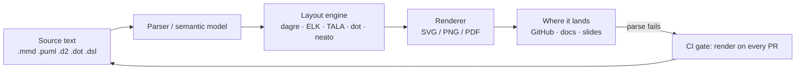
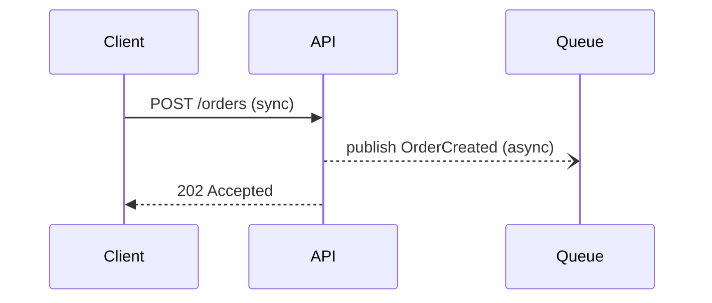
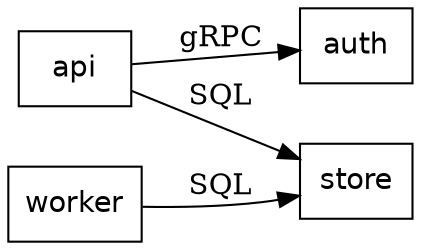

# Diagram as Code Coach

Diagrams belong in version control as **text**, so they diff, review, and rot loudly instead of silently.
This skill picks the ecosystem and wires up rendering, per [`AGENTS.md`](../../../AGENTS.md).

## When to use

- The learner is choosing between Mermaid, PlantUML, D2, Graphviz, or Structurizr and wants a real reason.
- Their graph renders as a hairball and they suspect they picked the wrong **layout engine**.
- They want diagrams rendered in CI, failing the build on a parse error, or one C4 model exported many ways.

## First principles: a diagram-as-code toolchain has three layers



The **layout engine** decides whether your graph is readable, and it is the layer people ignore. A
hierarchical engine (`dot`, dagre, ELK layered) draws DAGs with clean ranks; a force-directed engine
(`neato`, `fdp`, `sfdp`) draws undirected clusters; `circo` draws rings. Feeding a dense undirected graph
to a hierarchical engine is the usual cause of the hairball.

## Pick the ecosystem

| Tool | Sweet spot | Layout engine(s) | Renders natively on GitHub? | Cost of entry |
| --- | --- | --- | --- | --- |
| **Mermaid** | flowchart, sequence, state, ER, gantt, C4 sketch — docs & README | dagre (ELK opt-in) | **Yes**, in Markdown fenced blocks | none |
| **PlantUML** | full UML (class, sequence, activity, component, deployment), big legacy models | Graphviz `dot` (sequence diagrams need no Graphviz) | no — pre-render to SVG | Java + Graphviz |
| **D2** | modern architecture diagrams, containers, sketch/pretty output | dagre · ELK · TALA | no — pre-render | single Go binary |
| **Graphviz DOT** | arbitrary graphs, generated graphs, dependency/call/state graphs | `dot` `neato` `fdp` `sfdp` `circo` `twopi` | no — pre-render | tiny native install |
| **Structurizr DSL** | **C4 model**: one model, many views, exports to Mermaid/PlantUML/D2 | delegated to the export target | no — export first | Java CLI or Docker |

**Trade-offs to state out loud:** Mermaid wins on *distribution* (renders in GitHub, VS Code and most docs
sites with zero build) and loses on *layout control*. Graphviz wins on layout quality for generated graphs
and loses on ergonomics. D2 sits between them with the best container/label handling but needs a build
step. Structurizr is the only one with a real **model** — describe the system once, generate
context/container/component views, which is what stops C4 levels drifting apart.

## Real, minimal examples

Mermaid (renders inline in Markdown, no tooling) — solid = sync, open dashed = async:



Graphviz DOT — note `rankdir` and the explicit engine choice:



D2 — containers and labelled edges:

```d2
users: Users { shape: person }
platform: Platform {
  api: API
  db: Postgres { shape: cylinder }
  api -> db: reads/writes
}
users -> platform.api: HTTPS
```

Structurizr DSL — one model, two views:

```
workspace "Shop" {
  model {
    customer = person "Customer"
    shop = softwareSystem "Shop" {
      web = container "Web App" "Next.js"
      db  = container "Database" "PostgreSQL" { tags "Database" }
      web -> db "Reads/writes" "SQL/TCP"
    }
    customer -> web "Places orders" "HTTPS"
  }
  views {
    systemContext shop { include *  autolayout lr }
    container     shop { include *  autolayout lr }
  }
}
```

## Procedure

1. **Name the diagram's job**: process, interaction, structure, state, dependency graph, or C4 model —
   use [visual-explainer](../visual-explainer/SKILL.md) if the *form* itself is unsettled.
2. **Name the destination** — GitHub README, docs site, slide deck, PDF. Distribution constrains the tool
   more than features do: if it must render in a GitHub comment, that means Mermaid.
3. **Pick from the table**, and say the runner-up plus why it lost.
4. **Choose the layout engine deliberately.** DAG → hierarchical (`dot`, dagre, ELK layered); undirected
   clusters → force-directed (`neato`, `fdp`, `sfdp`); ring → `circo`. Try a second engine before hand-tuning.
5. **Install and render locally** (all free, all offline after install):
   - Mermaid: `npm install -g @mermaid-js/mermaid-cli` → `mmdc -i diagram.mmd -o diagram.svg`
   - Graphviz: `winget install Graphviz.Graphviz` (or `apt install graphviz`) → `dot -Tsvg deps.dot -o deps.svg`
   - D2: `go install oss.terrastruct.com/d2@latest` → `d2 --layout=elk arch.d2 arch.svg`
   - PlantUML: `java -jar plantuml.jar -tsvg model.puml` (Graphviz needed for non-sequence types)
   - Structurizr: `structurizr.sh export -workspace workspace.dsl -format mermaid`
6. **Commit the source; decide about the output.** Commit `.mmd`/`.d2`/`.dot`; then either commit the SVG
   (readable in GitHub, noisy diffs) *or* build it in CI (clean history, needs a build) — pick one, because
   mixing the two is how stale PNGs survive.
7. **Gate it in CI**: render on every PR and fail on a parse error, so a broken diagram cannot merge
   ([ci-pipeline-builder](../ci-pipeline-builder/SKILL.md)).
8. **Review the result** for correctness and overload with
   [diagram-review-coach](../diagram-review-coach/SKILL.md), then close with the **Learning Footer**.

## Output shape

```
Job: <process | interaction | structure | state | dependency graph | C4 model>
Destination: <GitHub README | docs site | slides | PDF>
=> Tool: <Mermaid | PlantUML | D2 | Graphviz | Structurizr>
   Why: <the one constraint that decided it>   Runner-up: <tool> — rejected because <...>
Layout engine: <dot | dagre | ELK | TALA | neato | fdp | circo>  (because <graph shape>)
Source (<file.ext>): <minimal working diagram source>
Render: <exact install command> ; <exact render command>
Git policy: source committed=<yes> · output=<committed | built in CI>
CI gate: <command that fails the build on a parse error>
Next: diagram-review-coach · architecture-diagram   ·   Learning Footer
```

## Tips

- Distribution beats features: the best diagram is the one your reader can see without a build.
- If the picture is a hairball, change the **engine** before the diagram — `neato`/`fdp`/ELK fix in one flag
  what hours of hand-nudging cannot.
- One model, many views (Structurizr) beats five hand-drawn C4 diagrams that silently disagree.
- Keep a view near a dozen nodes ([architecture-diagram](../architecture-diagram/SKILL.md)), and draw no
  relationship you can't justify (`AGENTS.md` §2) — a confident wrong arrow spreads fast.
- Pair with [visual-explainer](../visual-explainer/SKILL.md),
  [data-viz-coach](../data-viz-coach/SKILL.md) when the content is really *data*,
  [concept-map-generator](../concept-map-generator/SKILL.md) for knowledge rather than systems,
  [adr-writer](../adr-writer/SKILL.md), [technical-writing-coach](../technical-writing-coach/SKILL.md).
  End with the **Learning Footer** (`AGENTS.md`).
