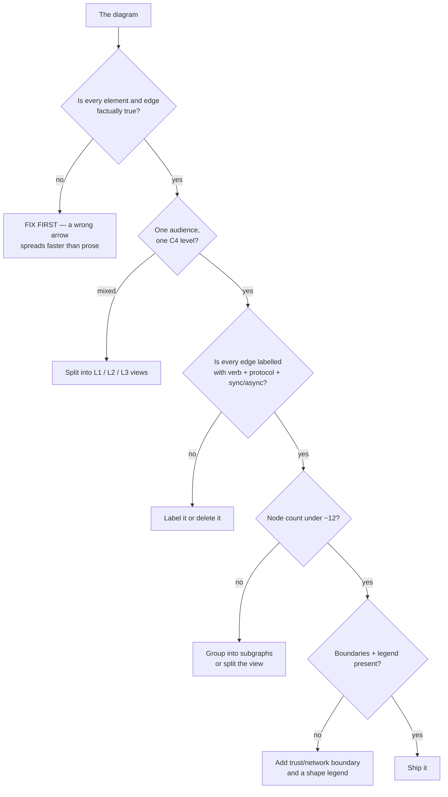
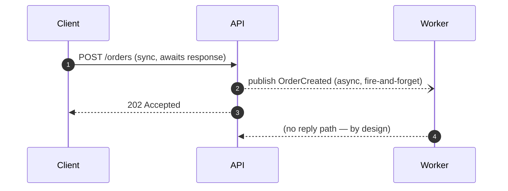

# Diagram Review Coach

A diagram is an argument. This skill reviews it the way a staff engineer would — **correctness before
cosmetics** — handing back a rubric plus a redraw, per [`AGENTS.md`](../../../AGENTS.md).

## When to use

- The learner drew an architecture, flow, or sequence diagram and wants honest feedback.
- Reviewers keep asking "wait, is that call synchronous?" — the picture is ambiguous.
- A diagram has grown to 30 boxes and nobody can find the point in it.
- Before an architecture review, a design doc, or a README merge.

## First principles: what a diagram must survive



The order matters. Reviewing shapes before facts is how a beautiful, wrong diagram gets merged and then
quoted for two years. Ask "is this true?" before "is this pretty?".

## The review rubric

| # | Check | Failure smell | Fix |
| --- | --- | --- | --- |
| 1 | **Correctness** | a component or dependency that doesn't exist; an arrow drawn the wrong way | verify against code/config, then redraw |
| 2 | **Direction of the arrow** | arrow shows *data* flow but reader assumes *call* flow | pick one convention and state it in the legend |
| 3 | **C4 level mixing** | a person, a container, and a Java class in one view | one level per view (L1 context / L2 container / L3 component) |
| 4 | **Unlabelled edges** | bare lines between boxes | verb + protocol, e.g. `reads orders (SQL/TCP)` |
| 5 | **Sync vs async** | every edge is the same solid arrow | solid = sync/request-response, dashed/open = async/event |
| 6 | **Node overload** | 25+ nodes, crossing edges everywhere | ≤ ~12 per view; group into `subgraph`s or split |
| 7 | **Missing boundaries** | no trust, network, or process boundary shown | draw the boundary that matters for *this* question |
| 8 | **No legend** | reader must guess what a cylinder means | legend for shapes, line styles, and colours |
| 9 | **Inconsistent shapes** | datastore drawn as a rectangle in one place, cylinder in another | one shape per element kind, everywhere |
| 10 | **Missing failure/edge paths** | only the happy path is drawn | show at least the retry, timeout, or error route |
| 11 | **Colour carrying meaning alone** | red vs green with no labels | encode with shape/label too — [accessibility-audit](../accessibility-audit/SKILL.md) |
| 12 | **No title or scope** | "diagram.png" with no question | title = the question the view answers |

Score each 0 (broken) / 1 (partial) / 2 (solid). Anything failing checks 1–3 blocks the review; 4–12 are
improvements. **Trade-off to teach:** completeness and clarity are in direct tension — a diagram that shows
every component shows nothing. The cure is more *views*, not more boxes.

## Sync vs async, drawn unambiguously



`->>` solid = synchronous call · `--)` open dashed = asynchronous message · `-->>` dashed = the return.
In `flowchart`, use `-->` for sync and `-.->` for async, and say so in the legend — Mermaid has no built-in
meaning for line style, so the legend is what makes it true.

## Procedure

1. **Ask for the diagram's job**: one sentence, plus the intended audience and where it will be read.
   A diagram with no stated question cannot be reviewed — only admired.
2. **Verify the facts** against the code, config, or the learner's description. Flag every element or edge
   you cannot justify (`AGENTS.md` §2), and say "unverified" rather than assuming.
3. **Detect the level**: classify each node as person / external system / container / component / class.
   Two or more categories mixed = a level-mixing finding; propose the split.
4. **Audit every edge**: does it have a verb, a protocol, a direction, and a sync/async style? Unlabelled
   edges get labelled or deleted — there is no third option.
5. **Count the nodes and crossings.** Over ~12 nodes, or edges crossing more than twice, means group into
   subgraphs or split the view. Consider changing layout engine first —
   [diagram-as-code-coach](../diagram-as-code-coach/SKILL.md).
6. **Look for what's missing**: trust/network boundaries, the datastore that's implied but not drawn, the
   error/retry path, the queue that's actually there.
7. **Check legend, shape consistency, title, and colour-independence.**
8. **Score the rubric**, then **redraw the top-three fixes** as real Mermaid source, so the learner sees the
   improved version rather than a list of complaints.
9. **Give one keep, one change, one experiment** — praise what worked, name the highest-leverage change,
   and suggest one thing to try next time. Then close with the **Learning Footer**.

## Output shape

```
Diagram: <title> · Job: <the question it answers> · Audience: <who>
Detected type: <flowchart | sequence | C4 | ER | state>   Level: <L1 | L2 | L3 | MIXED>

Rubric (0 broken / 1 partial / 2 solid)
  1 Correctness .......... <n>   <finding>
  2 Arrow direction ...... <n>   <finding>
  3 C4 level mixing ...... <n>   <finding>
  4 Edge labels .......... <n>   <finding>
  5 Sync vs async ........ <n>   <finding>
  6 Node count (<n> nodes) <n>   <finding>
  7 Boundaries ........... <n>   <finding>
  8 Legend ............... <n>   <finding>
  9-12 Shapes / failure paths / colour / title ... <n each>
  TOTAL: <x>/24     Blocking issues: <checks 1-3 failing>

Unverified claims: <elements or edges I could not justify>

Redraw (top 3 fixes applied):
  ```mermaid
  <corrected source, with legend>
  ```

Keep: <what already worked>
Change: <the single highest-leverage fix>
Experiment: <one thing to try in the next diagram>
Learning Footer
```

## Tips

- Review **facts first, aesthetics last** — a pretty diagram that lies is the most expensive kind.
- "Is that arrow a call or is it data?" is the most common real-review question; answer it in the legend
  before anyone has to ask.
- Node overload is nearly always a *level* problem in disguise: two audiences got merged into one picture.
- Every diagram needs a title that is a question; if you can't write one, the diagram has no scope.
- Prefer several small correct views to one heroic view — split by C4 level, per
  [architecture-diagram](../architecture-diagram/SKILL.md).
- Say what you cannot verify instead of quietly redrawing it as fact.
- Give feedback the way [code-review-coach](../code-review-coach/SKILL.md) and
  [feedback-giver](../feedback-giver/SKILL.md) do: specific, kind, and about the artifact, not the person.
- Pair with [visual-explainer](../visual-explainer/SKILL.md) when the diagram *type* is wrong,
  [data-viz-coach](../data-viz-coach/SKILL.md) when the content is really data,
  [concept-map-generator](../concept-map-generator/SKILL.md) when it's knowledge rather than a system, and
  [threat-model](../threat-model/SKILL.md) when the missing thing is a trust boundary.
  End with the **Learning Footer** (`AGENTS.md`).
