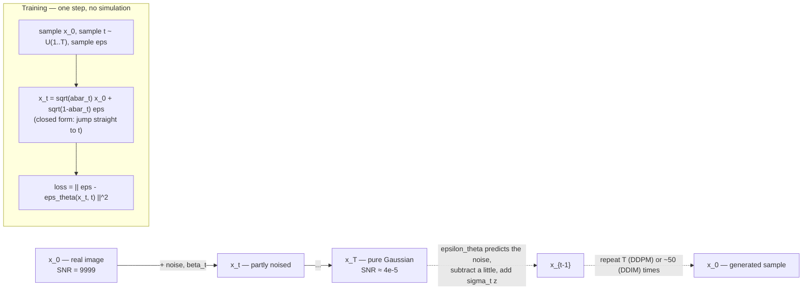

# Diffusion Models Explainer

A diffusion model is trained on one absurdly simple task — *look at a noisy image and guess which noise was
added* — and from that single objective you get image generation. This skill derives why, with the equations
traced numerically rather than asserted, following the teach-from-first-principles rule in
[`AGENTS.md`](../../../AGENTS.md).

## When to use

- You can run Stable Diffusion but cannot say what the sampler is doing, or why 30 steps works when training
  used 1000.
- You need to reason about a knob — steps, scheduler, CFG scale — instead of copying someone's settings.
- You are choosing between DDPM, DDIM, and the newer solvers and want the actual trade-off.
- You are studying for an ML interview or a course and need the derivation, not an analogy.
- You want to know why "latent" diffusion made the whole thing affordable.
- **Don't use it for** prompt-writing craft, model fine-tuning recipes (LoRA/DreamBooth), or picking a
  checkpoint — this is the mathematics. And don't expect training advice for a production image model;
  start with [pytorch-training-loop-lab](../pytorch-training-loop-lab/SKILL.md).

## First principles: destroy structure slowly, then learn to undo one step

**Primary sources.** The modern formulation is Ho, Jain & Abbeel, *"Denoising Diffusion Probabilistic
Models"*, **NeurIPS 2020 (arXiv:2006.11239, 19 June 2020)**, building on Sohl-Dickstein et al., *"Deep
Unsupervised Learning using Nonequilibrium Thermodynamics"* (**ICML 2015, arXiv:1503.03585**). Deterministic
few-step sampling is Song, Meng & Ermon, *"Denoising Diffusion Implicit Models"* (**ICLR 2021,
arXiv:2010.02502, 6 October 2020**). The unifying continuous view is Song, Sohl-Dickstein, Kingma, Kumar,
Ermon & Poole, *"Score-Based Generative Modeling through Stochastic Differential Equations"* (**ICLR 2021,
arXiv:2011.13456**), extending Song & Ermon (**NeurIPS 2019, arXiv:1907.05600**). Guidance without a
classifier is Ho & Salimans, *"Classifier-Free Diffusion Guidance"* (**arXiv:2207.12598, 26 July 2022**;
NeurIPS 2021 workshop). Latent diffusion — the basis of Stable Diffusion — is Rombach, Blattmann, Lorenz,
Esser & Ommer, *"High-Resolution Image Synthesis with Latent Diffusion Models"* (**CVPR 2022,
arXiv:2112.10752**).

### The forward process, and the trick that makes training cheap

Define a **forward (noising) process** that adds a little Gaussian noise at each of $T$ steps, with a
variance schedule $\beta_1 \dots \beta_T$:

$$q(\mathbf{x}_t \mid \mathbf{x}_{t-1}) = \mathcal{N}\!\left(\mathbf{x}_t;\ \sqrt{1-\beta_t}\,\mathbf{x}_{t-1},\ \beta_t \mathbf{I}\right)$$

Simulating that step-by-step to train would be hopeless. But Gaussians compose, so with
$\alpha_t = 1 - \beta_t$ and $\bar\alpha_t = \prod_{s=1}^{t}\alpha_s$ there is a **closed form that jumps to
any $t$ in one shot**:

$$q(\mathbf{x}_t \mid \mathbf{x}_0) = \mathcal{N}\!\left(\mathbf{x}_t;\ \sqrt{\bar\alpha_t}\,\mathbf{x}_0,\ (1-\bar\alpha_t)\mathbf{I}\right) \quad\Longleftrightarrow\quad \boxed{\ \mathbf{x}_t = \sqrt{\bar\alpha_t}\,\mathbf{x}_0 + \sqrt{1-\bar\alpha_t}\,\boldsymbol{\epsilon}\ }, \quad \boldsymbol{\epsilon}\sim\mathcal{N}(0,\mathbf{I})$$

Read the boxed equation as a **mixing coefficient pair**: $\sqrt{\bar\alpha_t}$ is how much signal is left,
$\sqrt{1-\bar\alpha_t}$ is how much noise was mixed in, and the two variances sum to 1, so $\mathbf{x}_t$
stays unit-scale throughout. Their ratio is the **signal-to-noise ratio**:

$$\mathrm{SNR}(t) = \frac{\bar\alpha_t}{1-\bar\alpha_t}$$

### The objective: predict the noise

The reverse of a Gaussian diffusion is itself approximately Gaussian when the steps are small, so we learn
$p_\theta(\mathbf{x}_{t-1}\mid\mathbf{x}_t)$. Ho et al. reparameterise the variational bound into a
**stunningly simple regression loss** — guess the noise that was added:

$$L_{\text{simple}} = \mathbb{E}_{t,\ \mathbf{x}_0,\ \boldsymbol{\epsilon}}\left[\left\lVert \boldsymbol{\epsilon} - \boldsymbol{\epsilon}_\theta\!\left(\sqrt{\bar\alpha_t}\mathbf{x}_0 + \sqrt{1-\bar\alpha_t}\boldsymbol{\epsilon},\ t\right)\right\rVert^2\right]$$

Why predict $\boldsymbol{\epsilon}$ and not $\mathbf{x}_0$? Because the two are algebraically equivalent —

$$\hat{\mathbf{x}}_0 = \frac{\mathbf{x}_t - \sqrt{1-\bar\alpha_t}\,\boldsymbol{\epsilon}_\theta(\mathbf{x}_t,t)}{\sqrt{\bar\alpha_t}}$$

— but $\boldsymbol{\epsilon}$-prediction is a **unit-variance target at every $t$**, so one network with one
loss weighting trains stably across the whole noise range. Predicting $\mathbf{x}_0$ makes the effective loss
weight explode as $\bar\alpha_t \to 0$.

### The score connection

$\boldsymbol{\epsilon}$-prediction *is* score estimation up to a scale factor. For the Gaussian above,

$$\nabla_{\mathbf{x}_t}\log q(\mathbf{x}_t\mid\mathbf{x}_0) = -\frac{\mathbf{x}_t - \sqrt{\bar\alpha_t}\mathbf{x}_0}{1-\bar\alpha_t} = -\frac{\boldsymbol{\epsilon}}{\sqrt{1-\bar\alpha_t}} \quad\Longrightarrow\quad \mathbf{s}_\theta(\mathbf{x}_t,t) \approx -\frac{\boldsymbol{\epsilon}_\theta(\mathbf{x}_t,t)}{\sqrt{1-\bar\alpha_t}}$$

So "denoiser", "noise predictor", and "score model" are three names for the same network, which is why the
SDE/ODE literature and the DDPM literature describe the same object.



*Figure — forward (solid) destroys structure with a known closed form; reverse (dashed) is learned one step
at a time. Training never simulates the chain, which is why the whole approach is tractable.*

| Sampler | Update | Stochastic? | Steps in practice | Property |
| --- | --- | --- | --- | --- |
| **DDPM** (ancestral) | $\mathbf{x}_{t-1} = \frac{1}{\sqrt{\alpha_t}}\left(\mathbf{x}_t - \frac{\beta_t}{\sqrt{1-\bar\alpha_t}}\boldsymbol{\epsilon}_\theta\right) + \sigma_t \mathbf{z}$ | yes ($\mathbf{z}\sim\mathcal{N}$) | ~1000 | high diversity; must walk every step |
| **DDIM** ($\eta = 0$) | $\mathbf{x}_{t-1} = \sqrt{\bar\alpha_{t-1}}\hat{\mathbf{x}}_0 + \sqrt{1-\bar\alpha_{t-1}}\,\boldsymbol{\epsilon}_\theta$ | **no** | 20–50 | deterministic, seed↔image is a bijection, skippable steps, invertible |
| DDIM, $0<\eta<1$ | above $+\ \sigma_t\mathbf{z}$ with $\sigma_t=\eta\tilde\beta_t^{1/2}$ | partly | 20–100 | dial between the two |
| DPM-Solver / higher-order ODE solvers | numerical ODE integration of the same field | no | 10–20 | fewer steps, same model |

The DDIM insight is worth stating plainly: because the training objective only ever conditions on
$\bar\alpha_t$, **any** non-Markovian process with the same marginals is a valid sampler. Setting the
injected noise $\sigma_t = 0$ turns the SDE into a **probability-flow ODE**, and an ODE can be integrated
with big strides. You are not retraining anything — you are choosing a different numerical integrator for a
field the network already learned.

### Guidance and latent space

**Classifier-free guidance** trains one network on both conditional and unconditional inputs (dropping the
condition ~10% of the time) and then extrapolates *away* from the unconditional prediction at sample time:

$$\tilde{\boldsymbol{\epsilon}}_\theta = (1+w)\,\boldsymbol{\epsilon}_\theta(\mathbf{x}_t, c) - w\,\boldsymbol{\epsilon}_\theta(\mathbf{x}_t, \varnothing) \;\equiv\; \boldsymbol{\epsilon}_\theta(\mathbf{x}_t,\varnothing) + s\big(\boldsymbol{\epsilon}_\theta(\mathbf{x}_t,c) - \boldsymbol{\epsilon}_\theta(\mathbf{x}_t,\varnothing)\big), \quad s = 1+w$$

⚠ **The two conventions differ by one.** Ho & Salimans' $w$ and the "CFG scale" $s$ in most tooling satisfy
$s = w + 1$, so $s = 1$ means *no guidance* and $w = 0$ means the same thing. Costs: two forward passes per
step, and prompt adherence bought at the price of diversity — push $s$ high and you get saturated,
over-committed, low-variety images.

**Latent diffusion** runs all of the above not on pixels but on $\mathbf{z} = E(\mathbf{x})$ from a
pretrained autoencoder, decoding with $D(\mathbf{z})$ at the end. At downsampling factor $f = 8$, a
$512\times512\times3$ image becomes a $64\times64\times4$ latent: $786{,}432 \to 16{,}384$ values, a **48×**
reduction in what the U-Net must touch at every one of the sampling steps. That single change is what moved
diffusion from a datacentre to a consumer GPU.

## Procedure

1. **Fix your notation before anything else**: $\beta_t$, $\alpha_t = 1-\beta_t$,
   $\bar\alpha_t = \prod \alpha_s$. Most confusion in this area is $\alpha$ versus $\bar\alpha$.
2. **Verify the closed form numerically** — simulate the step-by-step chain and check that
   $\mathrm{corr}(\mathbf{x}_t, \mathbf{x}_0) = \sqrt{\bar\alpha_t}$ and $\mathrm{Var}(\mathbf{x}_t) = 1$.
   Do not take the algebra on trust (worked example below).
3. **Plot the schedule.** Compute $\bar\alpha_t$ and $\mathrm{SNR}(t)$ across $t$. The schedule *is* the
   curriculum: it decides how much of training is spent on nearly-clean versus nearly-pure-noise inputs.
4. **Write the training step in five lines** — sample $\mathbf{x}_0$, sample $t$, sample
   $\boldsymbol{\epsilon}$, form $\mathbf{x}_t$ by the closed form, regress $\boldsymbol{\epsilon}$. Seeing
   how small it is dissolves most of the mystery.
5. **Implement DDPM ancestral sampling** and confirm that dropping the $\sigma_t\mathbf{z}$ term is what
   turns it into DDIM. One line separates the two families.
6. **Sub-sample the timestep grid** ($1000 \to 50$) with DDIM and observe that quality degrades gracefully —
   this is step-count intuition earned rather than borrowed.
7. **Sweep the CFG scale** at $s \in \{1, 3, 7, 15\}$ and record adherence versus diversity. State which
   convention your library uses before comparing to any paper.
8. **Situate latent diffusion**: encode, diffuse in latent space, decode. Compute the compression ratio for
   your resolution so the cost argument is concrete.
9. **Explain it back with a diagram and one traced number.** If you cannot state what $\bar\alpha_{500}$ is
   and what it means, you have read rather than understood. Close with the **Learning Footer**.

## Output shape

```
Notation: beta_t=<schedule, range>  alpha_t=1-beta_t  abar_t=prod(alpha)  T=<...>
Forward:  x_t = sqrt(abar_t) x_0 + sqrt(1-abar_t) eps            [closed form verified: corr=<..> vs sqrt(abar)=<..>]
Schedule: abar_1=<..> abar_{T/2}=<..> abar_T=<..>   SNR(1)=<..> SNR(T/2)=<..> SNR(T)=<..>
Objective: L = E || eps - eps_theta(x_t, t) ||^2     why eps not x0: <unit-variance target across all t>
Score link: s_theta = -eps_theta / sqrt(1-abar_t)
Sampler: <DDPM | DDIM eta=0 | DPM-Solver>  steps=<..>  sigma_t=<beta_t | beta-tilde_t | 0>
   x_hat_0 = (x_t - sqrt(1-abar_t) eps_theta)/sqrt(abar_t)
Guidance: convention=<s = w+1>  scale used=<s>  passes/step=<2>  effect: adherence <up> diversity <down>
Latent: encoder f=<8>  <HxWx3> -> <hxwxc>  compression=<..>x  decode at the end
Trade-offs: steps vs quality=<..> · stochastic vs deterministic=<..> · guidance vs diversity=<..>
Verified numerically: <which claims you actually computed>
Next: <transformer-architecture-explainer | pytorch-training-loop-lab | sampling-methods-coach>
Learning Footer
```

## Worked example — trace the schedule, then trace the two samplers

DDPM's default is a **linear** schedule, $\beta$ from $10^{-4}$ to $0.02$ over $T = 1000$. Everything below
is computed, not recalled.

```python
# pip install numpy
import numpy as np

T = 1000
betas  = np.linspace(1e-4, 0.02, T)          # DDPM linear schedule
alphas = 1.0 - betas
abar   = np.cumprod(alphas)                  # abar_t = prod_{s<=t} alpha_s
snr    = abar / (1 - abar)

for t in (1, 500, 1000):
    i = t - 1
    print(f"t={t:>4}  abar={abar[i]:.6g}  sqrt(abar)={np.sqrt(abar[i]):.4f}  SNR={snr[i]:.6g}")

# --- claim 1: the closed form really equals the step-by-step chain ---
rng = np.random.default_rng(0)
x0 = rng.normal(size=200_000)
x  = x0.copy()
for t in range(200):                          # simulate 200 actual forward steps
    x = np.sqrt(alphas[t]) * x + np.sqrt(betas[t]) * rng.normal(size=x.shape)
print(f"empirical corr(x_200, x_0) = {np.corrcoef(x, x0)[0,1]:.4f}   "
      f"predicted sqrt(abar_200) = {np.sqrt(abar[199]):.4f}")
print(f"empirical var(x_200)      = {x.var():.4f}   predicted abar + (1-abar) = 1.0000")

# --- claim 2: DDIM with sigma=0 preserves the correct marginal ---
t = 500
a_t, a_prev = abar[t], abar[t-1]
x0s = rng.normal(size=100_000); eps = rng.normal(size=100_000)
xt     = np.sqrt(a_t) * x0s + np.sqrt(1 - a_t) * eps        # forward, closed form
xhat0  = (xt - np.sqrt(1 - a_t) * eps) / np.sqrt(a_t)       # exact eps => exact x0
x_prev = np.sqrt(a_prev) * xhat0 + np.sqrt(1 - a_prev) * eps  # DDIM update, eta = 0
print("x_hat_0 recovers x_0 exactly:", np.allclose(xhat0, x0s))
print(f"var(x_499) after DDIM step = {x_prev.var():.4f}  (must be ~1.0)")

# --- claim 3: the two CFG conventions are the same formula ---
w, e_c, e_u = 2.5, 0.4, 0.1
print("(1+w)e_c - w e_u =", (1 + w) * e_c - w * e_u,
      " | e_u + s(e_c-e_u), s=w+1 =", e_u + (w + 1) * (e_c - e_u))

# --- posterior variance: the two sigma_t choices bracket each other ---
abar_prev = np.concatenate([[1.0], abar[:-1]])
beta_tilde = betas * (1 - abar_prev) / (1 - abar)
print(f"t=1000: beta={betas[-1]:.6f} beta_tilde={beta_tilde[-1]:.6f}   "
      f"t=500: beta={betas[499]:.6f} beta_tilde={beta_tilde[499]:.6f}")
```

Traced output (verified by running this exact script):

```
t=   1  abar=0.9999  sqrt(abar)=0.9999  SNR=9999
t= 500  abar=0.0785872  sqrt(abar)=0.2803  SNR=0.0852899
t=1000  abar=4.03583e-05  sqrt(abar)=0.0064  SNR=4.03599e-05
empirical corr(x_200, x_0) = 0.8112   predicted sqrt(abar_200) = 0.8118
empirical var(x_200)      = 1.0017   predicted abar + (1-abar) = 1.0000
x_hat_0 recovers x_0 exactly: True
var(x_499) after DDIM step = 0.9993  (must be ~1.0)
(1+w)e_c - w e_u = 1.1500000000000001  | e_u + s(e_c-e_u), s=w+1 = 1.1500000000000004
t=1000: beta=0.020000 beta_tilde=0.020000   t=500: beta=0.010040 beta_tilde=0.010031
```

Now read the numbers, because each one settles a question people usually answer with hand-waving:

- **$\bar\alpha_{1000} = 4.0\times10^{-5}$, so $\sqrt{\bar\alpha_{1000}} = 0.0064$.** Only 0.6% of the
  original signal amplitude survives at $t=T$; $\mathbf{x}_T$ is Gaussian noise for every practical purpose,
  which is exactly what licenses sampling to *start* from $\mathcal{N}(0,\mathbf{I})$. It is not *exactly*
  zero, which is why some schedules (zero-terminal-SNR variants) explicitly force $\bar\alpha_T = 0$.
- **The closed form is right.** Simulating 200 real forward steps gives $\mathrm{corr} = 0.8112$ against a
  predicted $\sqrt{\bar\alpha_{200}} = 0.8118$ (0.0006 apart, Monte-Carlo error at $n = 2\times10^5$), and
  variance 1.0017 against a predicted 1.0. The one-shot jump is not an approximation — it is an identity, and
  it is why training is a five-line loop instead of a 1000-step simulation.
- **SNR spans nine orders of magnitude**, from 9999 at $t=1$ to $4\times10^{-5}$ at $t=T$, and it falls off a
  cliff in the middle: at $t = 500$ the SNR is already **0.085**, meaning noise dominates signal by 12:1
  barely halfway through. The linear schedule therefore spends most of its steps in the near-noise regime —
  precisely the criticism that motivated the **cosine** schedule (Nichol & Dhariwal, *"Improved Denoising
  Diffusion Probabilistic Models"*, **arXiv:2102.09672, 18 February 2021**), which holds more of the budget
  at usable SNR.
- **DDIM's determinism costs nothing distributionally.** Removing all injected noise still lands
  $\mathbf{x}_{499}$ at unit variance (0.9993, sampling error). That is the licence to skip steps: the update
  is a valid transport along the same marginals, so a coarse timestep grid is an integration-accuracy
  question, not a correctness question.
- **Both CFG formulas print 1.15.** They are the same operation written twice; the only real hazard is
  reporting an $s$ where a paper meant $w$, which is an off-by-one that looks like a reproducibility failure.
- **$\tilde\beta_t \approx \beta_t$ throughout** — 0.020000 vs 0.020000 at $t=1000$ (they agree to six
  decimals) and 0.010031 vs 0.010040 at $t=500$ — which is why Ho et al. report that either choice of
  $\sigma_t$ works in practice. Reassuring, and now *verified* rather than assumed.

## Tips

- **$\alpha_t$ versus $\bar\alpha_t$ is the number-one source of bugs and confusion.** The DDPM update uses
  both in the same line; if a sampler produces washed-out output, check that first.
- **The network is a denoiser, a noise predictor, and a score model simultaneously.** Holding all three names
  in view is what lets you read the DDPM, score-SDE, and flow-matching literatures as one subject.
- **Sampler choice is numerical integration, not retraining.** DDPM/DDIM/DPM-Solver integrate the same
  learned field with different accuracy-versus-cost profiles.
- **Guidance is extrapolation, so it must overshoot.** High CFG buys prompt adherence with saturation and
  collapsed diversity — sweep it and look, rather than adopting a folklore default.
- **Say which CFG convention you mean** ($s = w+1$) whenever you quote a number, or your results will not
  reproduce against a paper.
- **Latent diffusion's win is arithmetic**: 48× fewer values per U-Net call at $f = 8$, $512\times512$, paid
  for with an encoder/decoder that caps achievable fidelity — the autoencoder is a lossy floor.
- **Verify claims numerically before teaching them.** Every number above came from a run, which is what
  `AGENTS.md` §"Verify before you teach" asks for; the script is 30 lines and needs only NumPy.
- Related: [transformer-architecture-explainer](../transformer-architecture-explainer/SKILL.md) for the
  conditioning path, [pytorch-tensors-lab](../pytorch-tensors-lab/SKILL.md) and
  [pytorch-training-loop-lab](../pytorch-training-loop-lab/SKILL.md) to implement it,
  [sampling-methods-coach](../sampling-methods-coach/SKILL.md) and
  [bayesian-basics-coach](../bayesian-basics-coach/SKILL.md) for the probability,
  [math-for-programming-coach](../math-for-programming-coach/SKILL.md) and
  [latex-math-coach](../latex-math-coach/SKILL.md) for the notation, and
  [visual-explainer](../visual-explainer/SKILL.md) to draw the schedule.
  End with the **Learning Footer** (`AGENTS.md`).
