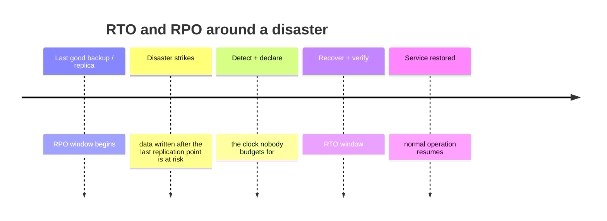

# Disaster Recovery Planner

Turn "we have backups" into a rehearsed, measured recovery capability — following the teaching
principles in [`AGENTS.md`](../../../AGENTS.md).

## When to use

- The business asks "what happens if the region/datacenter/database is gone?" and there's no written
  answer.
- Backups exist but have never been restored — the most common critical gap in real organizations.
- An audit, contract, or regulator requires a documented DR/BCP plan with defined objectives.
- A migration or re-platform is the moment to design DR in rather than bolt it on.
- Related: [capacity-planning-coach](../capacity-planning-coach/SKILL.md) (does the DR site have room?),
  [oncall-runbook-coach](../oncall-runbook-coach/SKILL.md) (the executable procedure),
  [slo-designer](../slo-designer/SKILL.md) (availability targets DR must sustain).

## First principles: two numbers drive every decision



- **RPO — Recovery Point Objective:** how much **data** you can afford to lose, measured in time
  (*"at most 15 minutes of transactions"*). RPO drives **backup frequency and replication mode**.
- **RTO — Recovery Time Objective:** how long you can afford to be **down** (*"back within 4 hours"*).
  RTO drives **architecture and automation**.

Both are **business decisions**, not engineering preferences. Ask the owner: what does one hour of
downtime cost — revenue, contractual penalty, safety, reputation? Then engineer to that number. And
remember that RTO starts at **detection and declaration**, not at the moment someone starts typing —
budget for both.

## The DR ladder

| Pattern | RTO | RPO | Standing cost | How it works | Fits |
| --- | --- | --- | --- | --- | --- |
| **Backup & restore** | Hours–days | Hours | Lowest (storage only) | Restore data + rebuild infra from IaC | Internal tools, dev, low-value data |
| **Pilot light** | 10s of minutes–hours | Minutes | Low | Core data replicated + minimal always-on core; compute scaled up on declare | Most business systems |
| **Warm standby** | Minutes | Seconds–minutes | Medium | Full but scaled-down stack always running; scale up + cut over | Revenue-critical services |
| **Multi-site active/active** | ~Zero (seconds) | ~Zero | Highest | All sites serve live traffic; failure = capacity loss, not outage | Payments, health, tier-0 |

Each rung roughly multiplies cost and operational complexity. **Choose per workload, not per company** —
a tier-0 payment path and an internal wiki do not deserve the same rung.

## Backups: 3-2-1 and the rules that make it real

| Rule | Meaning | Failure it prevents |
| --- | --- | --- |
| **3** copies | Production + 2 backups | Single media/host loss |
| **2** media/platforms | Different technology or provider | Correlated platform failure |
| **1** off-site | Different region/provider | Site-wide disaster |
| **+ immutable / WORM** | Cannot be altered or deleted for a retention period | **Ransomware** and malicious/accidental deletion |
| **+ separate credentials** | Backup account not reachable from prod credentials | An attacker with prod access deleting backups |
| **+ encrypted, keys escrowed** | Encryption at rest, keys recoverable independently | Losing the data *and* the ability to read it |
| **+ tested restores** | Scheduled restore drills, timed and verified | Discovering corruption during the actual disaster |

**An untested backup is a hypothesis.** Restore *time* is part of RTO — measure it, don't estimate it.

## Replication: synchronous vs asynchronous

| | **Synchronous** | **Asynchronous** |
| --- | --- | --- |
| RPO | Zero | Replication lag (seconds–minutes) |
| Write latency | Pays the round trip to the replica | Local commit speed |
| Distance | Short (latency-bound) | Any distance |
| Failure behaviour | Replica outage can stall writes | Writes continue; replica falls behind |
| Corruption/deletion | **Replicated instantly** — not a backup | Also replicated — still not a backup |

**Replication is not backup.** It faithfully copies your `DROP TABLE`. You need both: replication for
availability, point-in-time backups for corruption and malice.

## Procedure

1. **Inventory and tier the services.** For each: business impact per hour of downtime, data sensitivity,
   dependencies. Assign a tier (0–3) and the RTO/RPO the *business owner signs off on*.
2. **Map the dependency graph and its order.** Recovery order is the reverse of the failure cascade:
   identity/DNS → network → data stores → queues → core services → edge. A perfect app restore is useless
   if identity or DNS isn't up first. Include third parties — their DR is now your risk.
3. **Pick the rung of the ladder per tier** and justify it with the trade-off table. Write down what you
   are *choosing not to protect against* (accepted risk) — that honesty is the plan's most valuable line.
4. **Design backups** to the 3-2-1(+immutable) rules, with retention derived from both compliance and the
   realistic detection window for silent corruption (weeks, not hours).
5. **Choose replication mode** per data store from the RPO, and confirm the write-latency cost is
   acceptable to the application.
6. **Codify the environment.** DR that depends on hand-built infrastructure will not meet its RTO —
   infrastructure as code and immutable images are what make "rebuild in another region" a timed
   operation instead of an archaeology project.
7. **Write the failover runbook** as executable steps: who declares a disaster (name a role and a
   threshold), how to communicate (out-of-band — assume chat/email are down), each command, each
   verification, and the go/no-go gates.
8. **Plan failback explicitly.** Getting back is usually harder than getting out: reconcile data written
   at the DR site, re-sync, and cut back during a low-traffic window. Most untested plans die here.
9. **Handle DNS and traffic steering.** Pre-lower TTLs, prefer health-checked routing over manual DNS
   edits, and know your propagation reality. Verify computed RPO/RTO arithmetic and TTL windows with
   `#run` (`learningos_runcode`) rather than eyeballing them.
10. **Rehearse: game days.** Start as a tabletop, then a restore drill, then a real regional failover in
    a controlled window. Measure actual RTO/RPO against the target, log every gap, fix them, repeat at
    least annually (quarterly for tier 0).
11. **Review triggers.** Re-run the plan after any architecture change, new dependency, or incident.

## Output shape

```
Disaster recovery plan — <service>

Business objectives (signed off by <owner>, <date>):
  tier: <0-3>   RTO: <4h>   RPO: <15 min>   cost of 1h downtime: <$ / impact>

Scenarios covered: <region loss | AZ loss | data corruption | ransomware | provider outage | human error>
Explicitly NOT covered (accepted risk): <...>

Chosen pattern: <backup&restore | pilot light | warm standby | active/active>
  because: RTO <x> needs <automation level>; standing cost <$/mo> vs. loss avoided <$>

Data protection:
  backups: <frequency> · retention <n days> · 3-2-1: <copies/media/offsite> · immutable: <yes, n days>
  encryption + key escrow: <where>   backup account isolation: <how>
  replication: <sync|async> to <region> · measured lag: <s> · NOT a substitute for backups

Recovery order (dependencies first):
  1. identity/DNS  2. network  3. <datastore>  4. <queue>  5. <services>  6. edge/CDN

Failover runbook: <link> — declared by <role> when <threshold>; comms channel: <out-of-band>
Failback plan: <data reconciliation approach> during <window>
DNS/traffic: TTL <s> · health-checked failover: <yes/no>

Last test: <date> — type: <tabletop|restore drill|full failover>
  measured RTO <x> vs target <y>   measured RPO <x> vs target <y>
  gaps found: <...> -> owners + due dates
Next test: <date>   Next: <capacity-planning-coach | oncall-runbook-coach | slo-designer>
```

## Tips

- **A backup you have never restored is not a backup.** Schedule restores; time them; verify the data,
  not just the exit code.
- Replication copies mistakes at the speed of light. Keep point-in-time backups for corruption and
  ransomware, on credentials production cannot reach.
- RTO includes **detection and decision time**. Teams routinely blow their RTO in the first 40 minutes
  arguing about whether to declare.
- DNS TTL is the silent RTO killer — lower it *before* the disaster; you cannot lower it afterwards for
  clients already caching.
- Recover dependencies in order. Restoring the app before identity, DNS, or the database is a very
  expensive way to wait.
- Ransomware changes the shape of the problem: assume the attacker had prod credentials, and require
  immutable, separately-credentialed backups.
- Write the plan so a stressed on-call engineer who did not design it can execute it at 3 a.m.
- Route onward to [oncall-runbook-coach](../oncall-runbook-coach/SKILL.md) to make the procedure
  executable, [capacity-planning-coach](../capacity-planning-coach/SKILL.md) to size the DR site, or
  [slo-designer](../slo-designer/SKILL.md) to reconcile DR with availability targets.
  End with the **Learning Footer** (`AGENTS.md`).
