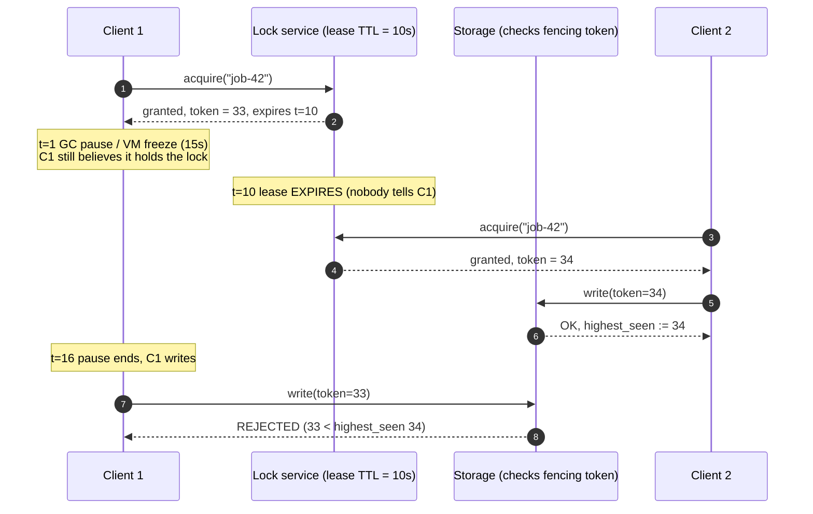

# Distributed Locking Coach

A distributed lock is a **lease with an unverifiable expiry** — the holder cannot know whether it still holds
it at the moment its write lands. This skill teaches that fact from first principles, then shows the only
construction that survives it, in the argue-from-sources spirit of [`AGENTS.md`](../../../AGENTS.md).

## When to use

- Two workers processed the same job / wrote the same file and you are reaching for a lock.
- Someone proposed Redlock, someone else linked the Kleppmann post, and the thread stalled.
- You have a `SET key val NX PX 30000` lock and want to know exactly what it does and does not guarantee.
- You need to decide between Redis, etcd, ZooKeeper, or **no lock at all** (a conditional write).
- **Don't use it for** in-process mutexes or single-node concurrency — that's
  [concurrency-coach](../concurrency-coach/SKILL.md); or for database row locking and isolation levels —
  that's [transaction-isolation-explainer](../transaction-isolation-explainer/SKILL.md).

## First principles: leases, pauses, and the gap you cannot close

A **lease** is a lock that expires without the holder's cooperation (Gray & Cheriton, *"Leases: An Efficient
Fault-Tolerant Mechanism for Distributed File Cache Consistency"*, SOSP 1989). Leases exist because a lock
holder can crash silently; expiry is what stops a dead process from blocking the world forever.

The cost of that expiry is the whole problem. Between "I checked that I hold the lock" and "my write reached
the resource" there is an interval the client does not control: a stop-the-world GC pause, a page fault, a
`SIGSTOP`, VM live-migration freeze, hypervisor steal, or plain network delay. Nothing bounds it.

$$T_{\text{valid}} = TTL - t_{\text{acquire}} - \Delta_{\text{clock drift}}
\qquad\text{safety needs}\qquad T_{\text{valid}} > t_{\text{pause}} + t_{\text{network}}$$

The left side is a number you chose. The right side is **unbounded**. So no TTL is large enough, in any lock
system — Redis, etcd, ZooKeeper, or a hand-rolled one. This is not a Redis bug; it is the shape of the problem.



*Fencing in one picture: the lock service does not stop the stale write; the **resource** does, because 33 < 34.*

### The two lock purposes — decide this before anything else

| Purpose | What a double-grant costs | Adequate mechanism | Over-engineering signal |
| --- | --- | --- | --- |
| **Efficiency** (don't do expensive work twice) | money/CPU, occasionally a duplicate email | single Redis instance, `SET NX PX`, no fencing | running 5 Redis masters to save one PDF render |
| **Correctness** (two holders corrupt state) | lost updates, corrupted file, double payment | **fencing tokens enforced by the resource**, or a conditional write / idempotency key instead of a lock | believing more lock replicas bought you safety |

Kleppmann's central claim (*"How to do distributed locking"*, martin.kleppmann.com, 8 February 2016) is exactly
this split: if you lock for efficiency, Redlock is unnecessary complexity; if you lock for correctness, Redlock
is **insufficient**, because (a) it depends on timing assumptions — bounded clock drift and bounded pauses —
and (b) it issues a *random* value per acquisition, not a monotonically increasing one, so its token cannot be
used for fencing.

antirez's reply (*"Is Redlock safe?"*, antirez.com/news/101, 9 February 2016) concedes the pause hazard is
generic — it applies to ZooKeeper leases too — and argues that Redlock's random value can serve as a
check-and-set value where the resource supports CAS, and that Redlock needs the clock *rate* to be roughly
correct rather than absolute time to be synchronized. **The unresolved core**: fencing needs an **order** ("is
this token newer than the last one I honoured?"), and a random 20-byte string has no order. That narrow point
is what the two sides actually disagree about; everything else is emphasis.

| Backing store | Ordering primitive usable as a fencing token | Consensus? | Honest verdict |
| --- | --- | --- | --- |
| Single Redis + `SET NX PX` | none (random value only) | no | fine for efficiency locks; never for correctness |
| Redlock (N=5 independent masters) | none (random value only) | **no** — a quorum over independent masters is not a replicated log | disputed; adds cost, not fencing |
| **etcd** (Raft) | `mod_revision` / `ETCD_LOCK_REV` — cluster-wide monotonic | yes | correctness locks, when paired with fencing |
| **ZooKeeper** (ZAB) | `zxid`, or the znode `version` on a CAS write | yes | the classic recipe (ephemeral sequential znodes + watch predecessor) |
| The resource itself (row `version`, object-store conditional write) | native | n/a | **often the right answer — no lock needed** |

⚠ Redlock's validity formula subtracts elapsed acquisition time *and* a drift allowance from the TTL — read
the current "Distributed Locks with Redis" page on redis.io for the exact constants before quoting them.

## Procedure

1. **Classify the lock.** Write one sentence: "If two clients hold this simultaneously, then ______."
   If the blank says *money wasted* → efficiency. If it says *data is wrong* → correctness. Stop guessing here.
2. **Try to delete the lock.** Can the operation be made idempotent (dedup key), or expressed as a conditional
   write (`UPDATE … SET v = v + 1 WHERE id = ? AND version = ?`)? If yes, that is strictly safer than any lock —
   see [idempotency-coach](../idempotency-coach/SKILL.md).
3. **For efficiency locks**, one Redis instance is enough — acquire with a unique owner value and release only
   if it is still yours (never a bare `DEL`):
   ```bash
   docker run --rm -d --name lockdemo -p 6379:6379 redis:7-alpine
   # NX = only if absent, PX = expiry in ms; the value identifies the owner
   redis-cli SET job:42 "$(uuidgen)" NX PX 30000
   ```
   ```lua
   -- release.lua — compare-and-delete; run: redis-cli --eval release.lua job:42 , "<my-uuid>"
   if redis.call("get", KEYS[1]) == ARGV[1] then
     return redis.call("del", KEYS[1])
   else
     return 0
   end
   ```
4. **For correctness locks, get a monotonic token** from a consensus store and **pass it to the resource**:
   ```bash
   docker run --rm -d --name etcdlab -p 2379:2379 quay.io/coreos/etcd:v3.5.13 \
     /usr/local/bin/etcd --advertise-client-urls http://0.0.0.0:2379 \
                         --listen-client-urls http://0.0.0.0:2379
   # etcdctl runs the command only while the lock is held, exporting the fencing token
   etcdctl --endpoints=127.0.0.1:2379 lock job-42 -- sh -c 'echo "key=$ETCD_LOCK_KEY rev=$ETCD_LOCK_REV"'
   ```
   Per the `etcdctl` README (etcd-io/etcd), the child command is launched with `ETCD_LOCK_KEY` and
   `ETCD_LOCK_REV` set. The revision is cluster-wide monotonically increasing — therefore a valid fence.
5. **Enforce the token at the resource.** The resource stores the highest token it has honoured and rejects
   anything lower:
   ```sql
   UPDATE resource
      SET payload = :new, fence = :token
    WHERE id = :id AND fence < :token;   -- 0 rows updated ⇒ you are a zombie; abort, do not retry blindly
   ```
   Without this line, the lock service is decoration.
6. **Set the TTL from measurements, not hope**: p99.9 of the critical section times a safety factor, plus a
   heartbeat that renews the lease. Renewal shrinks the window; it never removes it.
7. **Test the zombie path deliberately** — freeze the holder past its TTL and assert the rejection:
   ```bash
   kill -STOP <holder_pid>; sleep $((TTL + 5)); kill -CONT <holder_pid>   # the late write MUST be rejected
   ```
   If nothing rejects it, you do not have a correctness lock; you have an efficiency lock with extra latency.
8. **Choose the failure semantics explicitly**: when the lock service is unreachable — block, shed load, or
   proceed unlocked? The unexamined default ("retry forever") turns a lock outage into a full outage.
9. Summarise purpose, mechanism, token path and the tested zombie case, then close with the **Learning Footer**.

## Output shape

```
Lock: <name>   Protects: <resource + operation>
Purpose: <efficiency | correctness>   "If two hold it: <consequence>"
Can the lock be removed? <idempotency key | conditional write | no — why>
Mechanism: <single Redis SET NX PX | etcd Raft lock | ZooKeeper ephemeral sequential | resource CAS>
Fencing token: <ETCD_LOCK_REV | zxid | znode version | NONE>   Enforced at: <resource + exact predicate>
Lease: TTL=<ms> (p99.9 critical section = <ms>) · renewal=<every N ms | none> · clock assumption=<stated>
Zombie test: pause holder > TTL → late write <REJECTED | ACCEPTED (defect)>
Failure mode when lock service is down: <block | shed | proceed unlocked>   Blast radius: <...>
Redlock verdict (if raised): <not needed — efficiency | insufficient — no monotonic token>
Next: <idempotency-coach | consensus-explainer | transaction-isolation-explainer>
Learning Footer
```

## Worked example — recompute the fence, then check the SQL

A nightly job compacts `report-2026-06.parquet`. Two compactors overlapping would corrupt the file, so this is
a **correctness** lock. Measured critical section: p99.9 = 40 s. Chosen lease TTL = 120 s, renewed every 30 s.

Timeline (seconds since the job started):

| t | Client A | Client B | Lock state | `fence` stored at resource |
| --- | --- | --- | --- | --- |
| 0 | acquires, `ETCD_LOCK_REV = 1042` | — | held by A until t=120 | 1041 |
| 5 | starts compaction | — | held by A | 1041 |
| 8 | **STW GC pause begins** (the renewal thread freezes too) | — | held by A | 1041 |
| 120 | frozen | — | **lease expires** | 1041 |
| 121 | frozen | acquires, `rev = 1043` | held by B | 1041 |
| 130 | frozen | writes with token 1043 → accepted | held by B | **1043** |
| 154 | pause ends (146 s), writes with token 1042 | — | B holds | 1043 |

Trace A's late write, with `fence = 1043` already in the row and `:token = 1042`:

```sql
UPDATE report_files SET path = 'report-2026-06.parquet', fence = 1042
 WHERE id = 'report-2026-06' AND fence < 1042;
-- stored fence is 1043; the predicate 1043 < 1042 is FALSE ⇒ 0 rows updated ⇒ A aborts. Correct.
```

Now the near-miss people get wrong: the comparison must be **strict**. With `fence < :token`, a token that has
already been honoured can never be honoured twice, so a replayed or reused token is rejected. Relaxing it to
`fence <= :token` accepts any write carrying the *already-stored* token — which is precisely what a duplicated
or re-sent request from a zombie produces. The price of strictness is that B's own legitimate retry with token
1043 is also rejected (1043 < 1043 is false), so the holder's retry must be idempotent: treat "0 rows updated
and stored fence == my token" as *already applied*, and anything else as *abort*. Rejecting a duplicate is
always the cheaper mistake.

Counting the renewal honestly: renewal every 30 s could not save A, because the pause froze the renewal
thread as well. **Renewal shortens the window; only the fence closes it.** And if the storage layer cannot
check a token at all (a plain filesystem, or a bare object `PUT` with no conditional header), you cannot build
a correctness lock on it — change the storage design, or make the write idempotent by content address.

## Tips

- Answer "efficiency or correctness?" first; nearly every bad distributed-lock design skips that question.
- More lock replicas do not buy safety. Redlock's five masters address *availability of the lock service*, not
  the pause-then-write hazard — see [consensus-explainer](../consensus-explainer/SKILL.md) for what a real
  quorum does and does not give you.
- A token must be **ordered**, not merely unique. A UUID cannot fence; `mod_revision`, `zxid`, and a row
  `version` can.
- Never release a lock with a bare `DEL`/`delete`: after your own lease expired you would be deleting somebody
  else's lock. Compare-and-delete atomically (the Lua script above).
- Prefer designs that need no lock — a unique constraint, a dedup key, or a conditional write:
  [idempotency-coach](../idempotency-coach/SKILL.md) and
  [transaction-isolation-explainer](../transaction-isolation-explainer/SKILL.md).
- Locks held across network calls are latency bombs; pair with
  [retry-backoff-coach](../retry-backoff-coach/SKILL.md) and
  [circuit-breaker-coach](../circuit-breaker-coach/SKILL.md) so a slow dependency cannot pin the lease.
- For "exactly once" job execution, a queue with visibility timeouts plus idempotent consumers usually beats a
  lock — [message-queue-coach](../message-queue-coach/SKILL.md),
  [saga-pattern-coach](../saga-pattern-coach/SKILL.md).
- Practise offline with [redis-local-lab](../redis-local-lab/SKILL.md) and
  [postgres-local-lab](../postgres-local-lab/SKILL.md); cite the Kleppmann post and antirez's reply *by date*
  when you teach the debate, and end with the **Learning Footer** (`AGENTS.md`).
