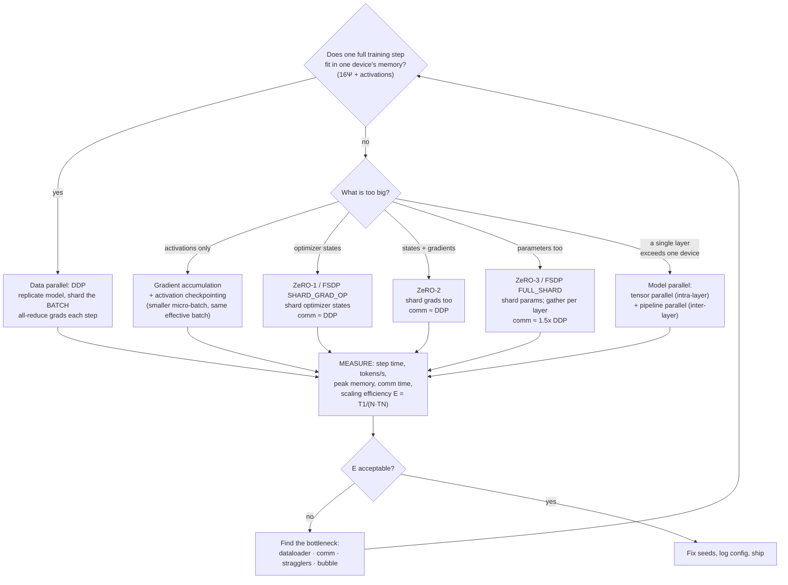

# Distributed Training Coach

Distributed training is an arithmetic problem wearing an infrastructure costume — following the
teach-the-why and source-discipline rules in [`AGENTS.md`](../../../AGENTS.md). Before adding a GPU, you
should be able to state the memory budget and the bytes moved per step.

## When to use

- Training fits on one device but takes too long, and the learner is about to add GPUs without measuring.
- Training does **not** fit: OOM at the first backward pass, and the question is DDP vs FSDP vs ZeRO.
- 8 GPUs delivered 5× throughput and nobody can decompose the missing 3×.
- The batch size changed when devices were added, and the learning rate did not.
- Validation loss differs between 1-GPU and 4-GPU runs — usually a missing `set_epoch` or a wrong reduction.
- **Don't use it for** single-GPU speedups (that is mixed precision, `torch.compile`, dataloader tuning —
  see [pytorch-dataloader-lab](../pytorch-dataloader-lab/SKILL.md)), for *inference* scaling (see
  [vllm-inference-lab](../vllm-inference-lab/SKILL.md)), or as a first response to a training bug — a run
  that is broken on one GPU is broken on sixty-four, so triage with
  [training-debug-coach](../training-debug-coach/SKILL.md) first.

## First principles: what fills the memory, what crosses the wire

**Memory, per device.** For mixed-precision training with Adam and $\Psi$ parameters, the ZeRO paper
(Rajbhandari et al., *ZeRO: Memory Optimizations Toward Training Trillion Parameter Models*, arXiv:1910.02054,
2019-10-04; SC20) accounts it as: fp16 parameters $2\Psi$ + fp16 gradients $2\Psi$ + optimizer states
$K\Psi$ with $K = 12$ (fp32 master weights $4\Psi$, momentum $4\Psi$, variance $4\Psi$):

$$M_{\text{model}} = (2 + 2 + K)\,\Psi = 16\Psi \text{ bytes}$$

A 1.5B-parameter model therefore needs ~24 GB **before a single activation exists** — which is why "it has
16 GB of VRAM, it's a 7B model in fp16, that's 14 GB, fine" is wrong by a factor of ~8. Activations are the
*other* term, and they scale with batch size and sequence length.

**Communication.** Plain data parallelism all-reduces the gradients every step. A bandwidth-optimal ring
all-reduce (reduce-scatter + all-gather; Patarasuk & Yuan, *Bandwidth optimal all-reduce algorithms*, JPDC
69(2), 2009) moves, per node,

$$V = 2\,\frac{N-1}{N}\,M \;\xrightarrow[N \gg 1]{}\; 2M$$

for a gradient buffer of $M$ bytes over $N$ workers. Concretely: 1.3B params in fp16 → $M = 2.6$ GB; at
$N=8$, $V = 2 \cdot \tfrac{7}{8} \cdot 2.6 = 4.55$ GB per step per node; over a 25 GB/s effective
interconnect that is **0.18 s of communication per step**, and if your step's compute is 0.20 s you have
just discovered why scaling stopped. PyTorch DDP hides much of this by bucketing gradients and overlapping
all-reduce with the backward pass (Li et al., *PyTorch Distributed*, VLDB 13(12), arXiv:2006.15704,
2020-06-28) — overlap is the whole trick.


*Caption: the branch point is always "what exactly does not fit" — sharding stage follows from that answer.*

| Strategy | Shards | Per-device memory | Comm vs DDP | Cost |
| --- | --- | --- | --- | --- |
| **DDP** (data parallel) | batch only | $16\Psi$ + activations | 1× | model must fit on one device |
| **ZeRO-1** / FSDP `SHARD_GRAD_OP`* | optimizer states | $4\Psi + 12\Psi/N$ | ≈1× | almost free; do this first |
| **ZeRO-2** | + gradients | $2\Psi + 14\Psi/N$ | ≈1× | free-ish; no param gather |
| **ZeRO-3** / FSDP `FULL_SHARD` | + parameters | $16\Psi/N$ | ~1.5× | params gathered/released per layer |
| **Tensor parallel** (Megatron-LM, Shoeybi et al., arXiv:1909.08053, 2019-09-17) | inside each layer | $\approx \Psi/T$ | high, every layer | needs fast intra-node links; keep $T \le$ one node |
| **Pipeline parallel** (GPipe, Huang et al., arXiv:1811.06965, 2018-11-16) | layers across stages | $\approx \Psi/P$ | low (activations at boundaries) | bubble: idle fraction $\frac{P-1}{M+P-1}$ for $M$ micro-batches |

\* FSDP sharding-strategy names and the newer `fully_shard` (FSDP2) API have changed across PyTorch
releases — **verify against the PyTorch version you have installed**, do not copy a blog from 2022.

**Effective batch size is the thing that actually changed.**

$$B_{\text{eff}} = b_{\text{per-device}} \times N_{\text{devices}} \times k_{\text{accum}}$$

Going from 1 to 8 GPUs at the same per-device batch multiplies $B_{\text{eff}}$ by 8, which changes the
optimisation problem. The standard remedy is the **linear scaling rule with warmup**: multiply the LR by the
same factor as the batch, ramping up over the first few epochs (Goyal et al., *Accurate, Large Minibatch
SGD*, arXiv:1706.02677, 2017-06-08). It is an empirical rule with a documented breakdown at very large
batches, not a law — verify on your own validation curve.

**Scaling efficiency** is the number to report: $E(N) = \dfrac{T_1}{N \cdot T_N}$. One GPU at 100 s/epoch and
four GPUs at 32 s/epoch is a speedup of $100/32 = 3.125$ and $E = 3.125/4 = \mathbf{78\%}$. The missing 22%
lives in exactly four places: communication, dataloading, stragglers, and (for pipelines) the bubble.

## Procedure

1. **Classify the problem in one sentence**: memory-bound (it does not fit) or throughput-bound (it fits but
   is slow). The entire decision tree hangs off this and people routinely answer it wrong.
2. **Compute the budget on paper before allocating anything.** $16\Psi$ bytes for states, plus activations
   $\approx$ batch × sequence × hidden × layers × dtype-bytes × a small constant. If paper says it will not
   fit, no flag will save you.
3. **Make the single-device run correct and fast first.** Mixed precision (`torch.autocast` +
   `GradScaler`), a dataloader that is not the bottleneck, and a *reproducible* loss curve. Scaling a broken
   run just makes it broken in parallel.
4. **Start with DDP, launched by `torchrun`** — never by hand-rolled `mp.spawn` unless you need to:

   ```bash
   torchrun --standalone --nproc_per_node=2 ddp_min.py                 # single node
   torchrun --nnodes=2 --node_rank=0 --nproc_per_node=8 \
            --rdzv_backend=c10d --rdzv_endpoint=host0:29500 train.py    # multi node
   ```
   `torchrun` sets `RANK`, `LOCAL_RANK`, `WORLD_SIZE`, `MASTER_ADDR`, `MASTER_PORT` for you. Backend:
   **NCCL** for NVIDIA GPUs, **Gloo** for CPU.
5. **Get the four DDP details right** — each has a distinct, silent failure mode:
   `DistributedSampler` (else every rank trains on the same data), `sampler.set_epoch(epoch)` (else the
   shuffle is identical every epoch), gradient *averaging* semantics (DDP averages; if you also divide the
   loss you have halved your LR), and rank-0-only logging/checkpointing (else 8 processes fight over one file).
6. **If you are memory-bound, climb the ladder in order:** micro-batch + gradient accumulation → activation
   checkpointing (Chen et al., arXiv:1604.06174, 2016-04-21: recompute activations to trade ~30% extra
   compute for a large memory win) → ZeRO-1/2 → ZeRO-3/FSDP `FULL_SHARD` → tensor/pipeline parallel. Stop at
   the first rung that fits; every rung above costs communication.
7. **Use `no_sync()` for accumulation.** Wrap the first $k-1$ micro-steps in `ddp.no_sync()` so gradients are
   all-reduced once per optimizer step instead of once per micro-batch — otherwise accumulation multiplies
   your communication bill by $k$ and buys nothing.
8. **Adjust the learning rate and warmup** to the new $B_{\text{eff}}$, then confirm the 1-device and
   $N$-device validation curves land in the same place. If they do not, you have a correctness bug, not a
   tuning problem.
9. **Measure, then attribute.** Record step time, tokens/s, peak memory (`torch.cuda.max_memory_allocated()`),
   and comm time (PyTorch profiler with `ProfilerActivity.CUDA`, or `TORCH_DISTRIBUTED_DEBUG=DETAIL`).
   Compute $E(N)$ for $N = 1,2,4,8$ and plot it. An unexplained efficiency number is not a result.
10. **Checkpoint and seed for restartability**: save on rank 0 (or use distributed checkpointing for FSDP,
    since each rank holds a shard), seed per-rank deterministically, and record the world size in the
    checkpoint — a run resumed at a different world size has a different effective batch. Close with the
    **Learning Footer**.

## Output shape

```
Model: <name> · Ψ=<params> · dtype=<bf16/fp16 + fp32 master>
Budget (paper): states 16Ψ = <..> GB · activations ≈ <..> GB · per-device VRAM = <..> GB
Bound: <memory | throughput>            Hardware: <N GPUs x M nodes, interconnect <..> GB/s>

Strategy: <DDP | FSDP FULL_SHARD | ZeRO-2 | TP=<t> x PP=<p> x DP=<d>>   why: <what did not fit>
Effective batch: <b_per_device> x <N> x <accum> = <B_eff>    LR: <base> -> <scaled> + warmup <steps>

| N GPUs | step time | tokens/s | peak mem | comm time | E = T1/(N·TN) |
|--------|-----------|----------|----------|-----------|---------------|
| 1      | <..>      | <..>     | <..>     | —         | 1.00          |
| 2      | <..>      | <..>     | <..>     | <..>      | <..>          |
| 4      | <..>      | <..>     | <..>     | <..>      | <..>          |
| 8      | <..>      | <..>     | <..>     | <..>      | <..>          |

Predicted comm/step: 2·(N−1)/N·M = <..> GB ÷ <..> GB/s = <..> s   measured: <..> s
Efficiency loss attributed to: comm <..>% · dataloader <..>% · stragglers <..>% · bubble <..>%
Correctness: DistributedSampler ✓ set_epoch ✓ rank-0-only IO ✓ 1-GPU vs N-GPU val curves match ✓
Checkpointing: <rank0 | distributed> · world_size recorded ✓ · resume tested ✓
Next: <training-debug-coach | pytorch-dataloader-lab | llm-quantization-lab>
Learning Footer
```

## Worked example — a correct DDP loop you can run on a laptop CPU, free

No GPU required: PyTorch's **Gloo** backend runs the same DDP code path on CPU, so every correctness lesson
below is reproducible for €0. `pip install torch`.

```python
# ddp_min.py
import os, torch, torch.nn as nn, torch.distributed as dist
from torch.nn.parallel import DistributedDataParallel as DDP
from torch.utils.data import TensorDataset, DataLoader, DistributedSampler

def main():
    cuda = torch.cuda.is_available()
    dist.init_process_group(backend="nccl" if cuda else "gloo")   # torchrun supplies the env vars
    rank, world = dist.get_rank(), dist.get_world_size()
    local_rank = int(os.environ["LOCAL_RANK"])
    device = torch.device(f"cuda:{local_rank}" if cuda else "cpu")
    if cuda:
        torch.cuda.set_device(local_rank)

    torch.manual_seed(0)                       # same init on every rank: DDP asserts this implicitly
    X = torch.randn(1024, 10)
    y = (X.sum(dim=1) > 0).long()
    ds = TensorDataset(X, y)
    sampler = DistributedSampler(ds, num_replicas=world, rank=rank, shuffle=True)
    dl = DataLoader(ds, batch_size=32, sampler=sampler)           # do NOT also pass shuffle=True

    model = nn.Sequential(nn.Linear(10, 32), nn.ReLU(), nn.Linear(32, 2)).to(device)
    ddp = DDP(model, device_ids=[local_rank] if cuda else None)   # device_ids MUST be None on CPU
    opt = torch.optim.SGD(ddp.parameters(), lr=0.1)
    lossf = nn.CrossEntropyLoss()

    for epoch in range(3):
        sampler.set_epoch(epoch)               # without this the shuffle is identical every epoch
        ddp.train()
        for xb, yb in dl:
            xb, yb = xb.to(device), yb.to(device)
            opt.zero_grad(set_to_none=True)
            loss = lossf(ddp(xb), yb)
            loss.backward()                    # gradient all-reduce fires here, bucketed + overlapped
            opt.step()
        stat = loss.detach().clone()
        dist.all_reduce(stat, op=dist.ReduceOp.SUM)   # SUM works on gloo AND nccl; AVG is nccl-only
        if rank == 0:
            print(f"epoch {epoch}  mean last-batch loss {stat.item() / world:.4f}  "
                  f"effective batch {32 * world}")
    dist.destroy_process_group()               # always tear down, or ranks hang at exit

if __name__ == "__main__":
    main()
```

```bash
torchrun --standalone --nproc_per_node=2 ddp_min.py
```

**Trace it.** With 1 024 samples and `world=2`, `DistributedSampler` gives each rank
$\lceil 1024/2 \rceil = 512$ samples, so at `batch_size=32` each rank runs **16 steps per epoch** and the
*effective* global batch is $32 \times 2 = 64$. That is the single most misunderstood line in the file: you
did not keep batch size 32, you doubled it — so an LR that was tuned at 32 is now, by the linear scaling
rule, roughly half of what it should be.

Four deliberate details, each a real bug in the wild:

- `device_ids=[local_rank] if cuda else None` — passing `device_ids` on CPU raises; passing `None` on GPU
  silently ruins placement.
- `DataLoader(..., sampler=sampler)` with **no** `shuffle=True`; PyTorch rejects both together, and people
  "fix" it by dropping the sampler, at which point all ranks train on identical batches.
- `dist.ReduceOp.SUM` then a manual divide, because `ReduceOp.AVG` is not available on every backend —
  writing it this way keeps the CPU (gloo) and GPU (nccl) paths identical.
- `dist.destroy_process_group()`; skip it and rank 1 can hang forever waiting on a collective at teardown.

Now measure instead of guessing, by running with 1 then 2 processes:

```bash
python -c "import time; print(time.time())"   # or just time the two runs
torchrun --standalone --nproc_per_node=1 ddp_min.py
torchrun --standalone --nproc_per_node=2 ddp_min.py
```

On this toy model you will very likely see $E(2) < 0.5$ — **and that is the lesson, not a failure**. The
model holds $(10{\times}32 + 32) + (32{\times}2 + 2) = 352 + 66 = \mathbf{418}$ parameters, so the
all-reduce payload is under a kilobyte while the per-step Python and collective overhead is not: you are
measuring latency, not bandwidth. Distributed training only pays when compute per step dwarfs communication
per step, which is exactly the inequality to check on paper before requisitioning eight GPUs.

## Tips

- **Compute before you allocate.** $16\Psi$ bytes and $2\frac{N-1}{N}M$ bytes take two minutes on paper and
  routinely change the plan.
- Efficiency below ~70% is a *diagnosis request*, not a verdict: attribute it to comm, dataloader,
  stragglers, or bubble before buying hardware.
- The most common DDP correctness bug is a forgotten `set_epoch` — training silently sees the same shuffle
  every epoch, and the loss curve looks merely "a bit worse".
- Adding devices changes $B_{\text{eff}}$, which changes optimisation. Scale the LR and warm up, then verify
  the multi-device validation curve matches the single-device one.
- Reach for gradient accumulation and activation checkpointing *before* sharding — they cost compute, not
  network, and they are one line each.
- Keep tensor parallelism inside a node (NVLink-class bandwidth) and use pipeline/data parallelism across
  nodes; a tensor-parallel group crossing a slow link is the classic way to make 8 GPUs slower than 4.
- Only rank 0 should log, print, and write checkpoints; FSDP needs distributed checkpointing because each
  rank holds only a shard.
- Related: [training-debug-coach](../training-debug-coach/SKILL.md) to fix the run before scaling it,
  [pytorch-training-loop-lab](../pytorch-training-loop-lab/SKILL.md) and
  [pytorch-dataloader-lab](../pytorch-dataloader-lab/SKILL.md) for the single-device foundation,
  [llm-quantization-lab](../llm-quantization-lab/SKILL.md) and
  [floating-point-numerics-coach](../floating-point-numerics-coach/SKILL.md) for precision trade-offs,
  [mpi-openmp-parallel-lab](../mpi-openmp-parallel-lab/SKILL.md) and
  [slurm-hpc-job-lab](../slurm-hpc-job-lab/SKILL.md) for the cluster side, and
  [ml-experiment-tracker](../ml-experiment-tracker/SKILL.md) to keep world size in the run record.
  End with the **Learning Footer** (`AGENTS.md`).
