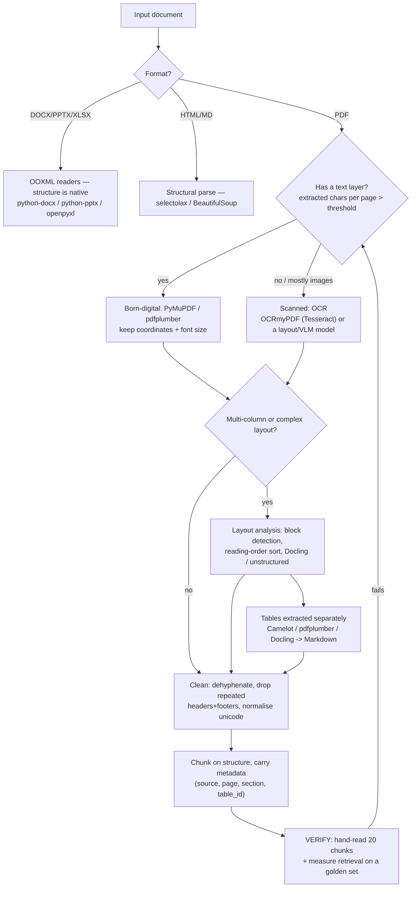

# Document Parsing Lab

Retrieval quality is capped by parse quality: **triage → extract → clean → chunk → verify**, built and
measured hands-on, following the verify-before-you-teach rule in [`AGENTS.md`](../../../AGENTS.md).
A great embedding model cannot rescue a chunk that ends mid-table.

## When to use

- Your RAG answers are wrong or empty and inspection shows mangled chunks: scrambled columns, tables
  flattened into number soup, page footers embedded in every chunk.
- You must decide OCR vs no OCR, or pick between `pypdf`, `pdfplumber`, PyMuPDF, Docling, and
  `unstructured` for a specific corpus.
- You need numbers *from tables* to survive into the index rather than being reduced to prose.
- **Don't use it for** choosing an embedding model, a vector store, or retrieval strategy — that is
  [embeddings-explainer](../embeddings-explainer/SKILL.md),
  [vector-db-selector](../vector-db-selector/SKILL.md), and [rag-designer](../rag-designer/SKILL.md).

## First principles: a PDF is a print job, not a document

PDF (ISO 32000-2) describes *where glyphs are painted*, not what a paragraph is. There is no guaranteed
reading order, no semantic table object, and no promise that a "space" exists between words — spacing is
often just a horizontal offset. Every text extractor is therefore a **heuristic that reconstructs
structure from geometry**. Office formats (OOXML, ECMA-376) are the opposite: they carry real structure,
so `python-docx` / `python-pptx` give you headings and table cells directly.



| Library | Best at | Real failure mode to expect |
| --- | --- | --- |
| `pypdf` | fast text pull, splitting/merging, metadata | weak layout handling; columns interleave; no table model |
| `pdfplumber` | word/char coordinates, ruled-line tables, debug images | slow on large corpora; borderless tables need tuned settings |
| PyMuPDF (`fitz`) | fastest text + image + block extraction, `get_text("dict")` | AGPL licensing for redistribution; blocks still need reading-order sort |
| Camelot / Tabula | dedicated table extraction (lattice vs stream) | lattice needs ruling lines; Tabula needs a JVM |
| Tesseract via OCRmyPDF | adds a searchable text layer to scans, page-parallel | accuracy collapses on low DPI, skew, handwriting, dense tables |
| `unstructured` | one API over many formats, element typing | heavy dependency tree; quality varies sharply by strategy |
| Docling (IBM, open source) | layout + table structure to Markdown/JSON for RAG | model download + GPU-friendly; slower than raw text pull |
| `python-docx` / `python-pptx` / `openpyxl` | native OOXML structure | ignores tracked changes, comments, and embedded objects unless asked |

**Chunking** is a retrieval decision, not a formatting one. Fixed-size character chunks are the fastest to
build and the easiest to get wrong; structure-aware chunks respect headings, list items, and table
boundaries so a chunk stays semantically self-contained.

| Strategy | Boundary | Good for | Cost / risk |
| --- | --- | --- | --- |
| Fixed token window + overlap | every N tokens, ~10–15 % overlap | uniform prose, quick baseline | cuts tables and sentences mid-way |
| Recursive character split | paragraph → sentence → word | mixed prose, cheap and robust | still ignores headings and tables |
| Structural / layout-aware | heading, section, table, list | contracts, manuals, specs | needs a layout parser (Docling, `unstructured`) |
| Table-as-unit | one table = one chunk (+ caption) | financial and spec documents | large tables exceed the context window; summarise or split by row group |
| Semantic (embedding-similarity) | topic shift between sentences | narrative text without headings | embedding cost per document; unstable boundaries |

## Procedure

1. **Triage the corpus.** Sample 20 documents and count extracted characters per page. Near zero means
   scanned — route to OCR; do **not** OCR a born-digital PDF, it is slower and *loses* accuracy.
2. **Extract with coordinates**, not just a string. Font size and block bounding boxes are what let you
   infer headings, detect columns, and sort reading order later.
3. **Fix reading order** for multi-column pages: sort blocks by column band, then by top coordinate.
   Naïve top-to-bottom sorting is the single most common cause of interleaved nonsense.
4. **Extract tables separately** and serialise them as Markdown or CSV with their caption; never let a
   table be swallowed by the surrounding paragraph flow.
5. **Clean**: drop headers/footers that repeat on >50 % of pages, join hyphenated line breaks, normalise
   Unicode (`NFKC`) to fix ligatures such as `fi`, and collapse whitespace.
6. **Chunk on structure**, attaching `source`, `page`, `section`, and `table_id` metadata — citations and
   filters both depend on it.
7. **Verify with two gates**: read 20 random chunks yourself, then measure retrieval recall on a golden
   question set — see [rag-evaluation-coach](../rag-evaluation-coach/SKILL.md). Close with the
   **Learning Footer**.

## Output shape

```
Corpus: <n docs> · <born-digital %> / <scanned %> · languages=<...> · tables=<none|simple|complex>
Route: text-layer=<PyMuPDF|pdfplumber> · ocr=<OCRmyPDF/Tesseract|none> · layout=<Docling|unstructured|custom>
Reading order: <naive|column-band sort>   Tables: <camelot lattice|pdfplumber|docling> -> <markdown|csv>
Cleaning: dehyphenate=<y/n> · repeated header/footer drop=<y/n> · unicode=<NFKC> · min-chunk-chars=<n>
Chunking: <fixed|recursive|structural|table-as-unit|semantic> · size=<n tokens> · overlap=<n>
Metadata per chunk: source, page, section, <extra>
Verification: hand-read <n> chunks · retrieval recall@k=<...> on <n> golden questions
Known failures: <what this pipeline still mangles>
Next: <rag-designer | rag-evaluation-coach | embeddings-explainer>
Learning Footer
```

## Worked example — triage, column-safe extraction, structural chunks

```python
# pip install pymupdf pdfplumber
import re, unicodedata, collections
import fitz  # PyMuPDF

MIN_CHARS_PER_PAGE = 100  # below this a page is effectively an image

def triage(path):
    doc = fitz.open(path)
    chars = [len(p.get_text("text").strip()) for p in doc]
    scanned = sum(c < MIN_CHARS_PER_PAGE for c in chars)
    return {"pages": len(chars), "scanned_pages": scanned,
            "route": "ocr" if scanned > len(chars) / 2 else "text-layer"}

def blocks_in_reading_order(page, n_cols=2):
    """Sort text blocks by column band, then vertically — fixes interleaved two-column text."""
    width = page.rect.width
    blocks = [b for b in page.get_text("blocks") if b[6] == 0]      # 0 = text, 1 = image
    def key(b):
        x0, y0 = b[0], b[1]
        band = min(int(x0 / (width / n_cols)), n_cols - 1)
        return (band, round(y0, 1))
    return [b[4] for b in sorted(blocks, key=key)]

def clean(text):
    text = unicodedata.normalize("NFKC", text)                       # fi -> fi, nbsp -> space
    text = re.sub(r"(\w)-\n(\w)", r"\1\2", text)                     # de-hyphenate line breaks
    return re.sub(r"[ \t]+", " ", text).strip()

def drop_repeated_lines(pages, threshold=0.5):
    """Remove running headers/footers appearing on more than `threshold` of pages."""
    edges = [l.strip() for p in pages for l in p.splitlines()[:2] + p.splitlines()[-2:]]
    noisy = {l for l, c in collections.Counter(edges).items() if l and c > threshold * len(pages)}
    return ["\n".join(l for l in p.splitlines() if l.strip() not in noisy) for p in pages]

HEADING = re.compile(r"^(?:\d+(?:\.\d+)*\s+)?[A-Z][A-Za-z0-9 ,\-]{3,80}$")

def structural_chunks(pages, source, max_chars=1200):
    chunks, buf, section = [], [], "preamble"
    def flush(page_no):
        if buf:
            chunks.append({"text": "\n".join(buf), "source": source,
                           "page": page_no, "section": section})
            buf.clear()
    for page_no, page_text in enumerate(pages, start=1):
        for line in page_text.splitlines():
            if HEADING.match(line.strip()) and len(line.split()) <= 12:
                flush(page_no); section = line.strip()               # heading starts a new chunk
            buf.append(line)
            if sum(len(x) for x in buf) > max_chars:
                flush(page_no)
        flush(page_no)
    return chunks

if __name__ == "__main__":
    path = "spec.pdf"
    print(triage(path))
    pages = [clean("\n".join(blocks_in_reading_order(p))) for p in fitz.open(path)]
    chunks = structural_chunks(drop_repeated_lines(pages), source=path)
    print(len(chunks), "chunks;", chunks[0]["section"], "|", chunks[0]["text"][:120])
```

Tables get their own pass — `pdfplumber`'s `extract_tables()` for ruled tables, or Camelot's `stream`
flavour for borderless ones — emitted as Markdown so the numbers stay aligned with their column headers
inside a single chunk.

## Tips

- **Never OCR a born-digital PDF.** Triage first; OCR is a fallback, not a default, and it degrades text
  that was already perfect.
- Two-column PDFs are the classic silent failure: extraction "works", the text is fluent, and every
  sentence is spliced from the wrong column. Always eyeball a two-column page.
- Hyphenation and ligature artefacts (`fi`, `fl`) break exact-match retrieval and tokenisation — `NFKC`
  normalise early, once.
- Repeated headers/footers inflate embedding similarity between unrelated chunks; strip them before
  indexing, not after.
- Chunk overlap is not free: it duplicates tokens in the index and can return three near-identical hits.
  Start ~10 % and measure.
- Keep `page` and `section` metadata on every chunk — without it you cannot cite, filter, or debug.
- Pair with [rag-designer](../rag-designer/SKILL.md),
  [rag-evaluation-coach](../rag-evaluation-coach/SKILL.md),
  [embeddings-explainer](../embeddings-explainer/SKILL.md),
  [vector-db-selector](../vector-db-selector/SKILL.md),
  [pgvector-local-lab](../pgvector-local-lab/SKILL.md),
  [data-cleaning-lab](../data-cleaning-lab/SKILL.md), and
  [data-quality-checker](../data-quality-checker/SKILL.md).
  End with the **Learning Footer** (`AGENTS.md`).
