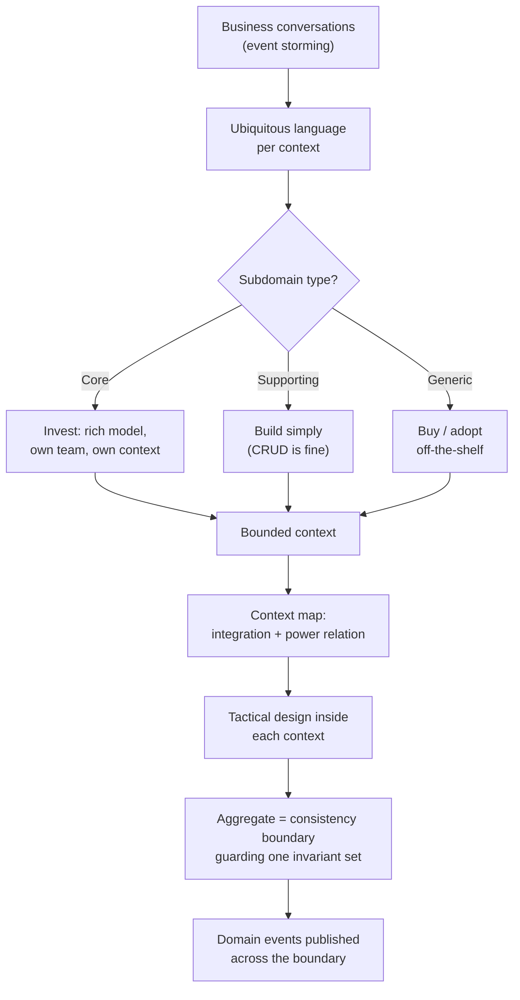

# Domain-Driven Design Coach

Teach DDD as **boundary discovery first, code second**, per [`AGENTS.md`](../../../AGENTS.md).
The deliverable is a *language* and a set of *boundaries* — the classes are a consequence.
Pairs with [microservices-decomposer](../microservices-decomposer/SKILL.md),
[event-sourcing-coach](../event-sourcing-coach/SKILL.md) and [cqrs-coach](../cqrs-coach/SKILL.md).

## When to use

- A team argues about "one big `Customer` model" that means five different things to five teams.
- Someone wants to split a monolith and is slicing by *technical layer* or *table* instead of by domain.
- Aggregates are huge, every save touches half the schema, and write conflicts are constant.
- The learner has read Evans, *Domain-Driven Design* (2003) or Vernon, *Implementing DDD* (2013) and
  wants the practical decision procedure rather than the vocabulary.
- You need to run — or debrief — an **event storming** workshop (Brandolini, *EventStorming*).

## Mental model — first principles

Software fails at the **seams**. A model is only valid inside the boundary where its words carry one
meaning; force one model across a whole business and it either bloats or lies. So DDD works
outside-in: *language → boundary → model → code*.



## Strategic building blocks

| Concept | Question it answers | Signal you got it wrong |
| --- | --- | --- |
| **Ubiquitous language** | What do these words mean *here*? | Code says `Order`, business says "booking"; translation happens in people's heads |
| **Subdomain** (core / supporting / generic) | Where do the best engineers go? | Your strongest team is rewriting an auth system you could buy |
| **Bounded context** | Where is this model valid? | One `User` class with 40 nullable fields serving billing, shipping and support |
| **Context map** | How do two contexts integrate, and who bends? | Undocumented shared database; one schema change breaks three teams |
| **Aggregate** | What must be transactionally consistent? | One save spans 12 tables, or unrelated users collide on the same row |
| **Domain event** | What happened that others care about? | Downstream teams poll your tables to detect change |

**Context-map relationship patterns** — choose deliberately, then write it down:

| Pattern | Power relation | Use when | Cost |
| --- | --- | --- | --- |
| **Shared kernel** | Peers | Two contexts genuinely share a small, stable model | Every change needs both teams' consent |
| **Customer / supplier** | Downstream has a voice | Upstream can prioritise downstream needs | Real planning coupling |
| **Conformist** | Downstream bends | Upstream won't change (vendor, legacy) | You inherit their model's flaws |
| **Anti-corruption layer** | Downstream protects itself | A legacy/third-party model would pollute yours | Translation code to build and maintain |
| **Open host + published language** | Upstream serves many | Many consumers need the same integration | Versioning discipline forever |
| **Separate ways** | None | Integration costs more than duplication | Duplicated data, drift |

## Tactical building blocks

- **Value object** — no identity, immutable, compared by value (`Money`, `DateRange`). Prefer these;
  they are trivial to test and impossible to corrupt half-way.
- **Entity** — identity that survives attribute change (`Order #4711`).
- **Aggregate** — a cluster with one **root**; the root enforces the **invariants** and is the only
  entry point. *One aggregate = one transaction = one consistency boundary.*
- **Repository** — collection-like persistence, one per aggregate root, never one per table.
- **Domain service** — behaviour owned by no single entity (e.g. `TransferFunds`).
- **Domain event** — a past-tense fact (`PaymentCaptured`) published after commit; deliver it reliably
  with the [transactional-outbox-lab](../transactional-outbox-lab/SKILL.md).

**Vernon's aggregate rules of thumb:** protect true invariants inside one aggregate; design *small*
aggregates; reference other aggregates **by identity**, not by object pointer; update other aggregates
**eventually** via events — which is exactly a [saga](../saga-pattern-coach/SKILL.md).

## Procedure

1. **Collect the language.** Ask for the sentences the business actually says. Build a glossary of
   term → meaning → owning context. Flag every word that means two things.
2. **Run (or replay) an event storming.** Orange stickies = **domain events** (past tense) on a
   timeline; add blue **commands**, yellow **actors**, pink **external systems**, purple **hot spots**
   (disagreements). Hot spots mark hidden boundaries — that is where the value is.
3. **Cluster events into candidate contexts.** A boundary appears where the *vocabulary changes* or a
   different actor/cadence takes over. Name each context in the business's own words.
4. **Classify each subdomain** as core, supporting, or generic, and decide build vs buy accordingly.
5. **Draw the context map**, choosing one explicit relationship per edge (table above). Every legacy
   or vendor edge gets an **anti-corruption layer**.
6. **Find aggregates inside one context.** Write each invariant as a sentence ("a booking may never
   exceed room capacity"). If an invariant spans two clusters, either merge them or accept eventual
   consistency between them — and say which, out loud.
7. **Shrink the aggregates.** Replace object references with IDs, push read-only needs into a query
   model, and confirm one transaction touches exactly one root.
8. **Name the domain events** each aggregate emits and route delivery through an outbox.
9. **Test the model against reality:** walk one happy path and one nasty edge case (cancellation,
   partial refund, concurrent edit) through the boundaries you drew.
10. **Route onward:** data shape → [data-modeling-drill](../data-modeling-drill/SKILL.md); service
    split → [microservices-decomposer](../microservices-decomposer/SKILL.md); cross-context
    consistency → [saga-pattern-coach](../saga-pattern-coach/SKILL.md) and
    [consistency-models-coach](../consistency-models-coach/SKILL.md); read models →
    [cqrs-coach](../cqrs-coach/SKILL.md).

## Output shape

```
DDD design — <domain>

Ubiquitous language (per context):
  <context>: <term> = <meaning>   ⚠ collides with <other context>'s <term>

Event storm (timeline):
  <Actor> --[Command]--> <EventA> --> <EventB>   ⚡hot spot: <disagreement>

Subdomains:  core: <...>   supporting: <...>   generic: <buy: ...>

Context map:
  <A> --(customer/supplier)--> <B>
  <A> --(ACL)--> <LegacyC>        # why: <their model would pollute A>

Aggregates in <context>:
  <Root>  invariant: "<sentence that must never be false>"
          holds: <VOs/entities>   references-by-id: <other roots>
          emits: <Event>          size check: <n entities, 1 tx>

Eventual-consistency edges: <A.X> --event--> <B.Y>   lag budget: <...>
Scenario walk: <edge case> -> <which aggregate, which compensation>
Next: <linked skill>
```

## Tips

- **The language is the deliverable.** A fuzzy glossary guarantees fuzzy boundaries; no amount of clean
  architecture rescues a model nobody can name.
- **Boundaries follow behaviour, not data.** Two contexts may each keep their own "customer";
  duplication *across* a boundary is a feature, not a bug.
- **Pitfall — the god aggregate.** Wide aggregates serialise unrelated work. If two users editing
  unrelated things collide, your consistency boundary is too wide.
- **Pitfall — DDD-flavoured CRUD.** Renaming DAOs to "repositories" around anaemic entities buys
  nothing; behaviour must live with the data it protects.
- **Pitfall — tactical-first.** Aggregates chosen before the context map merely relocate the mess.
- **Not everything deserves DDD.** Generic and supporting subdomains are allowed to be boring; spend
  the modelling budget on the core.
- Cite by name and date — Evans (2003), Vernon (2013), Brandolini's *EventStorming*. Never invent a
  "DDD rule" that no source states.
- End with the **Learning Footer** (`AGENTS.md`) — one glossary term to fix, one aggregate to shrink.
