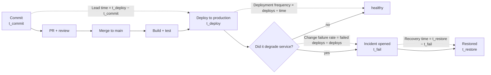

# DORA Metrics Coach

Four numbers, two of throughput and two of stability, that describe a delivery system rather than a person.
This skill computes them from real events, reads them as a *pair*, and refuses to let them become targets —
in the measure-honestly spirit of [`AGENTS.md`](../../../AGENTS.md).

## When to use

- Leadership asks "are we elite?" and nobody can say where the numbers would even come from.
- Deployment frequency is rising while incidents are also rising, and the team needs to see that the two
  metrics are meant to be read together.
- Someone proposes tying the four keys to individual performance reviews — this skill is the argument
  against that.
- **Don't use it for** measuring individual productivity, story points, or lines of code; DORA measures the
  *system*, and per-developer scorecards are the documented failure mode.

## First principles: throughput and stability, together

The four keys come from the DORA research programme and *Accelerate* (Forsgren, Humble & Kim, 2018) and are
re-validated annually in the **Accelerate State of DevOps Report**. Two measure **throughput** (deployment
frequency, lead time for changes) and two measure **stability** (change failure rate, and time to restore —
renamed *failed deployment recovery time* in the 2023 report). The headline finding is that these are **not
a trade-off**: the highest performers improve both simultaneously, because the practices that make
deployments small and frequent are the same ones that make failures rare and recovery fast.



| Key | Dimension | Definition (measure exactly this) | Source of truth | Report as |
| --- | --- | --- | --- | --- |
| Deployment frequency | throughput | how often you deploy **to production** | deployment events | per day/week (a rate) |
| Lead time for changes | throughput | commit → running in production | git commit ts + deploy ts | **median + p85**, never mean |
| Change failure rate | stability | share of deployments that degrade service and need remediation (rollback, hotfix, patch) | incidents linked to deploys | % of deployments |
| Failed deployment recovery time | stability | failure detected → service restored | incident open/close | median + p85 |

| Cluster | Reads like | What it usually indicates |
| --- | --- | --- |
| Elite | on-demand deploys, lead time under a day, low failure rate, recovery in under an hour | trunk-based, small batches, automated tests, fast rollback |
| High / Medium | weekly–monthly deploys, lead time days–weeks | batching, manual gates, environment scarcity |
| Low | infrequent deploys, lead time months, slow recovery | long-lived branches, manual deploys, no rollback path |

⚠ Exact cluster thresholds are re-fitted every year and have moved between reports — quote the **current
year's** Accelerate State of DevOps Report rather than a remembered number, and prefer your own trend line
over the benchmark badge.

## Procedure

1. **Define the deploy event precisely** — one row per production deploy, with a timestamp and the SHA it
   shipped. If you have nothing, start emitting it today; a metric with no event stream is an opinion.
2. **Extract deployment frequency**: `gh api repos/:owner/:repo/deployments --paginate | jq -r '.[] | [.created_at, .sha] | @tsv'`,
   then count per week. Deployments to *production* only — staging deploys inflate the number for free.
3. **Extract lead time**: for each deploy SHA, get the commit time
   (`git show -s --format=%cI <sha>`) and subtract. Report the **median and p85**; the mean is dominated by
   one stale branch and tells you nothing.
4. **Define "failed deployment" before you count one**: a deploy that caused degraded service requiring
   remediation. Write the definition down; ambiguity here is how change failure rate gets gamed.
5. **Join incidents to deploys** by time window and service to compute change failure rate and recovery
   time. Cheap start: an `incidents.csv` with `started_at,restored_at,caused_by_deploy_sha`.
6. **Plot all four on one page, as trends.** A single point is noise; twelve weeks is a signal.
7. **Read them as a pair.** Throughput up + stability down = you removed a gate that was doing real work.
   Both up = the system genuinely improved. Both flat = your constraint is elsewhere; go find it.
8. **Pick exactly one constraint and one intervention** — e.g. lead time p85 is 9 days because PRs wait 4
   days for review → adopt smaller PRs and a review SLA. Predict the effect, then re-measure.
9. **Guard against gaming** with the pairing rules in Tips, keep the metrics team-level and never
   individual, and close with the **Learning Footer**.

## Output shape

```
Scope: <service/repo>   Window: <12 weeks, YYYY-MM-DD → YYYY-MM-DD>   Deploy = <production only>
Deployment frequency: <N/week>  (trend: <↑|→|↓>)
Lead time for changes: median <..> · p85 <..>   (largest stage: <review|CI|release gate>)
Change failure rate: <N failed / M deploys = X%>   Failure defined as: "<written definition>"
Failed deployment recovery time: median <..> · p85 <..>
Pairing read: throughput <↑|→|↓> + stability <↑|→|↓> ⇒ <system improved | gate removed | constraint elsewhere>
Data quality: source=<GitHub Deployments API|CI logs> · gaps=<...> · confidence=<high|med|low>
Constraint: <the one bottleneck>      Intervention: <one change>      Predicted effect: <metric + direction>
Anti-gaming: team-level only · no individual attribution · failure definition frozen for <period>
Next: <ci-pipeline-builder | incident-postmortem | slo-designer>
Learning Footer
```

## Worked example — emit the deploy event, then compute lead time

A deploy is only measurable if it announces itself. This workflow records a real GitHub deployment on every
production release, costing nothing and requiring no extra tooling:

```yaml
name: deploy
on:
  push:
    branches: [main]

permissions:
  contents: read
  deployments: write        # lets the job record the deployment event we later measure

jobs:
  deploy:
    runs-on: ubuntu-latest
    environment: production
    steps:
      - uses: actions/checkout@v4
        with: {fetch-depth: 0}          # full history, so commit timestamps are available

      - name: Open a deployment record
        id: rec
        env: {GH_TOKEN: "${{ github.token }}"}
        run: |
          id=$(gh api repos/${{ github.repository }}/deployments \
                 -f ref='${{ github.sha }}' -f environment=production \
                 -F auto_merge=false -f description='automated deploy' --jq .id)
          echo "id=$id" >> "$GITHUB_OUTPUT"

      - name: Ship it
        run: ./scripts/deploy.sh

      - name: Close the deployment record
        if: always()
        env: {GH_TOKEN: "${{ github.token }}"}
        run: |
          state=$([ "${{ job.status }}" = "success" ] && echo success || echo failure)
          gh api repos/${{ github.repository }}/deployments/${{ steps.rec.outputs.id }}/statuses \
            -f state="$state"
```

Then lead time is arithmetic, not a product purchase:

```bash
gh api "repos/$OWNER/$REPO/deployments?environment=production&per_page=100" --paginate \
  --jq '.[] | [.sha, .created_at] | @tsv' |
while IFS=$'\t' read -r sha deployed; do
  committed=$(git show -s --format=%cI "$sha" 2>/dev/null) || continue
  python - "$committed" "$deployed" <<'PY'
import sys, datetime as dt
c, d = (dt.datetime.fromisoformat(x.replace("Z", "+00:00")) for x in sys.argv[1:3])
print(round((d - c).total_seconds() / 3600, 2))   # lead time in hours
PY
done | sort -n | awk '{a[NR]=$1} END {print "median:", a[int(NR/2)], " p85:", a[int(NR*0.85)]}'
```

Reasoning: the *deployment* event is the join key for three of the four keys — frequency counts it, lead
time subtracts from it, and change failure rate divides by it. Instrument that one event well and the rest
is arithmetic. Note the `if: always()` on the closing step: without it, failed deploys silently vanish from
the denominator and your change failure rate improves by accident.

## Tips

- **Goodhart's law is the main risk**: once a measure becomes a target it stops measuring. Splitting one
  deploy into five raises frequency and improves nothing.
- Always publish throughput and stability **together**; a frequency chart alone invites exactly the
  behaviour that breaks production.
- Use median and p85 for time-based keys — the mean is hijacked by a single six-month-old branch.
- Freeze the definition of "failed deployment" in writing; silently reclassifying incidents is the most
  common way change failure rate "improves".
- Never attribute the four keys to an individual. They describe a delivery system, and personal
  attribution reliably produces smaller, more honest-looking, less useful data.
- The metrics diagnose; they don't prescribe. Fix the constraint with
  [ci-pipeline-builder](../ci-pipeline-builder/SKILL.md),
  [progressive-delivery-lab](../progressive-delivery-lab/SKILL.md), or
  [feature-flags-coach](../feature-flags-coach/SKILL.md), then re-measure.
- Related: [incident-postmortem](../incident-postmortem/SKILL.md), [slo-designer](../slo-designer/SKILL.md),
  [observability-plan](../observability-plan/SKILL.md), [gitops-coach](../gitops-coach/SKILL.md),
  [github-actions-oidc-lab](../github-actions-oidc-lab/SKILL.md), and
  [data-viz-coach](../data-viz-coach/SKILL.md) for charting the trend honestly.
  End with the **Learning Footer** (`AGENTS.md`).
