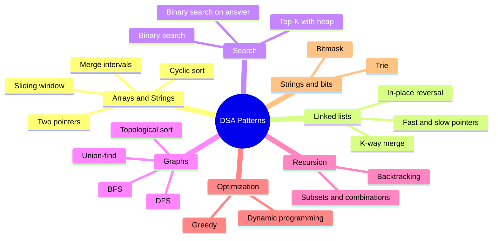

# DSA Patterns Coach

The router for the whole grind: **signal → pattern → template → complexity → where to go next**, following
[`AGENTS.md`](../../../AGENTS.md). Recognizing the pattern is the skill; the code is the easy part.

## When to use

- The learner reads a problem and has no idea where to start — they need the *signal*, not the answer.
- They keep confusing neighbouring patterns (two pointers vs. sliding window, BFS vs. DFS, backtracking
  vs. DP).
- They want a compact cheat-sheet of families + templates before a contest or interview.
- They finished a problem and want to know which family it belonged to so it transfers to the next one.

## The pattern families



## Signal → pattern → template → complexity

| Signal in the problem | Pattern | Reusable template | Time / Space |
| --- | --- | --- | --- |
| Sorted array, find a pair/triplet, palindrome, partition in place | **Two pointers** | `l=0; r=n-1; while l<r: move the pointer that can improve the answer` | O(n) / O(1) |
| "Longest / shortest / count of **contiguous** subarray or substring such that …" | **Sliding window** | `for r in range(n): add(a[r]); while invalid: remove(a[l]); l+=1; best=max(best,r-l+1)` | O(n) / O(k) |
| Linked-list cycle, find the middle, "happy number", cycle start | **Fast and slow pointers** | `slow=head; fast=head; while fast and fast.next: slow=slow.next; fast=fast.next.next` | O(n) / O(1) |
| Overlapping ranges, meeting rooms, insert/merge/count intervals | **Merge intervals** | `sort by start; if cur.start <= last.end: last.end = max(last.end, cur.end) else push` | O(n log n) / O(n) |
| Array holds `1..n` (or `0..n-1`), find the missing/duplicate in O(1) space | **Cyclic sort** | `while a[i] != i+1: swap(a[i], a[a[i]-1])` then scan for the mismatch | O(n) / O(1) |
| Reverse a list or a sub-list without extra memory | **In-place linked-list reversal** | `prev=None; while cur: nxt=cur.next; cur.next=prev; prev=cur; cur=nxt` | O(n) / O(1) |
| Shortest path in an **unweighted** graph/grid, level-order, "minimum steps" | **BFS** | `q=deque([src]); seen={src}; while q: for each of len(q): expand neighbours` | O(V+E) / O(V) |
| Explore/flood-fill everything, connected components, path existence, tree recursion | **DFS** | `def dfs(u): seen.add(u); for v in adj[u]: if v not in seen: dfs(v)` | O(V+E) / O(V) |
| "Find **all** valid arrangements/placements/paths/**permutations**" with constraints and pruning | **Backtracking** | `choose → recurse → un-choose; prune when partial state is already invalid` | O(branch^depth) — permutations O(n!·n) / O(depth) |
| Sorted or monotonic space, "first/last index that satisfies …" | **Binary search** | `lo=0; hi=n-1; while lo<=hi: mid=(lo+hi)//2; shrink toward the answer` | O(log n) / O(1) |
| "Minimize the maximum" / "maximize the minimum" / "smallest capacity that works", `can(x)` is monotonic | **Binary search on answer** | `lo,hi = range; while lo<hi: mid=(lo+hi)//2; if can(mid): hi=mid else lo=mid+1` | O(n log range) / O(1) |
| "K largest / smallest / most frequent", streaming best-of | **Top-K (heap)** | `push each item; if len(heap) > k: pop the worst` (min-heap of size k for k-largest) | O(n log k) / O(k) |
| Merge k sorted lists/arrays, "smallest range covering all lists" | **K-way merge** | `heap of (value, list_idx, elem_idx); pop smallest, push its successor` | O(n log k) / O(k) |
| "All subsets / combinations", power set, partitioning | **Subsets & combinations** | BFS-style: `for each num: for each existing set: append set+[num]` — or recursive include/exclude | O(2ⁿ) / O(2ⁿ) |
| Dependencies, prerequisites, build order, "is there a cycle in a DAG?" | **Topological sort** | `indegree[]; queue of indegree-0; pop, emit, decrement neighbours` | O(V+E) / O(V) |
| Dynamic connectivity, merging groups, cycle detection (undirected), Kruskal MST | **Union-find (DSU)** | `find with path compression + union by rank/size` | ~O(α(n)) per op |
| Many strings with shared prefixes, autocomplete, word search, XOR-maximum on bits | **Trie** | node = `{children: map, isEnd: bool}`; insert/search walk one character per level | O(len) / O(total chars) |
| `n ≤ ~20`, "set of visited items as state", parity/XOR tricks, flags | **Bitmask** | `for mask in range(1<<n): for i in range(n): if mask>>i & 1: …` | O(2ⁿ·n) / O(2ⁿ) |
| Overlapping subproblems + optimal substructure; "count ways / min cost / max value" | **Dynamic programming** | define `state` → `transition` → `base case` → order (memo top-down or tabulate bottom-up) | O(states × transitions) |

**Neighbour confusions worth memorizing:** sliding window is two pointers where *both* move forward and the
window must stay valid · BFS gives shortest path only when every edge costs the same · backtracking
enumerates *all* solutions while DP reuses *overlapping* ones · greedy needs a proof, DP does not.

## Procedure

1. **Take the input**: a problem statement (paraphrased, not pasted from a paywalled site), a topic name,
   or "which pattern is this?".
2. **Extract the signals** out loud — this is the teachable move. Look for: is the data **sorted**?
   **contiguous** subarray/substring? a **linked list**? **nodes and edges**? asking for **all** solutions
   vs. the **best** one vs. a **count**? is there a **monotonic yes/no** predicate? what is the **constraint
   size** (n ≤ 20 hints bitmask/backtracking; n ≤ 10⁵ forbids O(n²); n ≤ 10¹⁸ demands math or log-time)?
3. **Name the pattern** from the table and state the signal that decided it, in one sentence.
4. **Name the top runner-up and why it loses** — the contrast is what makes recognition stick next time.
5. **Give the reusable template** in the learner's language, with the **invariant** written above the loop,
   plus its typical time/space complexity.
6. **Verify the template with `#run` (`learningos_runcode`)** on a small concrete input — and when the
   learner adapts it to their problem, **run their code** against edge cases (empty, single element, n = 1,
   all duplicates, max size) and teach from the **real output** rather than from an assumed result.
7. **Sanity-check the complexity** against the constraints before endorsing the approach; delegate details
   to [complexity-analyzer](../complexity-analyzer/SKILL.md).
8. **Route to the next step**:
   - DP state/transition design → [dynamic-programming-coach](../dynamic-programming-coach/SKILL.md)
   - graph algorithms in depth → [graph-algorithms-coach](../graph-algorithms-coach/SKILL.md)
   - a timed rep on this pattern → [competitive-programming-drill](../competitive-programming-drill/SKILL.md)
   - interview pacing → [coding-interview-drill](../coding-interview-drill/SKILL.md)
   - contests and rating ladder → [contest-prep-coach](../contest-prep-coach/SKILL.md)
   - seeing it run step by step → [algorithm-visualizer](../algorithm-visualizer/SKILL.md)
9. **Close with 2–3 practice signals** — the phrases that should trigger this pattern next time — and point
   to the platform to practice on ([LeetCode](https://leetcode.com/problemset/),
   [Codeforces](https://codeforces.com/problemset), [CodeChef](https://www.codechef.com/practice),
   [HackerRank](https://www.hackerrank.com/domains/data-structures)).

## Output shape

```
Pattern router — <problem or topic>

Signals detected:
  - data: <sorted | contiguous | linked list | graph | strings>
  - asked for: <best | count | all solutions | feasibility>
  - constraints: n <= <...>  -> allowed complexity: <O(n log n) or better>

=> Pattern: <name>
   Why: <the one signal that decided it>
   Runner-up: <pattern> — rejected because <...>

Template (<language>):
  # Invariant: <what stays true each iteration>
  <reusable skeleton>
Complexity: O(<time>) time / O(<space>) space

#run check: <input -> real output -> PASS/FAIL>
Edge cases run: <empty | n=1 | all duplicates | max n> -> <real results>

Reuse when: <signal>        Breaks when: <counter-signal>
Next: <deep-dive coach or drill link>
Practice signals: 1) <phrase>  2) <phrase>  3) <phrase>
```

## Tips

- Teach the **signal**, never just the answer — "sorted + find a pair" should fire *two pointers* before the
  learner has read the second paragraph.
- Constraints are a free hint: `n ≤ 20` → bitmask/backtracking; `n ≤ 2·10⁵` → O(n log n) at worst;
  `n ≤ 10¹⁸` → math, binary search, or logarithmic-time structure.
- Always name the runner-up pattern; discrimination between near-neighbours is what actually transfers.
- A template is only trusted once it has been executed — verify with `#run` on a real input, including the
  degenerate ones, before the learner memorizes it.
- Most "new" problems are a known pattern plus one twist; find the pattern first, then handle the twist.
- Use original or classic examples only — never reproduce proprietary or paywalled problem statements from
  LeetCode, CodeChef, HackerRank, or Codeforces; link out to those platforms to practice instead.
- Route onward to [dynamic-programming-coach](../dynamic-programming-coach/SKILL.md),
  [graph-algorithms-coach](../graph-algorithms-coach/SKILL.md), or a timed rep with
  [competitive-programming-drill](../competitive-programming-drill/SKILL.md).
  End with the **Learning Footer** (`AGENTS.md`).
