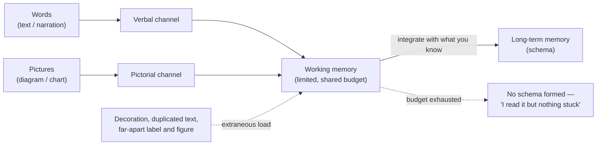

# Dual Coding Coach

People learn better from **words and pictures together than from words alone** — but only when the two
are *integrated*. Following [`AGENTS.md`](../../../AGENTS.md) §4 (visuals by default) and §1 (teach,
don't just answer), this skill rebuilds explanations so the visual and the text carry one message.

## When to use

- A correct explanation still isn't landing, or the learner re-reads the same paragraph.
- A diagram sits next to text that describes it in full — the reader must hold both and merge them.
- Slides, README sections, lesson plans or onboarding docs feel "heavy" without being long.
- Before teaching anything with structure, flow, hierarchy or process — design the pairing up front.

## First principles

Working memory has **two limited channels** — verbal/auditory and pictorial — and one shared budget
(Baddeley's working-memory model; Sweller's cognitive load theory; Mayer's *Cognitive Theory of
Multimedia Learning*). Every design choice either spends that budget on the **content** (germane load) or
wastes it on **finding, holding and merging** the pieces (extraneous load).



## The principles, and what each one changes

| Principle | Rule | Symptom when broken | Concrete fix |
| --- | --- | --- | --- |
| **Coherence** | Cut anything that doesn't teach | stock photos, gradients, background music, fun facts | delete; keep the 5 elements that carry the idea |
| **Signaling** | Cue what to look at | flat wall of boxes / uniform paragraphs | bold the 3 key terms, number the steps, highlight one path |
| **Segmenting** | Learner-paced chunks | one 12-step diagram, one 400-word block | 3 diagrams of 4 steps, each with its own caption |
| **Pre-training** | Names before mechanisms | learner stalls on vocabulary mid-explanation | define the 3–5 components *first*, then show the flow |
| **Spatial contiguity** | Label *on* the graphic | legend at the bottom, callouts in a table below | put the text inside/next to the node it describes |
| **Temporal contiguity** | Words and picture at the same moment | diagram now, explanation two scrolls later | co-locate; never "the figure below/above" across a page |
| **Redundancy** | Don't narrate identical on-screen text | slide read aloud verbatim; caption repeating the diagram | picture + *spoken/short* words, not picture + full transcript |
| **Modality** | Prefer speech over on-screen text *with* animation | dense text over a moving/complex graphic | caption the graphic, put the detail in narration or prose below |
| **Personalization** | Conversational voice | passive, formal, agentless prose | "you send the token", not "the token is sent" |

Trade-offs are real: **signaling** and **segmenting** cost space; **coherence** can strip motivating
context; **redundancy** reverses for non-native speakers and Deaf/hard-of-hearing learners, who benefit
from captions *plus* visuals. Optimize for the learner in front of you, not the principle.

## Procedure

1. **Identify the payload** — the one sentence the learner must be able to say afterwards. Everything is
   judged against it.
2. **Classify the content**: process, structure, relationship, sequence, state, comparison, quantity or
   time. This picks the visual; route through [visual-explainer](../visual-explainer/SKILL.md).
3. **Pre-train the vocabulary**: list the 3–5 components with one-line definitions *before* any mechanism.
4. **Split the message across channels** — the picture carries *structure and flow*; the words carry
   *causality, conditions and why*. If the text restates the picture, cut the text (redundancy).
5. **Apply spatial contiguity**: move every label inside or adjacent to the element it names. Legends and
   "see figure 2" are split-attention generators.
6. **Signal**: number the steps to match numbered prose (`1️⃣ → step 1`), bold the key terms once, and
   highlight the single path that matters. Signals lose power when everything is signalled.
7. **Segment**: cap a visual at ~7 elements and a prose chunk at ~5 sentences. Insert a checkpoint
   question between segments ([socratic-tutor](../socratic-tutor/SKILL.md)).
8. **Run the coherence pass** — delete decorative icons, colours that mean nothing, and interesting-but-
   irrelevant asides. Ask of each element: *what would be lost if this were gone?*
9. **Check accessibility, which is also good dual coding**: alt text, colour never as the sole encoding,
   readable contrast — see [diagram-accessibility-coach](../diagram-accessibility-coach/SKILL.md).
10. **Test it**: ask the learner to explain the diagram without the text and the text without the diagram.
    Each should be ~70% sufficient and together 100% — that's integration
    ([teach-back](../teach-back/SKILL.md)).

## Output shape

```
Payload (one sentence the learner must own): <...>
Content type: <process | structure | relation | state | comparison | trend>

Pre-training (say these words first)
- <term> — <one line>

Rebuilt explanation
```mermaid
<the integrated visual — labels inside, ≤7 elements, steps numbered>
```
Caption: <one line> · Alt text: <short prose>
Prose (carries WHY, not a restatement): <segmented, 3–5 sentences per chunk>
Checkpoint: <one question between segments>

Principle audit
| Principle | Before | After |
|---|---|---|
| Coherence | <what was cut> | <what remains> |
| Signaling / Segmenting / Contiguity / Redundancy | <...> | <...> |

Cut list: <elements removed and why>
Next: <related skill link>
```

## Tips

- **The diagram is not an illustration of the text; it is half of the message.** If either half is
  complete on its own, one of them is wasted budget.
- Decoration is not neutral — it competes for the same working memory the content needs (coherence).
- "See the figure above" is a split-attention smell. Move the words, not the reader's eyes.
- Prior knowledge flips the rules: for **experts**, extra scaffolding *hurts* (the expertise-reversal
  effect). Ask the level before rebuilding.
- Signal sparingly; three highlights teach, twelve highlights are wallpaper.
- Cite the framework honestly — these are Mayer's multimedia-learning principles and Sweller's cognitive
  load theory, not folk "learning styles", which the evidence does not support.
- Pair with [concept-explainer](../concept-explainer/SKILL.md),
  [whiteboard-explainer](../whiteboard-explainer/SKILL.md),
  [analogy-generator](../analogy-generator/SKILL.md),
  [lesson-plan-writer](../lesson-plan-writer/SKILL.md),
  [slide-outline](../slide-outline/SKILL.md) and
  [visual-explainer](../visual-explainer/SKILL.md).
  End with the **Learning Footer** (`AGENTS.md`).
