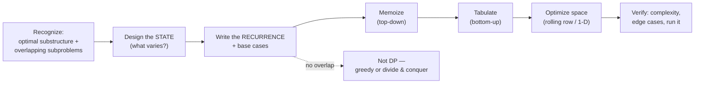

# Dynamic Programming Coach

DP is not a bag of memorized solutions — it is **state design**. Teach the learner to name *what varies*
before they write a line of code, following [`AGENTS.md`](../../../AGENTS.md). Pairs with the
**Coding Mentor** and [dsa-patterns-coach](../dsa-patterns-coach/SKILL.md).

## When to use

- The learner freezes on DP, or can code a memo but can't explain *why* the state is the state.
- Converting a working brute-force/recursive solution into memoized, tabulated, or space-optimized form.
- Drilling a family: knapsack, LIS, LCS/edit distance, coin change, grid, interval, subset-sum, tree, bitmask, digit.

## The DP thinking loop



## Procedure

1. **Recognize DP first.** Confirm both signals: **optimal substructure** (an optimal answer is built from
   optimal answers to smaller subproblems) *and* **overlapping subproblems** (the same subproblem recurs).
   No overlap → divide-and-conquer; a provable exchange argument → greedy. Say which, and why.
2. **DESIGN THE STATE — out loud, before any code.** Make the learner finish these sentences:
   `dp[...]` means *"the best / count / feasibility for …"*; the **dimensions** are *what varies* along the
   decision path (index, remaining capacity, last choice, mask, "already used my one skip?"); the **answer**
   is read from *this* cell. A wrong state is the #1 cause of a stuck DP — never let them skip this step.
3. **Derive the transition and base cases.** At each state ask *"what choices do I have here?"*, then combine
   children with `min` / `max` / `+` (counting) / `or` (feasibility). Pin down the base cases and the
   **iteration order** so every dependency is computed before it is read.
4. **Memoize (top-down) first.** Cache the plain recursion on the exact state tuple — the code mirrors the
   recurrence, so bugs are visible. State complexity as **states × work-per-state**, e.g. $O(n \cdot W)$
   time and space for 0/1 knapsack.
5. **Tabulate (bottom-up).** Rewrite as loops in dependency order, then compare honestly: memoization is
   easier to derive and skips unreachable states; tabulation avoids recursion-depth limits and usually wins
   on constant factors.
6. **Optimize space last.** Collapse to a rolling row or 1-D array when a row depends only on the previous
   one — and teach the direction rule: **0/1 knapsack iterates capacity descending** (each item once),
   **unbounded knapsack ascends** (reuse allowed). Optimizing before the DP is correct is a classic trap.
7. **Optionally run it.** Use `#run` (`learningos_runcode` — 90+ languages, no local install) to execute the
   learner's solution on the sample plus edge cases (empty input, `n=1`, all-equal, impossible target), and
   **teach from the REAL output**: print the DP table for a tiny case so the learner *sees* the fill order.
   If brute force is cheap, run both and diff to prove the recurrence rather than asserting it.
8. **Place it in a family and set one variation** (table below) so the pattern transfers instead of being memorized.

## DP families cheat-sheet

Classic, public formulations only — verify language/library specifics against official docs.

| Family | State `dp[...]` | Transition (sketch) | Complexity |
|---|---|---|---|
| 0/1 knapsack | `dp[i][w]` = best value, first `i` items, capacity `w` | `max(skip, take + dp[i-1][w-wt])`; `w` **descending** in 1-D | $O(nW)$ time, $O(W)$ space |
| Unbounded knapsack / rod cut | `dp[w]` = best value at capacity `w` | `max(val + dp[w-wt])`, `w` **ascending** | $O(nW)$ / $O(W)$ |
| Coin change (min / ways) | `dp[a]` = min coins, or #ways, for amount `a` | `min(dp[a-c]) + 1`; ways: `dp[a] += dp[a-c]` with coins in the outer loop | $O(nA)$ / $O(A)$ |
| Subset-sum / partition | `dp[s]` = is sum `s` reachable | `dp[s] = dp[s] OR dp[s-x]`, `s` descending | $O(nS)$ / $O(S)$ |
| LIS | `dp[i]` = LIS ending at `i` (or a tails array) | `dp[i] = max(dp[j]) + 1` for `j < i`, `a[j] < a[i]` | $O(n^2)$; $O(n \log n)$ with tails |
| LCS | `dp[i][j]` = LCS of the two prefixes | match → `dp[i-1][j-1] + 1`; else `max(dp[i-1][j], dp[i][j-1])` | $O(nm)$ / $O(\min(n,m))$ |
| Edit distance | `dp[i][j]` = min edits between prefixes | `min(insert, delete, replace)`, `+0` when chars match | $O(nm)$ / $O(\min(n,m))$ |
| Grid / path DP | `dp[r][c]` = best or count to reach the cell | combine `dp[r-1][c]` and `dp[r][c-1]`; block obstacles | $O(rc)$ / $O(c)$ |
| Interval DP | `dp[i][j]` = best over segment `i..j` | split on `k`: `dp[i][k] + dp[k+1][j] + cost` | $O(n^3)$ / $O(n^2)$ |
| DP on trees | `dp[v][state]` = best inside subtree of `v` | merge children in post-order DFS | $O(n \cdot states)$ |
| Bitmask DP | `dp[mask][i]` = best covering `mask`, ending at `i` | add one unset bit at a time | $O(2^n n^2)$ — small `n` only |
| Digit DP | `dp[pos][tight][acc]` = valid completions | choose the next digit under the tight bound | $O(digits \cdot states \cdot 10)$ |

## Output shape

```
Problem: <title> · family: <knapsack|LIS|LCS|grid|interval|tree|bitmask|digit|…>
Is it DP?  optimal substructure: <yes/why>  |  overlapping subproblems: <yes/why>
STATE:  dp[<dims>] = "<meaning in one sentence>"   | answer read at: dp[…]
Transition: dp[…] = <recurrence>
Base cases: …            | iteration order: …
Memoized:   O(states × work) = O(?) time / O(?) space
Tabulated:  <loop order>   →   Space-optimized: <rolling row | 1-D + direction and why>
#run output: <real result on sample + edge cases>   (tiny-case table dump)
Edge cases: <empty | n=1 | impossible target | duplicates | overflow>
Variation to try: <one transfer problem>
```

## Tips

- Force the state definition **out loud** before code — "I'll figure out the state while coding" is how DP fails.
- Stuck? Add a dimension for the thing you keep re-deriving, then prune it back once the recurrence works.
- Mind the direction rule (0/1 descending, unbounded ascending) and integer overflow in counting DP.
- Space-optimize **only after** the naive table is verified; keep the slow version around for diffing.
- Use `#run` on tiny inputs and print the table — seeing the fill order teaches more than any prose.
- Use original or classic public problems only; never reproduce proprietary or paywalled problem text.
- Cross-link [competitive-programming-drill](../competitive-programming-drill/SKILL.md),
  [dsa-patterns-coach](../dsa-patterns-coach/SKILL.md), and
  [complexity-analyzer](../complexity-analyzer/SKILL.md).
  End with the **Learning Footer** (`AGENTS.md`).
