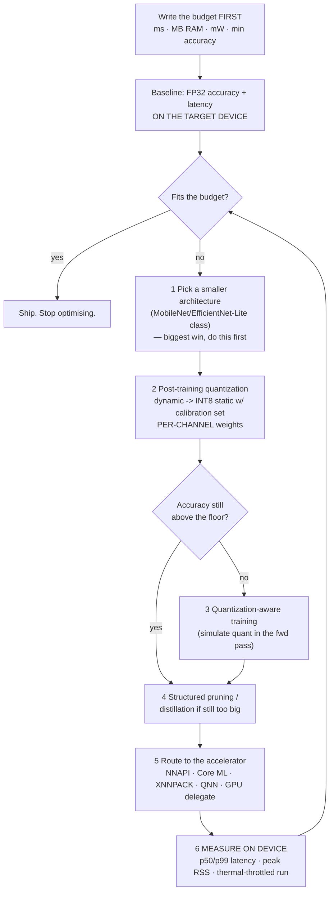

# Edge AI Inference Lab

On a server you buy your way out of a performance problem. On a device you cannot: the RAM, the thermal
envelope, and the battery are fixed before you write a line of code. Edge inference is therefore a
**budgeting discipline** — decide the budget, shrink the model until it fits, and prove on the real hardware
that accuracy survived. This lab does that with traced arithmetic, per
[`AGENTS.md`](../../../AGENTS.md).

## When to use

- The model must run **without a network**: offline, air-gapped, intermittent, or in-flight.
- **Privacy or regulation** says the data must not leave the device.
- Round-trip latency to a server blows the interaction budget (camera, audio, control loops).
- Per-inference cloud cost at your volume is untenable, or you're on a battery and every joule counts.
- The model works fine in the notebook and is 4× too large or 10× too slow for the target.
- **Don't use it for** server-side inference — that is a queueing and batching problem, see
  [model-serving-lab](../model-serving-lab/SKILL.md). **Don't use it for** LLM-specific weight-only
  quantization schemes (GPTQ/AWQ/GGUF), which have their own lab in
  [llm-quantization-lab](../llm-quantization-lab/SKILL.md). And don't quantize before you have a baseline
  accuracy number and a written budget — otherwise you cannot tell success from damage.

## First principles: three budgets, one arithmetic

**Primary sources.** Integer-only inference math is Jacob, Kligys, Chen, Zhu, Tang, Howard, Adam &
Kalenichenko, *"Quantization and Training of Neural Networks for Efficient Integer-Arithmetic-Only
Inference"*, **CVPR 2018 (arXiv:1712.05877, 15 December 2017)**; the practical per-channel guidance is
Krishnamoorthi, *"Quantizing deep convolutional networks for efficient inference: A whitepaper"*
(**arXiv:1806.08342, 21 June 2018**). Compression by pruning is Han, Mao & Dally, *"Deep Compression"*
(**ICLR 2016, arXiv:1510.00149**); distillation is Hinton, Vinyals & Dean (**arXiv:1503.02531, 2015**). The
canonical efficient vision backbone is Sandler et al., *"MobileNetV2"* (**CVPR 2018, arXiv:1801.04381**),
3.4 M parameters and ~300 M MACs at 1.0/224.

Runtimes: **LiteRT** — Google renamed TensorFlow Lite to LiteRT in the Google Developers Blog post
*"TensorFlow Lite is now LiteRT"* (**4 September 2024**); the Python package is now `ai-edge-litert` and the
Android artifact `com.google.ai.edge.litert:litert`, with docs at `ai.google.dev/edge/litert`.
**ONNX Runtime** (`onnxruntime.ai`, MIT) covers mobile and embedded through execution providers (XNNPACK,
NNAPI, Core ML, QNN). **Core ML** via `coremltools` (`apple.github.io/coremltools`) is the Apple path to the
Neural Engine. ⚠ Package names, EP availability, and delegate support change frequently — **verify on the
current vendor page before pinning a build.**

### Budget 1 — memory

Weights dominate, and the arithmetic is trivial and unforgiving:

$$\text{bytes} = N_{\text{params}} \times \frac{\text{bits}}{8}$$

MobileNetV2 at 3.4 M parameters: **13.6 MB in FP32, 6.8 MB in FP16, 3.4 MB in INT8, 1.7 MB in INT4.** Add
peak activation memory (often larger than weights for early conv layers) and the runtime's own arena.

### Budget 2 — compute

$$\text{FLOPs} \approx 2 \times \text{MACs}$$

MobileNetV2's 300 M MACs is **0.6 GFLOP per inference**. At an *effective* 5 GOP/s (a modest CPU core) that
is **120 ms**; at 20 GOP/s, **30 ms**; at 100 GOP/s on an NPU, **6 ms**. Note "effective": peak TOPS on a
datasheet is a marketing number, and real achieved throughput on a memory-bound depthwise conv is routinely
5–20% of it.

### Budget 3 — accuracy, which quantization spends

Affine (asymmetric) INT8 quantization maps a real range to integers:

$$s = \frac{x_{\max} - x_{\min}}{q_{\max} - q_{\min}}, \qquad z = q_{\min} - \left\lfloor\frac{x_{\min}}{s}\right\rceil, \qquad q = \operatorname{clip}\!\left(\left\lfloor\frac{x}{s}\right\rceil + z,\ q_{\min},\ q_{\max}\right), \qquad \hat{x} = s\,(q - z)$$

The maximum round-trip error inside the range is exactly **half a step**, $|\hat{x} - x| \le s/2$ — which
means *everything* depends on how wide a range that single $s$ has to cover. That is the whole per-tensor
versus per-channel argument, and the worked example measures it.



*Figure — the order matters. Architecture choice beats quantization, quantization beats pruning, and every
loop must end at a measurement taken on the real device under a sustained load.*

| Technique | Typical size win | Typical speed win | Accuracy risk | Needs retraining? |
| --- | --- | --- | --- | --- |
| Smaller architecture | 5–20× | 5–20× | designed-in, predictable | yes (train/fine-tune) |
| Dynamic-range PTQ (weights INT8, activations float) | 4× | 1–2× on CPU | low | **no** |
| Full-integer PTQ (weights + activations INT8) | 4× | 2–4×, unlocks NPUs | medium — needs a calibration set | no |
| Per-channel weights instead of per-tensor | none | none | **large improvement** — see worked example | no |
| Quantization-aware training | 4× | as full-integer | low | yes |
| FP16 | 2× | GPU/NPU only | very low | no |
| Structured pruning (channels/blocks) | 1.5–3× | ~proportional | medium | yes (fine-tune) |
| Unstructured sparsity | file size only | ~none without sparse kernels | low | yes |
| Distillation | depends on student | depends | medium | yes |

| Target | Runtime | Accelerator path | Watch out for |
| --- | --- | --- | --- |
| Android | LiteRT, ONNX Runtime | NNAPI, GPU delegate, QNN (Qualcomm) | huge device variance; NNAPI silently falls back to CPU |
| iOS / macOS | Core ML, ONNX Runtime | Neural Engine, Metal | conversion coverage; ANE only takes certain op/dtype combos |
| Linux SBC (Raspberry Pi) | ONNX Runtime, LiteRT | XNNPACK, ARM NEON | thermal throttling under sustained load |
| Microcontroller | LiteRT for Microcontrollers | CMSIS-NN | tens to hundreds of **KB**; no dynamic allocation |
| Browser | ONNX Runtime Web, TF.js | WebGPU, WASM SIMD | download size is part of the latency budget |

## Procedure

1. **Write the budget as numbers, before anything else**: p99 latency, peak RAM, model file size, minimum
   acceptable accuracy, and — if battery-powered — mJ per inference. An unwritten budget is always met.
2. **Baseline on the target device, not on your laptop.** A workstation CPU tells you nothing about a Cortex-A
   core under a thermal cap. Record FP32 accuracy and p50/p99 latency there.
3. **Try a smaller architecture first.** Switching backbone family is usually a bigger, safer win than any
   amount of compression applied to a model that was never meant to be small.
4. **Export cleanly, then verify parity** — an export that changes outputs is a bug that quantization will
   later be blamed for:
   ```python
   import torch
   torch.onnx.export(model, sample, "model.onnx", opset_version=17,
                     input_names=["input"], output_names=["logits"])
   ```
   ```python
   import numpy as np, onnxruntime as ort
   sess = ort.InferenceSession("model.onnx", providers=["CPUExecutionProvider"])
   assert np.allclose(sess.run(None, {"input": x})[0], reference, atol=1e-4)
   ```
5. **Quantize, cheapest option first.** Dynamic range needs no data at all:
   ```python
   from onnxruntime.quantization import quantize_dynamic, QuantType
   quantize_dynamic("model.onnx", "model.int8.onnx", weight_type=QuantType.QInt8)
   ```
   For full-integer, supply a **representative calibration set** (100–500 real samples, covering your actual
   input distribution) — `quantize_static` with a `CalibrationDataReader`. The LiteRT equivalent sets
   `converter.optimizations = [tf.lite.Optimize.DEFAULT]` plus a `representative_dataset`.
6. **Insist on per-channel weight quantization.** It is a flag, it costs nothing at inference time, and it is
   frequently the difference between "INT8 works" and "INT8 destroyed the model" — quantified below.
7. **Re-evaluate accuracy on the quantized artefact, per slice.** Aggregate accuracy hides the class that
   collapsed; reuse your eval harness ([eval-designer](../eval-designer/SKILL.md)).
8. **If PTQ lost too much, escalate to QAT**, which simulates quantization in the forward pass so the weights
   learn to tolerate it. Budget real training time.
9. **Route to the accelerator and confirm it was actually used.** Enable the delegate/EP and check the
   op-placement log — a silent CPU fallback looks exactly like "the NPU is slow".
   ```python
   sess = ort.InferenceSession("model.int8.onnx",
                               providers=["NnapiExecutionProvider", "CPUExecutionProvider"])
   print(sess.get_providers())     # confirm what is actually in use
   ```
10. **Measure sustained, not single-shot.** Run 5–10 minutes; record p50, p99, peak RSS, and whether latency
    degrades as the device heats. Then close with the **Learning Footer**.

## Output shape

```
Target: <device, SoC, RAM, accelerator>       Runtime: <LiteRT | ONNX Runtime | Core ML> <version>
Budget: p99 <= <..> ms · peak RAM <= <..> MB · file <= <..> MB · accuracy >= <..> · <..> mJ/inference
Baseline (FP32, ON DEVICE): accuracy=<..> p50=<..> ms p99=<..> ms size=<..> MB peak RSS=<..> MB
Params=<N> -> weights: fp32 <..> MB | fp16 <..> MB | int8 <..> MB      MACs=<..> -> <..> GFLOP/inference
Compute check: <..> GFLOP / <..> GOP/s effective = <..> ms floor   (measured <..> ms => <..>% efficiency)
Compression applied (in order):
  arch=<...>            size <..> -> <..>   acc <..> -> <..>
  PTQ <dynamic|static>  size <..> -> <..>   acc <..> -> <..>   calibration n=<..>
  weight granularity=<PER-CHANNEL|per-tensor>   acc delta from this flag alone = <..>
  QAT / pruning / distillation: <applied? result>
Per-slice accuracy after quantization: <slice=<..>, ...>   worst regression=<..> on <slice>
Accelerator: EP/delegate=<..>  ops offloaded=<n/m>  CPU fallback=<which ops and why>
Sustained run (<..> min): p50=<..> p99=<..> thermal drift=<..>%  peak RSS=<..> MB
Verdict: <fits | still <..> over on <budget>; next lever = <...>>
Next: <model-card-writer | mobile-release-coach | model-monitoring-coach>
Learning Footer
```

## Worked example — the one flag that decides whether INT8 works

Every INT8 tutorial says "use per-channel quantization for weights". Here is *why*, measured. A conv layer
has four output channels; three have small weights (σ ≈ 0.02) and one is fat (σ ≈ 1.5) — an entirely ordinary
situation after training, especially without weight decay on that layer.

```python
# pip install numpy
import numpy as np

def q_params(xmin, xmax, qmin=-128, qmax=127):
    scale = (xmax - xmin) / (qmax - qmin)
    zero_point = int(round(qmin - xmin / scale))
    return scale, zero_point

def fake_quant(x, scale, zp, qmin=-128, qmax=127):
    q = np.clip(np.rint(x / scale) + zp, qmin, qmax)     # quantize
    return scale * (q - zp)                              # dequantize -> round-trip error

rng = np.random.default_rng(0)
W = np.vstack([rng.normal(0, 0.02, 256),                 # 3 ordinary output channels
               rng.normal(0, 0.02, 256),
               rng.normal(0, 0.02, 256),
               rng.normal(0, 1.50, 256)])                # 1 fat channel drags the tensor range

s_t, z_t = q_params(W.min(), W.max())                    # ONE scale for the whole tensor
Wt = fake_quant(W, s_t, z_t)
print(f"per-TENSOR   scale={s_t:.6f}")
for c in range(4):
    err = np.abs(Wt[c] - W[c]).max()
    print(f"   ch{c} range=[{W[c].min():+.3f},{W[c].max():+.3f}] "
          f"max err={err:.6f}  relative={err / np.abs(W[c]).max():.2%}")

print("per-CHANNEL")
for c in range(4):                                        # one scale PER OUTPUT CHANNEL
    s, z = q_params(W[c].min(), W[c].max())
    err = np.abs(fake_quant(W[c], s, z) - W[c]).max()
    print(f"   ch{c} scale={s:.6f} max err={err:.6f}  relative={err / np.abs(W[c]).max():.2%}")
```

Traced output (verified by running this exact script):

```
per-TENSOR   scale=0.031853
   ch0 range=[-0.062,+0.061] max err=0.015778  relative=25.40%
   ch1 range=[-0.078,+0.055] max err=0.015922  relative=20.42%
   ch2 range=[-0.050,+0.048] max err=0.015913  relative=31.62%
   ch3 range=[-4.392,+3.730] max err=0.015773  relative=0.36%
per-CHANNEL
   ch0 scale=0.000484 max err=0.000242  relative=0.39%
   ch1 scale=0.000522 max err=0.000261  relative=0.33%
   ch2 scale=0.000385 max err=0.000192  relative=0.38%
   ch3 scale=0.031853 max err=0.015773  relative=0.36%
```

This is the whole lesson in one table:

- **The absolute error is identical everywhere under per-tensor** — about 0.0158, which is exactly the
  predicted $s/2 = 0.031853/2 = 0.015927$. The quantizer is behaving perfectly; the problem is that one
  step size must cover a range set entirely by the fattest channel.
- **The *relative* error is catastrophic for the small channels: 25%, 20%, 32%.** Channel 2's weights peak at
  ±0.050 while the quantization step is 0.032 — those weights are represented by roughly **three distinct
  integer levels out of 256.** The channel is effectively destroyed, and it will show up as an accuracy
  cliff that people misattribute to "INT8 is too aggressive for my model".
- **Per-channel gives every channel its own scale**, and relative error drops to a uniform ~0.35% — a **65–90×
  improvement** for the small channels (25.40% → 0.39%). Channel 3 is unchanged, because it was never the
  victim.
- **It costs nothing that matters.** You store one extra `float32` scale per output channel — for a
  256-channel layer that is 1 KB against megabytes of weights — and the integer kernel folds the per-channel
  scale into its existing requantization step. This is why Krishnamoorthi's whitepaper recommends per-channel
  weights and per-tensor activations as the default combination.

Now the scalar mechanics, so the formula is not a black box. Quantizing the range $[-2.5, 5.0]$ to INT8:
$s = (5.0 - (-2.5)) / (127 - (-128)) = 7.5/255 = 0.029412$ and $z = -128 - \lfloor -2.5/0.029412 \rceil =
-128 + 85 = -43$. Round-tripping four values gives

```
  x=  -2.5 -> q= -128 -> deq=-2.50000 err=0.00000
  x=   0.0 -> q=  -43 -> deq= 0.00000 err=0.00000
  x= 1.234 -> q=   -1 -> deq= 1.23529 err=0.00129
  x=   5.0 -> q=  127 -> deq= 5.00000 err=0.00000
```

Two details worth noticing: the endpoints are exact by construction, and **zero is exact** because the
asymmetric scheme places a real integer ($z = -43$) at $x = 0$ — which matters enormously, since padding and
post-ReLU activations are full of exact zeros and a scheme that smeared them would inject error everywhere.
The worst case, 0.00129 for $x = 1.234$, sits comfortably under the guaranteed bound $s/2 = 0.014706$.

Finally, size the job before doing it. MobileNetV2 (3.4 M params, 300 M MACs): weights are **13.6 MB fp32 →
3.4 MB int8**, and compute is $2 \times 300\text{M} = 0.6$ GFLOP, so **120 ms at 5 GOP/s, 30 ms at 20 GOP/s,
6 ms at 100 GOP/s**. If your budget is 30 ms and your CPU delivers 5 GOP/s effective, no amount of INT8 will
save you — you need the NPU or a smaller model. *That conclusion is available in one line of arithmetic,
before you spend a week on quantization.*

## Tips

- **Per-channel weights, per-tensor activations** is the default that works. If someone reports "INT8 ruined
  my accuracy", check this flag before believing anything else.
- **The calibration set is not a formality.** Full-integer PTQ derives activation ranges from it; 100–500
  samples drawn from the *real* input distribution (not clean validation crops) is the difference between a
  working model and a broken one.
- **Peak activation memory often exceeds weight memory** on early conv layers. Budget the runtime arena, not
  just the `.tflite`/`.onnx` file size — [memory-management-coach](../memory-management-coach/SKILL.md).
- **Confirm the accelerator is actually being used.** NNAPI, Core ML, and QNN all fall back to CPU op-by-op
  and log it quietly; an unsupported op in the middle of your graph can force expensive round trips.
- **Measure under sustained load.** Single-shot benchmarks miss thermal throttling entirely, and phones
  throttle hard — a model that hits 25 ms cold and 60 ms after four minutes has not met a 30 ms budget.
- **Unstructured sparsity shrinks files, not latency**, unless your runtime has sparse kernels. Structured
  (channel/block) pruning is what actually removes work.
- **Quantization changes the model, so re-run the evaluation and re-issue the artefact's documentation** —
  [model-card-writer](../model-card-writer/SKILL.md) exists exactly for "which artefact is this?".
- **Devices drift too.** OS upgrades change delegate behaviour and the input distribution changes with new
  hardware; keep monitoring after release
  ([model-monitoring-coach](../model-monitoring-coach/SKILL.md)).
- Related: [llm-quantization-lab](../llm-quantization-lab/SKILL.md),
  [model-serving-lab](../model-serving-lab/SKILL.md),
  [mobile-release-coach](../mobile-release-coach/SKILL.md),
  [android-lifecycle-coach](../android-lifecycle-coach/SKILL.md),
  [ios-lifecycle-coach](../ios-lifecycle-coach/SKILL.md),
  [cpu-cache-performance-coach](../cpu-cache-performance-coach/SKILL.md), and
  [mosquitto-mqtt-lab](../mosquitto-mqtt-lab/SKILL.md) for getting results off the device.
  End with the **Learning Footer** (`AGENTS.md`).
