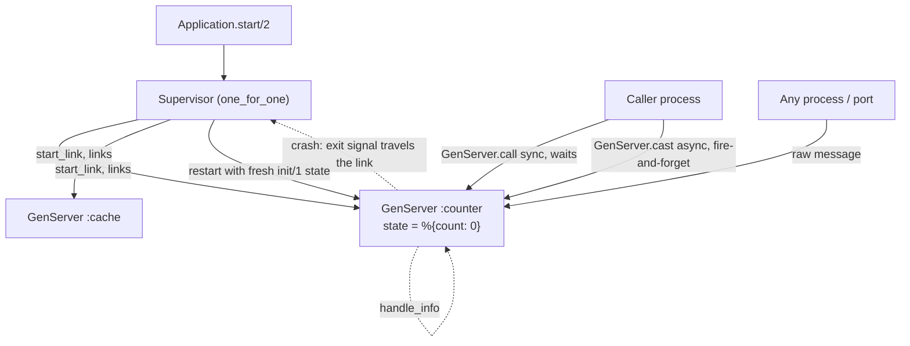

# Elixir OTP GenServer Lab

Build a supervised, stateful worker from `spawn` up to a Supervisor tree — a hands-on lab following
[`AGENTS.md`](../../../AGENTS.md). Terminology and callbacks follow the official Elixir docs at
**hexdocs.pm/elixir** (`Process`, `GenServer`, `Supervisor`, and the *Mix and OTP* guide), which sit on
Erlang/OTP's `gen_server` and `supervisor` behaviours.

## When to use

- The learner knows Elixir syntax but not **why** OTP exists, or has never written a `GenServer`.
- They are confused by `link` vs `monitor`, `call` vs `cast`, or which restart strategy to pick.
- "Let it crash" sounds reckless and needs to be grounded in supervision and state recovery.
- They need concurrent state (counters, caches, rate limiters, connection owners) without locks.

## The mental model



Every process has its own heap and mailbox; nothing is shared, so there are no locks and no data races —
the only coupling is **messages** and **exit signals**. Fault tolerance is therefore a *topology* problem.

## Links vs monitors, call vs cast

| Concern | `Process.link/1` | `Process.monitor/1` |
| --- | --- | --- |
| Direction | **Bidirectional** | **Unidirectional** (observer only) |
| On the other side dying | Sends an exit signal that kills you too (unless trapping exits) | Delivers a `{:DOWN, ref, :process, pid, reason}` message |
| Use for | Processes whose lifetimes must be shared (supervisor ↔ child) | Watching something you don't own; caller-side timeouts |
| Cleanup | `Process.unlink/1` | `Process.demonitor(ref, [:flush])` |

| Callback | Trigger | Blocks caller? | Returns |
| --- | --- | --- | --- |
| `init/1` | `start_link/3` | Yes (caller waits) | `{:ok, state}` / `{:stop, reason}` |
| `handle_call/3` | `GenServer.call/3` | **Yes**, 5 000 ms default timeout | `{:reply, reply, state}` |
| `handle_cast/2` | `GenServer.cast/2` | No — fire and forget | `{:noreply, state}` |
| `handle_info/2` | Raw messages: `send/2`, `:timer`, `:DOWN`, port data | No | `{:noreply, state}` |
| `terminate/2` | Graceful shutdown only (not on brutal kill) | — | ignored |

| Restart strategy | Restarts | Choose when |
| --- | --- | --- |
| `:one_for_one` | Only the crashed child | Children are independent (the default, ~90% of cases) |
| `:one_for_all` | Every child | Children share invariant state and must restart together |
| `:rest_for_one` | The crashed child and everything started **after** it | Later children depend on earlier ones (a pipeline) |

## Procedure

1. **Raw processes first (10 min).** `spawn/1`, `send/2` and a `receive do ... end` loop that carries state
   in its own arguments. Then show that a plain `spawn` crash is **silent** — nobody is told. This is the
   motivation for everything that follows. **Run it with `#run` (`learningos_runcode`)**.
2. **Links vs monitors.** Use `spawn_link` and watch the crash take the parent down; then
   `Process.flag(:trap_exit, true)` and observe the `{:EXIT, pid, reason}` message instead. Repeat with
   `Process.monitor/1` and observe `{:DOWN, ...}` without dying. Print both messages from a real run.
3. **Extract the boilerplate → GenServer.** The receive loop, the reply protocol and the state threading are
   always the same; `use GenServer` gives them a name. Build a `Counter`:
   ```elixir
   defmodule Counter do
     use GenServer

     # Client API — runs in the CALLER's process
     def start_link(opts), do: GenServer.start_link(__MODULE__, 0, opts)
     def value(pid), do: GenServer.call(pid, :value)
     def bump(pid, n \\ 1), do: GenServer.cast(pid, {:bump, n})

     # Server callbacks — run in the SERVER process, serialized
     @impl true
     def init(n), do: {:ok, n}

     @impl true
     def handle_call(:value, _from, n), do: {:reply, n, n}

     @impl true
     def handle_cast({:bump, n}, state), do: {:noreply, state + n}

     @impl true
     def handle_info(:tick, state), do: {:noreply, state}
   end
   ```
   Teach the client/server split explicitly: the public functions run in the caller, the callbacks run
   inside the server and are **serialized**, which is what makes the state safe without locks.
4. **Supervise it.** Add a `Supervisor` with `children = [{Counter, name: Counter}]` and
   `Supervisor.init(children, strategy: :one_for_one)`. Kill the worker with `Process.exit(pid, :kill)`,
   then read the value again — a **new pid** answers with the `init/1` state. Restarting *is* the recovery.
5. **"Let it crash" precisely.** Handle expected, modelled errors (`{:error, :not_found}`); let *unexpected*
   states crash so the supervisor restores a known-good one. Crashing is a strategy for corrupt state, not
   an excuse for skipping validation at the boundary. Note the restart intensity limits
   (`max_restarts`/`max_seconds`) — a supervisor that exceeds them gives up and escalates.
6. **Verify with `#run` on real inputs and edge cases**: concurrent `bump` from 100 tasks then `value`
   (must equal 100); `GenServer.call` to a dead pid (exit `:noproc`); a `handle_call` that sleeps past the
   5 000 ms timeout; state after a forced kill; `handle_info` receiving an unexpected message; and
   `:one_for_one` vs `:rest_for_one` behaviour with two children. Read the **actual output**.
7. **Route onward**: shared-memory concurrency contrast → [concurrency-coach](../concurrency-coach/SKILL.md);
   immutability and pure transformations → [functional-programming-coach](../functional-programming-coach/SKILL.md);
   diagnosing a crash report → [debugging-coach](../debugging-coach/SKILL.md); testing supervised state →
   [tdd-coach](../tdd-coach/SKILL.md).

## Output shape

```
OTP lab — <worker name>, stage <n>/5

Concept: no shared memory; state lives in a process; failures travel as signals

Code:
  <spawn/receive loop | GenServer module | Supervisor child spec>

#run evidence:
  spawn + crash          -> parent survives, nothing logged
  spawn_link + crash     -> parent exits with same reason
  monitor + crash        -> {:DOWN, #Ref<...>, :process, #PID<0.1.0>, :boom}
  100 concurrent casts   -> Counter.value == 100
  Process.exit(pid,:kill)-> new pid #PID<0.2.0>, value reset to 0   (supervisor restarted it)
  call to dead pid       -> ** (exit) {:noproc, ...}

Design check:
  call (needs reply / backpressure) vs cast (fire-and-forget)?  -> <choice + why>
  link (shared lifetime) vs monitor (observe only)?             -> <choice + why>
  strategy: one_for_one | one_for_all | rest_for_one            -> <choice + why>
```

## Tips

- A `GenServer` is a **serialization point**: every message is handled one at a time, so a slow
  `handle_call` is a system-wide bottleneck. Do heavy work in a `Task`, not in the callback.
- `cast` gives no backpressure — the mailbox grows unbounded. Prefer `call` when the caller must not
  outrun the server.
- Default `call` timeout is 5 000 ms; a timeout raises in the **caller** while the server keeps working,
  so late replies can arrive as stray `handle_info` messages.
- State is recovered by `init/1`, not by magic: if the state must survive a restart, put it in ETS, a
  database, or a separate process the supervisor restarts less often.
- Name the supervision tree after failure domains, not modules — `rest_for_one` is the right answer far
  more often than people expect for pipelines.
- Never expose a bare `pid` as your API; expose client functions so the transport (local, `:global`,
  registry) can change without touching callers.
- Prove every claim by running it — kill processes on purpose with `#run` and read the real messages.
  End with the **Learning Footer** (`AGENTS.md`).
