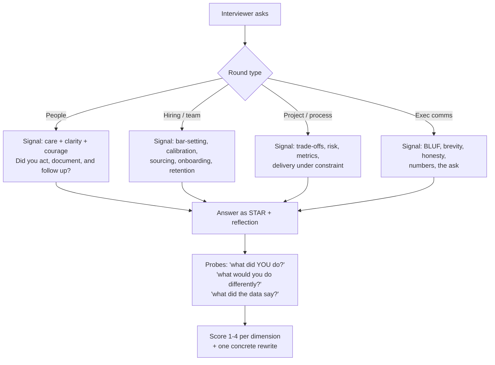

# EM Interview Drill

An engineering-manager loop tests judgement under ambiguity, not trivia. This drill runs realistic rounds
**one question at a time**, scores against a published rubric, and shows the model answer afterwards —
teaching-first, per [`AGENTS.md`](../../../AGENTS.md).

## When to use

- You're an IC/tech lead moving into management and have never been asked "walk me through a
  performance conversation you led".
- You're an EM interviewing at a new company and need calibrated practice across all four round types.
- You keep getting "great chat, but no strong signal" feedback and can't see what's missing.
- **Don't use it for** IC coding or system-design rounds
  ([coding-interview-drill](../coding-interview-drill/SKILL.md),
  [system-design-drill](../system-design-drill/SKILL.md)), or for real performance decisions about a real
  employee — this is rehearsal, not HR advice.

## First principles: four rounds, four different signals

Every EM loop is a variation on the same four probes. Each round asks for a different *kind* of evidence,
and candidates fail mostly by giving round-1 answers (empathy) to round-3 questions (judgement).



| Round | Representative question | Strong signal | Weak signal |
| --- | --- | --- | --- |
| People | "Tell me about someone on your team who was struggling." | named the gap early, wrote a plan, gave dated feedback, owned the outcome | "I coached them and it worked out" with no specifics |
| Hiring / team | "How do you set and hold a hiring bar?" | structured loop, calibrated rubric, debrief discipline, onboarding to first commit | "I go with gut feel / culture fit" |
| Project / process | "Your quarter is 40% behind at week 6. Go." | re-scopes with data, communicates early, names the trade-off, protects quality | promises overtime, hides the slip |
| Exec comms | "Give me a 60-second update for the CTO." | headline first, one number, one risk, one ask | chronological narration, no ask |

**Honest limits.** A drill can rehearse structure and probe-resilience; it cannot manufacture experience.
If you have never managed, say so plainly and answer from the closest real analogue (tech-lead, mentor,
on-call lead) — interviewers reward candour and punish invented headcount. Scores here are calibration
practice, not a prediction of any company's bar.

## Scoring rubric (per round)

| Dimension | 1 — no signal | 2 — mixed | 3 — solid | 4 — role model |
| --- | --- | --- | --- | --- |
| Situation clarity | vague, undated | some context | concrete team, timeline, stakes | crisp, quantified, one sentence |
| Your action ("I") | drifts into "we" | mixed | clear personal decisions | decisions *and* the alternatives rejected |
| Judgement / trade-offs | one option | mentions a trade-off | names trade-offs and picks | names the cost of the choice and mitigates |
| Evidence / metrics | none | anecdotal | specific numbers | numbers + how they were measured |
| Outcome + reflection | happy ending only | outcome stated | outcome + what you'd change | outcome, learning, and what you changed *since* |
| Communication | rambling | mostly clear | structured, timed | BLUF, tight, invites the follow-up |

## Procedure

1. **Set the level and context**: line EM (1 team), EM2 (multi-team), or senior EM/director. Expected scope
   changes the bar more than anything else.
2. **Pick the round** and state its signal aloud before the first question, so the learner knows what's
   being measured.
3. **Ask ONE question. Stop.** Never batch. Wait for the full answer before probing.
4. **Probe three times**: "what did *you* personally decide?", "what did the data say?", "what would you do
   differently?" — the probes are where the real score is earned.
5. **Score each dimension 1–4** with one line of evidence per score. No global vibes.
6. **Give one rewrite**, not five: take the weakest dimension and show the improved 4–6 sentence version.
7. **Escalate difficulty** — add a constraint (attrition risk, a peer who disagrees, a legal/HR boundary,
   a hard date) and re-ask.
8. **Cover all four rounds** across a session, then write the pattern: which dimension is consistently
   weakest across rounds?
9. **Produce a study plan**: 2–3 stories to build in [star-story-builder](../star-story-builder/SKILL.md),
   plus the metrics vocabulary from [engineering-metrics-coach](../engineering-metrics-coach/SKILL.md).
10. Close with the **Learning Footer**.

## Output shape

```
Level: line EM | EM2 | senior EM/director      Round: people | hiring | project | exec-comms
Q1: <the single question asked>
Answer summary: <2 lines>
Probes asked: <p1> · <p2> · <p3>
Scores: situation <1-4> · your-action <1-4> · judgement <1-4> · evidence <1-4> · outcome <1-4> · comms <1-4>
Evidence per score: <one line each>
Overall: <x>/24  ->  <no signal | mixed | hire | strong hire>
Weakest dimension: <...>
Rewrite (that dimension only): "<4-6 sentence improved answer>"
Escalation asked: <added constraint>  -> response quality: <...>
Pattern across rounds: <...>
Study plan: <2-3 stories / concepts to build>   Next round to drill: <...>
Learning Footer
```

## Worked exchange — scored

> **Interviewer (people round):** "Tell me about a time someone on your team was underperforming."
>
> **Candidate:** "We had an engineer who wasn't delivering. I paired with them a lot and eventually things
> improved."
>
> **Probe 1 — "What specifically was below bar, and when did you first name it to them?"**
> **Candidate:** "PRs took two weeks and needed heavy rework. I mentioned it in our 1:1 in March."
> **Probe 2 — "What did you write down, and what changed by when?"**
> **Candidate:** "We agreed on smaller PRs. I checked in weekly. By May, cycle time was in line with the
> team and they shipped the billing migration."
> **Probe 3 — "What would you do differently?"**
> **Candidate:** "Name it four weeks earlier. I told myself I was being kind; I was avoiding discomfort."
>
> **Scores:** situation 3 · your-action 3 · judgement 2 · evidence 3 · outcome 4 · comms 2 → **17/24, mixed
> → weak hire.** The reflection is the strongest part; the opening cost two dimensions.
>
> **Rewrite of the opener:** *"In March 2025 a mid-level engineer on my 6-person team had PR cycle times
> of ~14 days against a team p85 of 4, with heavy rework. I raised it directly in our next 1:1, wrote a
> 30-day plan with three specific behaviours and weekly checkpoints, and told my skip so there'd be no
> surprises. By May their p85 was 5 days and they led the billing migration. My mistake was waiting four
> weeks to name it — I now flag drift at the first 1:1 after I see it twice."*

## Tips

- "We" hides the signal. Interviewers are hiring *your* judgement — say "I decided", then credit the team.
- Every people answer needs a date, a document, and a follow-up; kindness without clarity scores as avoidance.
- Bring one number to every round — cycle time, attrition, hire-to-start, incident rate. Vague = unmeasured.
- Never invent headcount you never had; map the question to your closest real analogue and say so.
- In exec-comms rounds lead with the conclusion and end with the ask; chronology is the classic failure.
- Pair with [star-story-builder](../star-story-builder/SKILL.md),
  [leadership-principles-drill](../leadership-principles-drill/SKILL.md),
  [interview-debrief-coach](../interview-debrief-coach/SKILL.md),
  [hiring-process-coach](../hiring-process-coach/SKILL.md),
  [delegation-coach](../delegation-coach/SKILL.md),
  [performance-review-coach](../performance-review-coach/SKILL.md), and
  [exec-communication-coach](../exec-communication-coach/SKILL.md). End with the **Learning Footer**
  (`AGENTS.md`).
