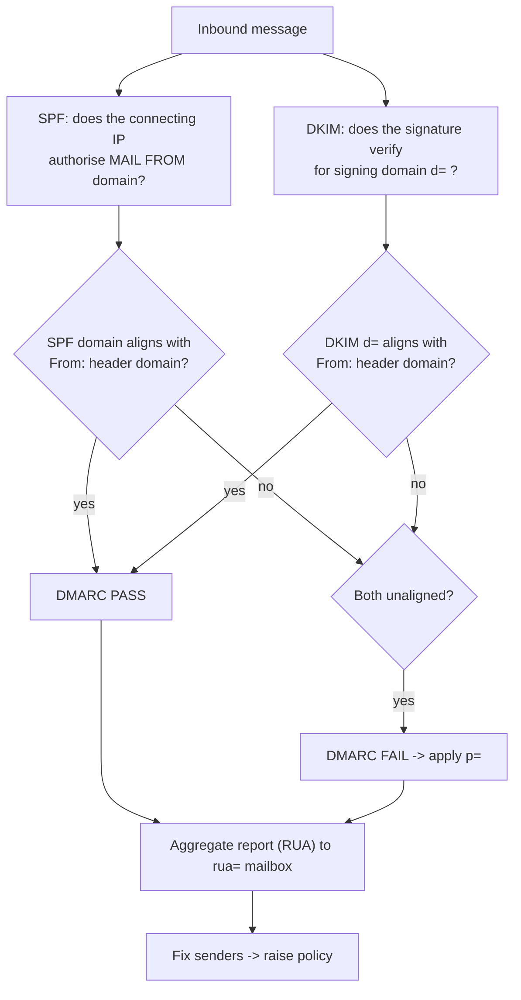

# Email Auth & Phishing Defense Lab

Email authentication is three independent checks plus one policy that ties them to the header the user
actually sees. Learn it by publishing records for a domain **you own and are authorized to change**,
following the verify-before-you-teach rule in [`AGENTS.md`](../../../AGENTS.md).

## When to use

- Your domain is spoofed, or a mailbox provider is quarantining your legitimate mail and nobody knows why.
- DMARC is stuck at `p=none` because no one can prove which senders would break at `reject`.
- Aggregate (RUA) XML is arriving and nobody reads it.
- **Don't use it for** sending phishing to third parties, running simulations against people who have not
  consented, or testing domains you do not control — that is out of scope here, permanently.

## First principles: three checks, one alignment

SPF (**RFC 7208**) authorises *sending IPs* for the `MAIL FROM` domain. DKIM (**RFC 6376**) cryptographically
signs the message, binding it to the `d=` signing domain. DMARC — now **RFC 9989** (Standards Track,
May 2026, obsoleting RFC 7489), with aggregate reporting in **RFC 9990** and failure reporting in
**RFC 9991** — publishes a policy for the **`From:` header domain** and passes only when at least one
underlying check **aligns** with it. Alignment is the whole point: neither SPF nor DKIM alone looks at the
address the human reads.



| Mechanism | Primary source | Authenticates | Survives forwarding? | Common failure |
| --- | --- | --- | --- | --- |
| SPF | RFC 7208 | connecting IP vs `MAIL FROM` | **no** (relay IP changes) | >10 DNS lookups → `permerror` |
| DKIM | RFC 6376 | message body/headers via `d=` selector | usually yes | body modified by a list/gateway |
| DMARC | RFC 9989 (+ 9990 RUA, 9991 RUF) | `From:` header domain via alignment | n/a — it *evaluates* | policy raised before senders are fixed |
| ARC | RFC 8617 | preserves prior auth results across forwarders | designed for it | receiver must choose to trust the chain |
| MTA-STS | RFC 8461 | enforces TLS to your MX | n/a | policy file/DNS mismatch |
| TLS-RPT | RFC 8460 | reports TLS delivery failures | n/a | nobody reads the reports |

**Trade-off to say out loud:** SPF breaks on forwarding, so a domain that relies on SPF alone will fail
DMARC for legitimately forwarded mail. DKIM survives forwarding, so **DKIM alignment is the durable
path to `p=reject`**. Note also that DMARCbis (RFC 9989) replaces Public Suffix List logic with a DNS
**tree walk** and deprecates the `pct` tag — confirm current tag support with your reporting provider
before relying on staged percentages.

## Procedure

1. **Inventory every sender** that puts your domain in `From:` — marketing platform, ticketing system,
   CI notifications, ERP, the finance appliance nobody documented. This list is the whole project.
2. **Publish DMARC at `p=none` with reporting first** so you collect evidence before enforcing:

   ```
   _dmarc.example.com.  TXT  "v=DMARC1; p=none; rua=mailto:dmarc@example.com; fo=1; adkim=r; aspf=r"
   ```

3. **Read the DNS you already have** (free, cross-platform):

   ```bash
   dig +short TXT example.com                  # SPF
   dig +short TXT _dmarc.example.com           # DMARC
   dig +short TXT selector1._domainkey.example.com   # DKIM public key
   ```

   ```powershell
   Resolve-DnsName -Type TXT example.com, _dmarc.example.com | Select-Object Name, Strings
   ```

4. **Fix SPF within the 10-lookup limit** (RFC 7208 §4.6.4): flatten or consolidate includes and end with
   `-all` once the sender list is verified; `~all` is a staging state, not a destination.
5. **Turn on DKIM signing for every sender**, one selector per service, ≥ 2048-bit RSA (or Ed25519 where
   supported), and schedule selector rotation.
6. **Prove alignment**, not just pass/fail — read `Authentication-Results:` in a received message and
   compare `header.d=` and `smtp.mailfrom=` to the `From:` domain. Relaxed alignment (`r`) permits an
   organisational-domain match; strict (`s`) demands exact.
7. **Test locally with a real SMTP sink** before touching production — Mailpit gives you a free local
   inbox and web UI ([mailpit-email-local-lab](../mailpit-email-local-lab/SKILL.md)):

   ```bash
   docker run --rm -p 1025:1025 -p 8025:8025 axllent/mailpit
   ```

8. **Parse the aggregate reports** (gzipped XML per RFC 9990) and rank failures by volume and source:

   ```bash
   gunzip -c report.xml.gz | python -c "import sys,xml.etree.ElementTree as ET; r=ET.parse(sys.stdin).getroot(); [print(x.findtext('row/source_ip'), x.findtext('row/count'), x.findtext('row/policy_evaluated/dkim'), x.findtext('row/policy_evaluated/spf'), x.findtext('identifiers/header_from')) for x in r.findall('record')]"
   ```

9. **Raise the policy in steps** — `none` → `quarantine` → `reject` — only when reports show ~0 aligned-fail
   volume from senders you recognise. Add `sp=` for subdomains and consider `np=` for non-existent
   subdomains (a DMARCbis tag; verify receiver support).
10. **Layer BEC controls** that DMARC cannot cover, then close with the **Learning Footer**.

## Output shape

```
Domain: <example.com>   (authorization confirmed: <owner/role>)
Senders: <service> -> <mechanism: SPF include | DKIM selector | both> · aligned=<yes|no>
SPF:   v=spf1 <mechanisms> <~all|-all>   lookups=<n>/10
DKIM:  <selector>._domainkey.<domain> · key=<rsa2048|ed25519> · rotation=<schedule>
DMARC: v=DMARC1; p=<none|quarantine|reject>; sp=<…>; rua=<mailto:…>; adkim=<r|s>; aspf=<r|s>
Alignment evidence: header.from=<…> · dkim d=<…> (<aligned|not>) · smtp.mailfrom=<…> (<aligned|not>)
RUA summary: window=<dates> · volume=<n> · aligned pass=<n> · fail by source=<ip/service: n>
Policy decision: raise to <level> on <date> because <evidence>; blocked by <sender> owner=<…>
Transport: MTA-STS=<none|testing|enforce> · TLS-RPT=<rua>  (RFC 8461 / RFC 8460)
BEC controls: <external-sender banner | lookalike-domain monitoring | payment-change out-of-band verify>
Scope note: authorized self-domain testing only; no third-party targets
Next: [phishing-resistant-auth-coach] · [dns-coach] · [security-logging-audit-coach]
Learning Footer
```

## Worked example — stuck at `p=none` because of one forwarder

Aggregate reports over 14 days: 412 000 messages, 99.2 % aligned pass. The 3 300 failures resolve to a
university alumni forwarder — SPF fails (relay IP not in the record, as expected per RFC 7208) and DKIM
**passes but is signed by the marketing vendor's own domain**, so `d=` does not align with `From:`.

Fix: configure the vendor to sign with `d=example.com` using selector `mkt1._domainkey.example.com`
instead of its shared domain. DKIM then aligns and survives the forwarding hop, which SPF never could.
Re-check after 7 days of reports, then move `p=none` → `p=quarantine`, hold two weeks, then `p=reject`.

```
_dmarc.example.com. TXT "v=DMARC1; p=quarantine; sp=reject; rua=mailto:dmarc@example.com; fo=1; adkim=r; aspf=r"
```

Note what DMARC still does **not** solve: a lookalike domain (`examp1e.com`) authenticates perfectly for
*its own* domain. That is a monitoring and human-process problem — out-of-band verification for any
payment or bank-detail change, and lookalike-domain registration monitoring.

## Tips

- Only ever test domains you own and are authorized to change; never send simulated phishing to people
  who have not consented through their organisation's programme.
- DKIM alignment, not SPF, is what gets you safely to `p=reject` — forwarding breaks SPF by design.
- Watch the **10 DNS lookup** SPF limit; exceeding it yields `permerror` and silently degrades everything.
- `p=none` is a measurement state. If you have been there for a year, you have monitoring, not protection.
- A perfect DMARC posture does not stop lookalike domains or a compromised legitimate mailbox — pair with
  [phishing-resistant-auth-coach](../phishing-resistant-auth-coach/SKILL.md) for the account side.
- Keep DKIM keys out of the repo — [secrets-management-coach](../secrets-management-coach/SKILL.md).
- Pair with [dns-coach](../dns-coach/SKILL.md),
  [mailpit-email-local-lab](../mailpit-email-local-lab/SKILL.md),
  [tls-ssl-explainer](../tls-ssl-explainer/SKILL.md),
  [security-logging-audit-coach](../security-logging-audit-coach/SKILL.md), and
  [threat-hunting-drill](../threat-hunting-drill/SKILL.md).
  End with the **Learning Footer** (`AGENTS.md`).
