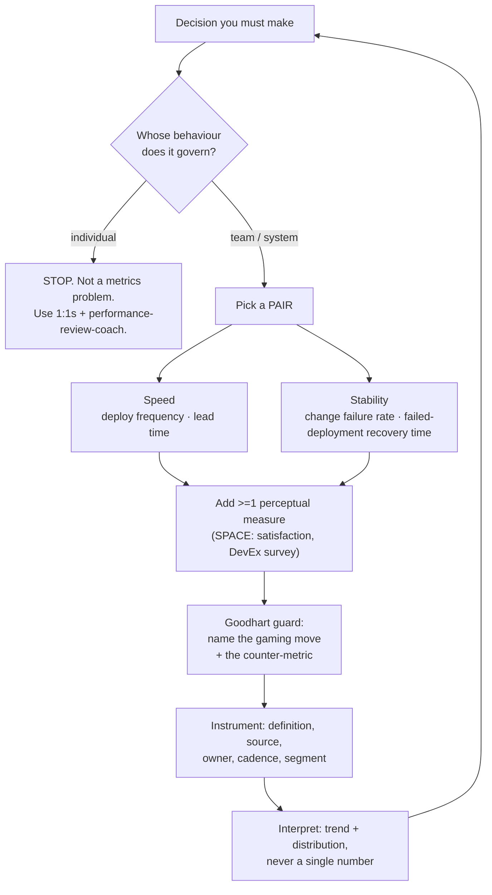

# Engineering Metrics Coach

Engineering metrics are only useful when they inform a *decision* and are safe from being turned into a
stick. This skill teaches the **DORA four keys**, **SPACE**, and **DevEx** together, with explicit
anti-weaponisation design, following the honesty-about-limits stance in
[`AGENTS.md`](../../../AGENTS.md).

## When to use

- You need to know whether a platform investment, a process change, or a reorg actually helped.
- Someone above you is proposing lines-of-code, commit counts, or story points per engineer.
- You have dashboards nobody acts on and want to cut them down to metrics tied to decisions.
- **Don't use it for** individual performance review or stack ranking — that is the one application these
  frameworks explicitly warn against; use [performance-review-coach](../performance-review-coach/SKILL.md).

## First principles: speed and stability, perception and telemetry

DORA's research programme (Nicole Forsgren, Jez Humble, Gene Kim; *Accelerate*, 2018, and the annual State
of DevOps reports) found four delivery metrics that co-vary with organisational performance — and crucially
that **throughput and stability rise together**, so the pairs must be reported together or the system will
be gamed. SPACE (Forsgren, Storey, Maddila, Zimmermann, Houck, Butler, *ACM Queue*, 2021) adds that
productivity is multidimensional and that at least one *perceptual* measure belongs in every set. DevEx
(Noda, Storey, Forsgren, Greiler, *ACM Queue*, 2023) reduces developer experience to feedback loops,
cognitive load, and flow state.



| Metric (DORA four keys) | Definition | Typical instrumentation | Gaming move | Counter |
| --- | --- | --- | --- | --- |
| Deployment frequency | how often code reaches production | CD pipeline deploy events | trivial no-op deploys | pair with change failure rate; count *value-bearing* deploys |
| Lead time for changes | commit → running in production | VCS + deploy timestamps | tiny PRs, work started off-branch | measure from first commit; watch batch size and rework |
| Change failure rate | % of deploys causing degraded service | incident/rollback tags | under-reporting incidents | blameless reporting; reconcile with alerting data |
| Failed-deployment recovery time | time to restore after a failed change | incident open→resolve | closing incidents early | customer-visible restore, spot-check samples |

| Framework | Dimensions | Adds what DORA lacks | Caution |
| --- | --- | --- | --- |
| SPACE | Satisfaction, Performance, Activity, Communication, Efficiency | perception + collaboration + wellbeing | activity metrics alone are the trap |
| DevEx | Feedback loops, Cognitive load, Flow state | the *causes* of slow delivery | mostly survey-based; needs consistent wording |
| Flow metrics | cycle time, WIP, throughput, flow efficiency | queueing behaviour inside the team | see [kanban-flow-coach](../kanban-flow-coach/SKILL.md) |

**Limits, stated plainly.** DORA benchmarks are self-reported survey clusters, not laws of nature — a
cluster label ("elite") is a description, not a target. Correlation with organisational performance is not
proof that hitting a number causes it. Small teams have tiny samples, so weekly point estimates are noise;
look at trends over quarters and at distributions (p50/p85), never a single mean. And **Goodhart's Law**
applies to every row above: when a measure becomes a target, it stops being a good measure.

## Procedure

1. **Write the decision first.** "We will/won't fund a build-cache team next quarter." No decision → no
   metric. Metrics without decisions become dashboards nobody reads.
2. **Refuse individual attribution.** State it up front, in writing, and name the unit of analysis: team,
   service, or value stream.
3. **Select a pair, not a number** — one speed and one stability key. Add one SPACE perceptual measure and
   one DevEx driver (feedback-loop length, cognitive load) that explains *why*.
4. **Define each metric operationally**: exact events, start/stop boundaries, exclusions, source system,
   owner, refresh cadence. Ambiguity here produces months of arguing about the number.
5. **Baseline before you change anything** — at least 8–12 weeks of history, or you cannot attribute later
   movement to your intervention.
6. **Run the Goodhart pre-mortem**: for each metric, write how a rational person would game it and the
   counter-metric or qualitative check that catches it. If you can't, drop the metric.
7. **Report distributions and trends**: p50 and p85, rolling windows, segmented by service or team. Never
   rank teams against each other publicly.
8. **Pair the numbers with a survey** (5–8 questions, identical wording each round) so perception and
   telemetry can disagree — disagreement is the most informative result you'll get.
9. **Close the loop**: state the decision the data drove, what you changed, and when you'll re-measure.
   Retire metrics that never changed a decision.
10. Report using the shape below and finish with the **Learning Footer**.

## Output shape

```
Decision this informs: <...>          Unit of analysis: team | service | value stream
Explicit non-use: not for individual evaluation, compensation, or ranking.
Metric set:
  Speed:      <deploy frequency | lead time>  def: <events, start->stop, exclusions>  source: <...>
  Stability:  <change failure rate | recovery time>  def: <...>  source: <...>
  Perceptual (SPACE): <survey item, exact wording>  cadence: <...>
  DevEx driver: <feedback loop | cognitive load | flow state>  proxy: <...>
Baseline: <window> · p50 <...> · p85 <...>
Goodhart guards: <metric> gamed by <move> -> counter: <counter-metric / check>
Reporting: <trend + distribution, segment, cadence, audience>
Interpretation: <what moved, what did NOT, plausible confounders>
Decision taken: <...>   Re-measure on: <date>
Learning Footer
```

## Worked example — a metric set that survived contact

A 5-team platform group wanted to justify investing in CI caching.

| Element | Value | Notes |
| --- | --- | --- |
| Decision | Fund a 2-engineer build-perf effort for one quarter? | binary, dated |
| Speed | Lead time p85: **9.4 days** (12-week baseline) | first commit → prod |
| Stability | Change failure rate: **14%**, recovery p50 **48 min** | from incident tags |
| Perceptual | "I can get feedback on a change in under 30 minutes" — **31% agree** (n = 62) | identical wording each round |
| DevEx driver | CI p85 wall-clock **38 min** | the feedback loop being attacked |
| Goodhart guard | Lead time gamed by splitting PRs → counter: track PRs/change and rework rate | written before rollout |
| Result after 1 quarter | CI p85 → 11 min; agreement 31% → 68%; lead time p85 → 6.1 days; CFR flat at 13% | speed improved without stability cost |
| Honest caveat | A reorg moved one team mid-quarter; two of five teams drove most of the gain. | attribution is partial |

Note the last row. Reporting the confounder is what makes the rest of the numbers believable.

## Tips

- Never report a speed metric alone; the stability partner is what stops the gaming.
- Benchmarks describe, they do not prescribe — "elite" is a cluster label, not a goal.
- If a metric can be traced to one person's name on a dashboard, you have built a surveillance tool.
- Survey wording must be frozen across rounds, or your trend is measuring your editing.
- When perception and telemetry disagree, believe the disagreement and go investigate — it's the finding.
- Retire any metric that has never changed a decision; dashboards have a maintenance cost too.
- Pair with [kanban-flow-coach](../kanban-flow-coach/SKILL.md) for flow,
  [metrics-definition-coach](../metrics-definition-coach/SKILL.md) for definitions,
  [slo-designer](../slo-designer/SKILL.md) and [observability-plan](../observability-plan/SKILL.md) for
  instrumentation, [incident-postmortem](../incident-postmortem/SKILL.md) for failure data,
  [tech-debt-coach](../tech-debt-coach/SKILL.md) for the investment case, and
  [exec-communication-coach](../exec-communication-coach/SKILL.md) to present it. Close with the
  **Learning Footer** (`AGENTS.md`).
