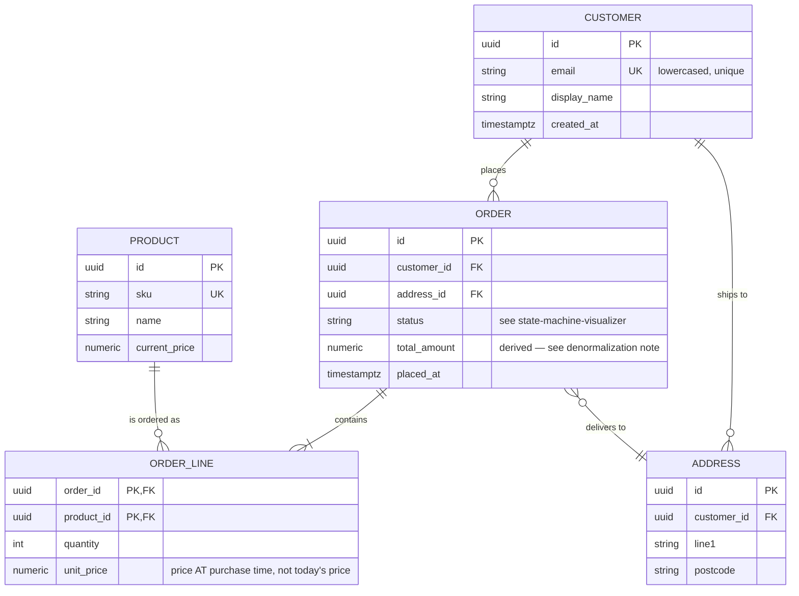

# ER Diagram Generator

A schema you can *see* is a schema you can argue about. Following [`AGENTS.md`](../../../AGENTS.md) §4
(visuals by default) and §2 (never invent a relationship), this skill turns DDL, ORM classes or prose
into a Mermaid `erDiagram` with honest cardinality and a normalization review.

## When to use

- You have `CREATE TABLE` statements, Django/SQLAlchemy/Prisma/EF models, or a Mongo/JSON sample and want
  the shape at a glance.
- You are designing a new domain and need to test the model against real questions before writing DDL.
- Onboarding to an unfamiliar database, or reviewing a migration
  ([database-migration-coach](../database-migration-coach/SKILL.md)).
- **Not** for behaviour over time (use [state-machine-visualizer](../state-machine-visualizer/SKILL.md))
  or for class inheritance and methods (use a `classDiagram`).

## First principles

An entity is a thing you must **identify** (it has a key); an attribute is a fact **about** exactly one
entity; a relationship is a fact **between** entities. Normalization is one rule applied repeatedly:
*every non-key attribute depends on the key, the whole key, and nothing but the key.* Denormalization is
that rule deliberately broken in exchange for read speed — which is a trade, never a default.



## Cardinality and relationship notation

| Meaning on that side | Mermaid marker | Reads as |
| --- | --- | --- |
| Exactly one | `\|\|` | "one and only one" |
| Zero or one | `\|o` | optional single |
| Zero or more | `}o` | optional many |
| One or more | `}\|` | mandatory many |
| Identifying (child can't exist alone) | solid line `--` | `ORDER \|\|--\|{ ORDER_LINE` |
| Non-identifying (child stands alone) | dashed line `..` | `PRODUCT \|\|..o{ REVIEW` |

Left marker describes the **left** entity's participation, right marker the **right** entity's — so
`CUSTOMER ||--o{ ORDER : places` means *one customer, zero-or-more orders*. Attribute keys are declared
with `PK`, `FK`, `UK` (combinable: `PK, FK`), and a quoted string after an attribute becomes its comment.
This is the notation defined in the **Mermaid** entity-relationship diagram documentation.

## Procedure

1. **Take the source as given** — DDL, ORM models, JSON, or prose — and list the candidate entities.
   Prefer singular, upper-case, domain-language names (`ORDER_LINE`, not `tbl_ord_ln_2`).
2. **Find the key for each entity.** No key, no entity: it is either an attribute of something else or a
   relationship in disguise.
3. **Classify every relationship's cardinality on both sides** and — crucially — its **optionality**.
   "Can an order exist with no lines?" is the question that produces `o{` vs `|{`.
4. **Break every many-to-many into a junction entity** with its own attributes (`quantity`,
   `unit_price`, `enrolled_at`). The attributes are why the junction deserves a name.
5. **Mark identifying relationships** (`--`) where the child's identity includes the parent's key, and
   non-identifying (`..`) otherwise. This drives cascade-delete decisions.
6. **Add attributes sparingly** — keys, foreign keys, and the 3–6 attributes that carry meaning. A
   diagram with every column is a `DESCRIBE`, not a diagram.
7. **Run the normalization pass** and comment explicitly:
   - **1NF** — any repeating group / comma-separated list / array pretending to be a column?
   - **2NF** — any non-key attribute depending on part of a composite key?
   - **3NF** — any attribute depending on another non-key attribute (`city` from `postcode`)?
   - **Deliberate denormalization** — name it, state the read it accelerates, and the write-time
     invariant that now needs enforcing (`orders.total_amount` must be recomputed on line change).
8. **Snapshot vs. reference:** flag every attribute that must record a value *as of* a moment
   (`unit_price`) rather than pointing at a mutable row (`product.current_price`). This is the most
   common modelling bug in commerce, payroll and billing schemas.
9. **Test the model against real questions** — write 3–5 queries the business will ask and check the
   model can answer them without a guess.
10. **List what's missing:** soft deletes, audit columns, tenancy, time zones, indexes
    ([sql-indexing-lab](../sql-indexing-lab/SKILL.md)), and add the accessibility layer — caption, alt
    text, and an entity/relationship table as the text equivalent; see
    [diagram-accessibility-coach](../diagram-accessibility-coach/SKILL.md).

## Output shape

```
Domain: <name>  ·  Source: <DDL | ORM | prose>  ·  Entities: <n>

```mermaid
erDiagram
  <relationships>
  <entity blocks with PK/FK/UK>
```

Relationship reading
- One <A> places zero-or-more <B>  (optional because <reason>)

Normalization review
- 1NF: <pass | violation + fix>
- 2NF: <pass | violation + fix>
- 3NF: <pass | violation + fix>
- Deliberate denormalization: <column> — buys <read>, costs <write invariant>

Questions this model answers: <q1, q2, q3>
Questions it cannot answer yet: <gap + the change needed>
Alt text: <short prose summary>
Next: <related skill link>
```

## Tips

- **Optionality is where the bugs are.** `||--o{` vs `||--|{` decides whether your code must handle an
  empty collection; get it from the business, not from the current data.
- A junction table with no extra attributes is fine; a junction table with attributes is a real entity —
  give it a domain name (`ENROLMENT`, not `STUDENT_COURSE`). Nullable foreign key = optional
  relationship: if the FK is nullable but you drew `||`, one of the two is wrong.
- For document/NoSQL stores, an `erDiagram` still helps — draw the *logical* entities, then decide
  embed-vs-reference with [nosql-data-modeling](../nosql-data-modeling/SKILL.md).
- Keep the diagram readable: ~10 entities max per view; split by bounded context and cross-reference.
- Colour is never the encoding — key markers and labels carry the meaning (WCAG 2.2 **1.4.1**).
- Pair with [data-modeling-drill](../data-modeling-drill/SKILL.md),
  [database-selection-advisor](../database-selection-advisor/SKILL.md),
  [data-warehouse-modeling](../data-warehouse-modeling/SKILL.md),
  [sql-query-explainer](../sql-query-explainer/SKILL.md) and
  [visual-explainer](../visual-explainer/SKILL.md).
  End with the **Learning Footer** (`AGENTS.md`).
