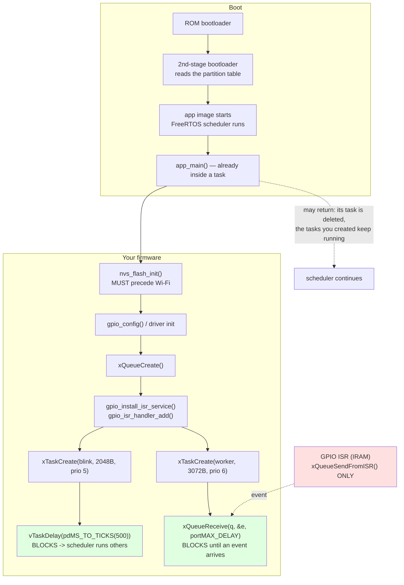

# ESP-IDF Lab

Embedded firmware taught as a stack you can see through — **CMake project → FreeRTOS tasks → peripheral
drivers → persistence → networking** — in the build-it-and-run-it spirit of
[`AGENTS.md`](../../../AGENTS.md). Every API, flag and default below is in the **ESP-IDF Programming Guide**
(`docs.espressif.com/projects/esp-idf/`, versioned per release — the **v5.x** line at the time of writing)
and the `espressif/esp-idf` repository; FreeRTOS kernel APIs are documented at `freertos.org`.

## When to use

- The learner is moving from Arduino to a real RTOS-based SDK and needs to understand what `app_main` sits
  on top of.
- They need genuine concurrency on a microcontroller — a blinking LED that keeps blinking while a button
  interrupt is serviced — instead of `delay()` in a superloop.
- The device must remember something across reboots, or join Wi-Fi, and they need the *ordering* rules
  (NVS before Wi-Fi, event loop before the driver).
- They are hitting `Task watchdog got triggered`, a stack overflow, or a Guru Meditation reset and need the
  diagnosis method rather than a random fix.
- **Don't use it for** the vendor-neutral RTOS alternative — see
  [zephyr-rtos-lab](../zephyr-rtos-lab/SKILL.md) — for robot middleware
  ([ros2-nodes-lab](../ros2-nodes-lab/SKILL.md)), or for the broker side of a telemetry pipeline
  ([mosquitto-mqtt-lab](../mosquitto-mqtt-lab/SKILL.md)).

## First principles: `app_main` is already a FreeRTOS task

ESP-IDF is not a bare-metal loop with helper functions. By the time your code runs, an RTOS has booted, a
scheduler is running, and `app_main()` is being called **from inside a task**. Four consequences drive
everything else:

1. **You never own the CPU.** Any code that loops without blocking starves lower-priority tasks and the idle
   task — which is what feeds the **task watchdog**. Yielding (`vTaskDelay`, a blocking queue receive) is not
   politeness, it is correctness.
2. **Time is quantised by the tick.** `CONFIG_FREERTOS_HZ` defaults to **100 Hz**, so one tick is 10 ms.
   `pdMS_TO_TICKS(ms)` converts, with integer truncation — and that truncation bites (below).
3. **ISRs are a different world.** In an interrupt handler you may only call the `…FromISR` APIs, must not
   block, and must not log or allocate. The correct pattern is *ISR posts to a queue, task does the work.*
4. **Everything returns `esp_err_t`.** Unchecked return values are how firmware fails silently at 3 a.m.
   `ESP_ERROR_CHECK()` turns a mistake into an immediate, backtraced abort.



*Fig. 1 — the ESP-IDF startup and runtime model. The two green boxes are the only reason this design works:
both tasks spend nearly all their time **blocked**, which is what lets the CPU serve interrupts, feed the
watchdog and idle at low power.*

| Concept | ESP-IDF specific | Gotcha |
| --- | --- | --- |
| Task stack | `xTaskCreate(fn, "name", **bytes**, arg, prio, &handle)` | vanilla FreeRTOS counts **words**; ESP-IDF counts **bytes** |
| Core affinity | `xTaskCreatePinnedToCore(..., core_id)` | ESP32/S3 are dual-core; C3/S2 are single-core |
| Delay | `vTaskDelay(pdMS_TO_TICKS(ms))` | see the truncation trap below |
| Priority | higher number = higher priority | a high-priority busy loop starves everything |
| ISR → task | `xQueueSendFromISR` + `portYIELD_FROM_ISR` | never `ESP_LOGx`, `malloc` or block in an ISR |
| Errors | `ESP_ERROR_CHECK(x)`, `esp_err_to_name(e)` | `ESP_ERROR_CHECK` **aborts** — use `_WITHOUT_ABORT` where recovery is possible |
| Persistence | `nvs_flash_init` → `nvs_open` → `nvs_set_*` → **`nvs_commit`** | without `nvs_commit` nothing is written |
| Logging | `static const char *TAG`; `ESP_LOGI(TAG, ...)` | level is compile-time *and* runtime (`esp_log_level_set`) |

### The tick-truncation trap, computed

$$ \texttt{pdMS\_TO\_TICKS}(x) = \left\lfloor \frac{x \times \texttt{CONFIG\_FREERTOS\_HZ}}{1000} \right\rfloor $$

At the default 100 Hz:

| Requested delay | Ticks | Actual behaviour |
| --- | --- | --- |
| 500 ms | $\lfloor 500 \times 100/1000 \rfloor = 50$ | 500 ms — exact |
| 15 ms | $\lfloor 15 \times 100/1000 \rfloor = 1$ | **10 ms** — a third short |
| 5 ms | $\lfloor 5 \times 100/1000 \rfloor = \mathbf{0}$ | **no delay at all** — `vTaskDelay(0)` yields but does not block ⇒ busy loop ⇒ **task watchdog** |

So "just add a 5 ms delay to fix the watchdog" makes it *worse* at the default tick rate. Either raise
`CONFIG_FREERTOS_HZ` in `menuconfig`, or use `esp_rom_delay_us()` / a timer for sub-tick waits — and never
busy-wait on a pinned core.

## Procedure

1. **Install the toolchain once** (Linux/macOS shown; on Windows use the ESP-IDF Installer, then
   `install.bat` / `export.bat`):
   ```bash
   git clone -b v5.3 --recursive https://github.com/espressif/esp-idf.git ~/esp/esp-idf
   cd ~/esp/esp-idf && ./install.sh esp32          # or: ./install.sh esp32,esp32s3,esp32c3
   . ~/esp/esp-idf/export.sh                       # per shell — sets IDF_PATH and PATH
   idf.py --version
   ```
   ⚠ Pin a release branch (`-b v5.x`) rather than tracking `master`; ESP-IDF's APIs move between major
   versions. Verify the **current stable release** on the Programming Guide's version selector.
2. **Create the project skeleton** — three files and nothing else:
   ```bash
   idf.py create-project esp-idf-lab && cd esp-idf-lab
   idf.py set-target esp32                         # regenerates sdkconfig for that chip
   ```
   `CMakeLists.txt` (top level), `main/CMakeLists.txt`, `main/main.c`. The `main` component implicitly
   depends on all built-in components, so `idf_component_register(SRCS "main.c" INCLUDE_DIRS "")` is enough.
3. **Configure, don't hard-code.** `idf.py menuconfig` writes `sdkconfig` (git-ignored); commit
   `sdkconfig.defaults` with the settings that matter (tick rate, log level, flash size, Wi-Fi credentials
   via `Kconfig.projbuild` if you add one).
4. **Build, flash, monitor** — one command:
   ```bash
   idf.py build
   idf.py -p /dev/ttyUSB0 flash monitor            # Windows: -p COM3   ·   exit the monitor with Ctrl+]
   ```
   `idf.py monitor` automatically decodes panic backtraces into file:line, which makes crashes readable.
5. **No hardware? Run it anyway.** ESP-IDF ships QEMU integration (`idf.py qemu monitor` in recent 5.x —
   check *"Running ESP-IDF apps in QEMU"* in the Programming Guide for the exact command and the
   `idf_tools.py install qemu-*` step for your version). The **Wokwi** browser simulator also runs ESP-IDF
   projects free, with virtual LEDs, buttons and sensors — ideal for the example below.
6. **Design in tasks, not in a superloop.** One responsibility per task, each blocking on a delay, queue,
   semaphore or event group. Give each task a stack you have *measured*, not guessed.
7. **Handle interrupts with the ISR→queue pattern**: install the ISR service, add a per-pin handler, do the
   minimum in the handler (`xQueueSendFromISR`), and put the logging/work in a task.
8. **Check every `esp_err_t`.** Wrap fatal-if-failed calls in `ESP_ERROR_CHECK()`; for recoverable ones
   branch on the value and log `esp_err_to_name(err)`.
9. **Persist with NVS in the right order**: `nvs_flash_init()` (handling `ESP_ERR_NVS_NO_FREE_PAGES` /
   `ESP_ERR_NVS_NEW_VERSION_FOUND` by erasing and re-initialising) → `nvs_open` → get/set → **`nvs_commit`**
   → `nvs_close`. Wi-Fi stores calibration data in NVS, so NVS must be initialised **before** `esp_wifi_init`.
10. **Bring up Wi-Fi in the documented order**: `esp_netif_init()` → `esp_event_loop_create_default()` →
    `esp_netif_create_default_wifi_sta()` → `esp_wifi_init()` → register handlers for `WIFI_EVENT` and
    `IP_EVENT` → `esp_wifi_set_mode(WIFI_MODE_STA)` → `esp_wifi_set_config()` → `esp_wifi_start()`, then call
    `esp_wifi_connect()` on `WIFI_EVENT_STA_START` and wait for `IP_EVENT_STA_GOT_IP`. Skipping a step gives
    an `ESP_ERR_WIFI_NOT_INIT`-class failure, not a silent one.
11. **Measure the resources you actually used**: `idf.py size` / `size-components` for flash and static RAM,
    `esp_get_free_heap_size()` at runtime, and `uxTaskGetStackHighWaterMark()` per task. Then right-size the
    stacks. Close with the **Learning Footer**.

## Output shape

```
Goal: <blink | sensor read | ISR handling | persist setting | join Wi-Fi>
Target: <esp32|esp32s3|esp32c3|...>   ESP-IDF: <v5.x, from idf.py --version>   Board: <name>
Run mode: <hardware /dev/ttyUSB0 | QEMU | Wokwi simulator>
Project: CMakeLists.txt · main/CMakeLists.txt · main/main.c · sdkconfig.defaults <keys changed: ...>
Tick rate: CONFIG_FREERTOS_HZ=<100> -> 1 tick = <10> ms   pdMS_TO_TICKS(<x>) = <n> ticks (truncation checked)
Tasks:
  <name> prio <n> stack <bytes> core <0|1|any> blocks on <vTaskDelay|queue|event group>
Peripherals: GPIO <n> <in|out> pull <up|down|none> intr <NEGEDGE|POSEDGE|none>
ISR pattern: <xQueueSendFromISR + portYIELD_FROM_ISR>  · nothing blocking/logging inside the ISR: <y>
Persistence: namespace <..> key <..> type <i32|str|blob>   nvs_commit called: <y>
Wi-Fi: mode <STA|AP|APSTA>  order verified (nvs -> netif -> event loop -> wifi_init -> handlers -> start): <y>
Error handling: ESP_ERROR_CHECK on <n> calls · recoverable branches on <...>
Build/flash: idf.py build && idf.py -p <port> flash monitor    (exit monitor: Ctrl+])
Resources: flash <..> KB · static RAM <..> KB · free heap at runtime <..> B
  stack high-water: <task>=<..> · <task>=<..>   -> stacks resized to <...>
Failure modes checked: task watchdog · stack overflow · unchecked esp_err_t · sub-tick delay
Next: <zephyr-rtos-lab | mosquitto-mqtt-lab | opc-ua-coach>
Learning Footer
```

## Worked example — blink + button ISR + a boot counter that survives reset

Three lessons in one small program: a task that blocks correctly, an interrupt handed off to a task, and a
value that persists across power cycles. It runs on a dev board, in QEMU, or in Wokwi.

`main/CMakeLists.txt`:

```cmake
idf_component_register(SRCS "main.c" INCLUDE_DIRS "")
```

`main/main.c`:

```c
#include <inttypes.h>
#include "freertos/FreeRTOS.h"
#include "freertos/task.h"
#include "freertos/queue.h"
#include "driver/gpio.h"
#include "esp_log.h"
#include "esp_err.h"
#include "esp_system.h"
#include "nvs_flash.h"
#include "nvs.h"

static const char *TAG = "lab";

/* ⚠ Board-specific. Many ESP32 dev boards wire an LED to GPIO2 and the BOOT button to
   GPIO0 (active LOW). Check YOUR board's schematic before wiring anything. */
#define LED_GPIO  GPIO_NUM_2
#define BTN_GPIO  GPIO_NUM_0

static QueueHandle_t  btn_q;
static TaskHandle_t   blink_handle;

/* ---- ISR: do the absolute minimum. No logging, no malloc, no blocking. ---- */
static void IRAM_ATTR btn_isr(void *arg)
{
    uint32_t pin = (uint32_t)(uintptr_t)arg;
    BaseType_t hp_task_woken = pdFALSE;
    xQueueSendFromISR(btn_q, &pin, &hp_task_woken);   /* the ONLY safe way out of an ISR */
    if (hp_task_woken == pdTRUE) {
        portYIELD_FROM_ISR();                         /* switch immediately to the woken task */
    }
}

/* ---- Task 1: blinks forever, but spends ~100% of its life BLOCKED. ---- */
static void blink_task(void *arg)
{
    int level = 0;
    while (1) {
        gpio_set_level(LED_GPIO, level);
        level = !level;
        vTaskDelay(pdMS_TO_TICKS(500));   /* 500 ms -> 50 ticks at 100 Hz. Exact, and it YIELDS. */
    }
}

/* ---- Task 2: wakes only when the ISR posts an event. ---- */
static void button_task(void *arg)
{
    uint32_t pin;
    while (1) {
        if (xQueueReceive(btn_q, &pin, portMAX_DELAY) == pdTRUE) {   /* blocks indefinitely */
            ESP_LOGI(TAG, "button GPIO%" PRIu32 " | free heap %" PRIu32 " B | blink stack headroom %u",
                     pin, esp_get_free_heap_size(),
                     (unsigned)uxTaskGetStackHighWaterMark(blink_handle));
            /* Real firmware debounces here: ignore edges within ~50 ms of the last one. */
        }
    }
}

/* ---- Persistence: increments on every boot and survives power loss. ---- */
static int32_t bump_boot_count(void)
{
    esp_err_t err = nvs_flash_init();
    if (err == ESP_ERR_NVS_NO_FREE_PAGES || err == ESP_ERR_NVS_NEW_VERSION_FOUND) {
        ESP_ERROR_CHECK(nvs_flash_erase());   /* documented recovery path, not a hack */
        err = nvs_flash_init();
    }
    ESP_ERROR_CHECK(err);

    nvs_handle_t h;
    ESP_ERROR_CHECK(nvs_open("storage", NVS_READWRITE, &h));

    int32_t count = 0;
    err = nvs_get_i32(h, "boot_count", &count);
    if (err == ESP_ERR_NVS_NOT_FOUND) {
        count = 0;                            /* first ever boot: the key genuinely does not exist */
    } else {
        ESP_ERROR_CHECK(err);                 /* any OTHER error is a real bug — don't swallow it */
    }
    count++;
    ESP_ERROR_CHECK(nvs_set_i32(h, "boot_count", count));
    ESP_ERROR_CHECK(nvs_commit(h));           /* WITHOUT THIS, nothing is persisted */
    nvs_close(h);
    return count;
}

void app_main(void)
{
    ESP_LOGI(TAG, "boot #%" PRIi32, bump_boot_count());

    const gpio_config_t led = {
        .pin_bit_mask = 1ULL << LED_GPIO,     /* a BITMASK, not a pin number */
        .mode         = GPIO_MODE_OUTPUT,
        .pull_up_en   = GPIO_PULLUP_DISABLE,
        .pull_down_en = GPIO_PULLDOWN_DISABLE,
        .intr_type    = GPIO_INTR_DISABLE,
    };
    ESP_ERROR_CHECK(gpio_config(&led));

    const gpio_config_t btn = {
        .pin_bit_mask = 1ULL << BTN_GPIO,
        .mode         = GPIO_MODE_INPUT,
        .pull_up_en   = GPIO_PULLUP_ENABLE,   /* idle HIGH; the button pulls it LOW */
        .pull_down_en = GPIO_PULLDOWN_DISABLE,
        .intr_type    = GPIO_INTR_NEGEDGE,    /* fire on the press, not the release */
    };
    ESP_ERROR_CHECK(gpio_config(&btn));

    btn_q = xQueueCreate(8, sizeof(uint32_t));
    configASSERT(btn_q != NULL);

    ESP_ERROR_CHECK(gpio_install_isr_service(0));
    ESP_ERROR_CHECK(gpio_isr_handler_add(BTN_GPIO, btn_isr, (void *)(uintptr_t)BTN_GPIO));

    /* Stack sizes are in BYTES in ESP-IDF. button_task logs, so it needs more than blink_task. */
    xTaskCreate(blink_task,  "blink",  2048, NULL, 5, &blink_handle);
    xTaskCreate(button_task, "button", 3072, NULL, 6, NULL);

    /* app_main may now return: its own task is deleted; the two above keep running. */
}
```

Build and run:

```bash
. ~/esp/esp-idf/export.sh
idf.py set-target esp32
idf.py build
idf.py -p /dev/ttyUSB0 flash monitor     # or: idf.py qemu monitor   (no hardware needed)
```

Expected monitor output (timestamps in ms since boot will differ):

```
I (305) lab: boot #1
I (4211) lab: button GPIO0 | free heap 289... B | blink stack headroom ...
```

Press reset and the counter reads `boot #2` — proof that `nvs_commit()` did its job. Comment out the
`nvs_commit()` line, reflash, and it stays at the same number forever: the single most instructive
five-second experiment in the whole lab.

**Trace the timing.** `pdMS_TO_TICKS(500)` at `CONFIG_FREERTOS_HZ = 100` is
$\lfloor 500 \times 100 / 1000 \rfloor = 50$ ticks × 10 ms = **exactly 500 ms**, so the LED toggles at 1 Hz
(500 ms on, 500 ms off). Now break it deliberately: change the delay to `pdMS_TO_TICKS(5)`. That evaluates to
$\lfloor 5 \times 100/1000 \rfloor = \mathbf{0}$ ticks, so `vTaskDelay(0)` yields without blocking, `blink_task`
becomes a busy loop, and within seconds the monitor prints `Task watchdog got triggered. The following tasks
did not reset the watchdog in time:`. Seeing that failure on purpose is worth more than reading about it.

**Wi-Fi, in the order that matters.** Add this before creating the tasks (full working code is in
`examples/wifi/getting_started/station` in the ESP-IDF repository — read it rather than retyping from memory):

```c
ESP_ERROR_CHECK(esp_netif_init());                    /* 1. TCP/IP stack */
ESP_ERROR_CHECK(esp_event_loop_create_default());     /* 2. event loop, BEFORE any handler */
esp_netif_create_default_wifi_sta();                  /* 3. the STA netif */
wifi_init_config_t cfg = WIFI_INIT_CONFIG_DEFAULT();
ESP_ERROR_CHECK(esp_wifi_init(&cfg));                 /* 4. needs NVS already initialised */
/* 5. register handlers for WIFI_EVENT/ESP_EVENT_ANY_ID and IP_EVENT/IP_EVENT_STA_GOT_IP */
ESP_ERROR_CHECK(esp_wifi_set_mode(WIFI_MODE_STA));
ESP_ERROR_CHECK(esp_wifi_set_config(WIFI_IF_STA, &wifi_config));
ESP_ERROR_CHECK(esp_wifi_start());                    /* -> WIFI_EVENT_STA_START -> esp_wifi_connect() */
```

`bump_boot_count()` already called `nvs_flash_init()`, which is exactly why it comes first in `app_main` —
Wi-Fi persists calibration data in NVS and `esp_wifi_init` fails without it.

## Tips

- **`Task watchdog got triggered` means a task never yielded.** Find the loop with no `vTaskDelay`/blocking
  call — and remember a sub-tick `pdMS_TO_TICKS` rounds to 0 and does *not* block.
- ESP-IDF measures task stacks in **bytes**; vanilla FreeRTOS tutorials use words. Copying a `configMINIMAL_STACK_SIZE`
  figure from a generic FreeRTOS example gives you a stack 4× too small and a mystifying corruption.
- Never log, allocate, or block inside an ISR. Post to a queue with `xQueueSendFromISR` and do the work in a
  task — the pattern in the example above.
- `ESP_ERROR_CHECK()` **aborts** on failure. That is right for "cannot continue" setup, wrong for a Wi-Fi
  connect that should retry; use `ESP_ERROR_CHECK_WITHOUT_ABORT()` or branch on the `esp_err_t` there.
- Nothing is stored in NVS until `nvs_commit()`. Treat the init/erase/re-init dance for
  `ESP_ERR_NVS_NO_FREE_PAGES` as required boilerplate, not an edge case.
- Right-size stacks with evidence: `uxTaskGetStackHighWaterMark()` per task and `idf.py size-components` for
  the static picture. Guessed stacks either waste scarce RAM or corrupt memory. (Confirm the high-water-mark
  unit for your ESP-IDF version in the FreeRTOS API reference.)
- Commit `sdkconfig.defaults`, **not** `sdkconfig` — the latter is generated per target and will fight your
  teammates.
- Version-volatile: ESP-IDF major versions reorganise drivers (for example the legacy `driver/i2c.h` API
  versus the newer `driver/i2c_master.h`), change defaults, and move examples. Pin a release branch, read the
  **migration guide** when you upgrade, and verify `idf.py qemu` availability and flags on the Programming
  Guide for *your* version.
- Pair with [zephyr-rtos-lab](../zephyr-rtos-lab/SKILL.md) for the vendor-neutral RTOS comparison,
  [mosquitto-mqtt-lab](../mosquitto-mqtt-lab/SKILL.md) to publish this device's telemetry,
  [opc-ua-coach](../opc-ua-coach/SKILL.md) when it must join an industrial network,
  [concurrency-coach](../concurrency-coach/SKILL.md) for the general task/queue/race reasoning,
  [memory-management-coach](../memory-management-coach/SKILL.md) for heap and stack discipline,
  [tls-ssl-explainer](../tls-ssl-explainer/SKILL.md) before you send anything over that Wi-Fi link,
  [debugging-coach](../debugging-coach/SKILL.md) for reading panic backtraces methodically, and
  [linux-command-coach](../linux-command-coach/SKILL.md) for serial-port and permissions problems.
  End with the **Learning Footer** (`AGENTS.md`).
