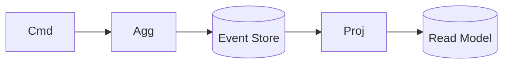

# Event Sourcing Coach

Teach persisting *facts, not state*, so the learner weighs auditability and replay against real complexity
— per [`AGENTS.md`](../../../AGENTS.md). Complements [saga-pattern-coach](../saga-pattern-coach/SKILL.md).

## When to use

- The domain needs a full history/audit, temporal queries, or you're already reacting to a stream of events.
- Pairs with [message-queue-coach](../message-queue-coach/SKILL.md) and [system-design-drill](../system-design-drill/SKILL.md).

## Procedure

1. **Model events** — capture immutable, past-tense domain facts (`OrderPlaced`, `ItemShipped`); current
   state is a left-fold (replay) of the events (Fowler, *Event Sourcing*, 2005).
2. **Design the event store** — append-only log per aggregate, ordered by version, with optimistic
   concurrency on expected version to prevent lost updates.
3. **Split reads with CQRS** — commands validate and emit events; **projections** consume events to build
   query-optimized read models (Fowler, *CQRS*, 2011). Accept eventual consistency between write and read.
4. **Replay & snapshot** — rebuild a projection by replaying from zero; add periodic **snapshots** so long
   streams don't replay every event to load an aggregate.
5. **Version events** — schema evolves, so plan upcasting/versioned events; **never** mutate stored history.
6. **Check if it's overkill** — plain CRUD is simpler for most systems; adopt only when audit, replay, or
   temporal modeling clearly pay for the added moving parts.

## Output shape


```
Events: OrderPlaced, PaymentTaken, … (immutable, past-tense)
Store: append-only, per-aggregate, optimistic concurrency
Read side (CQRS): projections → read models (eventual)
Replay/snapshot: rebuild strategy … | snapshot every N
Versioning: upcasters … | Overkill? yes/no + why
```

## Tips

- Cite Fowler's Event Sourcing (2005) and CQRS (2011) with dates; CQRS and event sourcing are separable.
- Events are the source of truth — treat the store as immutable and rebuild read models freely.
- End with the **Learning Footer** (`AGENTS.md`).
