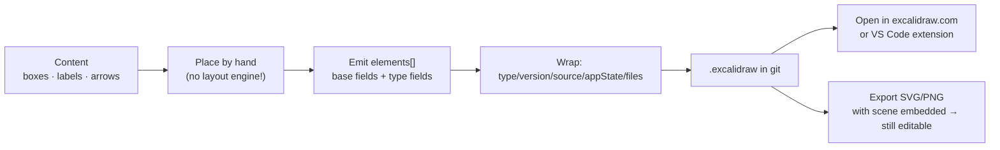

# Excalidraw Sketch Generator

Excalidraw files are plain JSON, so a diagram can be **generated**, committed, diffed and re-opened for
editing by a human. This skill emits valid `.excalidraw` scenes and says plainly when a *sketchy* drawing
teaches better than a crisp one — visuals-by-default per [`AGENTS.md`](../../../AGENTS.md).

## When to use

- You want a diagram that says **"this is a draft, argue with it"** — a whiteboard artefact, an architecture
  straw-man, a teaching sketch for a live session.
- You want a picture a reader can **open and edit** rather than a rendered dead end.
- You are generating many similar diagrams programmatically (per-service, per-lesson) and hand-drawing each
  is not viable.
- **Don't use it for** anything that must render inline on GitHub with no tooling (use Mermaid —
  [diagram-as-code-coach](../diagram-as-code-coach/SKILL.md)), for auto-laid-out graphs with dozens of nodes
  (use [graphviz-dot-lab](../graphviz-dot-lab/SKILL.md) — Excalidraw has **no layout engine**, you place
  every element yourself), or for final/authoritative published architecture where "provisional" is exactly
  the wrong signal.

## First principles

**Why sketchy at all?** The hand-drawn look is not decoration. Wood, Isenberg, Isenberg, Dykes, Boukhelifa
& Slingsby, *Sketchy Rendering for Information Visualization* (IEEE TVCG / InfoVis, **2012**), found that
sketchy rendering can encode uncertainty and changes how confidently viewers read a graphic. That is the
teaching lever: a polished box diagram implicitly claims "decided", while a wobbly one invites correction.
Excalidraw achieves the effect with **Rough.js**, and exposes it as the per-element `roughness` number
(0 = architect, 1 = artist, 2 = cartoonist in the UI).

**The file format.** From the Excalidraw source (`packages/excalidraw/data/json.ts`, `serializeAsJSON`, and
`packages/common/src/constants.ts` — read on the `master` branch, retrieved 2026-08-09):

```jsonc
{
  "type": "excalidraw",        // EXPORT_DATA_TYPES.excalidraw — validated on import
  "version": 2,                // VERSIONS.excalidraw
  "source": "https://excalidraw.com",
  "elements": [ /* ... */ ],
  "appState": { "gridSize": null, "viewBackgroundColor": "#ffffff" },
  "files": {}                  // base64 image blobs, keyed by fileId
}
```

Import validation is deliberately loose (`isValidExcalidrawData` checks `type === "excalidraw"` and that
`elements` is an array), but the renderer expects the element fields below — omit them and shapes render
oddly or not at all.

**The element schema.** Every element shares `_ExcalidrawElementBase`
(`packages/element/src/types.ts`, retrieved 2026-08-09):

| Field | Type | Notes |
| --- | --- | --- |
| `id` | string | unique in the scene; arrows/labels reference it |
| `type` | string | `rectangle` · `ellipse` · `diamond` · `text` · `arrow` · `line` · `freedraw` · `image` · `frame` · `embeddable` |
| `x`, `y` | number | **top-left** of the bounding box, scene coordinates (y grows downward) |
| `width`, `height` | number | bounding box |
| `angle` | number | radians |
| `strokeColor`, `backgroundColor` | string | `backgroundColor: "transparent"` is the common default |
| `fillStyle` | `"hachure"｜"cross-hatch"｜"solid"｜"zigzag"` | how the fill is drawn |
| `strokeWidth` | number | 1 thin · 2 bold · 4 extra-bold |
| `strokeStyle` | `"solid"｜"dashed"｜"dotted"` | **use this, not colour, to encode async/optional** |
| `roughness` | number | 0–2; the sketchiness dial |
| `opacity` | number | 0–100 |
| `roundness` | `null` or `{ "type": n }` | `ROUNDNESS.LEGACY=1`, `PROPORTIONAL_RADIUS=2`, `ADAPTIVE_RADIUS=3` |
| `seed`, `versionNonce` | integer | random; keeps the Rough.js shape stable across renders |
| `version` | integer | bumped on each edit (collab reconciliation) |
| `groupIds` | string[] | deepest → shallowest |
| `frameId` | string｜null | owning frame |
| `boundElements` | array｜null | `{ id, type: "text"｜"arrow" }` — things bound *to* this element |
| `isDeleted`, `locked` | boolean | soft delete / lock |
| `link` | string｜null | clickable hyperlink |
| `updated` | number | epoch ms |
| `index` | string｜null | fractional index for ordering; `null` is accepted on import |

Type-specific additions that matter in practice:

- **`text`**: `text`, `originalText`, `fontSize`, `fontFamily` (`Virgil:1`, `Helvetica:2`, `Cascadia:3`,
  `Excalifont:5`, `Nunito:6` — `DEFAULT_FONT_FAMILY` is Excalifont), `textAlign`, `verticalAlign`,
  `containerId` (set to a shape's `id` to make it that shape's **label**), `autoResize`, `lineHeight`
  (unitless).
- **`arrow` / `line`**: `points` (array of `[x, y]` **relative to the element's own x/y**, starting `[0,0]`),
  `startBinding` / `endBinding` (`null`, or `{ elementId, fixedPoint, mode }`), `startArrowhead` /
  `endArrowhead` (`null`, `"arrow"`, `"triangle"`, `"dot"`/`"circle"`, `"bar"`, `"diamond"`, …),
  and `elbowed` for arrows.

⚠ Excalidraw ships fast and these types are internal. Before relying on an exotic field, **verify on the
current `excalidraw/excalidraw` source** (`packages/element/src/types.ts`) rather than on this table.



*Figure 1 — Generation pipeline. Step B is the one people forget: Excalidraw stores absolute coordinates, so layout is your responsibility.*

## Procedure

1. **Decide sketchy is right.** Draft, teaching aid, or invitation to critique → yes. Compliance diagram,
   published reference architecture → no; the wobble reads as "unfinished".
2. **List the content first** — boxes, their labels, the arrows and *their* labels. Keep it under ~12 shapes;
   with no auto-layout, complexity costs you linearly in arithmetic.
3. **Lay out on a grid you choose** (e.g. 20 px). Give shapes a width that fits the label
   (~`10 px × characters` at `fontSize: 20`) and leave ≥ 60 px gutters for arrows.
4. **Emit shapes** with the full base field set. Reuse one `strokeColor` palette; encode differences with
   `strokeStyle` and labels, never colour alone (WCAG 2.2 §1.4.1).
5. **Bind labels to containers**: create the `text` element with `containerId: "<shape id>"`, and add
   `{ id: "<text id>", type: "text" }` to that shape's `boundElements`. Both halves are required —
   one-sided binding is the most common generated-file bug.
6. **Draw arrows in local coordinates**: put the arrow's `x`/`y` at its start point and make `points`
   relative — `[[0,0],[dx,dy]]`. Set `endArrowhead: "arrow"`, and `startBinding`/`endBinding` to `null`
   unless you are computing real fixed-point bindings.
7. **Randomise `seed` and `versionNonce`** per element (any 32-bit int). Identical seeds make different
   shapes wobble identically, which looks wrong.
8. **Wrap and save** as `<name>.excalidraw`, then **open it once** in excalidraw.com or the VS Code
   Excalidraw extension. Rendering it is the only real validation.
9. **Export for embedding** as SVG/PNG *with the scene embedded* (Excalidraw's "embed scene" option), so the
   published image remains re-editable — a rendered-only PNG is where diagrams go to die.
10. **Add caption + alt text** ([diagram-accessibility-coach](../diagram-accessibility-coach/SKILL.md)) —
    a sketch is an image and carries no accessible structure by itself. Close with the **Learning Footer**.

## Output shape

````
Scene: <what it shows>   ·   Elements: <n>   ·   Canvas: <w×h px>   ·   Roughness: <0|1|2>
Sketchy because: <draft | teaching aid | invites critique>   (else: use Mermaid/Graphviz instead)

File (<name>.excalidraw):
```json
{ "type": "excalidraw", "version": 2, "source": "...", "elements": [ ... ],
  "appState": { "gridSize": null, "viewBackgroundColor": "#ffffff" }, "files": {} }
```

Layout: grid <n px> · shape size <w×h> · gutters <n px>
Bindings: <text→container pairs> · <arrow start/end bindings>
Validated: opened in <excalidraw.com | VS Code extension> → renders <yes/no>
Embed: <SVG/PNG with scene embedded | raw .excalidraw in repo>
Caption: <one line>     Alt text: <prose description of the sketch>
Next: <diagram-as-code-coach | architecture-diagram | visual-explainer>
Learning Footer
````

## Worked example — a two-service sketch, emitted and checked

Goal: a teaching sketch, "API writes to the database, publishes an event asynchronously." Layout on a 20 px
grid: API box at (100,100) 200×100; DB box at (460,100) 200×100; arrow between them from x=300 to x=460.

```json
{
  "type": "excalidraw",
  "version": 2,
  "source": "https://excalidraw.com",
  "elements": [
    {
      "id": "api-box", "type": "rectangle", "x": 100, "y": 100,
      "width": 200, "height": 100, "angle": 0,
      "strokeColor": "#1e1e1e", "backgroundColor": "transparent",
      "fillStyle": "hachure", "strokeWidth": 2, "strokeStyle": "solid",
      "roughness": 1, "opacity": 100, "groupIds": [], "frameId": null,
      "index": null, "roundness": { "type": 3 },
      "seed": 1841255, "version": 1, "versionNonce": 902314,
      "isDeleted": false, "boundElements": [{ "id": "api-label", "type": "text" }],
      "updated": 1754761200000, "link": null, "locked": false
    },
    {
      "id": "api-label", "type": "text", "x": 130, "y": 138,
      "width": 140, "height": 25, "angle": 0,
      "strokeColor": "#1e1e1e", "backgroundColor": "transparent",
      "fillStyle": "hachure", "strokeWidth": 2, "strokeStyle": "solid",
      "roughness": 1, "opacity": 100, "groupIds": [], "frameId": null,
      "index": null, "roundness": null,
      "seed": 7712004, "version": 1, "versionNonce": 5540117,
      "isDeleted": false, "boundElements": null,
      "updated": 1754761200000, "link": null, "locked": false,
      "text": "orders-api", "originalText": "orders-api",
      "fontSize": 20, "fontFamily": 5, "textAlign": "center",
      "verticalAlign": "middle", "containerId": "api-box",
      "autoResize": true, "lineHeight": 1.25
    },
    {
      "id": "db-box", "type": "rectangle", "x": 460, "y": 100,
      "width": 200, "height": 100, "angle": 0,
      "strokeColor": "#1e1e1e", "backgroundColor": "transparent",
      "fillStyle": "hachure", "strokeWidth": 2, "strokeStyle": "solid",
      "roughness": 1, "opacity": 100, "groupIds": [], "frameId": null,
      "index": null, "roundness": { "type": 3 },
      "seed": 3390118, "version": 1, "versionNonce": 6621903,
      "isDeleted": false, "boundElements": [{ "id": "db-label", "type": "text" }],
      "updated": 1754761200000, "link": null, "locked": false
    },
    {
      "id": "db-label", "type": "text", "x": 490, "y": 138,
      "width": 140, "height": 25, "angle": 0,
      "strokeColor": "#1e1e1e", "backgroundColor": "transparent",
      "fillStyle": "hachure", "strokeWidth": 2, "strokeStyle": "solid",
      "roughness": 1, "opacity": 100, "groupIds": [], "frameId": null,
      "index": null, "roundness": null,
      "seed": 4480221, "version": 1, "versionNonce": 1190788,
      "isDeleted": false, "boundElements": null,
      "updated": 1754761200000, "link": null, "locked": false,
      "text": "PostgreSQL", "originalText": "PostgreSQL",
      "fontSize": 20, "fontFamily": 5, "textAlign": "center",
      "verticalAlign": "middle", "containerId": "db-box",
      "autoResize": true, "lineHeight": 1.25
    },
    {
      "id": "write-arrow", "type": "arrow", "x": 300, "y": 150,
      "width": 160, "height": 0, "angle": 0,
      "strokeColor": "#1e1e1e", "backgroundColor": "transparent",
      "fillStyle": "hachure", "strokeWidth": 2, "strokeStyle": "solid",
      "roughness": 1, "opacity": 100, "groupIds": [], "frameId": null,
      "index": null, "roundness": { "type": 2 },
      "seed": 9905531, "version": 1, "versionNonce": 3348810,
      "isDeleted": false, "boundElements": null,
      "updated": 1754761200000, "link": null, "locked": false,
      "points": [[0, 0], [160, 0]],
      "startBinding": null, "endBinding": null,
      "startArrowhead": null, "endArrowhead": "arrow", "elbowed": false
    },
    {
      "id": "event-arrow", "type": "arrow", "x": 200, "y": 200,
      "width": 0, "height": 120, "angle": 0,
      "strokeColor": "#1e1e1e", "backgroundColor": "transparent",
      "fillStyle": "hachure", "strokeWidth": 2, "strokeStyle": "dashed",
      "roughness": 1, "opacity": 100, "groupIds": [], "frameId": null,
      "index": null, "roundness": { "type": 2 },
      "seed": 2276640, "version": 1, "versionNonce": 8813755,
      "isDeleted": false, "boundElements": null,
      "updated": 1754761200000, "link": null, "locked": false,
      "points": [[0, 0], [0, 120]],
      "startBinding": null, "endBinding": null,
      "startArrowhead": null, "endArrowhead": "arrow", "elbowed": false
    }
  ],
  "appState": { "gridSize": null, "viewBackgroundColor": "#ffffff" },
  "files": {}
}
```

*Figure 2 — `orders-api` writes synchronously to PostgreSQL (solid arrow) and publishes an event asynchronously (dashed arrow, downward). Alt text: two hand-drawn boxes side by side joined by a solid right-pointing arrow, with a dashed arrow leaving the left box downward.*

**Trace that it is valid**, field by field, against the schema above:

| Check | Evidence in the file |
| --- | --- |
| Wrapper accepted by `isValidExcalidrawData` | `type: "excalidraw"`, `elements` is an array, `appState` is an object |
| Format version matches source | `version: 2` = `VERSIONS.excalidraw` |
| Every element has the full base field set | all 6 elements carry `id, type, x, y, width, height, angle, strokeColor, backgroundColor, fillStyle, strokeWidth, strokeStyle, roughness, opacity, groupIds, frameId, index, roundness, seed, version, versionNonce, isDeleted, boundElements, updated, link, locked` |
| Label binding is two-sided | `api-box.boundElements = [{id:"api-label",type:"text"}]` **and** `api-label.containerId = "api-box"` (same for `db-*`) |
| Arrow points are element-relative | `write-arrow` sits at `x:300,y:150` with `points: [[0,0],[160,0]]` → ends at scene x=460 = the DB box's left edge ✓ |
| Geometry is consistent | `width:160` equals the x-extent of `points`; `height:0` for a horizontal arrow |
| Async encoded without colour | `event-arrow.strokeStyle: "dashed"`; both arrows share `strokeColor: "#1e1e1e"` |
| `roundness` types are real | `{type:3}` = `ADAPTIVE_RADIUS` on rectangles, `{type:2}` = `PROPORTIONAL_RADIUS` on linear elements |
| Seeds differ per element | 6 distinct `seed` values → shapes wobble independently |

Save as `two-service.excalidraw` and open it in excalidraw.com (**File → Open**) or the VS Code Excalidraw
extension — rendering is the last, non-negotiable check.

## Tips

- **There is no layout engine.** Every `x`/`y` is yours. If you find yourself computing a layered layout,
  you wanted [graphviz-dot-lab](../graphviz-dot-lab/SKILL.md) instead.
- Already have a Mermaid diagram? Excalidraw's built-in **Mermaid to Excalidraw** import converts flowcharts
  and sequence diagrams into editable elements — cheaper than emitting JSON by hand.
- Arrow `points` are **relative to the arrow's own `x`/`y`** and start at `[0,0]`. Absolute points are the
  classic "my arrow flew off-canvas" bug.
- Label binding needs both directions (`containerId` **and** `boundElements`); one-sided bindings render as
  text floating near a box that doesn't move with it.
- Vary `seed` per element, and keep `roughness` consistent across a scene — mixed roughness reads as sloppy
  rather than deliberate.
- Export **with the scene embedded** so the published SVG/PNG stays editable; otherwise the source is lost.
- Sketchiness is a *claim about confidence*. Don't hand a wobbly diagram to an audit
  ([architecture-diagram](../architecture-diagram/SKILL.md) is the right register there).
- Related: [visual-explainer](../visual-explainer/SKILL.md),
  [diagram-as-code-coach](../diagram-as-code-coach/SKILL.md),
  [diagram-review-coach](../diagram-review-coach/SKILL.md),
  [concept-map-generator](../concept-map-generator/SKILL.md),
  [sequence-diagram-generator](../sequence-diagram-generator/SKILL.md).
  End with the **Learning Footer** (`AGENTS.md`).
