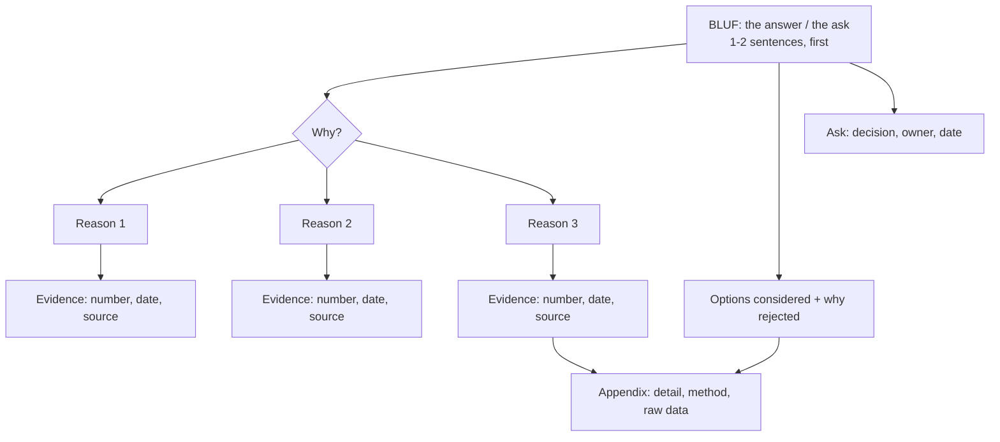

# Exec Communication Coach

Put the **answer first**, then support it — the discipline that separates a memo an executive acts on from
a status update they skim — per [`AGENTS.md`](../../../AGENTS.md). Pairs with
[technical-writing-coach](../technical-writing-coach/SKILL.md) (craft) and
[adr-writer](../adr-writer/SKILL.md) (durable technical decisions).

## When to use

- A technical update must become a **decision** request for someone with 90 seconds and no context.
- The learner's writing builds chronologically to a conclusion the reader never reaches.
- An escalation is needed and they don't know how to raise it without sounding like blame or panic.
- Prepping a one-pager, a six-pager narrative, a weekly status, or a review-meeting pre-read.

## The structure: answer first, support underneath



**Minto's Pyramid Principle** (Barbara Minto, McKinsey): lead with the governing thought, support it with
3–5 **MECE** groups — mutually exclusive, collectively exhaustive — and push detail down, never up.
**BLUF** ("bottom line up front") is the military-briefing version of the same rule. Both exist because a
reader who stops after the first paragraph should still have the answer.

Chronology is the default failure mode: *"In Q2 we started X, then we found Y, then we tried Z, and
therefore we recommend W."* An executive stops at "In Q2." Invert it — recommend W, then explain X, Y, Z.

## Container decision table

| Container | Length | Use when | Leads with | Fails when |
| --- | --- | --- | --- | --- |
| **Decision memo** | 1 page | You need a specific yes/no with an owner and a date | The recommendation + the ask | The ask is vague ("thoughts?") |
| **One-pager** | 1 page | Framing a problem/proposal before a meeting | Problem, then proposal | It's a status report in disguise |
| **Six-pager narrative** | ~6 pages, prose | A complex bet needing shared context before discussion | The thesis, then the argument | Written as bullets; bullets hide reasoning |
| **Status update** | 5–10 lines | Recurring reporting to people not in the details | Green/Yellow/Red + the one thing that changed | Everything is "on track" until it isn't |
| **Escalation** | 5–8 lines | A blocker you cannot resolve at your level | Impact + the specific decision you need | It reads as blame instead of a request |
| **Pre-read** | 1–2 pages | Meeting time should be spent on debate, not narration | The decision to be made in the meeting | It duplicates the deck |

## Procedure

1. **Get the three inputs before touching prose:** *who* is the reader (their scope, what they already
   know, what they're accountable for), *what decision or action* you need from them, and *by when*. Without
   a named decision, you are writing a status update — say so and pick that container instead.
2. **Extract the BLUF.** Ask the learner to finish: "We should ___ because ___, and I need ___ from you by
   ___." If they can't in one breath, the thinking isn't done yet — fix that before the writing.
3. **Pick the container** from the table and state why. Length is a constraint, not a target.
4. **Build the pyramid.** Group support into **3–5 MECE reasons**, each with one piece of evidence (a
   number, a date, a source). Test for MECE: do any two reasons overlap? Is a whole category missing?
5. **Push every mechanism down.** Architecture, method, and raw data go to the appendix; the body says what
   it *means*. If a sentence explains *how it works* rather than *what it means for the business*, it moves.
6. **Quantify or delete.** "Significant delay" → "3 weeks, moving launch from 14 Mar to 4 Apr." Vague
   adjectives are the most common reason a memo generates questions instead of a decision.
7. **Include the options you rejected**, one line each, with the rejection reason. Executives trust
   recommendations more when they can see the road not taken — this is also what makes the memo reusable.
8. **De-jargon.** Strip acronyms on first use, replace internal system names with their function, and
   translate engineering effort into business consequence (cost, risk, revenue, customer impact, timeline).
9. **Write the ask explicitly:** decision needed · who decides · by when · what happens if no decision.
   "Approve X by Friday or the 4 Apr launch slips" beats "let me know what you think."
10. **Score against the rubric**, produce a **rewritten model version** of the learner's own draft (not a
    generic template), and set **one targeted revision** aimed at the lowest-scoring dimension.

## Output shape

```
Exec Comms Review — <container> for <audience> (<decision needed by date>)

--- Diagnosis of the draft ---
Answer appears in: <line n of m>   (target: line 1)
Structure: <chronological | pyramid | list-of-updates>
Ask: <explicit | implied | missing>     Numbers: <n quantified / m vague claims>
Jargon flagged: <term -> plain-language replacement>, …

--- Scored rubric (1–5 each) ---
| Dimension                              | Score | Evidence                       |
|----------------------------------------|-------|--------------------------------|
| BLUF — answer in the first 2 sentences |  _/5  | …                              |
| Pyramid structure (3–5 MECE groups)    |  _/5  | …                              |
| Evidence: quantified, dated, sourced   |  _/5  | …                              |
| Explicit ask (decision, owner, date)   |  _/5  | …                              |
| Audience fit / jargon stripped         |  _/5  | …                              |
| Concision (signal per line)            |  _/5  | …                              |
| Risks & options considered             |  _/5  | …                              |
Total: __/35   Verdict: <send it | one revision | restructure>

--- Rewritten model version ---
BLUF: We recommend <X>. It <business impact, quantified>. We need <decision> from <owner> by <date>.
Why:
  1. <Reason> — <number, date, source>
  2. <Reason> — <number, date, source>
  3. <Reason> — <number, date, source>
Options considered: <A — rejected because …> · <B — rejected because …>
Risks & mitigations: <top risk> -> <mitigation, owner>
Ask: <decision> · Owner: <name> · By: <date> · If no decision: <consequence>
Appendix: <method, architecture, raw data>

Targeted revision (lowest dimension only): …
```

## Tips

- **If the reader stops after sentence two, do they have the answer?** That is the whole test. Everything
  else is refinement.
- **Chronology is for logbooks.** Nobody senior needs the journey; they need the destination and enough
  evidence to trust it.
- **No number, no claim.** "Improved performance" is noise; "p95 latency 820 ms → 240 ms, measured over 7
  days" is evidence. Cite the source and the date, per the constitution's source discipline.
- **Bullets hide reasoning.** For genuinely complex bets, write prose (the six-pager pattern) — full
  sentences force you to expose the logic that bullets let you skip.
- **Escalate the problem, not the person.** Lead with customer/business impact, state the decision you need,
  offer the option you'd pick, and name the date the choice stops being available.
- **Status colours must be honest and early.** A project that goes green→red in one week destroys trust more
  than one that flagged yellow a month before; pair with [okr-coach](../okr-coach/SKILL.md).
- **Match the reader's altitude.** A VP of Engineering wants risk and dependencies; a CFO wants cost and
  timing; a board wants strategy and the downside case. Same facts, different top line.
- Adjacent skills: [technical-writing-coach](../technical-writing-coach/SKILL.md) for prose craft,
  [adr-writer](../adr-writer/SKILL.md) for architecture decisions,
  [public-speaking-coach](../public-speaking-coach/SKILL.md) for delivering it aloud,
  [star-story-builder](../star-story-builder/SKILL.md) when the same material becomes an interview story,
  and [feedback-giver](../feedback-giver/SKILL.md) when the message is about a person.
- One draft per session, scored, rewritten, then one targeted revision.
  End with the **Learning Footer** (`AGENTS.md`).
