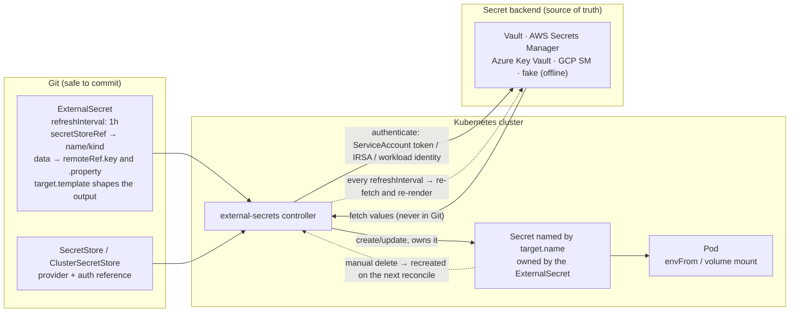

# External Secrets Lab

GitOps has one uncomfortable gap: **Git must not hold your secrets**. The External Secrets Operator closes
it by making the cluster *pull* secret material from a real secret manager and project it into ordinary
Kubernetes `Secret` objects, so your manifests reference secrets without ever containing them. This lab
runs the whole thing on a **free local kind/k3d cluster**, starting fully offline with the fake provider,
in the verify-before-you-teach spirit of [`AGENTS.md`](../../../AGENTS.md).

## When to use

- You adopted GitOps and immediately hit "…so where do the secrets live?"
- Secrets are pasted into `kubectl create secret` commands, chat messages, or CI variables with no rotation
  and no audit trail.
- The organisation already runs Vault / AWS Secrets Manager / Azure Key Vault / GCP Secret Manager, and the
  cluster should consume it rather than duplicate it.
- **Don't use it for** making a `Secret` cryptographically safe *inside* the cluster — Kubernetes Secrets
  are base64-encoded, not encrypted, unless you enable encryption at rest, and anyone with `get secrets`
  RBAC in that namespace can read them. Also don't use it when a workload can natively use workload
  identity to call the secret manager directly; that is strictly better, because the secret never lands in
  etcd at all.

## First principles: the cluster pulls; Git only holds a reference

ESO is a controller with two object families (External Secrets Operator documentation,
external-secrets.io — a CNCF project):

- **`SecretStore`** (namespaced) / **`ClusterSecretStore`** (cluster-scoped): *how to reach a backend and
  how to authenticate*. Owned by platform/security, not by app teams.
- **`ExternalSecret`** (namespaced): *which keys to fetch, and what the resulting `Secret` should look
  like*. Owned by the app team, and safe to commit — it contains **references**, never values.

The controller reconciles on an interval: fetch from the backend, render the target `Secret`, apply it,
report a `SecretSynced` condition. Because it is a control loop, deleting the generated `Secret` by hand
simply causes it to be recreated — which is also the fastest way to demonstrate that it is working.

⚠ Volatile and important: **ESO promoted its CRDs from `external-secrets.io/v1beta1` to
`external-secrets.io/v1`, and v0.17.0 stopped serving `v1beta1`** — so manifests must be migrated *before*
upgrading past v0.16.x (external-secrets release notes, 2025). Check what your cluster actually serves
before writing YAML: `kubectl api-resources --api-group=external-secrets.io`.



*Figure: Git holds only the reference and the shape; the value travels backend → controller → `Secret`,
inside the cluster, on a loop.*

| Object | Scope | Owned by | Contains | Safe in Git? |
| --- | --- | --- | --- | --- |
| `SecretStore` | namespace | platform team | provider endpoint + auth **reference** | yes |
| `ClusterSecretStore` | cluster | platform team | same, shared by all namespaces | yes |
| `ExternalSecret` | namespace | app team | which keys, target `Secret` shape, refresh interval | **yes** |
| generated `Secret` | namespace | the controller | the actual values | **never** |

| `ExternalSecret` field | Purpose | Trap |
| --- | --- | --- |
| `refreshInterval` | how often to re-fetch | `0` disables refresh entirely — rotation silently stops |
| `secretStoreRef.kind` | `SecretStore` (default) or `ClusterSecretStore` | omitting `kind` when you meant cluster-scoped ⇒ "store not found" |
| `data[].remoteRef.key` / `.property` | one key, optionally one JSON field within it | wrong `property` yields an empty value, not an error, in some providers |
| `dataFrom.extract` | pull **every** key of a map at once | you inherit new keys automatically — convenient and slightly dangerous |
| `target.template` | render config files, add keys, set `type` | templating with `.data` requires the referenced keys to exist |
| `target.creationPolicy` | `Owner` (default), `Merge`, `Orphan`, `None` | `Owner` deletes the `Secret` when the ES is deleted |
| `target.deletionPolicy` | what happens when the remote key disappears | `Delete` can remove a live secret mid-incident |

| Approach | Where the secret lives | Rotation | Best when |
| --- | --- | --- | --- |
| Plain `Secret` in Git | in Git, forever, in history | manual | never |
| Sealed Secrets | encrypted **in Git**, decrypted in-cluster | re-seal and commit | no external secret manager exists |
| **External Secrets Operator** | in a real secret manager | automatic on `refreshInterval` | you already run Vault/cloud SM |
| Direct workload identity (SDK call) | never in the cluster | provider-managed | the app can be changed |

## Procedure

1. **Cluster**: `kind create cluster --name eso` (or `k3d cluster create eso`); `kubectl get nodes`.
2. **Install ESO** via Helm (External Secrets Operator documentation, *Getting started*,
   external-secrets.io — pin and verify the chart version):
   ```bash
   helm repo add external-secrets https://charts.external-secrets.io && helm repo update
   helm install external-secrets external-secrets/external-secrets \
     -n external-secrets --create-namespace --set installCRDs=true
   kubectl -n external-secrets rollout status deploy/external-secrets
   kubectl api-resources --api-group=external-secrets.io   # ← confirm v1 vs v1beta1 BEFORE writing YAML
   ```
3. **Start offline with the `fake` provider.** It needs no Vault, no cloud account and no network, so you
   can learn the object model without fighting authentication — which is where most first attempts die.
4. **Create a `SecretStore`** using `fake`, then an **`ExternalSecret`** that targets a `Secret` named
   `app-credentials`. Apply both.
5. **Verify the sync, then read the condition** — this is the debugging surface:
   ```bash
   kubectl get externalsecret app-credentials -n demo
   kubectl get externalsecret app-credentials -n demo -o jsonpath='{.status.conditions}' | jq
   #   expect: type=Ready status=True reason=SecretSynced
   kubectl get secret app-credentials -n demo -o jsonpath='{.data.username}' | base64 -d
   ```
6. **Prove it is a control loop**: `kubectl delete secret app-credentials -n demo` and watch it come back on
   the next reconcile. Then break it on purpose — reference a key that does not exist — and read the
   failure condition rather than guessing.
7. **Swap in a real backend: Vault in dev mode**, still local and free:
   ```bash
   helm repo add hashicorp https://helm.releases.hashicorp.com && helm repo update
   helm install vault hashicorp/vault -n vault --create-namespace \
     --set "server.dev.enabled=true" --set "injector.enabled=false"
   kubectl -n vault rollout status statefulset/vault
   kubectl -n vault exec vault-0 -- vault kv put secret/demo/app \
     username=app_user password='S3cr3t-from-vault'
   ```
   ⚠ `server.dev.enabled=true` runs Vault **unsealed, in memory, with a root token** — a teaching tool
   only, never anything else.
8. **Authenticate ESO to Vault with the Kubernetes auth method** (the production-shaped path): enable
   `kubernetes` auth in Vault, bind a policy to the ServiceAccount ESO will present, and reference that
   ServiceAccount from the `SecretStore`. Static tokens are for the first five minutes only.
9. **Template the output** so the app gets the shape it wants (a `.env` file, a connection string, a
   `kubernetes.io/dockerconfigjson`), instead of forcing every app to match the backend's key names.
10. **Test rotation end to end**: change the value in Vault, wait for `refreshInterval` (or force with
    `kubectl annotate externalsecret … force-sync=$(date +%s) --overwrite`), and confirm the `Secret`
    changed. **Then confirm the pod did not** — mounted secrets update eventually, but environment
    variables never do. Wire up a reloader or a rollout, or your "rotation" only rotates etcd.
11. **Lock down access**: RBAC so app teams can create `ExternalSecret`s but not read arbitrary `Secret`s,
    and keep `ClusterSecretStore` credentials scoped to the smallest path in the backend
    ([k8s-rbac-lab](../k8s-rbac-lab/SKILL.md)).
12. **Clean up**: `helm uninstall external-secrets -n external-secrets`,
    `helm uninstall vault -n vault`, `kind delete cluster --name eso`. Close with the **Learning Footer**.

## Output shape

```
ESO: chart <x.y.z>   served API: <external-secrets.io/v1 | v1beta1>   Cluster: <kind/k3d>
Backend: <fake (offline) | Vault dev | AWS SM | Azure KV | GCP SM>

Store: <SecretStore|ClusterSecretStore>/<name>  ns=<...>
  provider: <vault: server, path, version=v2>   auth: <kubernetes SA <name> + role <role> | token (lab only)>
  status: Ready=<True>  (reason=<Valid>)

ExternalSecret: <ns>/<name>
  refreshInterval: <1h>          secretStoreRef: <name> kind=<...>
  data:     <k8s key> ← <remoteRef.key>[.property]
  dataFrom: <extract key=... (whole map)>
  target:   name=<secret name>  creationPolicy=<Owner>  deletionPolicy=<Retain>  type=<Opaque|dockerconfigjson>
  template: <rendered keys / file>          status: Ready=<True> reason=<SecretSynced>

Verification:
  kubectl get secret <name> -o jsonpath='{.data.<k>}' | base64 -d   → <matches backend ✔>
  deleted the Secret by hand → recreated on next reconcile           ✔
  bad remoteRef → condition Ready=False reason=<SecretSyncedError>, message quoted: "<...>"
Rotation drill:
  changed value in backend → Secret updated after <interval / force-sync>   ✔
  consuming pod picked it up: <mounted volume: yes, eventually | env var: NO — restart required>
  reload strategy: <rollout restart | reloader annotation | app re-reads file>
Blast radius: store scope=<ns|cluster>  backend path granted=<narrowest path>  RBAC on Secrets: <...>
Never in Git: <the values>      In Git: <SecretStore, ExternalSecret>
Next: <secrets-management-coach | vault-local-lab | gitops-coach>
Learning Footer
```

## Worked example — offline with `fake`, then real with Vault

**Part 1 — the object model, with zero dependencies.** The `fake` provider carries its values inline, which
would be absurd in production but removes every distraction while you learn the shapes:

```yaml
apiVersion: v1
kind: Namespace
metadata: {name: demo}
---
apiVersion: external-secrets.io/v1        # ← check `kubectl api-resources`; older ESO serves v1beta1
kind: SecretStore
metadata: {name: fake-store, namespace: demo}
spec:
  provider:
    fake:
      data:
        - key: /demo/app/username
          value: app_user
          version: "v1"
        - key: /demo/app/password
          value: fake-password-not-real
          version: "v1"
---
apiVersion: external-secrets.io/v1
kind: ExternalSecret
metadata: {name: app-credentials, namespace: demo}
spec:
  refreshInterval: 1m                     # short, so the lab shows rotation quickly
  secretStoreRef:
    name: fake-store
    kind: SecretStore                     # omit/mistype this and you get "could not get store"
  target:
    name: app-credentials                 # the Kubernetes Secret that will be created
    creationPolicy: Owner                 # ESO owns it: delete the ExternalSecret → Secret goes too
  data:
    - secretKey: username                 # key inside the Kubernetes Secret
      remoteRef:
        key: /demo/app/username           # key inside the backend
    - secretKey: password
      remoteRef:
        key: /demo/app/password
```

```bash
kubectl apply -f fake.yaml
kubectl get externalsecret -n demo
# NAME              STORE        REFRESH INTERVAL   STATUS         READY
# app-credentials   fake-store   1m                 SecretSynced   True

kubectl get secret app-credentials -n demo -o jsonpath='{.data.username}' | base64 -d   # app_user
kubectl delete secret app-credentials -n demo
sleep 65 && kubectl get secret app-credentials -n demo                                  # it's back ✔
```

**Now break it deliberately** — change `key: /demo/app/password` to `/demo/app/passwordX` and re-apply:

```bash
kubectl get externalsecret app-credentials -n demo -o jsonpath='{.status.conditions}' | jq
# → Ready=False, reason=SecretSyncedError, message names the missing key
```

Note what did **not** happen: the previously synced `Secret` is left alone rather than being emptied. That
is deliberate and worth knowing — a backend outage degrades *freshness*, not availability.

**Part 2 — the real shape, with Vault.** Enable the Kubernetes auth method so ESO authenticates as a
ServiceAccount rather than carrying a static token:

```bash
kubectl -n vault exec vault-0 -- sh -c '
  vault auth enable kubernetes || true
  vault write auth/kubernetes/config \
    kubernetes_host="https://$KUBERNETES_PORT_443_TCP_ADDR:443"
  vault policy write demo-read - <<EOF
path "secret/data/demo/*" { capabilities = ["read"] }
EOF
  vault write auth/kubernetes/role/demo \
    bound_service_account_names=eso-vault \
    bound_service_account_namespaces=demo \
    policies=demo-read ttl=1h'
kubectl create serviceaccount eso-vault -n demo
```

```yaml
apiVersion: external-secrets.io/v1
kind: SecretStore
metadata: {name: vault-store, namespace: demo}
spec:
  provider:
    vault:
      server: "http://vault.vault.svc.cluster.local:8200"
      path: "secret"          # the KV mount name — NOT the full data path
      version: "v2"           # KV v2 stores values under data/<path>/data; ESO handles that for you
      auth:
        kubernetes:
          mountPath: "kubernetes"
          role: "demo"
          serviceAccountRef:
            name: eso-vault
---
apiVersion: external-secrets.io/v1
kind: ExternalSecret
metadata: {name: app-credentials, namespace: demo}
spec:
  refreshInterval: 1h
  secretStoreRef: {name: vault-store, kind: SecretStore}
  target:
    name: app-credentials
    creationPolicy: Owner
    deletionPolicy: Retain          # a deleted remote key must NOT delete a live secret mid-incident
    template:
      engineVersion: v2
      type: Opaque
      data:
        # Render exactly what the app expects, so no application change is needed.
        DATABASE_URL: "postgres://{{ .username }}:{{ .password }}@db.demo.svc:5432/shop?sslmode=require"
        app.env: |
          APP_USER={{ .username }}
          APP_PASSWORD={{ .password }}
  data:
    - secretKey: username
      remoteRef: {key: demo/app, property: username}   # KV v2: path relative to the mount, + JSON field
    - secretKey: password
      remoteRef: {key: demo/app, property: password}
```

**Tracing this before applying it, because three details silently break it.** First, `path: "secret"` is
the **mount**, and `remoteRef.key: demo/app` is the path *inside* it — writing `secret/data/demo/app` in
`key` is the classic KV v2 mistake, since ESO already inserts `data/` for `version: v2`. Second,
`property` selects a field from the JSON object stored at that path; without it you would get the whole
JSON blob as one string. Third, the `template` block's `{{ .username }}` references `secretKey` names from
the `data` list — not backend key names — so renaming a `secretKey` breaks the template silently.

**Rotation drill, including the part everyone forgets:**

```bash
kubectl -n vault exec vault-0 -- vault kv put secret/demo/app \
  username=app_user password='ROTATED-value'

kubectl annotate externalsecret app-credentials -n demo \
  force-sync="$(date +%s)" --overwrite         # don't wait an hour for the demo

kubectl get secret app-credentials -n demo -o jsonpath='{.data.password}' | base64 -d
# → ROTATED-value   ✔  the Secret rotated

kubectl exec -n demo deploy/app -- printenv APP_PASSWORD
# → the OLD value  ✘  environment variables are injected at container start and NEVER change
```

**That last line is the real lesson.** A rotated `Secret` is not a rotated *application*. Either mount the
secret as a volume and have the app re-read the file (projected secret volumes are updated by the kubelet,
with a propagation delay), or trigger a rollout — for example `kubectl rollout restart deploy/app`, a
reloader controller watching the `Secret`, or a checksum annotation on the pod template so any change
produces a new pod spec. Choose one explicitly and write it into the runbook, otherwise your rotation
policy is a compliance document rather than a control.

## Tips

- **Commit the `ExternalSecret`, never the `Secret`.** That is the whole point: Git holds the *reference
  and the shape*, the backend holds the value.
- Check `kubectl api-resources --api-group=external-secrets.io` before writing manifests. The `v1beta1` →
  `v1` promotion is a hard break: ESO 0.17+ stops serving `v1beta1`, and manifests must be migrated first.
- `refreshInterval: 0` disables refreshing. It is a legitimate choice for immutable bootstrap material and
  a silent disaster for anything you believe rotates.
- Rotating the `Secret` does not rotate the **process**. Environment variables are frozen at container
  start; plan for a mounted file the app re-reads, or an explicit rollout.
- Scope aggressively: prefer namespaced `SecretStore` over `ClusterSecretStore`, and grant the backend
  identity the narrowest path that works. A cluster-wide store with broad Vault policy is a single object
  that unlocks everything.
- Set `deletionPolicy: Retain` unless you are certain: a mistakenly deleted remote key should degrade
  freshness, not delete a live credential during an incident.
- Kubernetes `Secret`s are only base64-encoded. ESO improves *distribution and rotation*; it does not make
  the value secret from anyone with `get secrets` in that namespace — pair it with RBAC and encryption at
  rest.
- `dataFrom.extract` is convenient and inherits new keys automatically; that is either excellent ergonomics
  or an unreviewed change, depending on who can write to that backend path.
- Related: [secrets-management-coach](../secrets-management-coach/SKILL.md) for the strategy,
  [vault-local-lab](../vault-local-lab/SKILL.md) for Vault depth,
  [azure-keyvault-lab](../azure-keyvault-lab/SKILL.md) for a cloud backend,
  [k8s-configmap-secret-lab](../k8s-configmap-secret-lab/SKILL.md) for how workloads consume them,
  [gitops-coach](../gitops-coach/SKILL.md) and [argocd-local-lab](../argocd-local-lab/SKILL.md) for the
  GitOps gap this closes, [k8s-rbac-lab](../k8s-rbac-lab/SKILL.md) to stop `get secrets` sprawl, and
  [k8s-operator-crd-lab](../k8s-operator-crd-lab/SKILL.md) — ESO is a well-designed operator worth reading.
  End with the **Learning Footer** (`AGENTS.md`).
